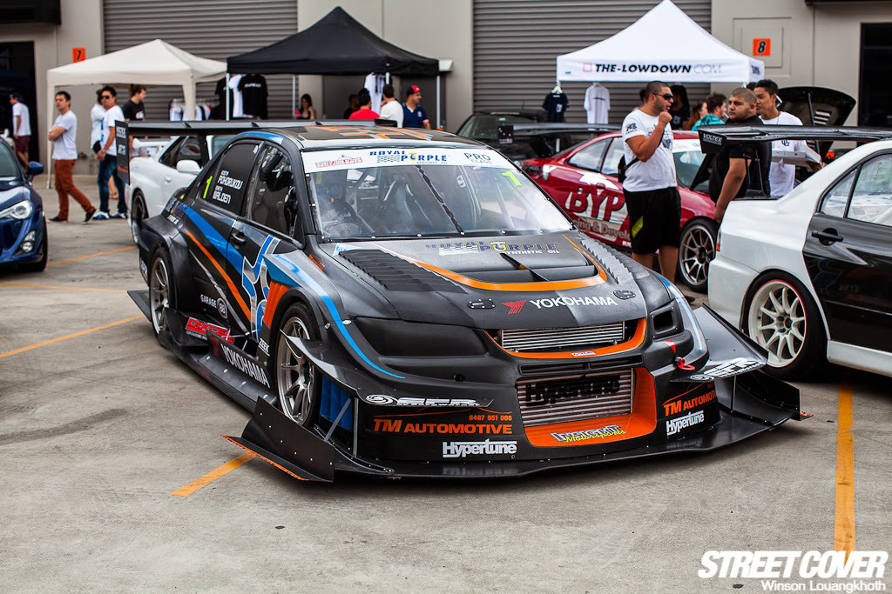

 Today marks the practice day for the [World Time Attack Challenge](http://www.worldtimeattack.com) which is held annually at Sydney Motorsport Park. The actual event is combined with Formula Drift and held over 3 days from Friday 17th October to Sunday 19th October.

The time attack event is run on the Friday and Saturday and the Formula Drift event is on the Sunday.

\[caption id="attachment\_16" align="aligncenter" width="1024"\] WTAC 2013 Champoins - Tilton Evo\[/caption\]

If you’ve never been to WTAC and you are free this weekend, I suggest heading out to take a look. It is truly a world class event with time attack cars from all over the world converging in the one spot to lay down the quickest time around SMSP.

I am hoping to head out there and maybe even take my car to display in the Show n Shine.
