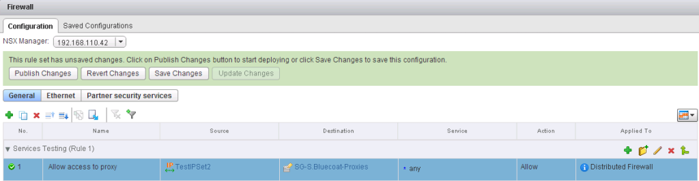
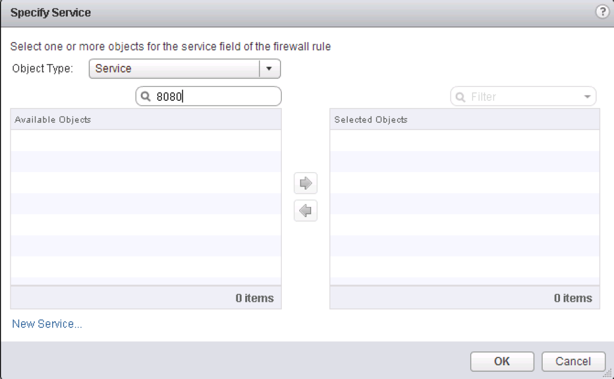
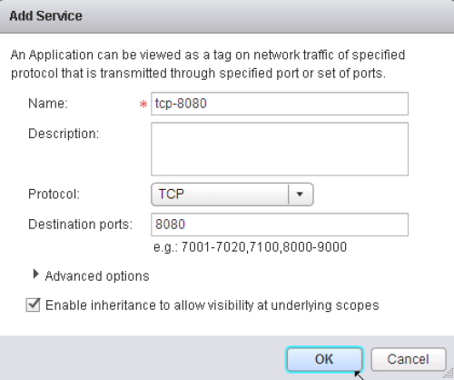
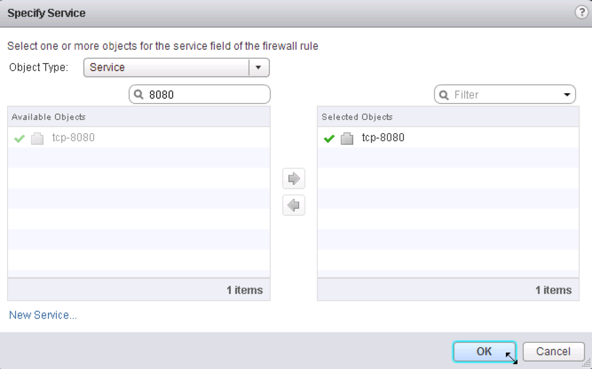
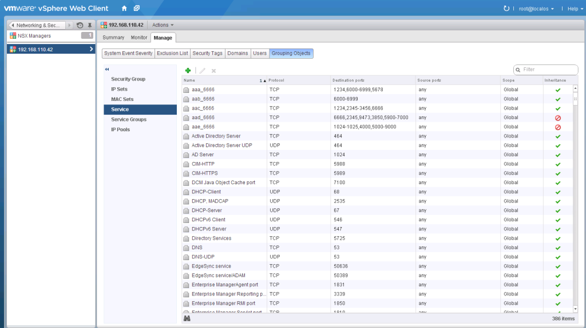
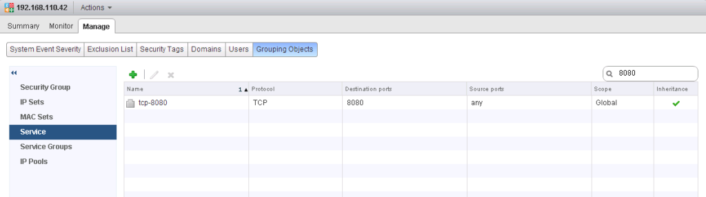
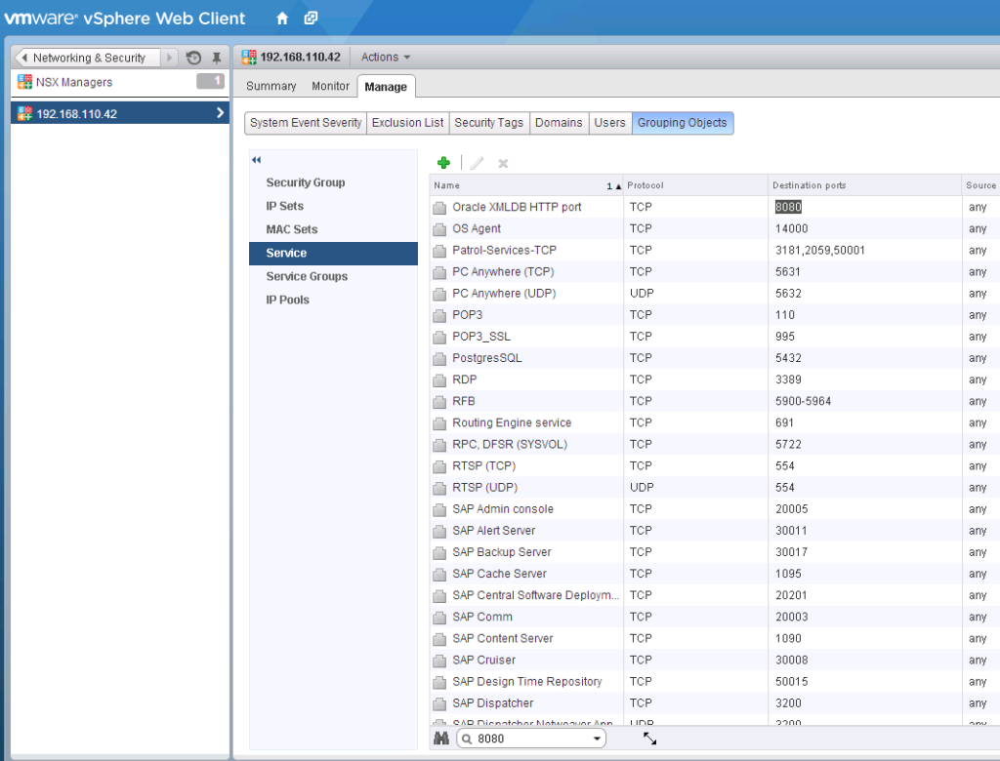

When using the NSX-v distributed firewall (DFW) have you ever need to find out if a service has already been configured in the system for a particular port number?

Recently I was given a sample ruleset from a client to re-create in the DFW, and one thing that stood out was that when creating NSX firewall rules and faced with a random port number that needed to be configured for a rule, there is no easy way to find out if a service has already been configured using that port.

[](http://www.sneaku.com/wp-content/uploads/2015/02/nsx-query-services-01.png)

When you are creating a new firewall rule, and you have clicked the link to add a pre-configured service, the filter box only searches the name of the service. So if I am looking for something configured for port 8080, I can't find it in this part of the UI and will need to go look where the services are configured.

[](http://www.sneaku.com/wp-content/uploads/2015/02/nsx-query-services-02.png)

 

You can however click on the **New Service** link, which will allow you to create a new service with whatever port you want, but then how do you know if you're doubling up?

[](http://www.sneaku.com/wp-content/uploads/2015/02/nsx-query-services-03-e1423054782205.png)

[](http://www.sneaku.com/wp-content/uploads/2015/02/nsx-query-services-04.png)

 

To try and find any services configured with port 8080, we will need to go look where the services are configured.

- Click **Networking & Security** and then click **NSX Managers**.
- Click an NSX Manager in the **Name** column and then click the **Manage** tab.
- Click the **Grouping Objects** tab and then click **Service**.

[](http://www.sneaku.com/wp-content/uploads/2015/02/nsx-query-services-05.png)

In my relatively small lab, I have 386 services configured. Most of them configured out-of-the-box. So how can we find what services are configured with port 8080?

If you type 8080 into the filter box on the top right hand side of the service window, this is next to useless as it only searches the name of the services. But, As you can see it has found the service we just created, but thats because we put the port number in the name. So if you have the opportunity, I would be naming all your services going forward with the port number in the name somewhere.

[](http://www.sneaku.com/wp-content/uploads/2015/02/nsx-query-services-06.png)

Back to my problem, Down the bottom of the window you will see a binocular icon with a search box next to it. When you type something in here it will highlight the text on the screen, and the annoying part is you now have to use the scroll bars to find the highlighted items. This to me is almost unusable. With my screen resolution and number of services configured, it takes 15 click in the side scrollbar to run the the list to find all the services - too clicky for me.

[](http://www.sneaku.com/wp-content/uploads/2015/02/nsx-query-services-07.png)

What does one do in this situation.....? Write a script to do the search for me.

The script is written in Python and is hosted on GitHub [here](https://github.com/dcoghlan/NSX-Query-Services-by-Port). I am not a programmer but have done my best with what I know, or what I am learning along the way. But if you know of a better way to do things, please feel free to fork it, modify it, and submit a pull request.

Make sure to read the [README](https://github.com/dcoghlan/NSX-Query-Services-by-Port/blob/master/README.md) file as it contains the prerequisites and instructions.

```
#
# Script to search VMware NSX-v services by port number
# Written by Dale Coghlan
# Date: 03 Feb 2015
# https://github.com/dcoghlan/NSX-Query-Services-by-Port

# ------------------------------------------------------------------------------------------------------------------	
# Set some variables. No need to change anything else after this section

# Sets a variable to save the HTTP/XML reponse so it can be parsed and displayed.
_responsefile = 'debug-xml-services.xml'

# Set the managed object reference
_scope = 'globalroot-0'

# Uncomment the following line to hardcode the password. This will remove the password prompt.
#_password = 'VMware1!'
#
# ------------------------------------------------------------------------------------------------------------------	

import requests
import sys
import re
import argparse
import getpass
import logging
import xml.etree.ElementTree as ET
from xml.dom import minidom
from xml.dom.minidom import parse, parseString

try:
	# Only needed to disable anoying warnings self signed certificate warnings from NSX Manager.
	import urllib3
	requests.packages.urllib3.disable_warnings()
except ImportError:
	# If you don't have urllib3 we can just hide the warnings 
	logging.captureWarnings(True)

parser = argparse.ArgumentParser(description="Queries NSX Manager for a list of services configured with a specific port")
parser.add_argument("-u", help="OPTIONAL - NSX Manager username (default: %(default)s)", metavar="user", dest="_user", nargs="?", const='admin')
parser.set_defaults(_user="admin")
parser.add_argument("-n", help="NSX Manager hostname, FQDN or IP address", metavar="nsxmgr", dest="_nsxmgr", type=str, required=True)
parser.add_argument("-p", help="TCP/UDP port number", metavar="port", dest="_port", required=True)
parser.add_argument("-r", help="Include port ranges in the output", dest="_searchRanges", action="store_true")
parser.add_argument("-d", help="Enable script debugging", dest="_debug", action="store_true")
args = parser.parse_args()

# Check to see if the password has been hardcoded. If it hasn't prompt for the password
try: 
	_password
except NameError:
	_password = getpass.getpass(prompt="NSX Manager password:")

# Reads command line flags and saves them to variables
_user = args._user
_nsxmgr = args._nsxmgr
_port = args._port

# Set the application content-type header value
myheaders = {'Content-Type': 'application/xml'}

# NSX API URL to get all services configured in the specified scope
requests_url = 'https://%s/api/2.0/services/application/scope/%s' % (_nsxmgr, _scope)

# Submits the request to the NSX Manager
success = requests.get((requests_url), headers=myheaders, auth=(_user, _password), verify=False)

def f_debugMode():
	_responsexml = open('%s' % _responsefile, 'w+')
	_responsexml.write(success.text)
	_responsexml.close()
	print()
	print("Status Code = %s" % success.status_code)
	print("API response written to %s" % _responsefile)

def f_checkRange(y, _port):
	_exists = "n"
	if args._searchRanges:
		# Splits the variable into 2
		rangechecklist = y.split("-")
		# set the low integer port number
		l = int(rangechecklist[0])
		# set the high integer port number
		h = int(rangechecklist[1])
		# performs a check to see if the port exists between the low and high port numbers, and if it does
		# will print the data from the list
		if (l <= int(_port) and h >= int(_port)):
			_exists = "y"
	return _exists

def f_checkSingle(_int_port, _port):
	_exists = "n"
	if _int_port == _port:	
		_exists = "y"
	return _exists

def f_printDataRow():
	print(_outputDataRow.format(data[0], data[1], data[2], data[3]))
	
# If something goes wrong with the xml query, and we dont get a 200 status code returned,
# enabled debug mode and exit the script.
if int(success.status_code) != 200:
	f_debugMode()
	exit()

# Checks to see if debug mode is enabled
if args._debug:
	f_debugMode()
	
# Loads XML response into memory
doc = parseString(success.text)

# Set output formatting
_outputHeaderRow = "{0:17} {1:30} {2:11} {3:16}"
_outputDataRow = "{0:17} {1:30.29} {2:11} {3:16}"

# Sets up column headers
print() 
print(_outputHeaderRow.format("ObjectID", "Name", "Protocol", "Port"))
print(_outputHeaderRow.format("-"*16, "-"*29, "-"*10, "-"*15))
	
# Loads xml document into memory using the application element
nodes = doc.getElementsByTagName('application')

# Iterates through each application element
for node in nodes:
	# clears the list
	data = [];
	# Gets the objectId of the application  
	appObjectId = node.getElementsByTagName("objectId")[0]
	# Get the name of the application
	name = node.getElementsByTagName("name")[0]
	# Sets the list to start with the objectID
	data = [(appObjectId.firstChild.data)]
	# Appends the application name to the list
	data.append(name.firstChild.data);
	# Within the application node, loads the element called "element"
	elements = node.getElementsByTagName('element')
	# Checks to see if the element actually exists
	if elements:
		# If element does exist, iterate through it
		for element in elements:
			# Load the element called applicationProtocol
			protocol = element.getElementsByTagName("applicationProtocol")[0]
			# Check to see if the element contains a child
			if protocol.firstChild:
				# If it contains the applicatioProtocol element then append the data to the list
				data.append(protocol.firstChild.data);
			else:
				# So if there is no element called applicationProtocol, append the string to the list
				data.append("no protocol")
			# Load the element called value
			port = element.getElementsByTagName("value")[0]
			# Check to see if the element contains a child
			if port.firstChild:
				# If it contains the value element then append the data to the list
				data.append(port.firstChild.data);
			else:
				# So if there is no element called value, append the string to the list
				data.append("no port value")
	else:
		# Will drop through to here if there is no element called "element". Some built in services 
		# seem to be structured like this and essentially have no protocol or port defined in NSX.
		# NOTE: These also seem to be marked as read-only services
		data.append("no protocol");
		data.append("no port");
	
	# loads the data in the "value" element (port/ports) into a variable to we can check it
	portcheck = data[3]

	# sets up regular expression to look for ranges within a variable
	_re_range = re.compile(".*\,*[0-9]+\-[0-9]+")
	
	# runs the regex against the port variable in the list to see if a range exists? We will use this further down.
	m = _re_range.match(portcheck)
	
	# Checks to see if multiple ports and/or ranges are specified in the service (separated by comma)
	# If not, check to see if it contains just a range
	# lastly check the single port number
	if "," in portcheck:
		portchecklist = portcheck.split(",")
		_existenceCount = 0
		for z in portchecklist:
			n = _re_range.match(z)
			if n:
				_exists=(f_checkRange(z,_port))
				if _exists =="y":
					_existenceCount += 1
			else:
				_exists=(f_checkSingle(int(z), int(_port)))
				if _exists =="y":
					_existenceCount += 1
		if _existenceCount >= 1:
			f_printDataRow()
	elif m:
		_exists=(f_checkRange(portcheck,_port))
		if _exists == "y":
			f_printDataRow()
	else:
		_exists=(f_checkSingle(portcheck, _port))
		if _exists == "y":
			f_printDataRow()

exit()
```

Here are some examples of the script in action.

The first one is doing a basic search on port 8080. The script only searches port numbers, so it will return both UDP and TCP services.

You'll also notice you don't need to specify a username and you get prompted for a password. The script will default to using admin as the username, as there is always an admin username configured on the NSX Manager. If you are not using the admin account to do your REST API calls, you can use the -u flag to specify an alternate username. You also have the option of hardcoding the password in the script if you don't want to enter it in every time you run the script.

```
python nsx-query-services.py -n nsxmgr-l-01a.corp.local -p 8080
NSX Manager password:
```

```
ObjectID          Name                           Protocol    Port
---------------- ----------------------------- ---------- ---------------
application-372   Tripwire Client Ports          TCP         9898,8080,1169
application-12    Oracle XMLDB HTTP port         TCP         8080
application-268   VMware-SRM-VAMI                TCP         8080
application-389   tcp-8080                       TCP         8080
```

In this second example, i've used the -r flag to show services where the port falls within one of the ranges configured.

```
python nsx-query-services.py -n nsxmgr-l-01a.corp.local -p 8080 -r
NSX Manager password:
```

```
ObjectID          Name                           Protocol    Port
---------------- ----------------------------- ---------- ---------------
application-32    Win - RPC, DCOM, EPM, DRSUAPI  UDP         1025-65535
application-372   Tripwire Client Ports          TCP         9898,8080,1169
application-147   Win - RPC, DCOM, EPM, DRSUAPI  TCP         1025-65535
application-12    Oracle XMLDB HTTP port         TCP         8080
application-166   VMware-VDM2.x-Ephemeral        TCP         1024-65535
application-268   VMware-SRM-VAMI                TCP         8080
application-388   aae_6666                       TCP         1024-1025,4000,5000-9000
application-389   tcp-8080                       TCP         8080
```

See, out of the box, there are a lot of services configured with port 8080 which were not so easy to find and see in a single screen until now :)

Stay tuned for more scripts and other interesting bits and pieces as they come up.
