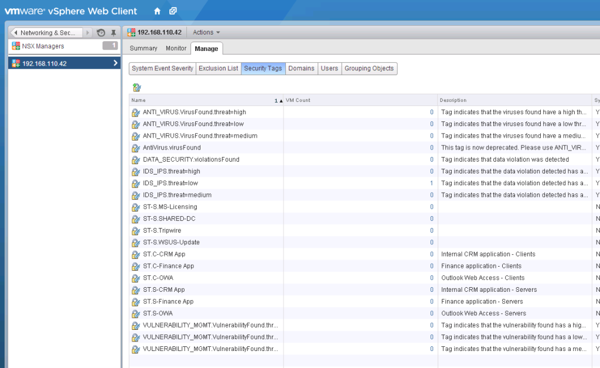
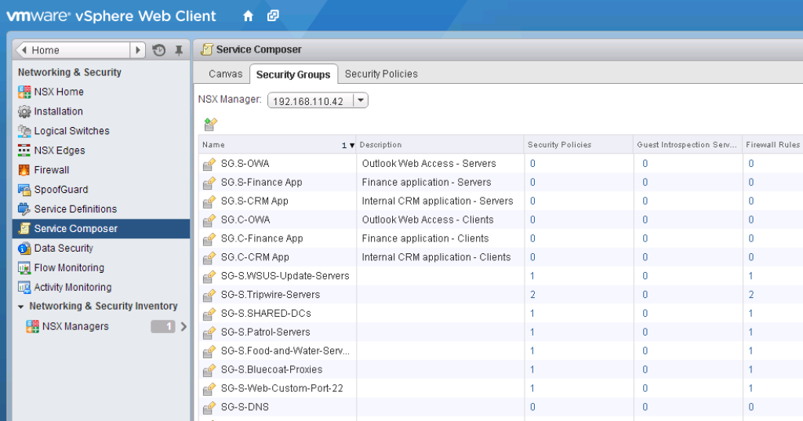
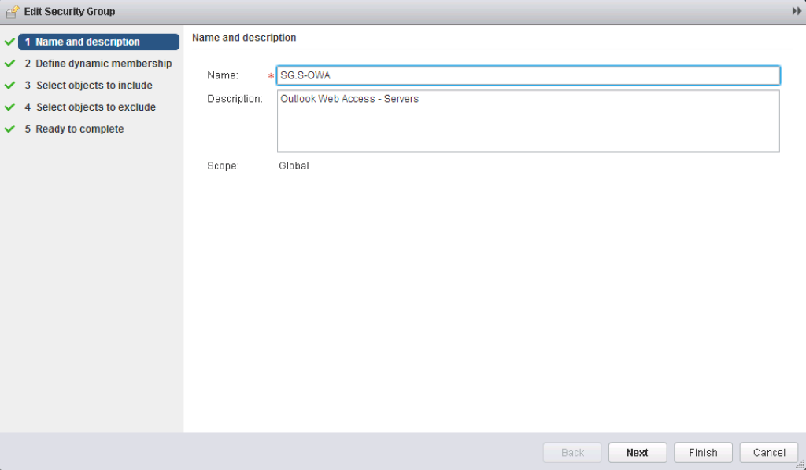
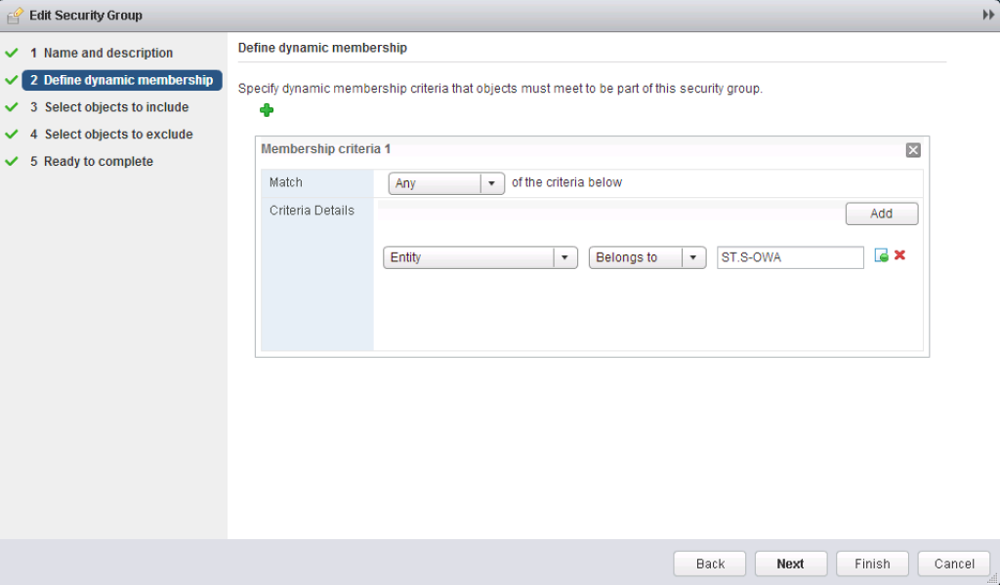
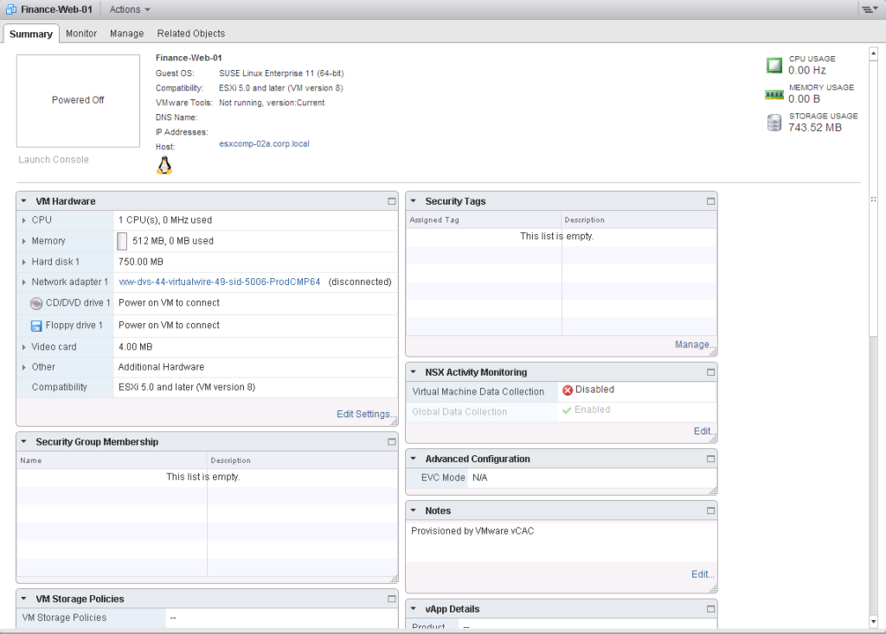
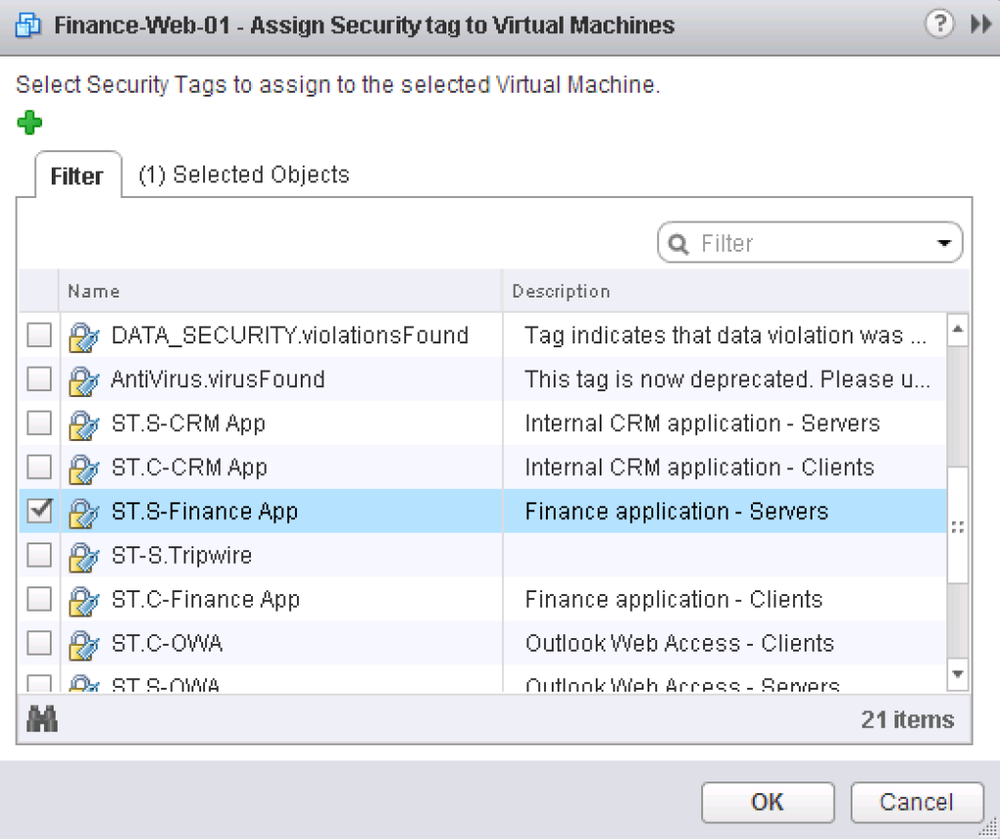
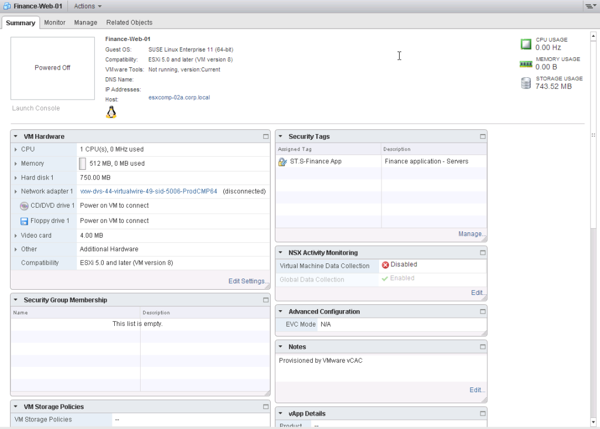
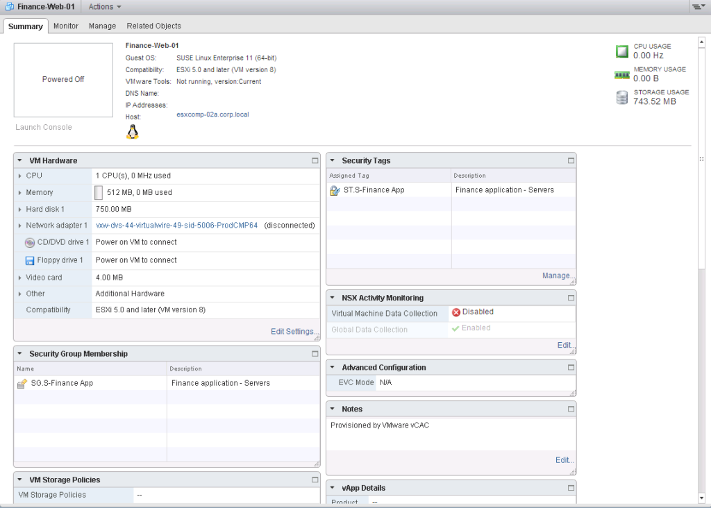
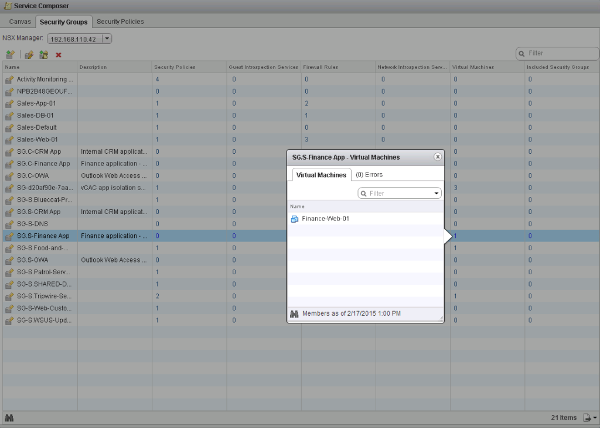
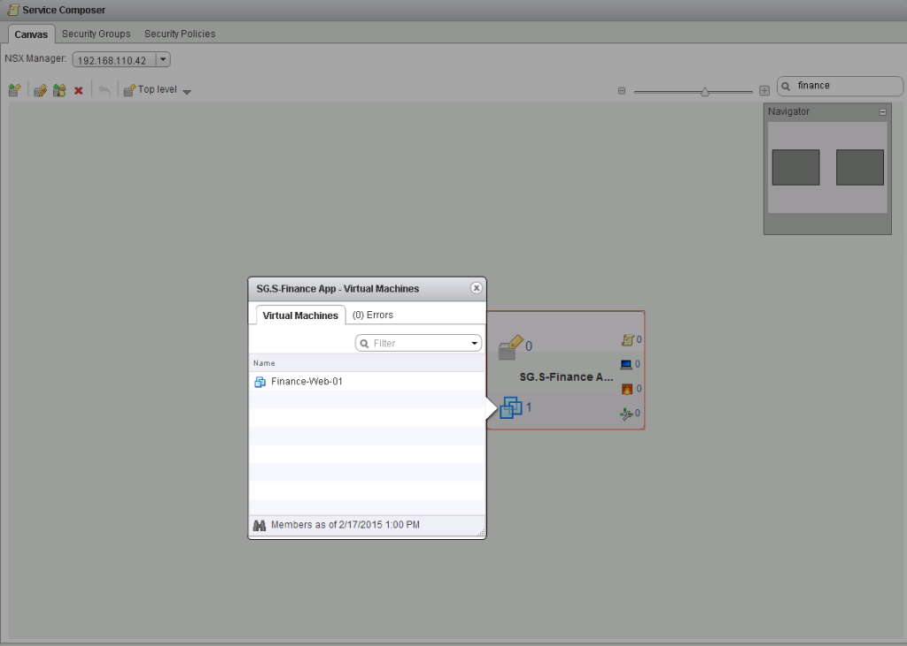

NSX-v allows the creation of Security Groups to group objects to be used in DFW rules and security policies. Each security group can have a mix of static and dynamic membership (If you want to get picky, you can also statically exclude objects). One of the possible ways to dynamically include members into the security group is to match on a security tag. This allows a VM to have security tags assigned to them, and based on the security tag, a VM can be dynamically added as a security group member.

Even though security groups and security tags go hand in hand, unfortunately they are not configured in the same part of the UI.

To configure a security group you must navigate to the following location

- Click **Networking & Security** and then click **Service Composer**.
- Click the **Security Groups** tab.

To configure a security tag you must navigate to the following location

- Click **Networking & Security** and then click **NSX Managers**.
- Click an NSX Manager in the **Name** column and then click the **Manage** tab.
- Click the **Security Tags** menu.

I have a scenario come up where we want to create DFW rules which utilise security groups as both the source and destination of the rule.

So for any particular service/app we want to create DFW rules for, there needs to be two security groups created, one for the clients (source) and another for the servers (destination).

- SG.S-CRM App (Security Group for the CRM Application Servers)
- SG.C-CRM App (Security Group for the CRM Application Clients)

Now we also need the corresponding security tags created so that VMs can be tagged and dynamically added to the required groups.

- ST.S-CRM App (Security Tag for the CRM Application Servers)
- ST.C-CRM App (Security Tag for the CRM Application Clients)

Once the security tags are created, we can then configure dynamic membership within the security group to include the VMs which belong to the security tag entity.

For me personally, configuring this in the current NSX-v UI (6.1.2) consists of way too many clicks, so I decided to script it.

The following Python script reads from a CSV file which consists of the security Service/App/Group name and description and creates the corresponding security tags and security groups along with the security group dynamic membership configuration.

The script has also been uploaded on my GitHub site [here](https://github.com/dcoghlan/NSX-Create-Security-Group-Tags/)

```
#!/usr/bin/env python
#
# Script to create NSX-v security tags and security groups from a csv file 
# The security groups are configured to add dynamic members with associated security tags
#
# Author: Dale Coghlan (www.sneaku.com)
# https://github.com/dcoghlan/
#
#
# Date: 18 Feb 2015
#
# ------------------------------------------------------------------------------------------------------------------
# Set some variables. No need to change anything else after this section

# Sets a variable to save the HTTP/XML reponses and debug logs.
_logfile = 'debug-create-sg-tags.xml'

# Set the managed object reference
_scope = 'globalroot-0'

# Uncomment the following line to hardcode the password. This will remove the password prompt.
#_password = 'VMware1!'
#
# ------------------------------------------------------------------------------------------------------------------

import requests
import argparse
import getpass
import logging
import csv
import xml.etree.ElementTree as ET

try:
    # Only needed to disable anoying warnings self signed certificate warnings from NSX Manager.
    import urllib3
    requests.packages.urllib3.disable_warnings()
except ImportError:
    # If you don't have urllib3 we can just hide the warnings
    logging.captureWarnings(True)

parser = argparse.ArgumentParser(description="Create NSX-v security security tags from CSV file and add \
                                 them to the associated Security Group.")
parser.add_argument("-u",
                    help="OPTIONAL - NSX Manager username (default: %(default)s)",
                    metavar="user",
                    dest="_user",
                    nargs="?",
                    const='admin')
parser.set_defaults(_user="admin")
parser.add_argument("-s",
                    help="NSX Manager hostname, FQDN or IP address",
                    metavar="nsxmgr",
                    dest="_nsxmgr",
                    type=str,
                    required=True)
parser.add_argument("-i",
                    help="Input file in csv format",
                    metavar="inputfile",
                    dest="_inputfile",
                    required=True)
parser.add_argument("-d",
                    help="Enable script debugging",
                    dest="_debug",
                    action="store_true")
args = parser.parse_args()

try:
    _password
except NameError:
    _password = getpass.getpass(prompt="NSX Manager password:")

# Reads command line flags and saves them to variables
_user = args._user
_nsxmgr = args._nsxmgr
_inputfile = args._inputfile

# Initialise the debug file
_responsexml = open('%s' % _logfile, 'w')
_responsexml.close()

def f_debugMode(_debugdata):
    _responsexml = open('%s' % _logfile, 'a+')
    _responsexml.write('\n')
    _responsexml.write(_debugdata)
    _responsexml.close()
    print("DEBUG MODE | debug data written to %s" % _logfile)

def f_get_sgid(group):
    _get_sec_group_url = 'https://%s/api/2.0/services/securitygroup/scope/%s' % (_nsxmgr, _scope)
    _get_sec_group_reponse = requests.get((_get_sec_group_url), headers=_myheaders, auth=(_user, _password), verify=False)
    _get_sec_group_data = _get_sec_group_reponse.content
    _get_sec_group_root = ET.fromstring(_get_sec_group_data)

    # If something goes wrong with the xml query, and we dont get a 200 status code returned,
    # enabled debug mode and return None.
    # If debug mode is enabled, enable debug via function and return the security tag objectid
    # else just return the security tag id.
    if int(_get_sec_group_reponse.status_code) != 200:
        f_debugMode(_get_sec_group_reponse.text)
        print('DEBUG MODE | Response code = ' + _get_sec_tag_reponse.text)
        return
    elif args._debug:
        f_debugMode(_get_sec_group_reponse.text)
        print ('DEBUG MODE | Success retrieving all Security Groups')

    for sgid in _get_sec_group_root.findall('securitygroup'):
        if sgid.find('name').text == group:
            if args._debug:
                print("DEBUG MODE | Security Group: " + group + " = " + sgid.find('objectId').text)
            return sgid.find('objectId').text

def f_get_stid(tag):
    _get_sec_tag_url = 'https://%s/api/2.0/services/securitytags/tag' % (_nsxmgr)
    _get_sec_tag_reponse = requests.get((_get_sec_tag_url), headers=_myheaders, auth=(_user, _password), verify=False)
    _get_sec_tag_data = _get_sec_tag_reponse.content
    _get_sec_tag_root = ET.fromstring(_get_sec_tag_data)

    # If something goes wrong with the xml query, and we dont get a 200 status code returned,
    # enabled debug mode and return None.
    # If debug mode is enabled, enable debug via function and return the security tag objectid
    # else just return the security tag id.
    if int(_get_sec_tag_reponse.status_code) != 200:
        f_debugMode(_get_sec_tag_reponse.text)
        print('DEBUG MODE | Response code = ' + _get_sec_tag_reponse.text)
        return
    elif args._debug:
        f_debugMode(_get_sec_tag_reponse.text)
        print ('DEBUG MODE | Success retrieving all Security Tags')

    for stid in _get_sec_tag_root.findall('securityTag'):
        if stid.find('name').text == tag:
            if args._debug:
                print("DEBUG MODE | Security Tag: " + tag + " = " + stid.find('objectId').text)
            return stid.find('objectId').text

def f_create_sec_tag(name, desc):
    _sec_tag_xml = '<?xml version="1.0" encoding="UTF-8" ?>'\
                   '<securityTag>'\
                   '<objectTypeName>SecurityTag</objectTypeName>'\
                   '<type>'\
                   '<typeName>SecurityTag</typeName>'\
                   '</type>'\
                   '<name>' + name + '</name>'\
                   '<description>' + desc + '</description>'\
                   '<extendedAttributes/>'\
                   '</securityTag>'
    _create_sec_tag_url = 'https://%s/api/2.0/services/securitytags/tag' % (_nsxmgr)
    _create_sec_tag_reponse = requests.post((_create_sec_tag_url), data=_sec_tag_xml, headers=_myheaders, auth=(_user, _password), verify=False)

	# If something goes wrong with the xml query, and we dont get a 201 status code returned,
    # enabled debug mode and return None.
    # If debug mode is enabled, enable debug via function and return the security tag objectid
    # else just return the security tag id.
    if int(_create_sec_tag_reponse.status_code) != 201:
        f_debugMode(_create_sec_tag_reponse.text)
        return
    elif args._debug:
        f_debugMode(_create_sec_tag_reponse.text)
        print ('Success creating Security Tag ' + _create_sec_tag_reponse.text + ' - ' + name)
        return _create_sec_tag_reponse.text
    else:
        print ('Success creating Security Tag ' + _create_sec_tag_reponse.text + ' - ' + name)
        return _create_sec_tag_reponse.text

def f_create_sec_group(name, desc, tag):
    _sec_group_xml = '<?xml version="1.0" encoding="UTF-8" ?>'\
                     '<securitygroup>'\
                     '<objectId></objectId>'\
                     '<objectTypeName></objectTypeName>'\
                     '<revision>0</revision>'\
                     '<type>'\
                     '<typeName></typeName>'\
                     '</type>'\
                     '<name>' + name + '</name>'\
					 '<description>' + desc + '</description>'\
					 '<dynamicMemberDefinition>'\
                     '<dynamicSet>'\
                     '<operator>OR</operator>'\
                     '<dynamicCriteria>'\
                     '<operator>OR</operator>'\
                     '<key>ENTITY</key>'\
                     '<criteria>belongs_to</criteria>'\
                     '<value>' + tag + '</value>'\
                     '</dynamicCriteria>'\
                     '</dynamicSet>'\
                     '</dynamicMemberDefinition>'\
                     '</securitygroup>'
    _create_sec_group_url = 'https://%s/api/2.0/services/securitygroup//bulk/%s' % (_nsxmgr, _scope)
    _create_sec_group_reponse = requests.post((_create_sec_group_url), data=_sec_group_xml, headers=_myheaders, auth=(_user, _password), verify=False)

    # If something goes wrong with the xml query, and we dont get a 201 status code returned,
    # enabled debug mode and return None.
    # If debug mode is enabled, enable debug via function and return the security tag objectid
    # else just return the security tag id.
    if int(_create_sec_group_reponse.status_code) != 201:
        f_debugMode(_sec_group_xml)
        f_debugMode(_create_sec_group_reponse.text)
        return
    elif args._debug:
        f_debugMode(_sec_group_xml)
        f_debugMode(_create_sec_group_reponse.text)
        print ('Success creating Security Group ' + _create_sec_group_reponse.text + ' - ' + name)
        return _create_sec_group_reponse.text
    else:
        print ('Success creating Security Group ' + _create_sec_group_reponse.text + ' - ' + name)
        return _create_sec_group_reponse.text

# Set the application content-type header value
_myheaders = {'Content-Type': 'application/xml'}

_exceptions = 0
_vm_type_list = ['S', 'C']

with open('%s' % _inputfile, 'r+') as _csvinput:
    spamreader = csv.reader(_csvinput, delimiter=',', quotechar='|')
    for row in spamreader:
        _name = (row[0])
        _desc = (row[1])
        print()
        print('-'*40)
        for _type in _vm_type_list:
            print()
            if _type == 'S':
                _desc_type = ' - Servers'
            elif _type == 'C':
                _desc_type = ' - Clients'
			# Lookup security tags to see if it already exists
            _check_sec_tag_id = f_get_stid('ST.' + _type + '-' + _name)
			# If security tag doesn't exists
            if _check_sec_tag_id is None:
				# Create the new security tag
                print("Need to create security tag | ST." + _type + "-" + _name)
                _sec_tag_id = f_create_sec_tag('ST.' + _type + '-' + _name, _desc + _desc_type)
				# If something goes wrong creating security tag, log it in debug file and pass the rest of the processing
                if _sec_tag_id is None:
                    print("ERROR creating | ST." + _type + "-" + _name + " - Check log file")
                    print()
                    _exceptions += 1
                    continue
			# So it seems the security tag exists, so lets use the existing security tag object id
            else:
                print("Security tag exists - " + _check_sec_tag_id)
                _sec_tag_id = _check_sec_tag_id
	
            # Lookup security groups to see if it already exists
            _check_sec_group_id = f_get_sgid('SG.' + _type + '-' + _name)
			# If security group doesn't exists
            if _check_sec_group_id is None:
				# Create the new security group
                print("Need to create security group | SG." + _type + "-" + _name)
                _sec_group_id = f_create_sec_group('SG.' + _type + '-' + _name, _desc + _desc_type, _sec_tag_id)
				# If something goes wrong creating security tag, log it in debug file and pass the reset of the processing
                if _sec_group_id is None:
                    print("ERROR creating | SG." + _type + "-" + _name + " - Check debug file")
                    print()
                    _exceptions += 1
                    continue
			# So it seems the security group exists, so lets use the existing security group object id
            else:
                print("Security group exists - " + _check_sec_group_id)
                print("Add ST." + _type + "-" + _name + " to security group manually")
                _exceptions += 1
                pass

if _exceptions >= 1 and args._debug:
    print()
    print('-'*40)
    print('Review the debug file | Exception count = %s' % _exceptions)

exit()

```

 

The csv file used as an input is as follows.

```
CRM App,Internal CRM Application
Finance App,Finance application
OWA,Outlook Web Access
```

To run the script, do this.

```
python nsx-create-sg-tags.py -s nsxmgr-l-01a.corp.local -i inputfule.csv
NSX Manager password:
```

The output will look like this.

```
----------------------------------------

Need to create security tag | ST.S-CRM App
Success creating Security Tag securitytag-74 - ST.S-CRM App
Need to create security group | SG.S-CRM App
Success creating Security Group securitygroup-62 - SG.S-CRM App

Need to create security tag | ST.C-CRM App
Success creating Security Tag securitytag-75 - ST.C-CRM App
Need to create security group | SG.C-CRM App
Success creating Security Group securitygroup-63 - SG.C-CRM App

----------------------------------------

Need to create security tag | ST.S-Finance App
Success creating Security Tag securitytag-76 - ST.S-Finance App
Need to create security group | SG.S-Finance App
Success creating Security Group securitygroup-64 - SG.S-Finance App

Need to create security tag | ST.C-Finance App
Success creating Security Tag securitytag-77 - ST.C-Finance App
Need to create security group | SG.C-Finance App
Success creating Security Group securitygroup-65 - SG.C-Finance App

----------------------------------------

Need to create security tag | ST.S-OWA
Success creating Security Tag securitytag-78 - ST.S-OWA
Need to create security group | SG.S-OWA
Success creating Security Group securitygroup-66 - SG.S-OWA

Need to create security tag | ST.C-OWA
Success creating Security Tag securitytag-79 - ST.C-OWA
Need to create security group | SG.C-OWA
Success creating Security Group securitygroup-67 - SG.C-OWA
```

After it's all done, we can see the newly created security tags.

[](http://www.sneaku.com/wp-content/uploads/2015/02/nsx-create-sg-tags-03.png)

And the new security groups.

[](http://www.sneaku.com/wp-content/uploads/2015/02/nsx-create-sg-tags-04.png)

And if you open up one of the security groups, you can see the dynamic membership configuration all done for you.

[](http://www.sneaku.com/wp-content/uploads/2015/02/nsx-create-sg-tags-05.png)

[](http://www.sneaku.com/wp-content/uploads/2015/02/nsx-create-sg-tags-06.png)

If you look at the Summary page of a VM, you can manually add a security tag to the VM _(Although adding a Security Tag to a VM is also easily scriptable - [Check out Brett Draytons script](http://brettdrayton.com/vmware-nsx-add-security-tag-vm-cool-way/))._

[](http://www.sneaku.com/wp-content/uploads/2015/02/nsx-create-sg-tags-07.png)

Just choose the required Security Tag (This is actually one of the spots where if the Security Tag you want to use doesn't exist, you can manually create it by clicking the Green +).

[](http://www.sneaku.com/wp-content/uploads/2015/02/nsx-create-sg-tags-08.png)

Now you can see the Security Tag assigned to the VM.

[](http://www.sneaku.com/wp-content/uploads/2015/02/nsx-create-sg-tags-09.png)

And if you refresh the Summary page, you will see it has been dynamically added to the appropriate Security Group.

[](http://www.sneaku.com/wp-content/uploads/2015/02/nsx-create-sg-tags-10.png)

You can also check members of the security group via the Security Groups tab in the Service Composer.

[](http://www.sneaku.com/wp-content/uploads/2015/02/nsx-create-sg-tags-11.png)

Or via the Canvas view in the Service Composer.

[](http://www.sneaku.com/wp-content/uploads/2015/02/nsx-create-sg-tags-12.png)

Now I can go about configuring my DFW rules utilising my new security groups :)
