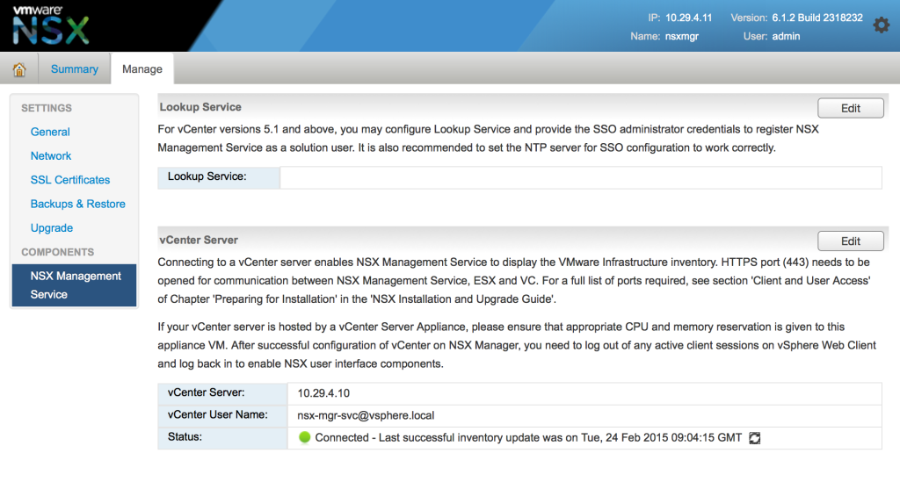
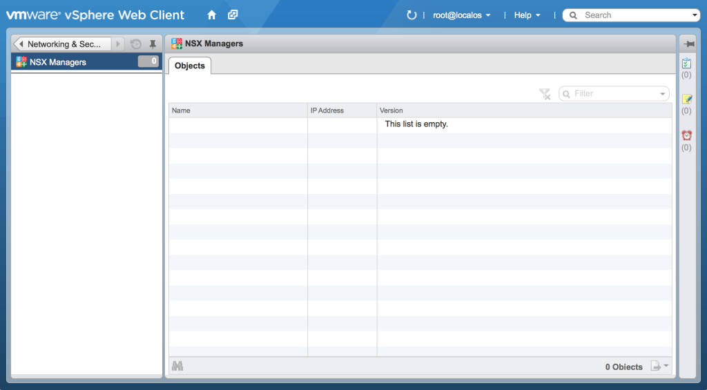
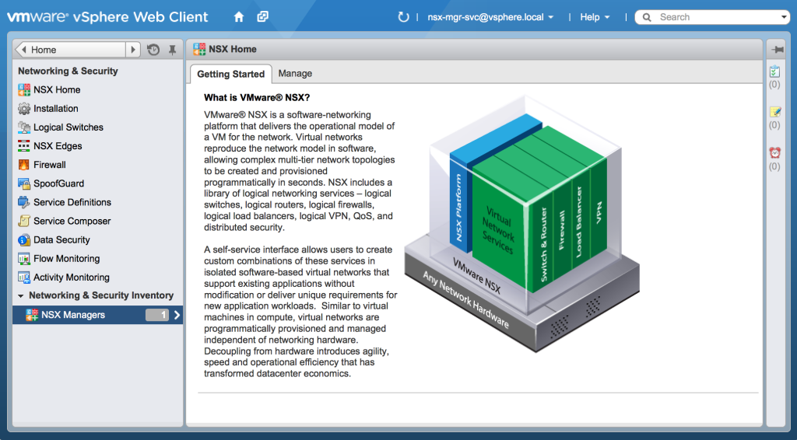
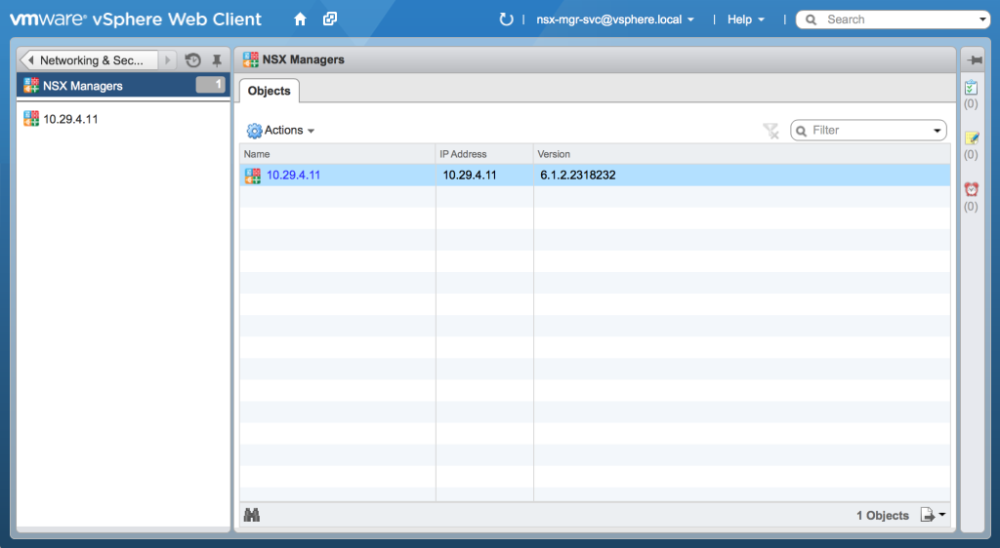
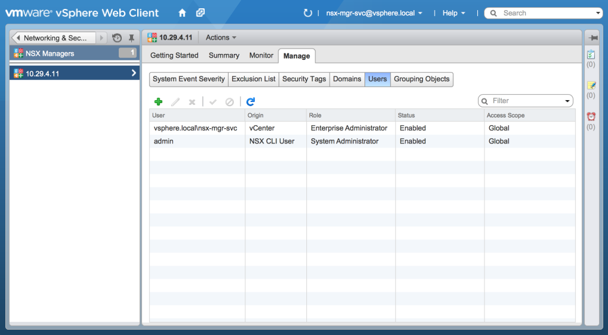

So you've just installed NSX Manager and registered vCenter, but when you log in to the vSphere Web Client, you cannot see your NSX Manager. Where did it go?

When deploying NSX-v, one of the initial steps involves registering vCenter server with NSX Manager. The section in the NSX 6.1 Installation guide reads as follows:

* * *

_**Register vCenter Server with NSX Manager**_

_You must login to the NSX Manager virtual appliance to register a vCenter Server and review the settings specified during installation._

_**Prerequisites**_

- _You must have a vCenter Server user account with administrative access to synchronize NSX Manager with the vCenter Server . If your vCenter password has non-Ascii characters, you must change it before synchronizing the NSX Manager with the vCenter Server._
- _To use SSO on NSX Manager, you must have vCenter Server 5.5 or later and single sign on service must be installed on the vCenter Server._

_**Procedure**_

1. _Log in to the NSX Manager virtual appliance._
2. _Under Appliance Management, click **Manage Appliance Settings**._
3. _From the left panel, select **NSX Management Service** and click **Configure** next to vCenter Server. Type the IP address of the vCenter Server._
4. _Type the vCenter Server user name and password._
5. _Click **OK**._
6. _Confirm that the vCenter Server status is Connected._

_**What to do next**_

_Login to the vSphere Web Client and click the Networking & Security tab. You can now install and configure NSX components._

_VMware recommends that you schedule a backup of NSX Manager data right after installing NSX Manager. See NSX Administration Guide._

* * *

Seems simple enough? Read on.

Typically when doing this in a lab or POC environment (including VMware Hands On Labs) the account used to register vCenter to the NSX Manager is the root account. The reason being that the root account details are often at hand, and its known that it has administrative rights to vCenter.

In a real world situations however, some companies enforce the use of specific service accounts for these types of connections.

So whats the big deal, you go ahead and create a user account (in your AD or a vsphere.local account) and give it administrator rights to your vCenter and then use that account to register the NSX Manager to vCenter and all appears to be fine, and NSX Manager tells you that it all worked. Yipeee

But when you login to the vSphere Web Client with your normal vSphere administrator account (I am using the root account in this example), and click on Networking & Security, you don't see any NSX Managers listed????

The reason for this is that although you have administrative rights to vCenter, the account you have logged into the vSphere Web Client with does not have any permissions within the NSX Manager. By default when a vCenter is registered to NSX Manager, the only account provisioned with any NSX rights, is the account you used to register vCenter to your NSX Manager. Sorta makes sense, as thats the only account that NSX Manager initially knows about.

So, what you need to do is logout of the vSphere Web Client, and log back into the vSphere Web Client using the NSX Manager service account. Now when you click on Networking & Security, you will see the NSX Manager listed now.

Here you can see the accounts which have NSX permissions immediately after vCenter is registered to NSX Manager.

Since you can now see the NSX Manager, you can now configure NSX permissions which utilises RBAC so you can use your normal vSphere administrator account to manage the Networking & Security environment.
