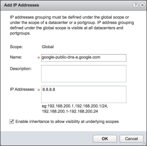
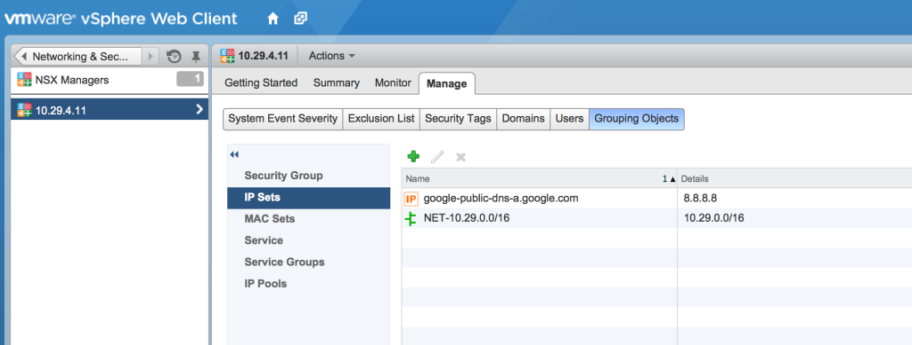
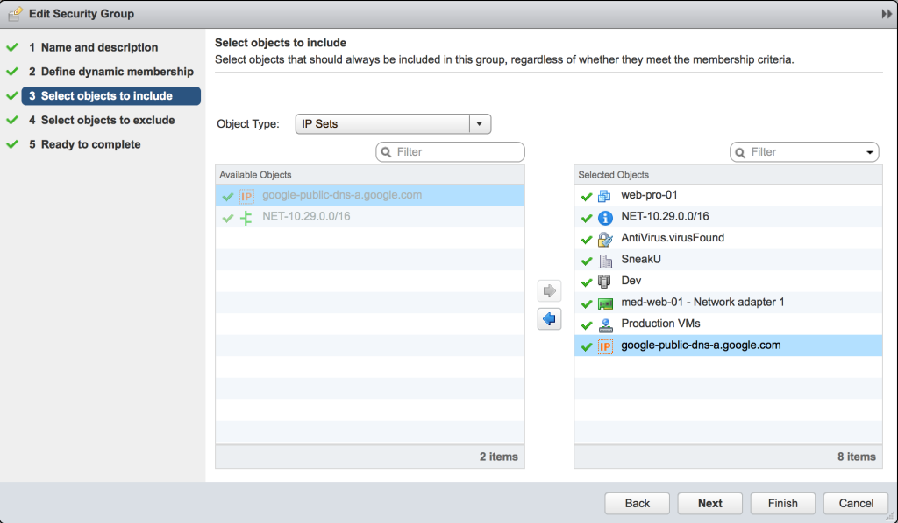
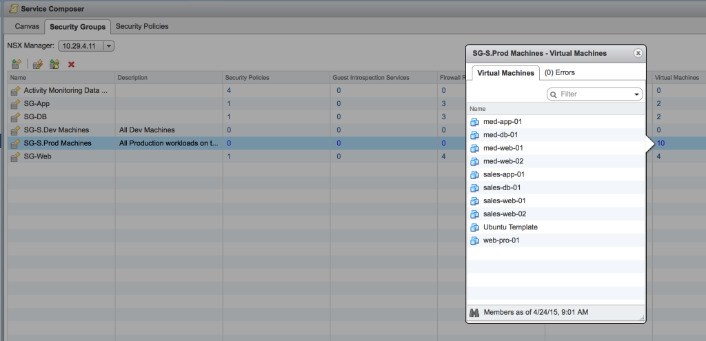

Often when working in customer environments, there is a requirement to define security group members which are not virtual machines within the visualised environment. To achieve this, these security group members must be defined as an IP Set.

[](http://www.sneaku.com/wp-content/uploads/2015/04/IPSet-01.png)

[](http://www.sneaku.com/wp-content/uploads/2015/04/IPSet-02.png)

The IP Set can then be included as an object in a security group.

[](http://www.sneaku.com/wp-content/uploads/2015/04/IPSet-03.png)

However, within the UI, it doesn't show you all the non-vm members of a security group.

[](http://www.sneaku.com/wp-content/uploads/2015/04/IPSet-05.png)

So whilst on site recently, I wrote a quick script to show me ALL the members included in a security group, and it will also show the IP addresses that will be applied as part of any policy where the security group is used.

Here you can see the script when querying the security group "SG-S.Prod Machines"

```
python nsx-query-sg.py -n 10.29.4.11 -sg "SG-S.Prod Machines"

#########################################################################################
                                     STATIC INCLUDES                                     
#########################################################################################
ObjectID          ObjectType                     Name                                    
----------------- ------------------------------ ----------------------------------------
vm-38             VirtualMachine                 web-pro-01                              
ipset-2           IPSet                          NET-10.29.0.0/16                        
securitytag-7     SecurityTag                    AntiVirus.virusFound                    
domain-c28        ClusterComputeResource         Dev                                     
datacenter-21     Datacenter                     SneakU                                  
ipset-3           IPSet                          google-public-dns-a.google.com          
5031acba-3df2-... Vnic                           med-web-01 - Network adapter 1          
dvportgroup-50    DistributedVirtualPortgroup    Production VMs                          

#########################################################################################
                                      IP ADDRESSES                                       
#########################################################################################
Addresses                                                                                
-------------------------------------------------- 
fe80::250:56ff:feb1:72df
10.29.6.101
10.29.0.0/16
8.8.8.8
10.29.5.101
fe80::250:56ff:feb1:a666

#########################################################################################
                                    VIRTUAL MACHINES                                     
#########################################################################################
ObjectID          VM Name                                                                
---------------- ----------------------------- 
vm-40             med-web-01                                                             
vm-38             web-pro-01                                                             
vm-46             sales-app-01                                                           
vm-45             sales-web-02                                                           
vm-39             Ubuntu Template                                                        
vm-47             sales-db-01                                                            
vm-44             sales-web-01                                                           
vm-41             med-web-02                                                             
vm-43             med-db-01                                                              
vm-42             med-app-01                                                             

```

I also slid another function into the script which can be used to list all the security groups configured within NSX-v.

```
python nsx-query-sg.py -n 10.29.4.11 -l

#########################################################################################
                                     SECURITY GROUPS                                     
#########################################################################################
ObjectID          Security Group Name            Description                             
---------------- ----------------------------- ----------------------------------------
securitygroup-14  SG-DB                                                                  
securitygroup-10  SG-S.Dev Machines              All Dev Machines                        
securitygroup-12  SG-Web                                                                 
securitygroup-11  SG-S.Prod Machines             All Production workloads on the NSX Cluster
securitygroup-1   Activity Monitoring Data Coll  All Production workloads on the NSX Cluster
securitygroup-13  SG-App                                                                 

```

As usual, the script is located on my GitHub site [here](https://github.com/dcoghlan/NSX-Query-Security-Groups).
