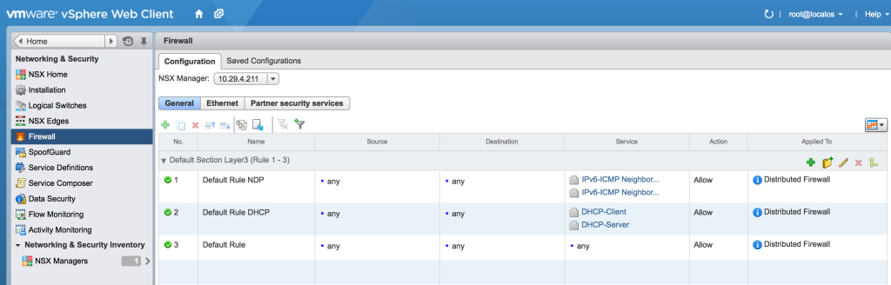

On various engagements I am involved with, I often need to produce some code to add or delete objects from NSX-v. These objects in general are things like IP Sets, MAC Sets, Security Groups, Security Tags, Services, Service Groups, Security Policies and even deleting the FW rulebase itself.

Until recently I was doing this manually as I was dealing with relatively small numbers of objects, however on a previous engagement I was working on a script to import up to 33,000 objects and when testing the script in a dev environment, we needed a way to go through and delete everything we had just imported and set it back to "defaults".

So the following script was born which essentially "resets" the different NSX-v components to their defaults.

The script is hosted on my GitHub site as I am constantly developing this one.

[https://github.com/dcoghlan/NSX-Reset-Environment](https://github.com/dcoghlan/NSX-Reset-Environment)

> WARNING: This script is dangerous and has the potential to delete items you may not want deleted. Only use this script in a dev/test environment unless you are 100% sure what you are doing.

To view the options for the script, you can use the following command:

```
python nsx-reset-environment.py -h
```

```
usage: nsx-reset-environment.py [-h] --nsxmgr nsxmgr [--user [user]]
                                [--ipsets] [--services] [--secgroups]
                                [--servicegroups] [--macsets] [--secpolicies]
                                [--sectags] [--fwrules]

Bulk delete NSX Objects.

optional arguments:
  -h, --help       show this help message and exit
  --nsxmgr nsxmgr  NSX Manager hostname, FQDN or IP address
  --user [user]    OPTIONAL - NSX Manager username (default: admin)
  --ipsets         Delete all IP Sets
  --services       Delete all services
  --secgroups      Delete all security groups
  --servicegroups  Delete all service groups
  --macsets        Delete all MAC sets
  --secpolicies    Delete all security policies
  --sectags        Delete all security tags
  --fwrules        Delete all firewall rules and reset to default

```

The following are some examples on various objects that can be deleted:

## Deleting IP Sets

This will delete all IP Sets configured in NSX-v (excluding hidden/system required objects):

```
python nsx-reset-environment.py --nsxmgr 10.29.4.211 --ipsets
NSX Manager password:

SUCCESS: Retrieved list of IP Sets in scope | globalroot-0
INFO: Skipping Read Only IP Set ipset-1
INFO: Deleting IP Set: "Net_10.29.32.0" (ipset-14)
INFO: Deleting IP Set: "Net_10.29.64.0" (ipset-15)
INFO: Deleting IP Set: "Net_10.29.0.0" (ipset-16)
INFO: Deleting IP Set: "Net_10.29.128.0" (ipset-17)
```

## Deleting Services

This will delete all NSX-v services (excluding default configured services):

```
python nsx-reset-environment.py --nsxmgr 10.29.4.211 --services
NSX Manager password:

SUCCESS: Retrieved list of Services in scope | globalroot-0
INFO: Deleting Service: "SAP IPC data loader" (application-5)
INFO: Deleting Service: "SAP IBM" (application-6)
INFO: Deleting Service: "IPv6-ICMP Multicast Listener Done" (application-8)
INFO: Deleting Service: "Office Server Web Services, HTTP, SSL" (application-9)
INFO: Deleting Service: "SAP Cruiser" (application-10)
```

## Deleting Security Groups

This will delete all security groups configured in NSX-v (excluding hidden/system required objects):

```
python nsx-reset-environment.py --nsxmgr 10.29.4.211 --secgroups
NSX Manager password:

SUCCESS: Retrieved list of Security Groups in scope | globalroot-0
INFO: Deleting Security Group: "Web-Tier" (securitygroup-11)
INFO: Deleting Security Group: "SG-S.DNS Servers" (securitygroup-12)
INFO: Skipping Security Group "Activity Monitoring Data Collection" (securitygroup-1)
```

## Deleting Service Groups

This will delete all NSX-v service groups (excluding default configured services):

```
python nsx-reset-environment.py --nsxmgr 10.29.4.211 --servicegroups
NSX Manager password:

SUCCESS: Retrieved list of Service Groups in scope | globalroot-0
INFO: Deleting Service Group: "Heartbeat" (applicationgroup-3)
INFO: Deleting Service Group: "Microsoft Active Directory" (applicationgroup-16)
INFO: Deleting Service Group: "Microsoft Exchange 2003" (applicationgroup-17)
INFO: Deleting Service Group: "MS Exchange 2007 Transport Servers" (applicationgroup-6)
INFO: Deleting Service Group: "MS Exchange 2007 Unified Messaging Centre" (applicationgroup-7)
```

## Deleting MAC Sets

This will delete all MAC Sets configured in NSX-v (except  hidden/system required objects):

```
python nsx-reset-environment.py --nsxmgr 10.29.4.211 --macsets
NSX Manager password:

SUCCESS: Retrieved list of MAC Sets in scope | globalroot-0
INFO: Skipping Read Only MAC Set "system-generated-broadcast-macset" (macset-1)
INFO: Skipping Hidden MAC Set "system-generated-broadcast-macset" (macset-1)
INFO: Skipping Facade Hidden MAC Set "system-generated-broadcast-macset" (macset-1)
INFO: Deleting MAC Set: "server1" (macset-3)
```

## Deleting Security Policies (Service Composer)

This will delete all Service Composer Security Policies configured in NSX-v (except all the hidden/system required objects):

```
python nsx-reset-environment.py --nsxmgr 10.29.4.211 --secpolicies
NSX Manager password:

SUCCESS: Retrieved list of Security Policies
INFO: Deleting Security Policy: "SPO-C.DNS Clients" (policy-5)
INFO: Skipping hidden security policy "spo_eventcontrol_collect_connect_outbound" (policy-4)
INFO: Skipping hidden security policy "spo_eventcontrol_collect_connect_inbound" (policy-3)
INFO: Skipping hidden security policy "spo_eventcontrol_collect_listen_stop" (policy-2)
INFO: Skipping hidden security policy "spo_eventcontrol_collect_listen_start" (policy-1)
```

## Deleting Security Tags

This will delete all Security Tags configured in NSX-v (except all the hidden/system required objects):

```
python nsx-reset-environment.py --nsxmgr 10.29.4.211 --sectags
NSX Manager password:

SUCCESS: Retrieved list of Security Tags
INFO: Skipping system security tag "VULNERABILITY_MGMT.VulnerabilityFound.threat=high" (securitytag-1)
INFO: Skipping system security tag "ANTI_VIRUS.VirusFound.threat=low" (securitytag-2)
INFO: Skipping system security tag "ANTI_VIRUS.VirusFound.threat=medium" (securitytag-3)
INFO: Skipping system security tag "IDS_IPS.threat=high" (securitytag-4)
INFO: Skipping system security tag "DATA_SECURITY.violationsFound" (securitytag-5)
INFO: Skipping system security tag "IDS_IPS.threat=low" (securitytag-6)
INFO: Skipping system security tag "AntiVirus.virusFound" (securitytag-7)
INFO: Skipping system security tag "VULNERABILITY_MGMT.VulnerabilityFound.threat=low" (securitytag-8)
INFO: Skipping system security tag "VULNERABILITY_MGMT.VulnerabilityFound.threat=medium" (securitytag-9)
INFO: Skipping system security tag "IDS_IPS.threat=medium" (securitytag-10)
INFO: Skipping system security tag "ANTI_VIRUS.VirusFound.threat=high" (securitytag-11)
INFO: Deleting Security tag: "ST-S.DNS Servers" (securitytag-13)
INFO: Deleting Security tag: "ST-C.DNS Clients" (securitytag-14)
```

## Deleting Firewall Rules

This will delete all firewall rules configured and reset the rulebase to the default rules:

```
python nsx-reset-environment.py --nsxmgr 10.29.4.211 --fwrules
NSX Manager password:

INFO: Deleting Firewall configuration:
INFO: Status Code 403
```

## Deleting multiple object types

You can use multiple options to delete multiple object types in the one command like the example below:

```
python nsx-reset-environment.py --nsxmgr 10.29.4.211 --ipsets --macsets --fwrules
NSX Manager password:

INFO: Deleting Firewall configuration:
INFO: Status Code 204

SUCCESS: Retrieved list of IP Sets in scope | globalroot-0
INFO: Skipping Read Only IP Set ipset-1
INFO: Deleting IP Set: "Net_10.29.32.0" (ipset-14)
INFO: Deleting IP Set: "Net_10.29.64.0" (ipset-15)
INFO: Deleting IP Set: "Net_10.29.0.0" (ipset-16)
INFO: Deleting IP Set: "Net_10.29.128.0" (ipset-17)

SUCCESS: Retrieved list of MAC Sets in scope | globalroot-0
INFO: Skipping Read Only MAC Set "system-generated-broadcast-macset" (macset-1)
INFO: Skipping Hidden MAC Set "system-generated-broadcast-macset" (macset-1)
INFO: Skipping Facade Hidden MAC Set "system-generated-broadcast-macset" (macset-1)
INFO: Deleting MAC Set: "server1" (macset-3)
```

## Hidden Option (--force)

There are often times where you would like to remove all the default configured services and service groups from NSX-v. Whether it's because you don't like what's configured, or you will be importing your own via some other means, and the default ones will be irrelevant. The command below will delete the services and service groups configured during a default installation, only leaving the following list of service objects as they are required when resetting the firewall rules back to defaults.

- DHCP-Client
- DHCP-Server
- IPv6-ICMP Neighbor Advertisement
- IPv6-ICMP Neighbor Solicitation

[](http://www.sneaku.com/wp-content/uploads/2015/06/nsx-reset-environment-01.png)

 

```
python nsx-reset-environment.py --nsxmgr 10.29.4.211 --services --servicegroups --force
```
