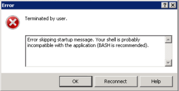
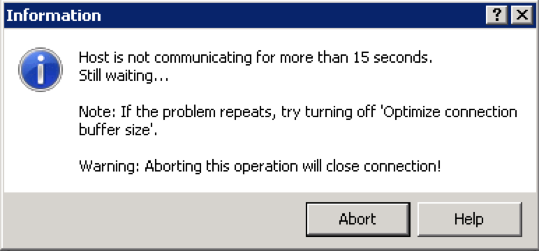

Whilst working with a customer recently, we encountered a situation recently where we were required to run a packet capture on a VCSA (vCenter Server appliance) version 6.0.

Being a Linux appliance underneath, the tool to use is tcpdump, but by default tcpdump is not actually installed by default. There are a few steps you need to follow to get it installed.

SSH into the VCSA which should get you to the standard appliance shell

```
Using username "root".

VMware vCenter Server Appliance 6.0.0

Type: vCenter Server with an external Platform Services Controller

root@10.29.87.132's password:
Last login: Fri Jun 26 01:57:53 2015 from 10.29.4.103
Connected to service

* List APIs: "help api list"
* List Plugins: "help pi list"
* Enable BASH access: "shell.set --enabled True"
* Launch BASH: "shell"

Command>
```

Now run the following command to enable the pi shell:

```
shell.set --enable true
```

```
Command> shell.set --enabled True
Command>
```

Next you can enter the pi shell with the following command:

```
pi shell
```

or you can just type

```
shell
```

Which should drop you into the pi shell

```
Command> shell
    ---------- !!!! WARNING WARNING WARNING !!!! ----------

Your use of "pi shell" has been logged!

The "pi shell" is intended for advanced troubleshooting operations and while
supported in this release, is a deprecated interface, and may be removed in a
future version of the product.  For alternative commands, exit the "pi shell"
and run the "help" command.

The "pi shell" command launches a root bash shell.  Commands within the shell
are not audited, and improper use of this command can severely harm the
system.

Help us improve the product!  If your scenario requires "pi shell," please
submit a Service Request, or post your scenario to the
communities.vmware.com/community/vmtn/server/vcenter/cloudvm forum.

SneakU-ESXi-01:~ #
```

By default tcpdump is not installed, so we need to run the following commands to install the required RPMs.

```
cd /etc/vmware/gss-support/
./install.sh
```

If you are using version 5.x VCSA, the path is slightly different.

```
/etc/gss_support/
```

Which will then proceed to install both tcpdump and netcat

```
SneakU-ESXi-01:~ # cd /etc/vmware/gss-support/
SneakU-ESXi-01:/etc/vmware/gss-support # ./install.sh
Preparing...                ########################################### [100%]
   1:tcpdump                ########################################### [ 50%]
   2:netcat                 ########################################### [100%]
SneakU-ESXi-01:/etc/vmware/gss-support #
```

So now you can use tcpdump to your hearts content. However keep in mind that according to the documentation tcpdump was not installed by default due to security concerns, so they also provide you a script to uninstall it.

```
cd /etc/vmware/gss-support/
./uninstall.sh
```

```
SneakU-ESXi-01:/etc/vmware/gss-support # ./uninstall.sh
SneakU-ESXi-01:/etc/vmware/gss-support #
```

And if you just want to check whether tcpdump has already been installed you can run the following command:

```
rpm -q tcpdump
```

Not Installed

```
SneakU-ESXi-01:/etc/vmware/gss-support # rpm -q tcpdump
package tcpdump is not installed

```

Installed

```
SneakU-ESXi-01:/etc/vmware/gss-support # rpm -q tcpdump 
tcpdump-3.9.8-1.23.
```

* * *

# WinSCP

Sometime when using tcpdump, you want to save the capture to a pcap file so you can analyse it in something like Wireshark. But getting the file off the VCSA appliance via WinSCP can lead to the following error messages

[](http://www.sneaku.com/wp-content/uploads/2015/06/Screen-Shot-2015-06-26-at-2.57.52-pm.png)

[](http://www.sneaku.com/wp-content/uploads/2015/06/Screen-Shot-2015-06-26-at-2.57.38-pm.png)

 

This error is due to the fact that when connecting to the VCSA appliance its not dropping the root user into the BASH shell by default.

So to change the default shell to the BASH shell, you can execute the following command:

```
chsh -s /bin/bash root
```

```
SneakU-ESXi-01:~ # chsh -s /bin/bash root
Changing login shell for root.
Shell changed.
SneakU-ESXi-01:~ #
```

And to switch it back to the applianceshell (default), execute the following command:

```
chsh -s /bin/appliancesh root
```

```
SneakU-ESXi-01:~ # chsh -s /bin/appliancesh root
Changing login shell for root.
Shell changed.
SneakU-ESXi-01:~ #
```
