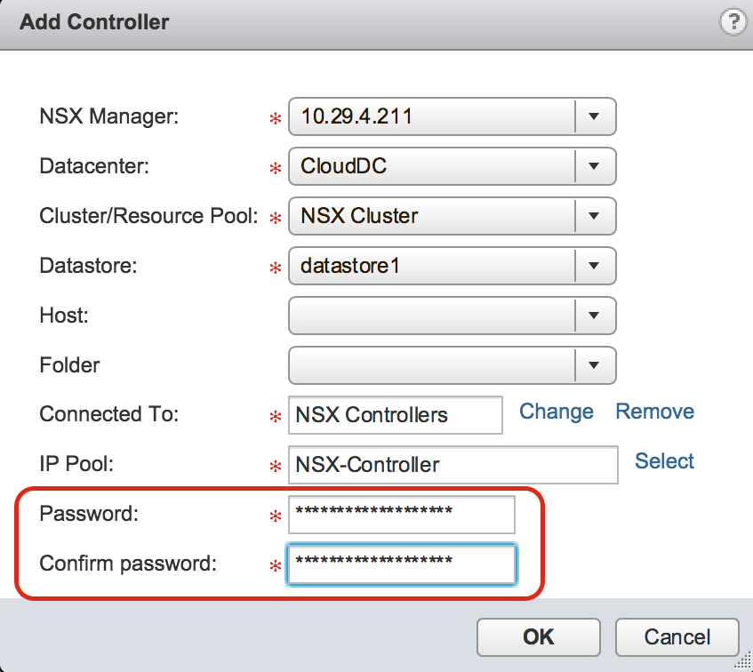
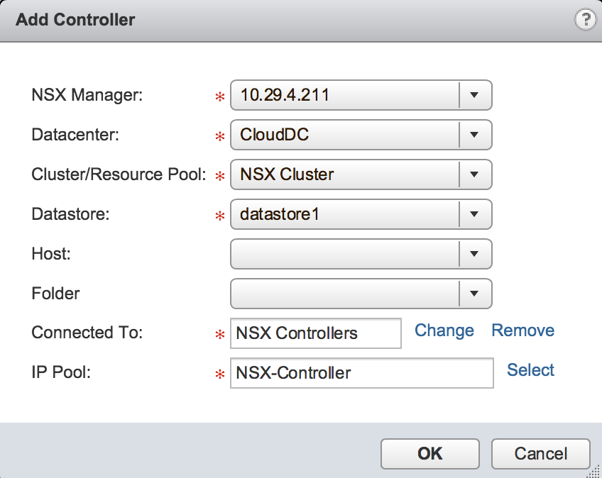
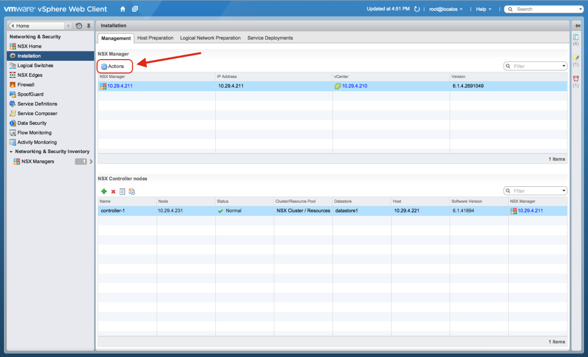
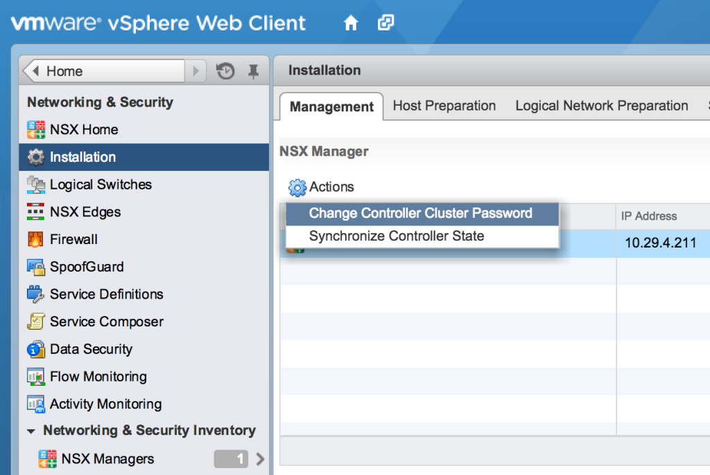
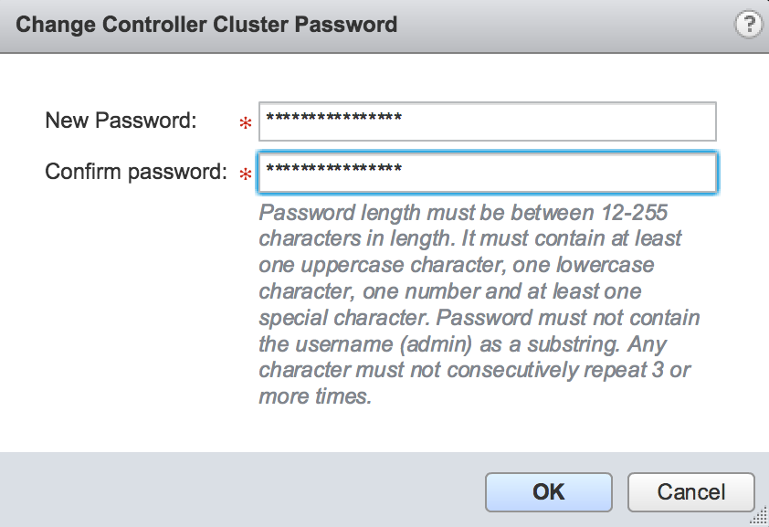

Changing NSX-v controller passwords is a question which comes up quite a bit with customers. Often because the passwords chosen at deployment time are either too complex to type in on a VM console session, or on the other end of the spectrum, they were set to something easy to type during deployment, and now need to be changed.

When deploying NSX-v controllers during the setup phase, the password is set when deploying the first controller.

Subsequent controllers will then use the same password when deployed (the password fields are removed).

In NSX-v 6.1.2 and earlier versions, the only known way to change the password of a controller was via the CLI (although not officially supported), however it only affects the specific controller you run the commands on, meaning you would need to run the commands on all your controllers. If you deployed a new controller, it would be deployed with the original password, and you would need to change it via the CLI manually once deployed.

In NSX-v version 6.1.3, a new "Actions" menu was snuck in on the Networking & Security Installation screen, under the management tab. There didn't appear to be any mention of this in the official NSX-v release notes though.

One of the new Action menu items is "Change Controller Cluster Password".

And guess what, it does exactly what it says. It allows the controller cluster password to be changed within the UI. It will change the password on all currently deployed controllers, and will use the new password for all new controllers that get deployed in the future. Happy Days!
