When working with the Service Composer in NSX-v, by default, when a firewall rule is created in a Security Policy, the firewall rule, when applied, uses the default **Applied To** value of **Distributed Firewall**. This means that even though the firewall rule is part of a security policy which is then applied to a specific security group, the rule would be pushed down to every vNIC within the clusters that have been prepared for NSX DFW capabilities and have the firewall enabled.

[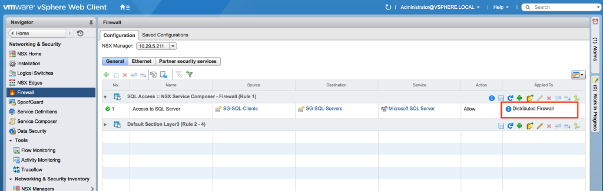](http://www.sneaku.com/wp-content/uploads/2015/09/appliedto-01.png)

One of the new features introduced in NSX-v 6.2 is the ability to modify the default behaviour of the Applied To field for all Service Composer firewall rules so that the behaviour can be switched between the values **Distributed Firewall** or **Policy’s Security Group**.

To change the behaviour, use the following steps:

> **Please read the whole article before changing this value so you understand the implications of doing so!**

[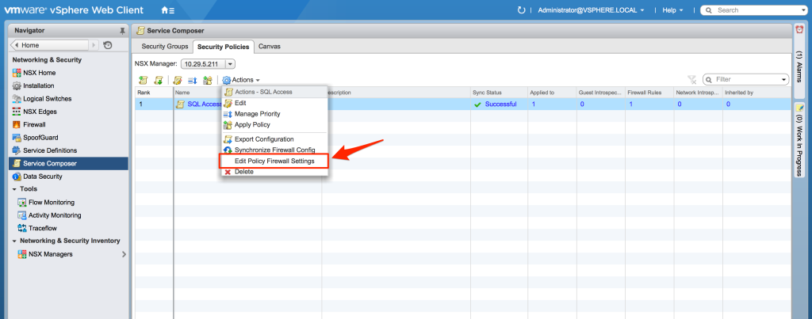](http://www.sneaku.com/wp-content/uploads/2015/09/appliedto-02.png)

[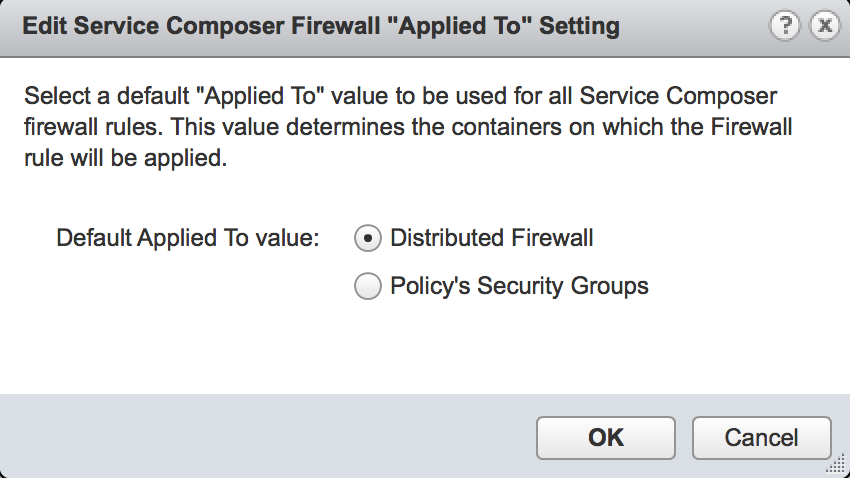](http://www.sneaku.com/wp-content/uploads/2015/09/appliedto-03.png)

What is the effect of changing the value from the default setting of **Distributed Firewall** to **Policy’s Security Group**?

So if we go back to our already created security policy which is configured to allow **Policy Security Group** as the source, to communicate to servers which are members of the security group called **SG-SQL-Servers** via **MSSQL** (TCP/1433)

[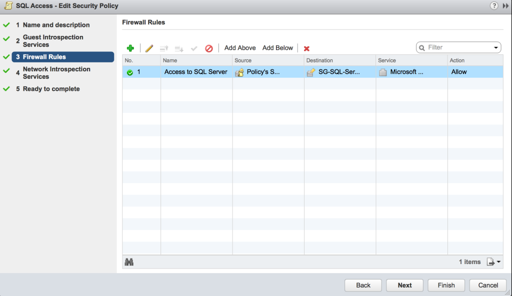](http://www.sneaku.com/wp-content/uploads/2015/09/appliedto-04.png)

[](http://www.sneaku.com/wp-content/uploads/2015/09/appliedto-05.png)

We can see that the **Policy’s Security Group** is defined as the source in the rule. We can also see that the security policy has been applied to the security group **SG-SQL-Clients**.

[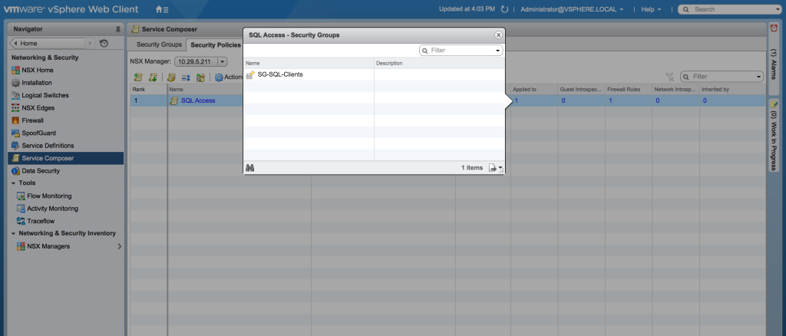](http://www.sneaku.com/wp-content/uploads/2015/09/appliedto-06.png)

And if you look at the firewall UI, you can see the whole rule along with the **Applied To** field which is set to **Distributed Firewall**. Unlike a normal firewall rule, you cannot change the individual **Applied To** field of a firewall rule created within a Security Policy.

[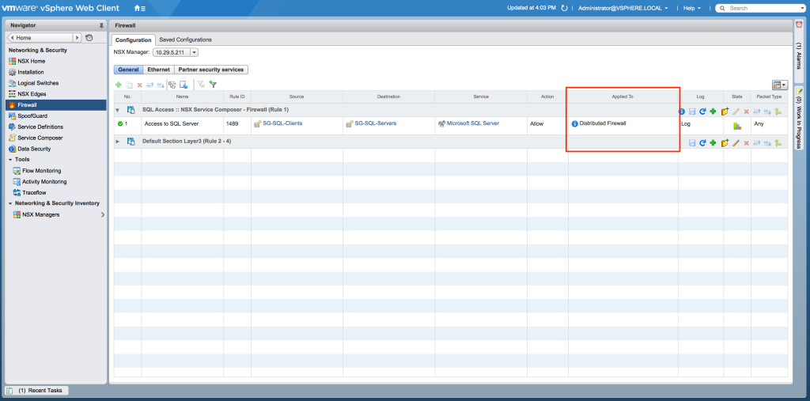](http://www.sneaku.com/wp-content/uploads/2015/09/appliedto-07.png)

On both the source and destination VMs which make up this rule, the firewall rules appear as follows:

This is the filter applied to the VM **SneakU-APP-02** which is a member of the **SG-SQL-Clients** security group

```
nsxmgr01> show dfw host host-10 filter nic-689859-eth0-vmware-sfw.2 rules
ruleset domain-c7 {
  # Filter rules
  rule 1489 at 1 inout protocol tcp from addrset ip-securitygroup-23 to addrset ip-securitygroup-24 port 1433 accept with log;
  rule 1003 at 2 inout protocol ipv6-icmp icmptype 136 from any to any accept;
  rule 1003 at 3 inout protocol ipv6-icmp icmptype 135 from any to any accept;
  rule 1002 at 4 inout protocol udp from any to any port 67 accept;
  rule 1002 at 5 inout protocol udp from any to any port 68 accept;
  rule 1001 at 6 inout protocol any from any to any drop with log;
}

ruleset domain-c7_L2 {
  # Filter rules
  rule 1004 at 1 inout ethertype any from any to any accept;
}
```

This is the filter applied to the VM **SneakU-DB-01** which is a member of the **SG-SQL-Servers** security group

```
nsxmgr01> show dfw host host-10 filter nic-704448-eth0-vmware-sfw.2 rules
ruleset domain-c7 {
  # Filter rules
  rule 1489 at 1 inout protocol tcp from addrset ip-securitygroup-23 to addrset ip-securitygroup-24 port 1433 accept with log;
  rule 1003 at 2 inout protocol ipv6-icmp icmptype 136 from any to any accept;
  rule 1003 at 3 inout protocol ipv6-icmp icmptype 135 from any to any accept;
  rule 1002 at 4 inout protocol udp from any to any port 67 accept;
  rule 1002 at 5 inout protocol udp from any to any port 68 accept;
  rule 1001 at 6 inout protocol any from any to any drop with log;
}

ruleset domain-c7_L2 {
  # Filter rules
  rule 1004 at 1 inout ethertype any from any to any accept;
}
```

You can see rule ID **1489** appears on both the source and destination VMs. The outcome is that on the SQL-Client VM, the rule allows the connection to the SQL-Server VM (outbound), and on the SQL-Server VM, the rules will allow the connection from the SQL-Client VM to the SQL-Server VM (inbound).

Now lets change the behaviour

[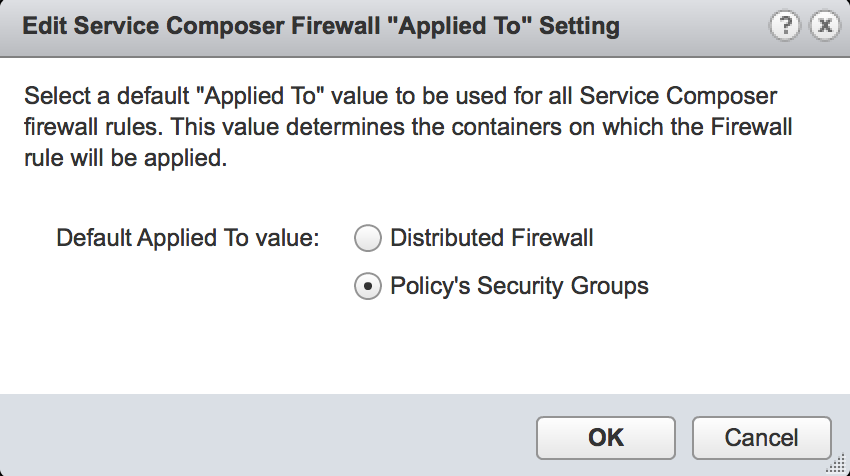](http://www.sneaku.com/wp-content/uploads/2015/09/appliedto-08.png)

The Firewall rule in the Firewall UI has now got its **Applied To** field changed, which means that this rule will now only apply to the VMs which are a member of the security group **SG-SQL-Clients**.

[](http://www.sneaku.com/wp-content/uploads/2015/09/appliedto-09.png)

And we run the same commands from the nsx manger central cli to view the rules actually applied to the vmic on the VMs.

The rules as applied to the SQL Client VM**:**

```
nsxmgr01> show dfw host host-10 filter nic-689859-eth0-vmware-sfw.2 rules
ruleset domain-c7 {
  # Filter rules
  rule 1489 at 1 inout protocol tcp from addrset ip-securitygroup-23 to addrset ip-securitygroup-24 port 1433 accept with log;
  rule 1003 at 2 inout protocol ipv6-icmp icmptype 136 from any to any accept;
  rule 1003 at 3 inout protocol ipv6-icmp icmptype 135 from any to any accept;
  rule 1002 at 4 inout protocol udp from any to any port 67 accept;
  rule 1002 at 5 inout protocol udp from any to any port 68 accept;
  rule 1001 at 6 inout protocol any from any to any drop with log;
}

ruleset domain-c7_L2 {
  # Filter rules
  rule 1004 at 1 inout ethertype any from any to any accept;
}
```

And here are the rules as applied to the SQL server VM:

```
nsxmgr01> show dfw host host-10 filter nic-704448-eth0-vmware-sfw.2 rules
ruleset domain-c7 {
  # Filter rules
  rule 1003 at 1 inout protocol ipv6-icmp icmptype 136 from any to any accept;
  rule 1003 at 2 inout protocol ipv6-icmp icmptype 135 from any to any accept;
  rule 1002 at 3 inout protocol udp from any to any port 67 accept;
  rule 1002 at 4 inout protocol udp from any to any port 68 accept;
  rule 1001 at 5 inout protocol any from any to any drop with log;
}

ruleset domain-c7_L2 {
  # Filter rules
  rule 1004 at 1 inout ethertype any from any to any accept;
}
```

As you can see from the output of the above commands, a connection from the SQL client VM will be permitted out of the SQL Client VM by rule ID 1489, however there is now no corresponding rule on the SQL Server VM to allow the connection from the SQL Client VM (as the default rule is set to drop). So what was previously a working security policy in a default NSX-v installation, will now not work and the connection will be dropped by the DFW filter applied to the SQL-Server VM.

To permit this traffic now, a second security policy must be created, and applied to the SG-SQL-Servers security group.

[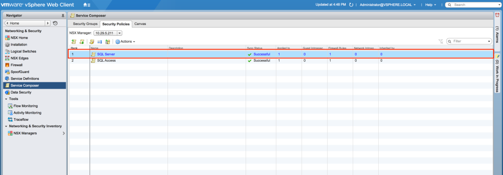](http://www.sneaku.com/wp-content/uploads/2015/09/appliedto-10.png)

[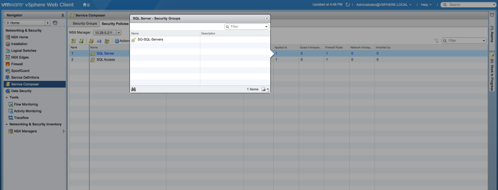](http://www.sneaku.com/wp-content/uploads/2015/09/appliedto-11.png)

[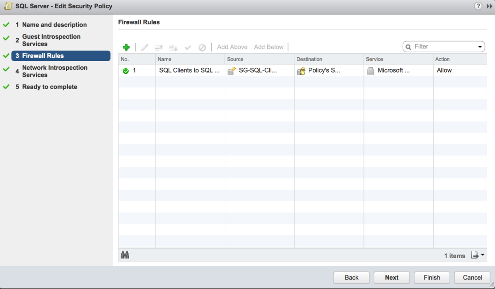](http://www.sneaku.com/wp-content/uploads/2015/09/appliedto-12.png)

[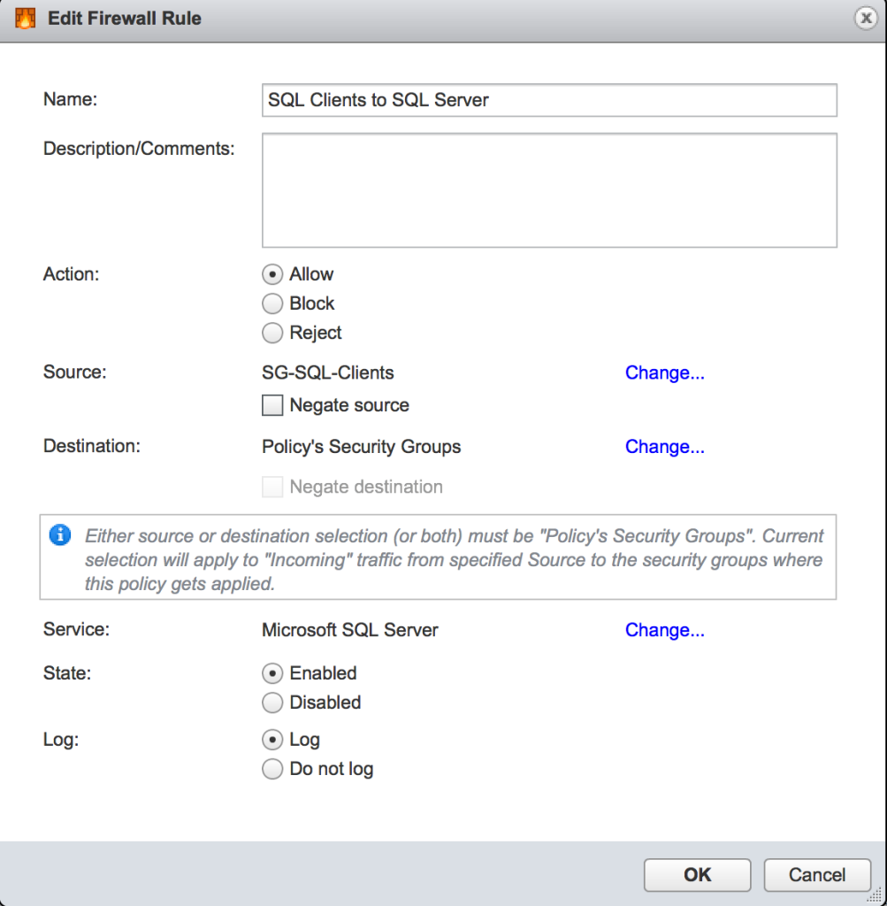](http://www.sneaku.com/wp-content/uploads/2015/09/appliedto-13.png)

[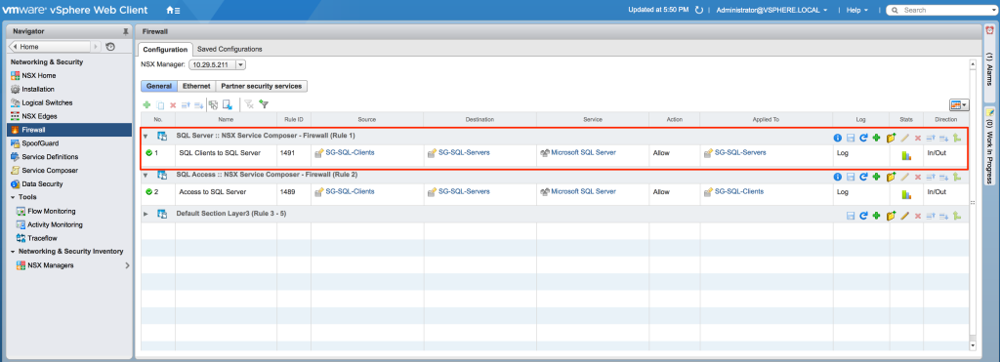](http://www.sneaku.com/wp-content/uploads/2015/09/appliedto-14.png)

And here you can see the appropriate rules are now applied to both the SQL Client VM and the SQL Server VM.

SQL Client VM:

```
nsxmgr01> show dfw host host-10 filter nic-689859-eth0-vmware-sfw.2 rules  
ruleset domain-c7 {
  # Filter rules
  rule 1489 at 1 inout protocol tcp from addrset ip-securitygroup-23 to addrset ip-securitygroup-24 port 1433 accept with log;
  rule 1003 at 2 inout protocol ipv6-icmp icmptype 136 from any to any accept;
  rule 1003 at 3 inout protocol ipv6-icmp icmptype 135 from any to any accept;
  rule 1002 at 4 inout protocol udp from any to any port 67 accept;
  rule 1002 at 5 inout protocol udp from any to any port 68 accept;
  rule 1001 at 6 inout protocol any from any to any drop with log;
}

ruleset domain-c7_L2 {
  # Filter rules
  rule 1004 at 1 inout ethertype any from any to any accept;
}

```

SQL Server VM:

```
nsxmgr01> show dfw host host-10 filter nic-704448-eth0-vmware-sfw.2 rules
ruleset domain-c7 {
  # Filter rules
  rule 1491 at 1 inout protocol tcp from addrset ip-securitygroup-23 to addrset ip-securitygroup-24 port 1433 accept with log;
  rule 1003 at 2 inout protocol ipv6-icmp icmptype 136 from any to any accept;
  rule 1003 at 3 inout protocol ipv6-icmp icmptype 135 from any to any accept;
  rule 1002 at 4 inout protocol udp from any to any port 67 accept;
  rule 1002 at 5 inout protocol udp from any to any port 68 accept;
  rule 1001 at 6 inout protocol any from any to any drop with log;
}

ruleset domain-c7_L2 {
  # Filter rules
  rule 1004 at 1 inout ethertype any from any to any accept;
}

```

If you are just starting out with NSX 6.2 and don’t have any security policies created, you should experiment and evaluate whether you want to change this setting or not.

If you have an existing installation with many security policies already configured, then you will need to determine if you want to change this value, as it could have disastrous consequences in an existing environment if you don't plan correctly.

## What about vRA?

For customers who use vRA or may want to implement vRA in the future, please take note.

Part of the vRA documentation has a section for integration with NSX ([LINK](http://pubs.vmware.com/vra-62/index.jsp#com.vmware.vra.iaas.mm.doc/GUID-716C5AD6-C4E0-4671-99BE-B0720A01340B.html?resultof=%2522%254e%2553%2558%2522%2520%2522%256e%2573%2578%2522%2520)), which as of vRA version 6.2.2 reads as follows:

> Before you use the NSX security policy features from vRealize Automation, an administrator must run the **Enable security policy support for overlapping subnets** workflow in vRealize Orchestrator.
> 
> The security policy support for overlapping subnets workflow is applicable to an VMware NSX 6.1 and later endpoint. You must run this workflow only once to enable the AppliedTo flag in the service composer.
> 
> Prerequisites
> 
> - Verify that a vSphere endpoint is registered with an NSX endpoint. See Create a vSphere Endpoint for Networking and Security Virtualization.
> - Log in to the vRealize Orchestrator Client as an Administrator.
> 
> Procedure
> 
> 1. Select the Workflow tab to navigate through the library to the NSX > NSX workflows for VCAC folder.
> 2. Run the Enable security policy support for overlapping subnets workflow.
> 3. Select the NSX endpoint as the input parameter for the workflow.
>     - Use the IP address you specified when you created the vSphere endpoint to register an NSX instance.

By running the workflow mentioned in the vRA NSX integration instructions, it changes the default **Applied To** value via an API call.

This means that if your NSX 6.0.x or 6.1.x installation is being consumed by vRA or vCAC, it may have already modified the default behaviour.

It is something to keep in mind, as often vRA may be implemented by a different team that operates/installed NSX into the environment, and if the individual installing vRA into the environment follows the instructions to the letter (which they should do), depending on how your firewall rules are configured, they could cause them to break if they were configured through security policies.
