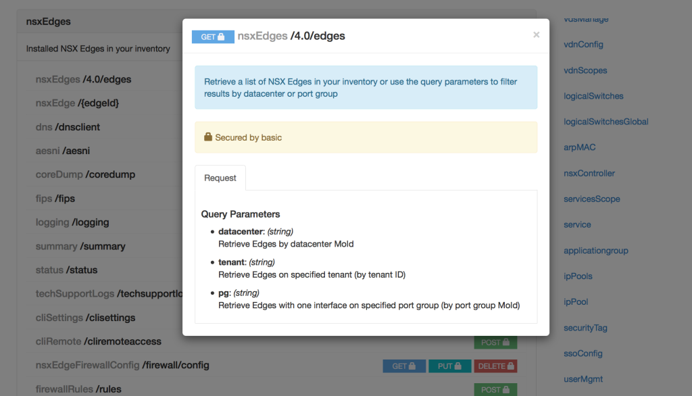
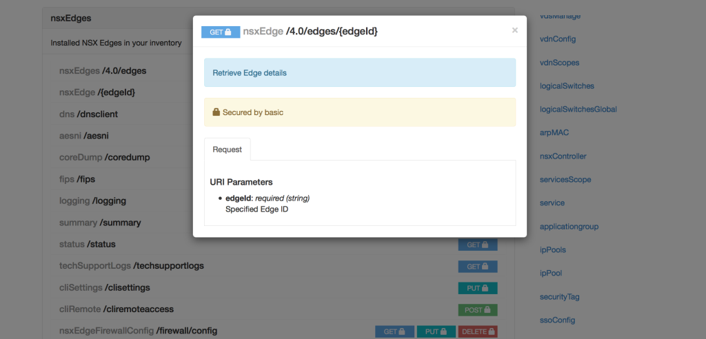

Up until now, my programmatic interactions with the NSX API have all been hacked together based on the NSX API Guide, due to the lack of a specific NSX API scripting interface.

 

For typical vSphere scripting, there has been PowerCli and also pyvmomi and I am sure a few more I don't know about, but nothing created specifically for NSX. This meant that for individuals like myself, who wanted to write scripts to interact with the NSX-v API through python, we would have to create all the API calls from scratch which is time consuming and then learn how to parse the responses and content.

 

What I also found, is that as I have written more scripts and understood how to parse XML better, my scripts have changed over time so how I used to do something in an early script, is not how I do it in my more recent scripts.

 

This week I stumbled across a couple of interesting VMware repositories on GitHub which hopefully will make interacting with the NSX-v API a hell of a lot easier through Python and Ansible.

 

The repositories are:

**NSXRAML**

[https://github.com/vmware/nsxraml](https://github.com/vmware/nsxraml)

A RAML specification of the NSX for vSphere 6.x API.

 

**NSXRAMLCLIENT**

[https://github.com/vmware/nsxramlclient](https://github.com/vmware/nsxramlclient)

A Python client which can utilise the NSX RAML file above.

 

**NSXANSIBLE**

[https://github.com/vmware/nsxansible](https://github.com/vmware/nsxansible)

This repository contains a number of Ansible modules, written in Python, that can be used to create, read, update and delete objects in NSX for vSphere.

 

So after a quick google to figure out what an actual RAML file is ([click here to open the RAML website in a new window which explains it all](http://raml.org/)), I thought I would jump straight into the deep end and give both the NSXRAML and NSXRAMLCLIENT a shot.

 

Obviously the first port of call is to download both the source for NSXRAML and the NSXRAMLCLIENT

 

Next we will user pip to install the nsxramlclient

```
sudo pip install nsxramlclient
```

```
sneaku-mbpro:Desktop sneaku$ sudo pip install nsxramlclient
Password:

Collecting nsxramlclient
  Downloading nsxramlclient-1.0.1.tar.gz
Collecting pyraml-parser>=0.1.3 (from nsxramlclient)
  Downloading pyraml-parser-0.1.5.tar.gz
Collecting lxml (from nsxramlclient)
  Downloading lxml-3.4.4.tar.gz (3.5MB)
    100% |████████████████████████████████| 3.5MB 147kB/s
Collecting requests>=2.7.0 (from nsxramlclient)
  Downloading requests-2.7.0-py2.py3-none-any.whl (470kB)
    100% |████████████████████████████████| 471kB 455kB/s

Requirement already satisfied (use --upgrade to upgrade): setuptools in /System/Library/Frameworks/Python.framework/Versions/2.7/Extras/lib/python (from pyraml-parser>=0.1.3->nsxramlclient)

Collecting PyYAML>=3.10 (from pyraml-parser>=0.1.3->nsxramlclient)
  Downloading PyYAML-3.11.tar.gz (248kB)
    100% |████████████████████████████████| 249kB 1.2MB/s

Requirement already satisfied (use --upgrade to upgrade): six>=1.9.0 in /Library/Python/2.7/site-packages (from pyraml-parser>=0.1.3->nsxramlclient)
Installing collected packages: PyYAML, pyraml-parser, lxml, requests, nsxramlclient
  Running setup.py install for PyYAML
  Running setup.py install for pyraml-parser
  Running setup.py install for lxml
  Found existing installation: requests 2.5.0
    Uninstalling requests-2.5.0:
      Successfully uninstalled requests-2.5.0
  Running setup.py install for nsxramlclient
Successfully installed PyYAML-3.11 lxml-3.4.4 nsxramlclient-1.0.1 pyraml-parser-0.1.5 requests-2.7.0
sneaku-mbpro:Desktop sneaku$
```

After a little wait, you should have the NSXRAMLCLIENT installed.

Now apparently we just jump into our python environment

```
sneaku-mbpro:Desktop sneaku$ python
Python 2.7.10 (default, Jul 14 2015, 19:46:27)
[GCC 4.2.1 Compatible Apple LLVM 6.0 (clang-600.0.39)] on darwin
Type "help", "copyright", "credits" or "license" for more information.
>>>
```

and import the nsxramlclient module, set some variables, remembering that the path to the RAML file is the absolute path, not a relative path.

```
from nsxramlclient.client import NsxClient

nsxraml_file = '/Users/sneaku/Documents/07-NSXRAML/Repositories/NSXRAML/nsxraml-master/nsxvapiv614.raml'
nsxmanager = '10.29.5.211'
nsx_username = 'admin'
nsx_password = 'default'
```

Create a session to our nsx manager.

```
client_session = NsxClient(nsxraml_file, nsxmanager, nsx_username, nsx_password, debug=False)
```

```
sneaku-mbpro:Desktop sneaku$ python
Python 2.7.10 (default, Jul 14 2015, 19:46:27)
[GCC 4.2.1 Compatible Apple LLVM 6.0 (clang-600.0.39)] on darwin
Type "help", "copyright", "credits" or "license" for more information.
>>>
>>> from nsxramlclient.client import NsxClient
>>>
>>> nsxraml_file = '/Users/sneaku/Documents/07-NSXRAML/Repositories/NSXRAML/nsxraml-master/nsxvapiv614.raml'
>>> nsxmanager = '10.29.5.211'
>>> nsx_username = 'admin'
>>> nsx_password = 'default'
>>>
>>> client_session = NsxClient(nsxraml_file, nsxmanager, nsx_username, nsx_password, debug=False)
>>>
```

Now lets do something simple, like check the sso configuration

```
client_session.read('ssoConfig')
```

```
>>> client_session.read('ssoConfig')
OrderedDict([('status', 200), ('body', {'ssoConfig': {'vsmSolutionName': 'VSM_SOLUTION_1dafd442-2e1d-4a61-b538-3acb4c60658e', 'ssoAdminUsername': 'administrator@vsphere.local', 'ssoLookupServiceUrl': 'https://10.29.5.210:443/lookupservice/sdk'}}), ('location', None), ('objectId', None), ('Etag', None)])

```

Ok this makes things a hell of a lot easier, as I don’t have to know how to parse XML to read the content, I can just use python ordered dictionaries.

Lets try something a bit more in-depth like querying all edges. But first we need to find out the syntax and I will use the HTML version of the RAML file, which makes browsing the API really simplistic.

[](http://www.sneaku.com/wp-content/uploads/2015/09/RAML-01.png)

As I just want to query all edges, I don't need to use a parameter.

```
client_session.read('nsxEdges')
```

```
>>> client_session.read('nsxEdges')
OrderedDict([('status', 200), ('body', {'pagedEdgeList': {'edgePage': {'pagingInfo': {'sortOrderAscending': 'true', 'totalCount': '3', 'startIndex': '0', 'sortBy': 'id', 'pageSize': '256'}, 'edgeSummary': [{'edgeType': 'gatewayServices', 'recentJobInfo': {'status': 'SUCCESS', 'jobId': 'jobdata-2628'}, 'hypervisorAssist': 'false', 'id': 'edge-1', 'edgeStatus': 'GREEN', 'objectId': 'edge-1', 'nodeId': '90b9aba3-1d2d-4e1a-82f4-7f51b907b209', 'datacenterName': 'SneakU 6.2 VDC', 'state': 'deployed', 'clientHandle': None, 'type': {'typeName': 'Edge'}, 'revision': '20', 'vsmUuid': '564DB5DE-B47E-A83E-CB5D-915368D5EA23', 'appliancesSummary': {'activeVseHaIndex': '0', 'vmMoidOfActiveVse': 'vm-21', 'vmVersion': '6.2.0', 'numberOfDeployedVms': '1', 'fqdn': 'ComputeFW', 'vmBuildInfo': '6.2.0-2982179', 'applianceSize': 'compact', 'communicationChannel': 'msgbus', 'hostMoidOfActiveVse': 'host-10', 'vmNameOfActiveVse': 'ComputeFW-0', 'hostNameOfActiveVse': '10.29.5.128', 'dataStoreMoidOfActiveVse': 'datastore-11', 'resourcePoolNameOfActiveVse': 'Resources', 'dataStoreNameOfActiveVse': 'datastore1', 'statusFromVseUpdatedOn': '1442550646622', 'resourcePoolMoidOfActiveVse': 'resgroup-8'}, 'extendedAttributes': None, 'universalRevision': '0', 'allowedActions': {'string': ['Change Log Level', 'Add Edge Appliance', 'Delete Edge Appliance', 'Edit Edge Appliance', 'Edit CLI Credentials', 'Change edge appliance size', 'Force Sync', 'Redeploy Edge', 'Change Edge Appliance Core Dump Configuration', 'Enable hypervisorAssist', 'Edit Highavailability', 'Edit Dns', 'Edit Syslog', 'Edit Automatic Rule Generation Settings', 'Disable SSH', 'Download Edge TechSupport Logs']}, 'objectTypeName': 'Edge', 'isUniversal': 'false', 'name': 'ComputeFW', 'numberOfConnectedVnics': '2', 'apiVersion': '4.0', 'tenantId': 'default', 'datacenterMoid': 'datacenter-2'}, {'edgeType': 'distributedRouter', 'recentJobInfo': {'status': 'SUCCESS', 'jobId': 'jobdata-2620'}, 'apiVersion': '4.0', 'edgeAssistId': '5000', 'edgeStatus': 'GREEN', 'edgeAssistInstanceName': 'Internal-IT+edge-29', 'objectId': 'edge-29', 'nodeId': '90b9aba3-1d2d-4e1a-82f4-7f51b907b209', 'id': 'edge-29', 'datacenterName': 'SneakU 6.2 VDC', 'state': 'deployed', 'clientHandle': None, 'type': {'typeName': 'Edge'}, 'revision': '8', 'vsmUuid': '564DB5DE-B47E-A83E-CB5D-915368D5EA23', 'appliancesSummary': {'activeVseHaIndex': '0', 'vmMoidOfActiveVse': 'vm-172', 'vmVersion': '6.2.0', 'numberOfDeployedVms': '1', 'fqdn': 'Internal-IT-DLR-01', 'vmBuildInfo': '6.2.0-2982179', 'applianceSize': 'compact', 'communicationChannel': 'msgbus', 'hostMoidOfActiveVse': 'host-10', 'vmNameOfActiveVse': 'Internal-IT-DLR-01-0', 'hostNameOfActiveVse': '10.29.5.128', 'dataStoreMoidOfActiveVse': 'datastore-11', 'resourcePoolNameOfActiveVse': 'Resources', 'dataStoreNameOfActiveVse': 'datastore1', 'statusFromVseUpdatedOn': '1442550646835', 'resourcePoolMoidOfActiveVse': 'resgroup-8'}, 'extendedAttributes': None, 'universalRevision': '0', 'allowedActions': {'string': ['Change Log Level', 'Add Edge Appliance', 'Delete Edge Appliance', 'Edit Edge Appliance', 'Edit CLI Credentials', 'Force Sync', 'Redeploy Edge', 'Change Edge Appliance Core Dump Configuration', 'Edit Highavailability', 'Edit Dns', 'Edit Syslog', 'Disable SSH', 'Download Edge TechSupport Logs']}, 'objectTypeName': 'Edge', 'isUniversal': 'false', 'name': 'Internal-IT-DLR-01', 'lrouterUuid': '79d086e1-42ca-4dbd-8f09-c0482aaf7e52', 'numberOfConnectedVnics': '3', 'hypervisorAssist': 'false', 'tenantId': 'Internal-IT', 'datacenterMoid': 'datacenter-2'}, {'edgeType': 'gatewayServices', 'recentJobInfo': {'status': 'SUCCESS', 'jobId': 'jobdata-2627'}, 'hypervisorAssist': 'false', 'id': 'edge-30', 'edgeStatus': 'GREEN', 'objectId': 'edge-30', 'nodeId': '90b9aba3-1d2d-4e1a-82f4-7f51b907b209', 'datacenterName': 'SneakU 6.2 VDC', 'state': 'deployed', 'clientHandle': None, 'type': {'typeName': 'Edge'}, 'revision': '5', 'vsmUuid': '564DB5DE-B47E-A83E-CB5D-915368D5EA23', 'appliancesSummary': {'activeVseHaIndex': '0', 'vmMoidOfActiveVse': 'vm-173', 'vmVersion': '6.2.0', 'numberOfDeployedVms': '1', 'fqdn': 'Internal-IT-ESG-01', 'vmBuildInfo': '6.2.0-2982179', 'applianceSize': 'compact', 'communicationChannel': 'msgbus', 'hostMoidOfActiveVse': 'host-10', 'vmNameOfActiveVse': 'Internal-IT-ESG-01-0', 'hostNameOfActiveVse': '10.29.5.128', 'dataStoreMoidOfActiveVse': 'datastore-11', 'resourcePoolNameOfActiveVse': 'Resources', 'dataStoreNameOfActiveVse': 'datastore1', 'statusFromVseUpdatedOn': '1442550648608', 'resourcePoolMoidOfActiveVse': 'resgroup-8'}, 'extendedAttributes': None, 'universalRevision': '0', 'allowedActions': {'string': ['Change Log Level', 'Add Edge Appliance', 'Delete Edge Appliance', 'Edit Edge Appliance', 'Edit CLI Credentials', 'Change edge appliance size', 'Force Sync', 'Redeploy Edge', 'Change Edge Appliance Core Dump Configuration', 'Enable hypervisorAssist', 'Edit Highavailability', 'Edit Dns', 'Edit Syslog', 'Edit Automatic Rule Generation Settings', 'Disable SSH', 'Download Edge TechSupport Logs']}, 'objectTypeName': 'Edge', 'isUniversal': 'false', 'name': 'Internal-IT-ESG-01', 'numberOfConnectedVnics': '2', 'apiVersion': '4.0', 'tenantId': 'Internal-IT', 'datacenterMoid': 'datacenter-2'}]}}}), ('location', None), ('objectId', None), ('Etag', None)])
```

And then we get a whole heap of data. Do it again and save it as a variable this time.

```
edgesList = client_session.read('nsxEdges')
```

Import the YAML module, which can be used to display the output in a more readable format.

```
import yaml
print yaml.dump(edgesList)
```

```
>>> import yaml
>>> print yaml.dump(edgesList)
status: 200
body:
  pagedEdgeList:
    edgePage:
      edgeSummary:
      - allowedActions:
          string: [Change Log Level, Add Edge Appliance, Delete Edge Appliance, Edit
              Edge Appliance, Edit CLI Credentials, Change edge appliance size, Force
              Sync, Redeploy Edge, Change Edge Appliance Core Dump Configuration,
            Enable hypervisorAssist, Edit Highavailability, Edit Dns, Edit Syslog,
            Edit Automatic Rule Generation Settings, Disable SSH, Download Edge TechSupport
              Logs]
        apiVersion: '4.0'
        appliancesSummary: {activeVseHaIndex: '0', applianceSize: compact, communicationChannel: msgbus,
          dataStoreMoidOfActiveVse: datastore-11, dataStoreNameOfActiveVse: datastore1,
          fqdn: ComputeFW, hostMoidOfActiveVse: host-10, hostNameOfActiveVse: 10.29.5.128,
          numberOfDeployedVms: '1', resourcePoolMoidOfActiveVse: resgroup-8, resourcePoolNameOfActiveVse: Resources,
          statusFromVseUpdatedOn: '1442550766619', vmBuildInfo: 6.2.0-2982179, vmMoidOfActiveVse: vm-21,
          vmNameOfActiveVse: ComputeFW-0, vmVersion: 6.2.0}
        clientHandle: null
        datacenterMoid: datacenter-2
        datacenterName: SneakU 6.2 VDC
        edgeStatus: GREEN
        edgeType: gatewayServices
        extendedAttributes: null
        hypervisorAssist: 'false'
        id: edge-1
        isUniversal: 'false'
        name: ComputeFW
        nodeId: 90b9aba3-1d2d-4e1a-82f4-7f51b907b209
        numberOfConnectedVnics: '2'
        objectId: edge-1
        objectTypeName: Edge
        recentJobInfo: {jobId: jobdata-2628, status: SUCCESS}
        revision: '20'
        state: deployed
        tenantId: default
        type: {typeName: Edge}
        universalRevision: '0'
        vsmUuid: 564DB5DE-B47E-A83E-CB5D-915368D5EA23
      - allowedActions:
          string: [Change Log Level, Add Edge Appliance, Delete Edge Appliance, Edit
              Edge Appliance, Edit CLI Credentials, Force Sync, Redeploy Edge, Change
              Edge Appliance Core Dump Configuration, Edit Highavailability, Edit
              Dns, Edit Syslog, Disable SSH, Download Edge TechSupport Logs]
        apiVersion: '4.0'
        appliancesSummary: {activeVseHaIndex: '0', applianceSize: compact, communicationChannel: msgbus,
          dataStoreMoidOfActiveVse: datastore-11, dataStoreNameOfActiveVse: datastore1,
          fqdn: Internal-IT-DLR-01, hostMoidOfActiveVse: host-10, hostNameOfActiveVse: 10.29.5.128,
          numberOfDeployedVms: '1', resourcePoolMoidOfActiveVse: resgroup-8, resourcePoolNameOfActiveVse: Resources,
          statusFromVseUpdatedOn: '1442550766835', vmBuildInfo: 6.2.0-2982179, vmMoidOfActiveVse: vm-172,
          vmNameOfActiveVse: Internal-IT-DLR-01-0, vmVersion: 6.2.0}
        clientHandle: null
        datacenterMoid: datacenter-2
        datacenterName: SneakU 6.2 VDC
        edgeAssistId: '5000'
        edgeAssistInstanceName: Internal-IT+edge-29
        edgeStatus: GREEN
        edgeType: distributedRouter
        extendedAttributes: null
        hypervisorAssist: 'false'
        id: edge-29
        isUniversal: 'false'
        lrouterUuid: 79d086e1-42ca-4dbd-8f09-c0482aaf7e52
        name: Internal-IT-DLR-01
        nodeId: 90b9aba3-1d2d-4e1a-82f4-7f51b907b209
        numberOfConnectedVnics: '3'
        objectId: edge-29
        objectTypeName: Edge
        recentJobInfo: {jobId: jobdata-2620, status: SUCCESS}
        revision: '8'
        state: deployed
        tenantId: Internal-IT
        type: {typeName: Edge}
        universalRevision: '0'
        vsmUuid: 564DB5DE-B47E-A83E-CB5D-915368D5EA23
      - allowedActions:
          string: [Change Log Level, Add Edge Appliance, Delete Edge Appliance, Edit
              Edge Appliance, Edit CLI Credentials, Change edge appliance size, Force
              Sync, Redeploy Edge, Change Edge Appliance Core Dump Configuration,
            Enable hypervisorAssist, Edit Highavailability, Edit Dns, Edit Syslog,
            Edit Automatic Rule Generation Settings, Disable SSH, Download Edge TechSupport
              Logs]
        apiVersion: '4.0'
        appliancesSummary: {activeVseHaIndex: '0', applianceSize: compact, communicationChannel: msgbus,
          dataStoreMoidOfActiveVse: datastore-11, dataStoreNameOfActiveVse: datastore1,
          fqdn: Internal-IT-ESG-01, hostMoidOfActiveVse: host-10, hostNameOfActiveVse: 10.29.5.128,
          numberOfDeployedVms: '1', resourcePoolMoidOfActiveVse: resgroup-8, resourcePoolNameOfActiveVse: Resources,
          statusFromVseUpdatedOn: '1442550768602', vmBuildInfo: 6.2.0-2982179, vmMoidOfActiveVse: vm-173,
          vmNameOfActiveVse: Internal-IT-ESG-01-0, vmVersion: 6.2.0}
        clientHandle: null
        datacenterMoid: datacenter-2
        datacenterName: SneakU 6.2 VDC
        edgeStatus: GREEN
        edgeType: gatewayServices
        extendedAttributes: null
        hypervisorAssist: 'false'
        id: edge-30
        isUniversal: 'false'
        name: Internal-IT-ESG-01
        nodeId: 90b9aba3-1d2d-4e1a-82f4-7f51b907b209
        numberOfConnectedVnics: '2'
        objectId: edge-30
        objectTypeName: Edge
        recentJobInfo: {jobId: jobdata-2627, status: SUCCESS}
        revision: '5'
        state: deployed
        tenantId: Internal-IT
        type: {typeName: Edge}
        universalRevision: '0'
        vsmUuid: 564DB5DE-B47E-A83E-CB5D-915368D5EA23
      pagingInfo: {pageSize: '256', sortBy: id, sortOrderAscending: 'true', startIndex: '0',
        totalCount: '3'}
location: null
objectId: null
Etag: null

```

If you change the default\_flow\_style to False, it makes it a bit more readable again.

```
print yaml.dump(edgesList, default_flow_style=False)
```

```
>>> print yaml.dump(edgesList, default_flow_style=False)
status: 200
body:
  pagedEdgeList:
    edgePage:
      edgeSummary:
      - allowedActions:
          string:
          - Change Log Level
          - Add Edge Appliance
          - Delete Edge Appliance
          - Edit Edge Appliance
          - Edit CLI Credentials
          - Change edge appliance size
          - Force Sync
          - Redeploy Edge
          - Change Edge Appliance Core Dump Configuration
          - Enable hypervisorAssist
          - Edit Highavailability
          - Edit Dns
          - Edit Syslog
          - Edit Automatic Rule Generation Settings
          - Disable SSH
          - Download Edge TechSupport Logs
        apiVersion: '4.0'
        appliancesSummary:
          activeVseHaIndex: '0'
          applianceSize: compact
          communicationChannel: msgbus
          dataStoreMoidOfActiveVse: datastore-11
          dataStoreNameOfActiveVse: datastore1
          fqdn: ComputeFW
          hostMoidOfActiveVse: host-10
          hostNameOfActiveVse: 10.29.5.128
          numberOfDeployedVms: '1'
          resourcePoolMoidOfActiveVse: resgroup-8
          resourcePoolNameOfActiveVse: Resources
          statusFromVseUpdatedOn: '1442550766619'
          vmBuildInfo: 6.2.0-2982179
          vmMoidOfActiveVse: vm-21
          vmNameOfActiveVse: ComputeFW-0
          vmVersion: 6.2.0
        clientHandle: null
        datacenterMoid: datacenter-2
        datacenterName: SneakU 6.2 VDC
        edgeStatus: GREEN
        edgeType: gatewayServices
        extendedAttributes: null
        hypervisorAssist: 'false'
        id: edge-1
        isUniversal: 'false'
        name: ComputeFW
        nodeId: 90b9aba3-1d2d-4e1a-82f4-7f51b907b209
        numberOfConnectedVnics: '2'
        objectId: edge-1
        objectTypeName: Edge
        recentJobInfo:
          jobId: jobdata-2628
          status: SUCCESS
        revision: '20'
        state: deployed
        tenantId: default
        type:
          typeName: Edge
        universalRevision: '0'
        vsmUuid: 564DB5DE-B47E-A83E-CB5D-915368D5EA23
      - allowedActions:
          string:
          - Change Log Level
          - Add Edge Appliance
          - Delete Edge Appliance
          - Edit Edge Appliance
          - Edit CLI Credentials
          - Force Sync
          - Redeploy Edge
          - Change Edge Appliance Core Dump Configuration
          - Edit Highavailability
          - Edit Dns
          - Edit Syslog
          - Disable SSH
          - Download Edge TechSupport Logs
        apiVersion: '4.0'
        appliancesSummary:
          activeVseHaIndex: '0'
          applianceSize: compact
          communicationChannel: msgbus
          dataStoreMoidOfActiveVse: datastore-11
          dataStoreNameOfActiveVse: datastore1
          fqdn: Internal-IT-DLR-01
          hostMoidOfActiveVse: host-10
          hostNameOfActiveVse: 10.29.5.128
          numberOfDeployedVms: '1'
          resourcePoolMoidOfActiveVse: resgroup-8
          resourcePoolNameOfActiveVse: Resources
          statusFromVseUpdatedOn: '1442550766835'
          vmBuildInfo: 6.2.0-2982179
          vmMoidOfActiveVse: vm-172
          vmNameOfActiveVse: Internal-IT-DLR-01-0
          vmVersion: 6.2.0
        clientHandle: null
        datacenterMoid: datacenter-2
        datacenterName: SneakU 6.2 VDC
        edgeAssistId: '5000'
        edgeAssistInstanceName: Internal-IT+edge-29
        edgeStatus: GREEN
        edgeType: distributedRouter
        extendedAttributes: null
        hypervisorAssist: 'false'
        id: edge-29
        isUniversal: 'false'
        lrouterUuid: 79d086e1-42ca-4dbd-8f09-c0482aaf7e52
        name: Internal-IT-DLR-01
        nodeId: 90b9aba3-1d2d-4e1a-82f4-7f51b907b209
        numberOfConnectedVnics: '3'
        objectId: edge-29
        objectTypeName: Edge
        recentJobInfo:
          jobId: jobdata-2620
          status: SUCCESS
        revision: '8'
        state: deployed
        tenantId: Internal-IT
        type:
          typeName: Edge
        universalRevision: '0'
        vsmUuid: 564DB5DE-B47E-A83E-CB5D-915368D5EA23
      - allowedActions:
          string:
          - Change Log Level
          - Add Edge Appliance
          - Delete Edge Appliance
          - Edit Edge Appliance
          - Edit CLI Credentials
          - Change edge appliance size
          - Force Sync
          - Redeploy Edge
          - Change Edge Appliance Core Dump Configuration
          - Enable hypervisorAssist
          - Edit Highavailability
          - Edit Dns
          - Edit Syslog
          - Edit Automatic Rule Generation Settings
          - Disable SSH
          - Download Edge TechSupport Logs
        apiVersion: '4.0'
        appliancesSummary:
          activeVseHaIndex: '0'
          applianceSize: compact
          communicationChannel: msgbus
          dataStoreMoidOfActiveVse: datastore-11
          dataStoreNameOfActiveVse: datastore1
          fqdn: Internal-IT-ESG-01
          hostMoidOfActiveVse: host-10
          hostNameOfActiveVse: 10.29.5.128
          numberOfDeployedVms: '1'
          resourcePoolMoidOfActiveVse: resgroup-8
          resourcePoolNameOfActiveVse: Resources
          statusFromVseUpdatedOn: '1442550768602'
          vmBuildInfo: 6.2.0-2982179
          vmMoidOfActiveVse: vm-173
          vmNameOfActiveVse: Internal-IT-ESG-01-0
          vmVersion: 6.2.0
        clientHandle: null
        datacenterMoid: datacenter-2
        datacenterName: SneakU 6.2 VDC
        edgeStatus: GREEN
        edgeType: gatewayServices
        extendedAttributes: null
        hypervisorAssist: 'false'
        id: edge-30
        isUniversal: 'false'
        name: Internal-IT-ESG-01
        nodeId: 90b9aba3-1d2d-4e1a-82f4-7f51b907b209
        numberOfConnectedVnics: '2'
        objectId: edge-30
        objectTypeName: Edge
        recentJobInfo:
          jobId: jobdata-2627
          status: SUCCESS
        revision: '5'
        state: deployed
        tenantId: Internal-IT
        type:
          typeName: Edge
        universalRevision: '0'
        vsmUuid: 564DB5DE-B47E-A83E-CB5D-915368D5EA23
      pagingInfo:
        pageSize: '256'
        sortBy: id
        sortOrderAscending: 'true'
        startIndex: '0'
        totalCount: '3'
location: null
objectId: null
Etag: null
```

Now let run through some more basic tasks

Save some of the first level items as variables

```
status = edgesList['status']
body = edgesList['body']
etag = edgesList['Etag']
location = edgesList['location']
objectid = edgesList['objectId']
```

```
>>> 
>>> status = edgesList['status']
>>> body = edgesList['body']
>>> etag = edgesList['Etag']
>>> location = edgesList['location']
>>> objectid = edgesList['objectId']
>>>
```

Display all edges

```
print body['pagedEdgeList']['edgePage']['edgeSummary']
```

```
>>> print body['pagedEdgeList']['edgePage']['edgeSummary']
[{'edgeType': 'gatewayServices', 'recentJobInfo': {'status': 'SUCCESS', 'jobId': 'jobdata-2628'}, 'hypervisorAssist': 'false', 'id': 'edge-1', 'edgeStatus': 'GREEN', 'objectId': 'edge-1', 'nodeId': '90b9aba3-1d2d-4e1a-82f4-7f51b907b209', 'datacenterName': 'SneakU 6.2 VDC', 'state': 'deployed', 'clientHandle': None, 'type': {'typeName': 'Edge'}, 'revision': '20', 'vsmUuid': '564DB5DE-B47E-A83E-CB5D-915368D5EA23', 'appliancesSummary': {'activeVseHaIndex': '0', 'vmMoidOfActiveVse': 'vm-21', 'vmVersion': '6.2.0', 'numberOfDeployedVms': '1', 'fqdn': 'ComputeFW', 'vmBuildInfo': '6.2.0-2982179', 'applianceSize': 'compact', 'communicationChannel': 'msgbus', 'hostMoidOfActiveVse': 'host-10', 'vmNameOfActiveVse': 'ComputeFW-0', 'hostNameOfActiveVse': '10.29.5.128', 'dataStoreMoidOfActiveVse': 'datastore-11', 'resourcePoolNameOfActiveVse': 'Resources', 'dataStoreNameOfActiveVse': 'datastore1', 'statusFromVseUpdatedOn': '1442550766619', 'resourcePoolMoidOfActiveVse': 'resgroup-8'}, 'extendedAttributes': None, 'universalRevision': '0', 'allowedActions': {'string': ['Change Log Level', 'Add Edge Appliance', 'Delete Edge Appliance', 'Edit Edge Appliance', 'Edit CLI Credentials', 'Change edge appliance size', 'Force Sync', 'Redeploy Edge', 'Change Edge Appliance Core Dump Configuration', 'Enable hypervisorAssist', 'Edit Highavailability', 'Edit Dns', 'Edit Syslog', 'Edit Automatic Rule Generation Settings', 'Disable SSH', 'Download Edge TechSupport Logs']}, 'objectTypeName': 'Edge', 'isUniversal': 'false', 'name': 'ComputeFW', 'numberOfConnectedVnics': '2', 'apiVersion': '4.0', 'tenantId': 'default', 'datacenterMoid': 'datacenter-2'}, {'edgeType': 'distributedRouter', 'recentJobInfo': {'status': 'SUCCESS', 'jobId': 'jobdata-2620'}, 'apiVersion': '4.0', 'edgeAssistId': '5000', 'edgeStatus': 'GREEN', 'edgeAssistInstanceName': 'Internal-IT+edge-29', 'objectId': 'edge-29', 'nodeId': '90b9aba3-1d2d-4e1a-82f4-7f51b907b209', 'id': 'edge-29', 'datacenterName': 'SneakU 6.2 VDC', 'state': 'deployed', 'clientHandle': None, 'type': {'typeName': 'Edge'}, 'revision': '8', 'vsmUuid': '564DB5DE-B47E-A83E-CB5D-915368D5EA23', 'appliancesSummary': {'activeVseHaIndex': '0', 'vmMoidOfActiveVse': 'vm-172', 'vmVersion': '6.2.0', 'numberOfDeployedVms': '1', 'fqdn': 'Internal-IT-DLR-01', 'vmBuildInfo': '6.2.0-2982179', 'applianceSize': 'compact', 'communicationChannel': 'msgbus', 'hostMoidOfActiveVse': 'host-10', 'vmNameOfActiveVse': 'Internal-IT-DLR-01-0', 'hostNameOfActiveVse': '10.29.5.128', 'dataStoreMoidOfActiveVse': 'datastore-11', 'resourcePoolNameOfActiveVse': 'Resources', 'dataStoreNameOfActiveVse': 'datastore1', 'statusFromVseUpdatedOn': '1442550766835', 'resourcePoolMoidOfActiveVse': 'resgroup-8'}, 'extendedAttributes': None, 'universalRevision': '0', 'allowedActions': {'string': ['Change Log Level', 'Add Edge Appliance', 'Delete Edge Appliance', 'Edit Edge Appliance', 'Edit CLI Credentials', 'Force Sync', 'Redeploy Edge', 'Change Edge Appliance Core Dump Configuration', 'Edit Highavailability', 'Edit Dns', 'Edit Syslog', 'Disable SSH', 'Download Edge TechSupport Logs']}, 'objectTypeName': 'Edge', 'isUniversal': 'false', 'name': 'Internal-IT-DLR-01', 'lrouterUuid': '79d086e1-42ca-4dbd-8f09-c0482aaf7e52', 'numberOfConnectedVnics': '3', 'hypervisorAssist': 'false', 'tenantId': 'Internal-IT', 'datacenterMoid': 'datacenter-2'}, {'edgeType': 'gatewayServices', 'recentJobInfo': {'status': 'SUCCESS', 'jobId': 'jobdata-2627'}, 'hypervisorAssist': 'false', 'id': 'edge-30', 'edgeStatus': 'GREEN', 'objectId': 'edge-30', 'nodeId': '90b9aba3-1d2d-4e1a-82f4-7f51b907b209', 'datacenterName': 'SneakU 6.2 VDC', 'state': 'deployed', 'clientHandle': None, 'type': {'typeName': 'Edge'}, 'revision': '5', 'vsmUuid': '564DB5DE-B47E-A83E-CB5D-915368D5EA23', 'appliancesSummary': {'activeVseHaIndex': '0', 'vmMoidOfActiveVse': 'vm-173', 'vmVersion': '6.2.0', 'numberOfDeployedVms': '1', 'fqdn': 'Internal-IT-ESG-01', 'vmBuildInfo': '6.2.0-2982179', 'applianceSize': 'compact', 'communicationChannel': 'msgbus', 'hostMoidOfActiveVse': 'host-10', 'vmNameOfActiveVse': 'Internal-IT-ESG-01-0', 'hostNameOfActiveVse': '10.29.5.128', 'dataStoreMoidOfActiveVse': 'datastore-11', 'resourcePoolNameOfActiveVse': 'Resources', 'dataStoreNameOfActiveVse': 'datastore1', 'statusFromVseUpdatedOn': '1442550768602', 'resourcePoolMoidOfActiveVse': 'resgroup-8'}, 'extendedAttributes': None, 'universalRevision': '0', 'allowedActions': {'string': ['Change Log Level', 'Add Edge Appliance', 'Delete Edge Appliance', 'Edit Edge Appliance', 'Edit CLI Credentials', 'Change edge appliance size', 'Force Sync', 'Redeploy Edge', 'Change Edge Appliance Core Dump Configuration', 'Enable hypervisorAssist', 'Edit Highavailability', 'Edit Dns', 'Edit Syslog', 'Edit Automatic Rule Generation Settings', 'Disable SSH', 'Download Edge TechSupport Logs']}, 'objectTypeName': 'Edge', 'isUniversal': 'false', 'name': 'Internal-IT-ESG-01', 'numberOfConnectedVnics': '2', 'apiVersion': '4.0', 'tenantId': 'Internal-IT', 'datacenterMoid': 'datacenter-2'}]

```

Display the first edge details.

```
print body['pagedEdgeList']['edgePage']['edgeSummary'][0]
```

```
>>> print body['pagedEdgeList']['edgePage']['edgeSummary'][0]
{'edgeType': 'gatewayServices', 'recentJobInfo': {'status': 'SUCCESS', 'jobId': 'jobdata-2628'}, 'hypervisorAssist': 'false', 'id': 'edge-1', 'edgeStatus': 'GREEN', 'objectId': 'edge-1', 'nodeId': '90b9aba3-1d2d-4e1a-82f4-7f51b907b209', 'datacenterName': 'SneakU 6.2 VDC', 'state': 'deployed', 'clientHandle': None, 'type': {'typeName': 'Edge'}, 'revision': '20', 'vsmUuid': '564DB5DE-B47E-A83E-CB5D-915368D5EA23', 'appliancesSummary': {'activeVseHaIndex': '0', 'vmMoidOfActiveVse': 'vm-21', 'vmVersion': '6.2.0', 'numberOfDeployedVms': '1', 'fqdn': 'ComputeFW', 'vmBuildInfo': '6.2.0-2982179', 'applianceSize': 'compact', 'communicationChannel': 'msgbus', 'hostMoidOfActiveVse': 'host-10', 'vmNameOfActiveVse': 'ComputeFW-0', 'hostNameOfActiveVse': '10.29.5.128', 'dataStoreMoidOfActiveVse': 'datastore-11', 'resourcePoolNameOfActiveVse': 'Resources', 'dataStoreNameOfActiveVse': 'datastore1', 'statusFromVseUpdatedOn': '1442550766619', 'resourcePoolMoidOfActiveVse': 'resgroup-8'}, 'extendedAttributes': None, 'universalRevision': '0', 'allowedActions': {'string': ['Change Log Level', 'Add Edge Appliance', 'Delete Edge Appliance', 'Edit Edge Appliance', 'Edit CLI Credentials', 'Change edge appliance size', 'Force Sync', 'Redeploy Edge', 'Change Edge Appliance Core Dump Configuration', 'Enable hypervisorAssist', 'Edit Highavailability', 'Edit Dns', 'Edit Syslog', 'Edit Automatic Rule Generation Settings', 'Disable SSH', 'Download Edge TechSupport Logs']}, 'objectTypeName': 'Edge', 'isUniversal': 'false', 'name': 'ComputeFW', 'numberOfConnectedVnics': '2', 'apiVersion': '4.0', 'tenantId': 'default', 'datacenterMoid': 'datacenter-2'}
```

Display the second edge details.

```
print body['pagedEdgeList']['edgePage']['edgeSummary’][1]
```

```
>>> print body['pagedEdgeList']['edgePage']['edgeSummary'][1]
{'edgeType': 'distributedRouter', 'recentJobInfo': {'status': 'SUCCESS', 'jobId': 'jobdata-2620'}, 'apiVersion': '4.0', 'edgeAssistId': '5000', 'edgeStatus': 'GREEN', 'edgeAssistInstanceName': 'Internal-IT+edge-29', 'objectId': 'edge-29', 'nodeId': '90b9aba3-1d2d-4e1a-82f4-7f51b907b209', 'id': 'edge-29', 'datacenterName': 'SneakU 6.2 VDC', 'state': 'deployed', 'clientHandle': None, 'type': {'typeName': 'Edge'}, 'revision': '8', 'vsmUuid': '564DB5DE-B47E-A83E-CB5D-915368D5EA23', 'appliancesSummary': {'activeVseHaIndex': '0', 'vmMoidOfActiveVse': 'vm-172', 'vmVersion': '6.2.0', 'numberOfDeployedVms': '1', 'fqdn': 'Internal-IT-DLR-01', 'vmBuildInfo': '6.2.0-2982179', 'applianceSize': 'compact', 'communicationChannel': 'msgbus', 'hostMoidOfActiveVse': 'host-10', 'vmNameOfActiveVse': 'Internal-IT-DLR-01-0', 'hostNameOfActiveVse': '10.29.5.128', 'dataStoreMoidOfActiveVse': 'datastore-11', 'resourcePoolNameOfActiveVse': 'Resources', 'dataStoreNameOfActiveVse': 'datastore1', 'statusFromVseUpdatedOn': '1442550766835', 'resourcePoolMoidOfActiveVse': 'resgroup-8'}, 'extendedAttributes': None, 'universalRevision': '0', 'allowedActions': {'string': ['Change Log Level', 'Add Edge Appliance', 'Delete Edge Appliance', 'Edit Edge Appliance', 'Edit CLI Credentials', 'Force Sync', 'Redeploy Edge', 'Change Edge Appliance Core Dump Configuration', 'Edit Highavailability', 'Edit Dns', 'Edit Syslog', 'Disable SSH', 'Download Edge TechSupport Logs']}, 'objectTypeName': 'Edge', 'isUniversal': 'false', 'name': 'Internal-IT-DLR-01', 'lrouterUuid': '79d086e1-42ca-4dbd-8f09-c0482aaf7e52', 'numberOfConnectedVnics': '3', 'hypervisorAssist': 'false', 'tenantId': 'Internal-IT', 'datacenterMoid': 'datacenter-2'}
```

Saves all edge details to a variable.

```
allEdgeDetails = body['pagedEdgeList']['edgePage']['edgeSummary']
```

Loop through the edges and print the objectId, name and tenantId

```
for x in allEdgeDetails:
    print x['id'] + ' | ' + x['name'] + ' | ' + x['tenantId']
```

```
>>> allEdgeDetails = body['pagedEdgeList']['edgePage']['edgeSummary']
>>> for x in allEdgeDetails:
...     print x['id'] + ' | ' + x['name'] + ' | ' + x['tenantId']
... 
edge-1 | ComputeFW | default
edge-29 | Internal-IT-DLR-01 | Internal-IT
edge-30 | Internal-IT-ESG-01 | Internal-IT

```

Get the actual config of the ComputeFW and display the output.

[](http://www.sneaku.com/wp-content/uploads/2015/09/RAML-02.png)

```
edgeDetails = client_session.read('nsxEdge', uri_parameters={'edgeId': 'edge-1'})
print yaml.dump(edgeDetails, default_flow_style=False)
```

```
>>> edgeDetails = client_session.read('nsxEdge', uri_parameters={'edgeId': 'edge-1'})
>>> print yaml.dump(edgeDetails, default_flow_style=False)
status: 200
body:
  edge:
    appliances:
      appliance:
        datastoreId: datastore-11
        datastoreName: datastore1
        deployed: 'true'
        edgeId: edge-1
        highAvailabilityIndex: '0'
        hostId: host-10
        hostName: 10.29.5.128
        resourcePoolId: domain-c7
        resourcePoolName: NSX
        vcUuid: 500c7c84-2298-fdaa-4aaf-cb5f22788764
        vmFolderId: group-v3
        vmFolderName: vm
        vmHostname: ComputeFW-0
        vmId: vm-21
        vmName: ComputeFW-0
      applianceSize: compact
      deployAppliances: 'true'
    autoConfiguration:
      enabled: 'true'
      rulePriority: high
    cliSettings:
      passwordExpiry: '99999'
      remoteAccess: 'true'
      sshLoginBannerText: '***************************************************************************

        NOTICE TO USERS

        This computer system is the private property of its owner, whether

        individual, corporate or government.  It is for authorized use only.

        Users (authorized or unauthorized) have no explicit or implicit

        expectation of privacy.

        Any or all uses of this system and all files on this system may be

        intercepted, monitored, recorded, copied, audited, inspected, and

        disclosed to your employer, to authorized site, government, and law

        enforcement personnel, as well as authorized officials of government

        agencies, both domestic and foreign.

        By using this system, the user consents to such interception, monitoring,

        recording, copying, auditing, inspection, and disclosure at the

        discretion of such personnel or officials.  Unauthorized or improper use

        of this system may result in civil and criminal penalties and

        administrative or disciplinary action, as appropriate. By continuing to

        use this system you indicate your awareness of and consent to these terms

        and conditions of use. LOG OFF IMMEDIATELY if you do not agree to the

        conditions stated in this warning.

        ****************************************************************************'
      userName: admin
    datacenterMoid: datacenter-2
    datacenterName: SneakU 6.2 VDC
    enableAesni: 'true'
    enableFips: 'false'
    features:
      bridges:
        enabled: 'false'
        version: '20'
      dhcp:
        enabled: 'false'
        ipPools: null
        logging:
          enable: 'false'
          logLevel: info
        staticBindings: null
        version: '20'
      dns:
        cacheSize: '16'
        dnsViews:
          dnsView:
            enabled: 'true'
            name: vsm-default-view
            recursion: 'false'
            viewId: view-0
            viewMatch:
              ipAddress: any
              vnic: any
        enabled: 'false'
        listeners:
          vnic: any
        logging:
          enable: 'false'
          logLevel: info
        version: '20'
      featureConfig:
      - null
      - null
      - null
      firewall:
        defaultPolicy:
          action: accept
          loggingEnabled: 'true'
        enabled: 'true'
        firewallRules:
          firewallRule:
          - action: accept
            description: firewall
            enabled: 'true'
            id: '131074'
            loggingEnabled: 'false'
            name: firewall
            ruleTag: '131074'
            ruleType: internal_high
            source:
              exclude: 'false'
              vnicGroupId: vse
          - action: accept
            description: default rule for ingress traffic
            enabled: 'true'
            id: '131073'
            loggingEnabled: 'true'
            name: default rule for ingress traffic
            ruleTag: '131073'
            ruleType: default_policy
        globalConfig:
          dropInvalidTraffic: 'true'
          icmp6Timeout: '10'
          icmpTimeout: '10'
          ipGenericTimeout: '120'
          logInvalidTraffic: 'false'
          tcpAllowOutOfWindowPackets: 'false'
          tcpPickOngoingConnections: 'false'
          tcpSendResetForClosedVsePorts: 'true'
          tcpTimeoutClose: '30'
          tcpTimeoutEstablished: '3600'
          tcpTimeoutOpen: '30'
          udpTimeout: '60'
        version: '1'
      gslb:
        enabled: 'false'
        logging:
          enable: 'false'
          logLevel: info
        version: '1'
      highAvailability:
        declareDeadTime: '15'
        enabled: 'false'
        logging:
          enable: 'false'
          logLevel: info
        security:
          enabled: 'false'
        version: '20'
      ipsec:
        enabled: 'false'
        global:
          caCertificates: null
          crlCertificates: null
          psk: '******'
        logging:
          enable: 'false'
          logLevel: info
        sites: null
        version: '1'
      l2Vpn:
        enabled: 'false'
        logging:
          enable: 'false'
          logLevel: info
        version: '20'
      loadBalancer:
        accelerationEnabled: 'false'
        enableServiceInsertion: 'false'
        enabled: 'false'
        logging:
          enable: 'false'
          logLevel: info
        monitor:
        - interval: '5'
          maxRetries: '3'
          monitorId: monitor-1
          name: default_tcp_monitor
          timeout: '15'
          type: tcp
        - interval: '5'
          maxRetries: '3'
          method: GET
          monitorId: monitor-2
          name: default_http_monitor
          timeout: '15'
          type: http
          url: /
        - interval: '5'
          maxRetries: '3'
          method: GET
          monitorId: monitor-3
          name: default_https_monitor
          timeout: '15'
          type: https
          url: /
        version: '1'
      nat:
        enabled: 'true'
        natRules: null
        version: '20'
      routing:
        enabled: 'true'
        ospf:
          defaultOriginate: 'false'
          enabled: 'false'
          gracefulRestart: 'true'
          ospfAreas:
            ospfArea:
            - areaId: '51'
              authentication:
                type: none
              type: nssa
            - areaId: '0'
              authentication:
                type: none
              type: normal
          ospfInterfaces: null
          redistribution:
            enabled: 'false'
            rules: null
        routingGlobalConfig:
          ecmp: 'false'
          logging:
            enable: 'false'
            logLevel: info
        staticRouting:
          staticRoutes: null
        version: '20'
      sslvpnConfig:
        advancedConfig:
          clientNotification: null
          enableCompression: 'false'
          enablePublicUrlAccess: 'false'
          forceVirtualKeyboard: 'false'
          preventMultipleLogon: 'false'
          randomizeVirtualkeys: 'false'
          timeout:
            forcedTimeout: '0'
            sessionIdleTimeout: '10'
        authenticationConfiguration:
          passwordAuthentication:
            authenticationTimeout: '1'
            primaryAuthServers: null
            secondaryAuthServer: null
        clientConfiguration:
          autoReconnect: 'true'
          upgradeNotification: 'false'
        enabled: 'false'
        layoutConfiguration:
          bodyColor: FFFFFF
          companyName: VMware
          logoBackgroundColor: 56A2D4
          logoExtention: jpg
          logoUri: /api/4.0/edges/edge-1/sslvpn/config/layout/images/portallogo
          menuBarColor: '999999'
          portalTitle: VMware
          rowAlternativeColor: FFFFFF
          rowColor: F5F5F5
          titleColor: '996600'
          topFrameColor: '000000'
        logging:
          enable: 'false'
          logLevel: info
        version: '20'
      syslog:
        enabled: 'false'
        version: '1'
    fqdn: ComputeFW
    hypervisorAssist: 'false'
    id: edge-1
    isUniversal: 'false'
    name: ComputeFW
    queryDaemon:
      enabled: 'false'
      port: '5666'
    status: deployed
    tenant: default
    type: gatewayServices
    version: '20'
    vnics:
      vnic:
      - addressGroups: null
        enableProxyArp: 'false'
        enableSendRedirects: 'false'
        index: '0'
        isConnected: 'true'
        label: vNic_0
        mtu: '1500'
        name: Uplink
        portgroupId: virtualwire-1
        portgroupName: Compute-Uplink-LS
        type: uplink
      - addressGroups:
          addressGroup:
            primaryAddress: 7.7.7.2
            subnetMask: 255.255.255.252
            subnetPrefixLength: '30'
        enableProxyArp: 'false'
        enableSendRedirects: 'false'
        index: '1'
        isConnected: 'true'
        label: vNic_1
        mtu: '1500'
        name: Internal-IT
        portgroupId: virtualwire-93
        portgroupName: Internal-IT-ESG-Uplink
        type: uplink
      - addressGroups: null
        enableProxyArp: 'false'
        enableSendRedirects: 'true'
        index: '2'
        isConnected: 'false'
        label: vNic_2
        mtu: '1500'
        name: vnic2
        type: internal
      - addressGroups: null
        enableProxyArp: 'false'
        enableSendRedirects: 'true'
        index: '3'
        isConnected: 'false'
        label: vNic_3
        mtu: '1500'
        name: vnic3
        type: internal
      - addressGroups: null
        enableProxyArp: 'false'
        enableSendRedirects: 'true'
        index: '4'
        isConnected: 'false'
        label: vNic_4
        mtu: '1500'
        name: vnic4
        type: internal
      - addressGroups: null
        enableProxyArp: 'false'
        enableSendRedirects: 'true'
        index: '5'
        isConnected: 'false'
        label: vNic_5
        mtu: '1500'
        name: vnic5
        type: internal
      - addressGroups: null
        enableProxyArp: 'false'
        enableSendRedirects: 'true'
        index: '6'
        isConnected: 'false'
        label: vNic_6
        mtu: '1500'
        name: vnic6
        type: internal
      - addressGroups: null
        enableProxyArp: 'false'
        enableSendRedirects: 'true'
        index: '7'
        isConnected: 'false'
        label: vNic_7
        mtu: '1500'
        name: vnic7
        type: internal
      - addressGroups: null
        enableProxyArp: 'false'
        enableSendRedirects: 'true'
        index: '8'
        isConnected: 'false'
        label: vNic_8
        mtu: '1500'
        name: vnic8
        type: internal
      - addressGroups: null
        enableProxyArp: 'false'
        enableSendRedirects: 'true'
        index: '9'
        isConnected: 'false'
        label: vNic_9
        mtu: '1500'
        name: vnic9
        type: internal
    vseLogLevel: emergency
location: null
objectId: null
Etag: null
```

To display a list of NICs on the edge.

```
for x in edgeDetails['body']['edge']['vnics']['vnic']:
    print x['name']

```

```
>>> for x in edgeDetails['body']['edge']['vnics']['vnic']:
...     print x['name']
...
Uplink
Internal-IT
vnic2
vnic3
vnic4
vnic5
vnic6
vnic7
vnic8
vnic9
```

Show interfaces with an IP address configured.

```
for x in edgeDetails['body']['edge']['vnics']['vnic']:
    if x['addressGroups']:
        print x['name'] + ' | ' + x['addressGroups']['addressGroup']['primaryAddress'] + '/' + x['addressGroups']['addressGroup']['subnetPrefixLength'] + ' | ' + x['isConnected’]

```

```
>>> for x in edgeDetails['body']['edge']['vnics']['vnic']:
...     if x['addressGroups']:
...         print x['name'] + ' | ' + x['addressGroups']['addressGroup']['primaryAddress'] + '/' + x['addressGroups']['addressGroup']['subnetPrefixLength'] + ' | ' + x['isConnected’]
...
Internal-IT | 7.7.7.2/30 | true
```

Now that I have got my head around how to work with the response data, I am going to see if I can re-write some of my other scripts using the NSXRAMLCLIENT. After I have finished my first one, I will put up a post comparing both scripts so it's easy to see the differences.
