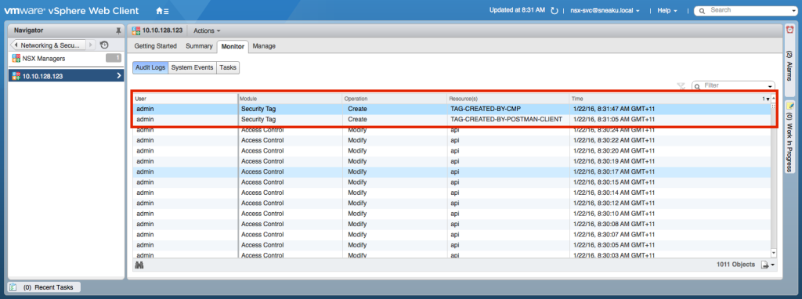
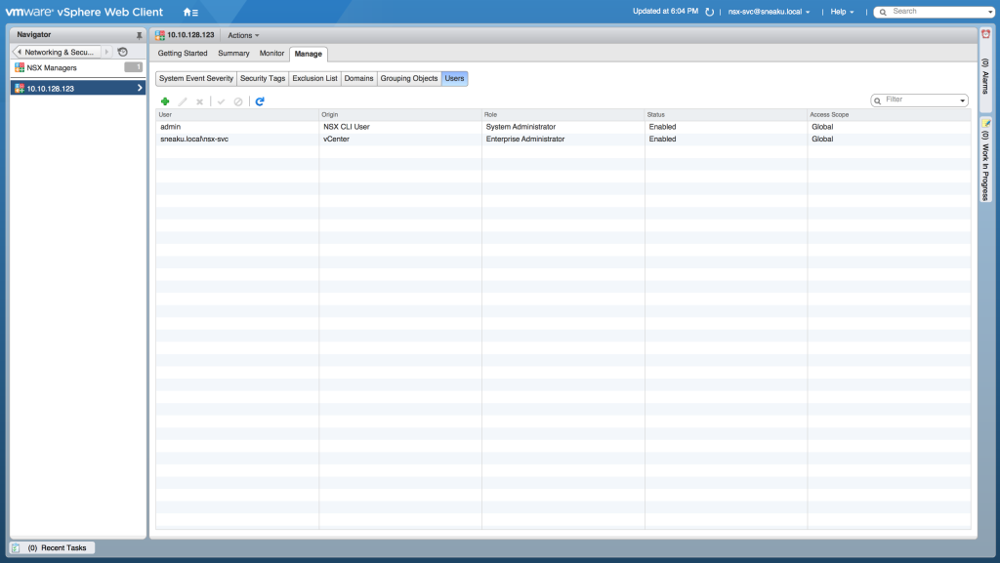
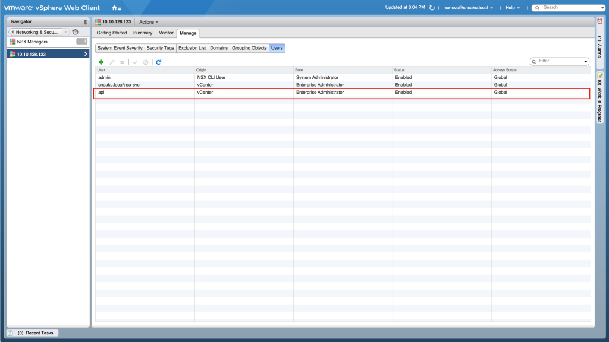
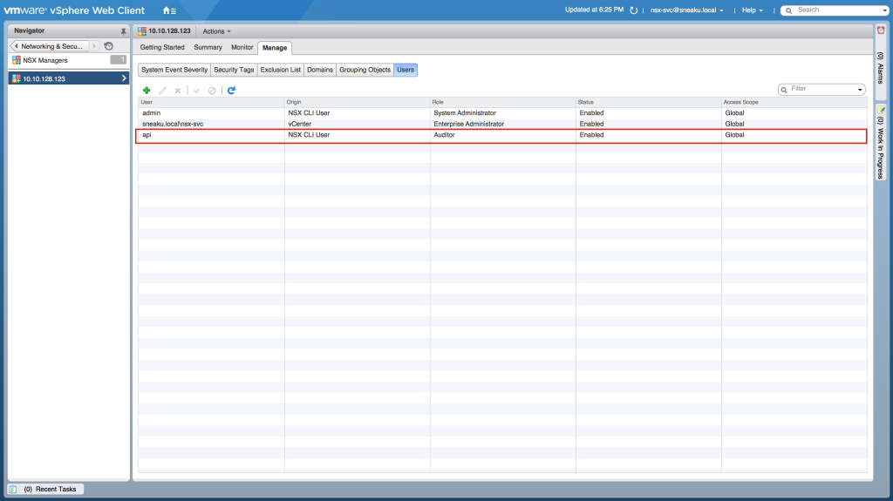
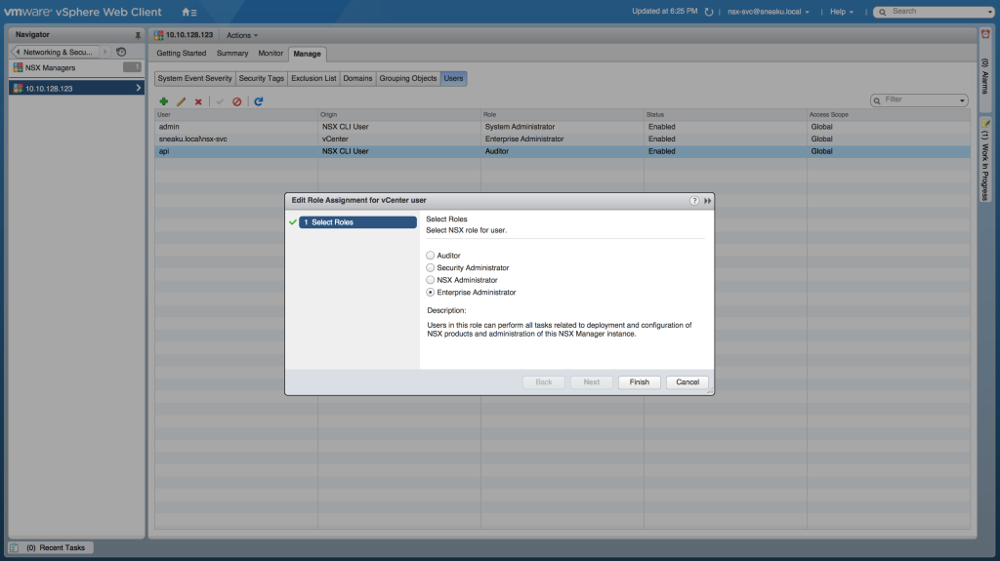
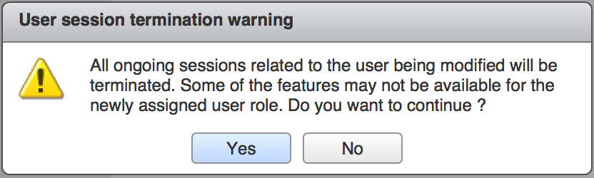
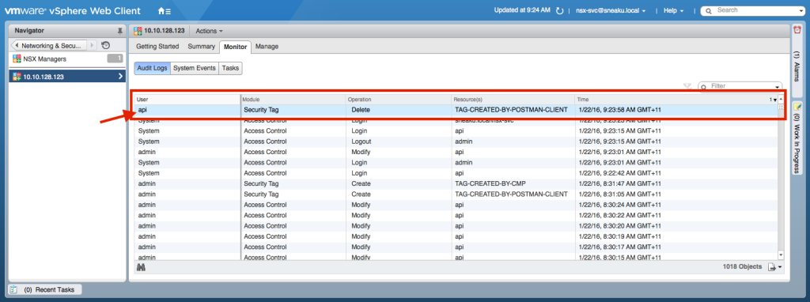

One of the main reasons for customers wanting to implement NSX for vSphere is the fact there is a RESTful API which can be leveraged to drive the whole system.

In a standard NSX-v installation, by default, the only account that has API only privileges (and no vSphere Web Client privileges) is the NSX Manager "admin" account. It is possible to use vSphere SSO accounts to interact with the NSX API, however this will also allow vSphere Web Client access (although they wont be able to view or access anything once logged on without granting specific vCenter rights).

However, recently I have been working with specific customers where there is often a requirement for an audit trail of some description, and having API calls logged under a normal NSX administrators account or the admin account typically does not fly when it comes to security reviews.

In other customer environments, different teams (or even external companies) look after different components of the NSX environment, so there is often a case to be able to give API only access just for security related configuration, in which case you would want to create an API only user with the role Security Admin. As is often the case in outsourcing type scenarios, the admin account credentials are not easily given up.

You can see from the following screenshot that when looking in the UI at the NSX Manager audit logs, it just shows the User, and in this case, it is "admin". This is the perfect example of 2 separate API clients making changes, as I actually made some manual changes via my Postman client, and some of the other audit log events are from automated scripts that I run. But from an audit log point of view, I can't tell them apart.

[](http://www.sneaku.com/wp-content/uploads/2016/01/api_user_007.png)

Even if I was to pull the audit logs via the API, they don't hold any more information to tell them apart.

```
<?xml version="1.0" encoding="UTF-8"?>
<pagedAuditLogList>
    <dataPage>
        <pagingInfo>
            <pageSize>256</pageSize>
            <startIndex>1009</startIndex>
            <totalCount>1011</totalCount>
            <sortOrderAscending>true</sortOrderAscending>
            <sortBy>id</sortBy>
        </pagingInfo>
        <auditLog>
            <id>1010</id>
            <userName>admin</userName>
            <module>SECURITY_TAG</module>
            <operation>CREATE</operation>
            <resource>TAG-CREATED-BY-POSTMAN-CLIENT</resource>
            <resourceId>securitytag-13</resourceId>
            <status>SUCCESS</status>
            <timestamp>1453411865978</timestamp>
            <oldValue></oldValue>
            <newValue></newValue>
            <isResourceUniversal>false</isResourceUniversal>
        </auditLog>
        <auditLog>
            <id>1011</id>
            <userName>admin</userName>
            <module>SECURITY_TAG</module>
            <operation>CREATE</operation>
            <resource>TAG-CREATED-BY-CMP</resource>
            <resourceId>securitytag-14</resourceId>
            <status>SUCCESS</status>
            <timestamp>1453411907550</timestamp>
            <oldValue></oldValue>
            <newValue></newValue>
            <isResourceUniversal>false</isResourceUniversal>
        </auditLog>
    </dataPage>
</pagedAuditLogList>
```

So as a means to provide the ability to be able to differentiate API only users, it is often a requirement to be able to create accounts specifically for API requests so these can be differentiated.

> Remember it is possible to use a normal vCenter/SSO with the correct NSX Roles assigned to it to execute NSX API requests. However this article focuses on creating a API account that cannot be used at all to logon to the vSphere Web Client.

The first step in creating an new API only user account is to SSH to the NSX Manager, switch to enable mode and enter the configuration terminal.

```
nsxmgr> ena
Password: 
nsxmgr# conf t
nsxmgr(config)#
```

Now once at the configuration terminal, we need to create a new user account on the NSX Manager with the following command:

```
user username password (hash | plaintext) password
```

So for this example we will create a user account called **api** and set the password to be **Password123**:

```
nsxmgr(config)# 
nsxmgr(config)# user api password plaintext Password123
nsxmgr(config)#
```

> _The NSX Manager does not allow you to enter a username that has a capital letter. If you try and create a user with a capital letter in the username, you will get the cryptic error as shown below:_

```
nsxmgr(config)# 
nsxmgr(config)# user Api password plaintext Password123 
Failed to add user. Note: You cannot use this command to change the passwd of an existing user.
ERROR: could not add user:Api
nsxmgr(config)#
```

Once you've created the CLI user, you need to assign it web-interface privileges so that it is able to be authenticated against the NSX Manager web interface

```
user username privilege web-interface
```

```
nsxmgr(config)# user api privilege web-interface 

```

Now save the configuration, and if you are the curious type, it possible to take a look at the running configuration.

```
nsxmgr(config)# user api privilege web-interface 
nsxmgr(config)# exit
nsxmgr#
nsxmgr# write memory 
Building Configuration...
Configuration saved.
[OK]
nsxmgr#
nsxmgr# show running-config 
Building configuration...

Current configuration:
!
user api
!
ntp server au.pool.ntp.org
!
ip name server 10.10.128.230 
!
hostname nsxmgr
!
interface mgmt
 ip address 10.10.128.123/24
!
ip route 0.0.0.0/0 10.10.128.1
!
web-manager
nsxmgr#
```

> _You will notice that the running configuration (or the startup configuration for that matter) does not indicate if the user has web-interface privileges or not!_

Although we have our API user created, if we try to do something via the API with the newly created credentials, we will get the error **HTTP Status 403 - VC user does not have any role on NSX Manager**.

So this is indicating that the user doesn't have any roles assigned on the NSX Manager.

Now jump into the vSphere Web Client and navigate to Networking & Security > NSX Managers > _"Select your NSX Manager"_ > Manage > Users

As you can see the user we created called **api** is not listed, and therefore has no role assigned.

[](http://www.sneaku.com/wp-content/uploads/2016/01/api_user_002.png)

If you try to create the user from this screen as I have done in the next screenshot

[](http://www.sneaku.com/wp-content/uploads/2016/01/api_user_001.png)

 

The user will be created as a vCenter user (as indicated in the Origin column), which means that the user will be authenticated against vCenter/SSO and will allow the user account to at least be able to logon to the vSphere Web Client.

You'll also notice that the admin user has an Origin of NSX CLI User, so what we need to do is create the user with an origin of NSX CLI User. Unfortunatley this cannot be done from the vSphere Web Client and must be done via the API.

> A quick thanks to Donovan Durand ([@donovanjd](https://twitter.com/donovanjd)) for figuring out the API required for this.

The API to do this is as follows:

Request

```
POST https://NSX-Manager-IP-Address/api/2.0/services/usermgmt/role/userId?isCli=true
```

Request Body

```
<accessControlEntry>
  <role>new-role</role>
  <resource>
    <resourceId>resource-num</resourceId>
  </resource>
</accessControlEntry>
```

The possible options for the role are:

- auditor (Auditor)
- security\_admin (Security Administrator)

> _The API requires that you enter the userId. Unlike most other NSX-v API requests, this does not use the underlying object-Id assigned to the object. You MUST enter the actual username assigned to the account._

For this example, we will use auditor for the role.

Request

```
POST https://10.10.128.123/api/2.0/services/usermgmt/role/api?isCli=true
```

Request Body

```
<accessControlEntry>
  <role>auditor</role>
  <resource>
    <resourceId>globalroot-0</resourceId>
  </resource>
</accessControlEntry>
```

And when submitted, if all goes well, we should get a response of **HTTP 204 No Content**.

Now take another look at the user configuration in the vSphere Web Client and the newly created api user should be present.

[](http://www.sneaku.com/wp-content/uploads/2016/01/api_user_003.png)

Now you should be able to use the new credentials when interacting with the NSX API.

If the roles auditor or security\_admin do not give you enough privileges, you can modify the role assigned to the newly created user either via another API request, or you can simply edit the user in the vSphere Web Client now and change the role assigned

[](http://www.sneaku.com/wp-content/uploads/2016/01/api_user_004.png)

A warning will appear when you click Finish notifying you that if you proceed that all ongoing sessions for the user being modified will be terminated. Click Yes if you want to proceed

[](http://www.sneaku.com/wp-content/uploads/2016/01/api_user_005.png)

If you want to change the role assignement via the API, it can be done using the following API

Request

```
PUT https://NSX-Manager-IP-Address/api/2.0/services/usermgmt/role/userId
```

Request Body

```
<accessControlEntry>
  <role>role</role>
  <resource>
    <resourceId>resource-num</resourceId>
  </resource>
</accessControlEntry>
```

The possible options to change a users role are as follows:

- super\_user (System Administrator)
- vshield\_admin (NSX Administrator)
- enterprise\_admin (Enterprise Admin)
- security\_admin (Security Administrator)
- auditor (Auditor)

For this example I will change the role assigned to my user called api to be vshield\_admin (NSX Administrator).

Request

```
PUT https://10.10.128.123/api/2.0/services/usermgmt/role/api
```

Request Body

```
<accessControlEntry>
  <role>vshield_admin</role>
  <resource>
    <resourceId>globalroot-0</resourceId>
  </resource>
</accessControlEntry>
```

If the request has been successful it should return a **HTTP 200 OK** message and the response body with the role assignment as follows

Response Body

```
<?xml version="1.0" encoding="UTF-8"?>
<accessControlEntry>
    <role>vshield_admin</role>
</accessControlEntry>
```

If you choose to change the role assigned to either auditor or security\_admin, the response body will also include details of the resourceId (scope) as shown in the following example response body:

```
<?xml version="1.0" encoding="UTF-8"?>
<accessControlEntry>
    <role>security_admin</role>
    <resource>
        <objectId>globalroot-0</objectId>
        <objectTypeName>GlobalRoot</objectTypeName>
        <vsmUuid>423D5836-F7F8-5BBB-85E9-670FDBC0D8F0</vsmUuid>
        <nodeId>1e2da1cb-3182-4ed1-a7af-e9a242619cb3</nodeId>
        <revision>15</revision>
        <type>
            <typeName>GlobalRoot</typeName>
        </type>
        <name>Global</name>
        <clientHandle></clientHandle>
        <extendedAttributes/>
        <isUniversal>false</isUniversal>
        <universalRevision>0</universalRevision>
    </resource>
</accessControlEntry>
```

And now in the UI it is possible to differentiate what account was used for the API call

[](http://www.sneaku.com/wp-content/uploads/2016/01/api_user_008.png)

And this is also reflected in the audit logs when retrieved via the API too

```
<?xml version="1.0" encoding="UTF-8"?>
<pagedAuditLogList>
    <dataPage>
        <pagingInfo>
            <pageSize>256</pageSize>
            <startIndex>1017</startIndex>
            <totalCount>1019</totalCount>
            <sortOrderAscending>true</sortOrderAscending>
            <sortBy>id</sortBy>
        </pagingInfo>
        <auditLog>
            <id>1018</id>
            <userName>api</userName>
            <module>SECURITY_TAG</module>
            <operation>DELETE</operation>
            <resource>TAG-CREATED-BY-POSTMAN-CLIENT</resource>
            <resourceId>securitytag-13</resourceId>
            <status>SUCCESS</status>
            <timestamp>1453415038938</timestamp>
            <oldValue></oldValue>
            <newValue></newValue>
            <isResourceUniversal>false</isResourceUniversal>
        </auditLog>
        <auditLog>
            <id>1019</id>
            <userName>System</userName>
            <module>ACCESS_CONTROL</module>
            <operation>LOGIN</operation>
            <resource>admin</resource>
            <resourceId>userinfo-3</resourceId>
            <status>SUCCESS</status>
            <timestamp>1453415834411</timestamp>
            <isResourceUniversal>false</isResourceUniversal>
        </auditLog>
    </dataPage>
</pagedAuditLogList>
```

**UPDATE: 07/09/2017**

It appears that when I first wrote this article, back in the 6.2.x days, you could assign any of the NSX Roles to a CLI account. However, it turns out that this was not meant to be how it was meant to work and the roles applicable to CLI accounts in later versions has been drastically reduced to auditor, security\_admin and super\_user.

This may or may not be an issue for you, but I have found one environment where this was an issue.
