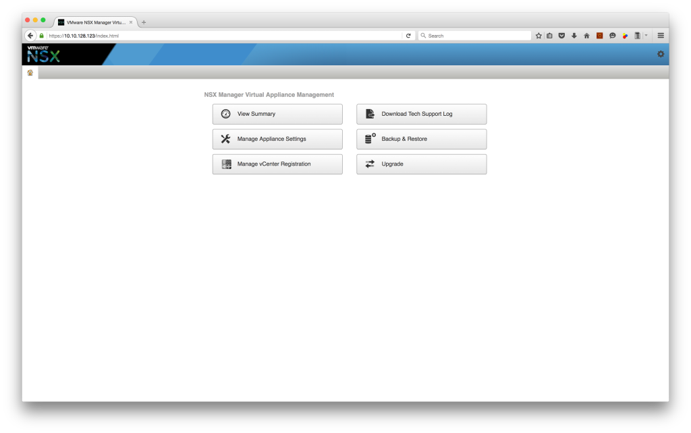
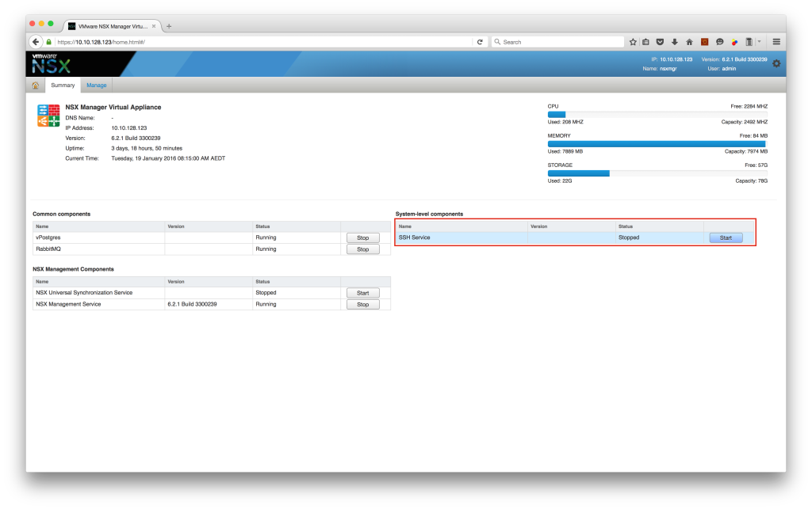

Have you ever had the problem of working on a unstable network connection and your network drops out.

Well this happened to me this morning, but whilst it happened, I was actually connected to my NSX Manager via SSH and in configuration mode. When my network connectivity returned (4G) and I could SSH into the NSX Manager, I was greeted with the following:

```
VTY configuration is locked by other VTY
nsxmgr> ena
Password: 
nsxmgr# conf t
VTY configuration is locked by other VTY
nsxmgr#
```

I asked around internally and it turns out that there is currently no elegant way of disconnecting the session which has crashed. I will be following this up so that hopefully an elegant solution will be included in a future release.

So to get around this now, I did the following

Open up the NSX Manager web interface

[](http://www.sneaku.com/wp-content/uploads/2016/01/VTY_locked.png)

Click on **View Summary**, and then stop and start the SSH Service.

[](http://www.sneaku.com/wp-content/uploads/2016/01/SSH_restart.png)

> Restarting the SSH Service will obviously will also disconnect anyone else logged into the NSX Manager via SSH.

Once the SSH Service has been restarted, you should now be able to login to the NSX Manager again via SSH and enter configuration mode.

```
nsxmgr> ena
Password: 
nsxmgr# conf t
nsxmgr(config)# exit
nsxmgr#
```

It's crude, and brute force like, but that's how it's currently done.
