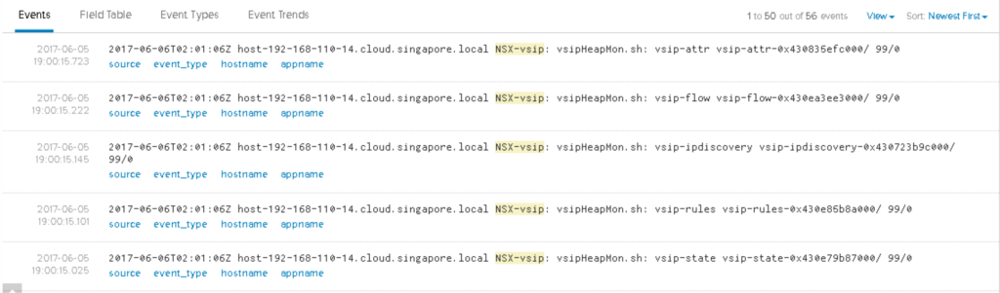
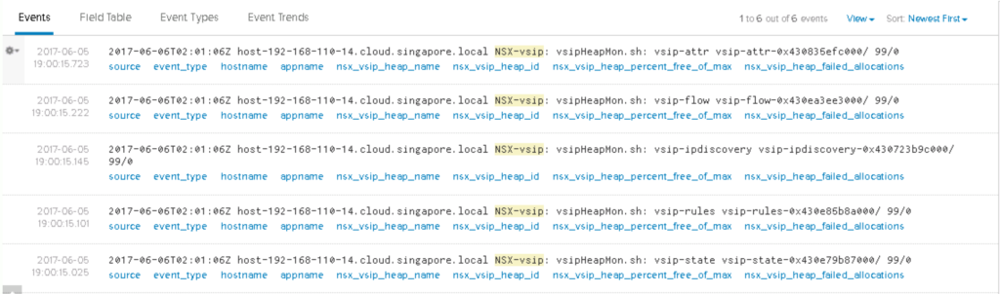
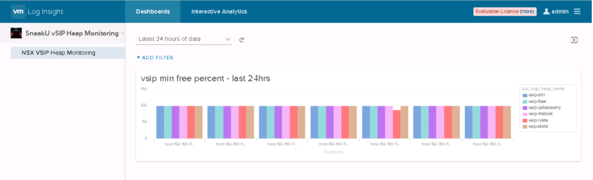
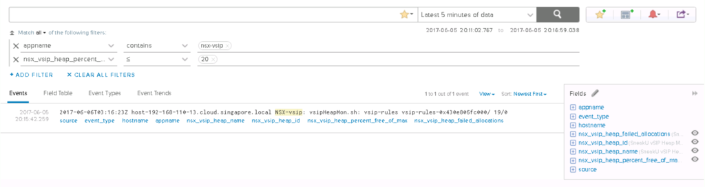
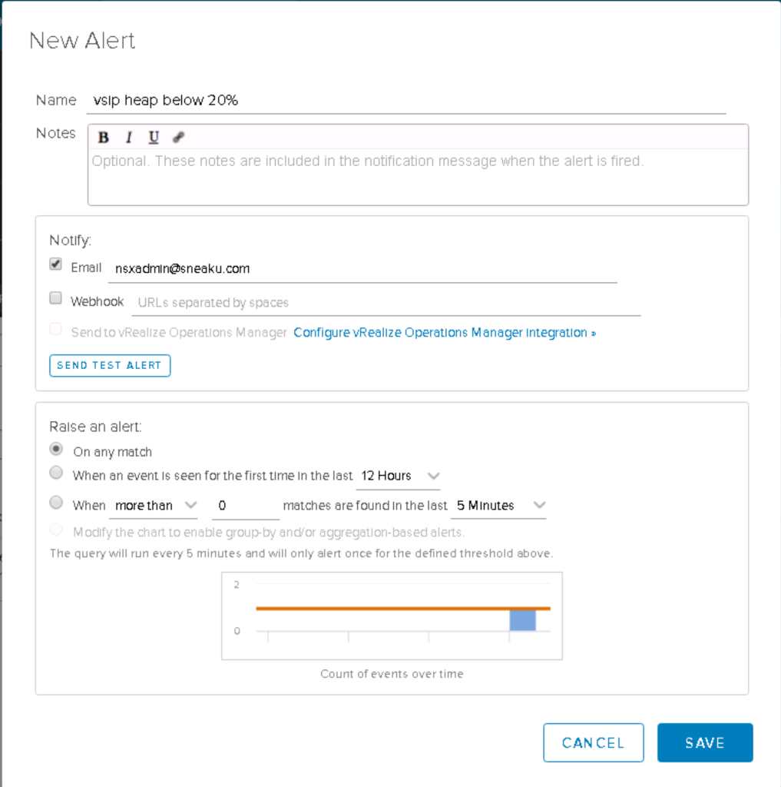

When operating NSX-v DFW at scale, the recommendation from VMware on memory/heap usage per host is to stick to a maximum of around 80% usage. But then this often raises the question of how to monitor the actual memory/heap the the DFW is consuming per host.

As the NSX-v Distributed Firewall is running in kernel on the vSphere hypervisor, it uses leverages vSphere memory heaps. So to monitor the memory usage per host, it is these vSphere heaps that need to be monitored.

To check heap usage on a vSphere host, you must use the undocumented vsish command.

> You can read more about the vsish command on [Willams blog here](http://www.virtuallyghetto.com/2010/08/what-is-vmware-vsish.html).

There are a number of different heaps used by the NSX-v Distributed Firewall, and for this blog post, we will be focusing on NSX-v 6.2.3 and above. The following 1-Liner will display some of the relevant pieces of information.

```
for n in $(vsish -e ls /system/heaps|grep vsip); do echo $n; vsish -e get /system/heaps/$n'stats'| grep -e "Name\|current\ bytes\ allocated\|maximum\ heap\ size\|percent free of max\|failed"; done

```

Which will give you an output similar to the following:

```
vsip-attr-0x430c1db5c000/
   Name:vsip-attr
   current bytes allocated:944
   maximum heap size:536875872
   percent free of max size:99
   lowest percent free of max size ever encountered:100
   number of failed allocations:0
vsip-flow-0x430bedb59000/
   Name:vsip-flow
   current bytes allocated:1424
   maximum heap size:805311328
   percent free of max size:99
   lowest percent free of max size ever encountered:99
   number of failed allocations:0
vsip-ipdiscovery-0x430bcdb56000/
   Name:vsip-ipdiscovery
   current bytes allocated:1488
   maximum heap size:536875872
   percent free of max size:99
   lowest percent free of max size ever encountered:99
   number of failed allocations:0
vsip-rules-0x430b6dc53000/
   Name:vsip-rules
   current bytes allocated:100317024
   maximum heap size:1609569120
   percent free of max size:93
   lowest percent free of max size ever encountered:93
   number of failed allocations:0
vsip-state-0x430b0dd50000/
   Name:vsip-state
   current bytes allocated:944
   maximum heap size:1609569120
   percent free of max size:99
   lowest percent free of max size ever encountered:100
   number of failed allocations:0
vsip-module-0x430addd4d000/
   Name:vsip-module
   current bytes allocated:1544464
   maximum heap size:805311328
   percent free of max size:99
   lowest percent free of max size ever encountered:99
   number of failed allocations:0
```

And you can see from the output above, i've highlighted the lines which outline the percentage free of the heaps maximum size. This number should be above 20%.

Seeing the output above on the command line is all well and good, however the command is required to be run interactively on the command line of every host, which does not lend itself to being very efficient when running 10's, 100's or even 1000's of vSphere hosts.

What can we do about that? Well, what if we could write a script that would extract the "percent free of max size" and send it to your syslog server for each of the heaps used by the NSX-v Distributed Firewall. That would be cool, wouldn't it.

Here is a basic script that does just that.

```
#! /bin/sh
VSIPHEAPMON="heapmon.sh: "
VSIP_HEAPMON_SYSLOG_TAG="NSX-vsip"

syslog() {
   echo "$@"
   logger -p daemon.info -t "${VSIP_HEAPMON_SYSLOG_TAG}" "$@"
}

for i in $(vsish -e ls /system/heaps|grep vsip)
do
    VSIPHEAPMON_NAME=$(echo $i | awk 'BEGIN { FS = "-" } { x=$1"-"$2; print x }') 
    VSIPHEAPMON_FREEPERCENT=$(vsish -e get /system/heaps/$i'stats'|grep -e "percent free of max size:" | awk 'BEGIN { FS = ":" } { print $2 }')
    VSIPHEAPMON_FAILEDALLOC=$(vsish -e get /system/heaps/$i'stats'|grep -e "number of failed allocations:" | awk 'BEGIN { FS = ":" } { print $2 }')
    syslog $VSIPHEAPMON $VSIPHEAPMON_NAME $i $VSIPHEAPMON_FREEPERCENT/$VSIPHEAPMON_FAILEDALLOC
```

Save the script to somewhere on your vSphere host. For this example I will save it in /

> Make sure to change the permissions on the file to allow execution - chmod +x heapmon.sh

If run interactively, it will show the heap name, heap id, percent free of max size & number of failed allocations.

```
./heapmon.sh
```

```
vsipHeapMon.sh: vsip-module vsip-module-0x430f2e081000/ 99/0
vsipHeapMon.sh: vsip-state vsip-state-0x430e79b87000/ 99/0
vsipHeapMon.sh: vsip-rules vsip-rules-0x430e85b8a000/ 99/0
vsipHeapMon.sh: vsip-ipdiscovery vsip-ipdiscovery-0x430723b9c000/ 99/0
vsipHeapMon.sh: vsip-flow vsip-flow-0x430ea3ee3000/ 99/0
vsipHeapMon.sh: vsip-attr vsip-attr-0x430835efc000/ 99/0
```

/var/log/syslog.log will also contain the following log entries

```
2017-06-06T02:01:06Z NSX-vsip: vsipHeapMon.sh: vsip-module vsip-module-0x430f2e081000/ 99/0
2017-06-06T02:01:06Z NSX-vsip: vsipHeapMon.sh: vsip-state vsip-state-0x430e79b87000/ 99/0
2017-06-06T02:01:06Z NSX-vsip: vsipHeapMon.sh: vsip-rules vsip-rules-0x430e85b8a000/ 99/0
2017-06-06T02:01:06Z NSX-vsip: vsipHeapMon.sh: vsip-ipdiscovery vsip-ipdiscovery-0x430723b9c000/ 99/0
2017-06-06T02:01:06Z NSX-vsip: vsipHeapMon.sh: vsip-flow vsip-flow-0x430ea3ee3000/ 99/0
2017-06-06T02:01:06Z NSX-vsip: vsipHeapMon.sh: vsip-attr vsip-attr-0x430835efc000/ 99/0
```

If for some reason you haven't setup any syslog targets on your vSphere hosts, and need to do this manually, here are some quick commands you can use. Obviously you will need to replace the IP Address with the IP/FQDN of your own syslog server.

```
esxcli network firewall ruleset set --ruleset-id=syslog --enabled=true
esxcli network firewall refresh
esxcli system syslog config set --loghost='tcp://192.168.101.195:514'
esxcli system syslog reload
```

To have this script run periodically, you can add it to the root user crontab, which is located at _/var/spool/cron/crontabs/root_

For my example I have configured the script run every 6 hours with the following crontab entry

```
*    */6  *   *   *   /heapmon.sh
```

Once you edit the crontab for the root user, you need to restart the crond service. Detailed instructions for specific versions of vSphere can be found in the following article - [VMware KB 1033346](https://kb.vmware.com/selfservice/microsites/search.do?language=en_US&cmd=displayKC&externalId=1033346)

Find the process id of crond

```
cat /var/run/crond.pid
```

```
[root@host-192-168-111-11:/var/spool/cron] cat /var/run/crond.pid
2035699
```

Kill the crond process

```
kill <pid>
```

```
[root@host-192-168-111-11:/var/spool/cron] kill 2035699
[root@host-192-168-111-11:/var/spool/cron]
```

Start the busy box crond process

```
/usr/lib/vmware/busybox/bin/busybox crond
```

```
[root@host-192-168-111-11:/var/spool/cron] /usr/lib/vmware/busybox/bin/busybox crond
[root@host-192-168-111-11:/var/spool/cron] tail -f /var/log/syslog.log 
2017-06-06T02:58:33Z crond[2193383]: crond: crond (busybox 1.20.2) started, log level 8
```

Since this information is sent to the syslog.log file via the logger function, the logs will also appear in your syslog platform of choice. This is what they will look like in Log Insight by default.

[](http://www.sneaku.com/wp-content/uploads/2017/06/Screen-Shot-2017-06-06-at-12.23.49-pm.png)

Once this information is in Log Insight, it is possible to extract the fields in the syslog message so that they are searchable by Log Insight and you can then perform meaningful actions with them.

I've created a simple Log Insight Content Pack which has a sample dashboard and all the extracted fields already configured to be used as a starting point for setting up heap monitoring.

[Download Link - SneakU vSIP Heap Monitoring Content Pack](http://www.sneaku.com/sdm_downloads/sneaku-vsip-heap-monitoring-content-pack/)

Once installed, and you have some heap information being received by Log Insight, your logs should look something similar to the following.

 

[](http://www.sneaku.com/wp-content/uploads/2017/06/Screen-Shot-2017-06-06-at-12.03.56-pm.png)

With Log Insight now having an understanding of the format of the information, it is possible to create charts, queries and dashboards to display or alert on the data. Here is a screenshot of a sample Dashboard widget that shows the minimum values seems for each sip heap across each host for the past 24 hours.

[](http://www.sneaku.com/wp-content/uploads/2017/06/Screen-Shot-2017-06-06-at-1.09.59-pm.png)

And Log Insight will also allow an alert to be created based on the syslog data, which means that you can set an alert when any of the heaps drops below 20% free.

[](http://www.sneaku.com/wp-content/uploads/2017/06/Screen-Shot-2017-06-06-at-1.16.08-pm.png)

 

[](http://www.sneaku.com/wp-content/uploads/2017/06/Screen-Shot-2017-06-06-at-1.18.12-pm.png)

 

This post should provide a starting point on how to monitor DFW heap usage across your environment.
