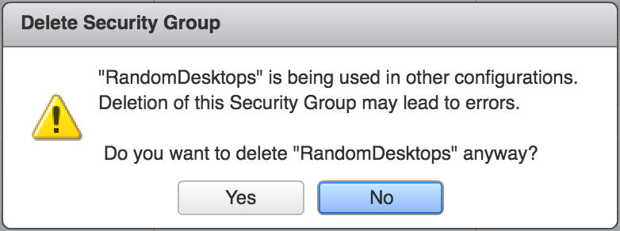

Over the past few years of working with NSX vSphere, one of the more frustrating things that would happen is that you would try to delete an object of some description (IP Set, Security Group, Service etc) and you would get the annoying message in the UI which says the object is in use, but it doesn't give you any more information or any context of where to even start looking to find out where it is being used.

[](http://www.sneaku.com/wp-content/uploads/2017/09/delete_remote_desktops_group.png)

So due to the lack of detail in the message, some people would "force" delete the object because they don't know where its being used, or they think they had actually removed all references to it, but the system is just wrong in displaying the message.

Once they force delete the object which was still in use, then it can cause issues in other parts of the system that it was being used in.

Well why am I ranting on about this? Because as I was playing with some [PowerNSX](https://github.com/vmware/powernsx) ([https://github.com/vmware/powernsx](https://github.com/vmware/powernsx)) test environments recently, I noticed a difference in behaviour in our 6.3.2 environment.

When trying to delete an object in 6.3.1 via the UI, we would be greeted with a message similar to the one above, and when trying to delete the same object via the API, this is the response.

```
<error>
  <details>The object securitygroup-3427 is in use, this operation cannot be performed. Remove all configuration
referring to this object and retry
operation.</details>
  <errorCode>209</errorCode>
  <moduleName>core-services</moduleName>
</error>

```

Thanks mate, thats really helpful :(

However, over in my 6.3.2 environment, when I try to delete an object which is in use somewhere in the UI, I still get the standard message (like the one shown above) just telling me its in use somewhere, and do I really want to delete it, but try and do the same delete operation via the API, and I actually get a bit more detail in the error message.

```
<?xml version="1.0" encoding="UTF-8"?> 
<errors>
  <error>
    <details>The requested object is in use by firewall section Global Exceptions with id 1056 in firewall rule Proxy_Bypass with id 1223.</details>
    <errorCode>110510</errorCode>
    <moduleName>vShield App</moduleName>
  </error>
  <error>
    <details>The requested object is in use by firewall section Global Exceptions with id 1056 in firewall rule Proxy_Bypass with id 1222.</details>
    <errorCode>110510</errorCode>
    <moduleName>vShield App</moduleName>
  </error>
</errors>
```

So you can see that this security group which I tried to delete was used directly in 2 different firewall rules.

And you can see the same type of error when trying to delete an IP Set which is directly used in a firewall rule.

```
<?xml version="1.0" encoding="UTF-8"?>
<error>
    <details>The requested object is in use by firewall section Infrastructure Services with id 1055 in firewall rule DNS with id 1220.</details>
    <errorCode>110510</errorCode>
    <moduleName>vShield App</moduleName>
</error>
```

Now lets see what happens when the object is used in a Service Composer FW Rule.

```
<?xml version="1.0" encoding="UTF-8"?>
<errors>
  <error>
    <details>The requested object is in use by firewall section Active Directory :: NSX Service Composer - Firewall with id 1057 in firewall rule null with id 1224.</details>
    <errorCode>110510</errorCode>
    <moduleName>vShield App</moduleName>
  </error>
  <error>
    <details>The requested object is in use by policy object null with id firewallpolicyaction-2.</details>
    <errorCode>275</errorCode>
    <moduleName>core-services</moduleName>
  </error>
</errors>
```

It shows us the name of the section, which happens to tell us that its a service composer policy that contains the rule, and it also tells us that it is in use in a firewall policy action. Whilst it may not be the most descriptive, giving some indication is better than whats returned in the UI.

And here is an example of one where the group being deleted has an security policy applied to it.

```
<?xml version="1.0" encoding="UTF-8"?>
<errors>
  <error>
    <details>The requested object is in use by firewall section Active Directory :: NSX Service Composer - Firewall with id 1057 in firewall rule null with id 1224.</details>
    <errorCode>110510</errorCode>
    <moduleName>vShield App</moduleName>
  </error>
  <error>
    <details>The requested object is in use by policy object internal_security_group_for_Active Directory with id securitygroup-270.</details>
    <errorCode>275</errorCode>
    <moduleName>core-services</moduleName>
  </error>
</errors>
```

If an object (SecurityGroup) is being used by a partner service profile, it replies with the following

```
<?xml version="1.0" encoding="UTF-8"?>
<error>
  <details>The requested object is in use by partner service profile TestProfile with id serviceprofile-1 and service name Guest Introspection with id service-5.</details>
  <errorCode>276</errorCode>
  <moduleName>core-services</moduleName>
</error>
```

So if you are running 6.3.2 or higher and going through and deleting items in the UI but are being greeted with the really unhelpful message box telling you the object is in use somewhere, you might want to try deleting it via the API (without the force option) and letting the task fail and return you the error details which describe where the object is actually being used.

Now I am going to make a huge leap here and say that if this information is available via the API today, then I don't think it would be too long before this information starts to surface in the UI. I guess we will just need to watch this space carefully.
