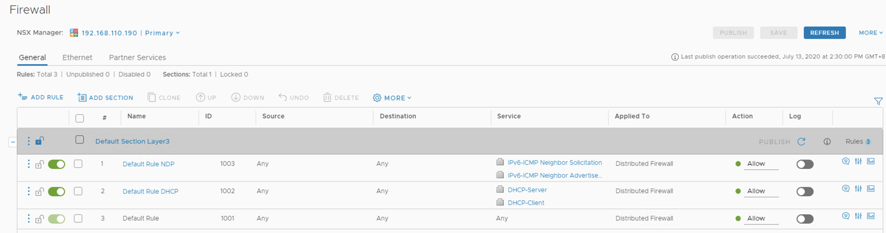
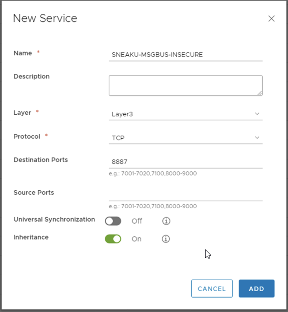
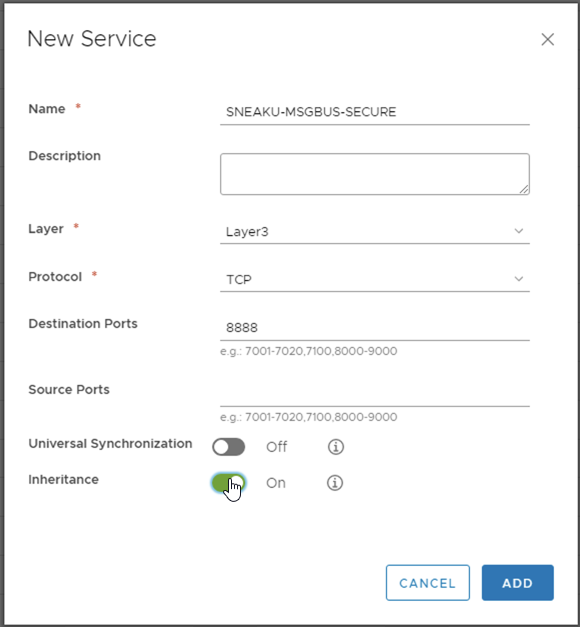
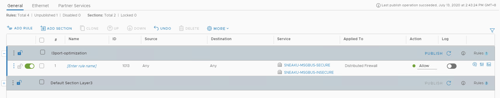
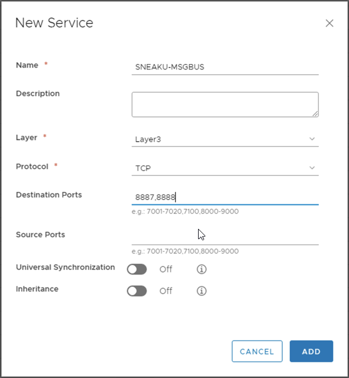
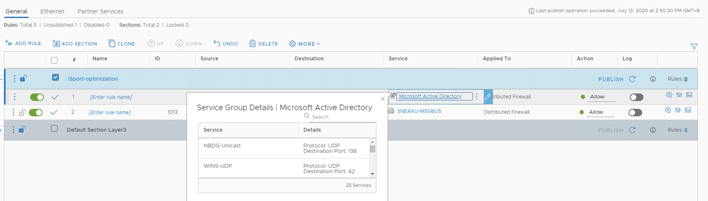

Late last week, the latest version of NSX vSphere, 6.4.7 was released for General Availability (GA). Although it was mainly a maintenance release, there were a couple of items listed in the What's New section of the release notes. I won't list them all here, and instead I will just provide you with a link.

[https://docs.vmware.com/en/VMware-NSX-Data-Center-for-vSphere/6.4/rn/releasenotes\_nsx\_vsphere\_647.html](https://docs.vmware.com/en/VMware-NSX-Data-Center-for-vSphere/6.4/rn/releasenotes_nsx_vsphere_647.html)

Once a NSX-v environment has been upgrade to 6.4.7, you may notice there will be a difference in how Distributed Firewall (DFW) rules will look on the dataplane when viewing them using the following command:

```
vsipioctl getrules -f <filter_name>
```

But before we dive too far into things, first a bit of a history lesson.

When looking at the following image from NSX-v, how many Layer 3 rules do you see in the UI? and how many Layer 3 rules will be configured on the dataplane (DP)?



The answers are as follows:

- UI = 3
- DP = 5

So why does the default configuration not equal what is seen in the UI? It has to do with the way the services are configured.

If we take a look at the ESXi hypervisor, we can see the rules as they are configured in the dataplane.

```
[root@host-192-168-109-152:~] vsipioctl getrules -f nic-4265096-eth0-vmware-sfw.2
ruleset domain-c26 {
# generation number: 1594621799418
# realization time : 2020-07-13T06:30:09
rule 1003 at 1 inout protocol ipv6-icmp icmptype 135 from any to any accept;
rule 1003 at 2 inout protocol ipv6-icmp icmptype 136 from any to any accept;
rule 1002 at 3 inout protocol udp from any to any port 67 accept;
rule 1002 at 4 inout protocol udp from any to any port 68 accept;
rule 1001 at 5 inout protocol any from any to any accept;
}
```

What you can see is that rules are configured in the dataplane, depending on protocol and port configuration.

A better example can be seen if we configure a rule and services manually.

Below you can see a couple of services that were created.

<figure>



<figcaption>

  

</figcaption>

</figure>



And here they are added into a new rule.



And this is what that new rule looks like when it is configured on the dataplane.

```
[root@host-192-168-109-152:~] vsipioctl getrules -f nic-4265096-eth0-vmware-sfw.2
ruleset domain-c26 {
# generation number: 1594622728124
# realization time : 2020-07-13T06:45:38
rule 1013 at 1 inout protocol tcp from any to any port 8888 accept;
rule 1013 at 2 inout protocol tcp from any to any port 8887 accept;
rule 1003 at 3 inout protocol ipv6-icmp icmptype 135 from any to any accept;
rule 1003 at 4 inout protocol ipv6-icmp icmptype 136 from any to any accept;
rule 1002 at 5 inout protocol udp from any to any port 67 accept;
rule 1002 at 6 inout protocol udp from any to any port 68 accept;
rule 1001 at 7 inout protocol any from any to any accept;
}
```

You can see that rule ID 1013 gets configured on the dataplane as 2 individual rules.

This behaviour can be influenced by creating the services in a specific manner which will reduce the number of rules that get created on the dataplane. To apply that methodology to this rule, we could create the service as follows:



As the ports were from the same protocol, they are able to be grouped together in a single service via specifying the port numbers on the same line (comma delimited).

There is a limit to the number of ports that can be entered on a single line, separated by commas. The system will accept up to 15 "entries". But what is an entry?

An entry is a port, whether it is a single port, or a port used as part of a range. The following shows some practical examples:

- 1 entry = `80`
- 2 entries = `80,443`
- 3 entries = `80,1024-65535`
- 4 entries = `80-100,1024-65535`
- 5 entries = `22,135-139,1024-65535`
- 15 entries = `20-23,25,135-139,80,443,161,162,53,123,65,67-69,88`
- 15 entries = `1,2,3,4,5,6,7,8,9,10,11,12,13,14,15`

So once a service has been created to take advantage of the underlying port-sets, it can then be applied to the rule.

```
[root@host-192-168-109-152:~] vsipioctl getrules -f nic-4265096-eth0-vmware-sfw.2
ruleset domain-c26 {
# generation number: 1594623029536
# realization time : 2020-07-13T06:50:38
rule 1013 at 1 inout protocol tcp from any to any port {8887, 8888} accept;
rule 1003 at 2 inout protocol ipv6-icmp icmptype 135 from any to any accept;
rule 1003 at 3 inout protocol ipv6-icmp icmptype 136 from any to any accept;
rule 1002 at 4 inout protocol udp from any to any port 67 accept;
rule 1002 at 5 inout protocol udp from any to any port 68 accept;
rule 1001 at 6 inout protocol any from any to any accept;
}
```

The net result is still the same from a security/enforcement perspective, however the way it is implemented in the dataplane is different. Rule 1013 now only has 1 rule configured in the dataplane.

Whilst the example above only show what happens at a fairly small scale with a single rule in the UI, things can get a bit out of hand if you have 1000's of rules in the UI, or you have service groups with lots of services.

In the example below, we add a rule and use the Service Group `Microsoft Active Directory`



As you can see there are at least 25 separate services configured in this service group.

And this is what that rule looks like on the dataplane.

```
[root@host-192-168-109-152:~] vsipioctl getrules -f nic-4265096-eth0-vmware-sfw.2
ruleset domain-c26 {
# generation number: 1594624410674
# realization time : 2020-07-13T07:13:41
rule 1014 at 1 inout protocol udp from any to any port 42 accept;
rule 1014 at 2 inout protocol tcp from any to any port 139 accept;
rule 1014 at 3 inout protocol tcp from any to any port 53 accept;
rule 1014 at 4 inout protocol udp from any to any port 137 accept;
rule 1014 at 5 inout protocol tcp from any to any port 9389 accept;
rule 1014 at 6 inout protocol udp from any to any port 123 accept;
rule 1014 at 7 inout protocol udp from any to any port 138 accept;
rule 1014 at 8 inout protocol tcp from any to any port 464 accept;
rule 1014 at 9 inout protocol tcp from any to any port 3269 accept;
rule 1014 at 10 inout protocol udp from any to any port 445 accept;
rule 1014 at 11 inout protocol udp from any to any port 53 accept;
rule 1014 at 12 inout protocol udp from any to any port 67 accept;
rule 1014 at 13 inout protocol tcp from any to any port 42 accept;
rule 1014 at 14 inout protocol tcp from any to any port 636 accept;
rule 1014 at 15 inout protocol udp from any to any port 88 accept;
rule 1014 at 16 inout protocol tcp from any to any port 445 accept;
rule 1014 at 17 inout protocol tcp from any to any port 88 accept;
rule 1014 at 18 inout protocol udp from any to any port 137 accept;
rule 1014 at 19 inout protocol udp from any to any port 464 accept;
rule 1014 at 20 inout protocol tcp from any to any port 389 accept;
rule 1014 at 21 inout protocol tcp from any to any port 135 accept as dcerpc;
# internal # rule 1014 at 22 inout protocol tcp from any to any port 135 accept;
rule 1014 at 23 inout protocol tcp from any to any port 3268 accept;
rule 1014 at 24 inout protocol udp from any to any port 138 accept;
rule 1014 at 25 inout protocol udp from any to any port 389 accept;
rule 1014 at 26 inout protocol tcp from any to any port 25 accept;
rule 1013 at 27 inout protocol tcp from any to any port {8887, 8888} accept;
rule 1003 at 28 inout protocol ipv6-icmp icmptype 135 from any to any accept;
rule 1003 at 29 inout protocol ipv6-icmp icmptype 136 from any to any accept;
rule 1002 at 30 inout protocol udp from any to any port 67 accept;
rule 1002 at 31 inout protocol udp from any to any port 68 accept;
rule 1001 at 32 inout protocol any from any to any accept;
}
```

As you can see, rule ID 1014 explodes into 26 individual rules split across both UDP and TCP ports, which means there is room to optimize this service/service group.

## 6.4.7 behaviour differences

Using the same rules as shown in the configuration above, once the environment is upgraded to NSX-v 6.4.7, the dataplane will perform some optimisation on the configured firewall rules, and this will be the result:

```
[root@host-192-168-109-152:~] vsipioctl getrules -f nic-4265096-eth0-vmware-sfw.2
ruleset domain-c26 {
# generation number: 1594624656477
# realization time : 2020-07-13T07:17:45
rule 1014 at 1 inout protocol udp from any to any port {42, 53, 67, 88, 123, 137, 138, 389, 445, 464} accept;
rule 1014 at 2 inout protocol tcp from any to any port {25, 42, 53, 88, 139, 389, 445, 464, 636, 3268, 3269, 9389} accept;
rule 1014 at 3 inout protocol tcp from any to any port 135 accept as dcerpc;
# internal # rule 1014 at 4 inout protocol tcp from any to any port 135 accept;
rule 1013 at 5 inout protocol tcp from any to any port {8887, 8888} accept;
rule 1003 at 6 inout protocol ipv6-icmp icmptype 135 from any to any accept;
rule 1003 at 7 inout protocol ipv6-icmp icmptype 136 from any to any accept;
rule 1002 at 8 inout protocol udp from any to any port {67, 68} accept;
rule 1001 at 9 inout protocol any from any to any accept;
}
```

As you can see, the system has now taken advantage of the port-set feature on the dataplane and optimised the rules when configured on the dataplane.

In this example, the rule count on this specific vnic has been reduced from 32 down to 9 which is a 71% reduction.

## Should I Upgrade?

If you want to understand whether or not it would be beneficial to upgrade to 6.4.7 just to take advantage of this behaviour, there is a script which I have written which will give you an idea about the rule count savings that can be had by these service port optimisations (whether they are done manually, or via a 6.4.7 upgrade).

[https://github.com/dcoghlan/dfwoptimzer](https://github.com/dcoghlan/dfwoptimzer)

The script can be run against a file which contains the output of the `vsipioctl getrules -f <filter_name>` command and spit out something similar to the following:

```
python3 dfwoptimizer/dfwoptimizer.py dfw_services --prefix sneaku --rules sneaku.rules
--> Parsing rules
--> Processed 36 lines in 0:00:00.002502
================================================================================
Management Plane
--> Total individual rules (MP) = 5
Data Plane - Services Analysis
--> vNic L3 rules eligible for services optimization: 27
--> vNic optimization eligible L3 rules AFTER services optimization: 4
Data Plane - BEFORE Services Optimization
--> Total L3 rules on vNIC (DP) = 32
--> Total L3 Non Port rules (DP) = 3
--> Total L3 ALG rules (DP) = 1
--> Total L3 ALG Internal rules (DP) = 1
--> Total TCP exploded rules (DP) = 13
--> Total UDP exploded rules (DP) = 14
Data Plane - AFTER Optimization
--> Total L3 rules on vNIC (DP) = 9 (71% decrease)
--> Total L3 Non Port rules (DP) = 3
--> Total L3 ALG rules (DP) = 1
--> Total L3 ALG Internal rules (DP) = 1
--> Total TCP optimized services (DP) = 2
--> Total UDP optimized services (DP) = 2
```

So by running the dfwoptimizer script, you'll be able to determine if you'll experience a substantial reduction in rules per vnic just by upgrading to NSX-v 6.4.7.

## What about NSX-T?

This behaviour change is also present in NSX-T 3.0, and the same dfwoptimizer script is able to be used against the output of the vsipioctl command from a NSX-T host.

## Conclusion

So as you can see, if you are experiencing issues with having an excessive number of rules per vnic, the upgrade to 6.4.7 may be of benefit to you.

But as with anything like this, I highly recommend that you test this in a lab/dev environment first so that you get familiar with the change in behaviour and any scripts/automation that you have will be able to adapt to the changes.
