A couple of weeks ago when I was helping a colleague out with a script to [count the number of DFW rules on a host](/2020/11/18/monitoring-nsx-fw-rules-per-host/) , I needed to see what other (if any) configuration maximums had changed between 2 releases of NSX-T.

If you take a look at the configmax site [https://configmax.vmware.com](https://configmax.vmware.com) , there is a link which will "Compare Limits" for you.

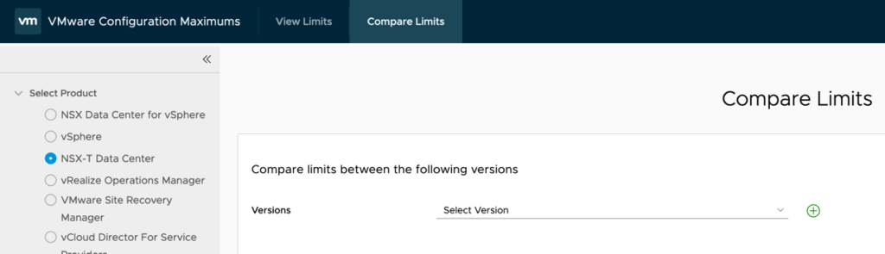

And this allows you to choose the releases that you want to compare

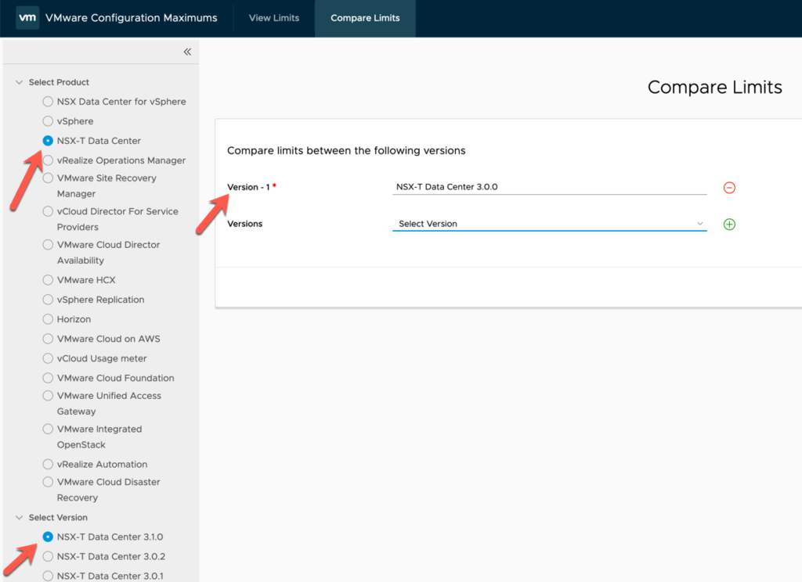

Which gives you a nice spiffy page where you can look at the limits and literally compare them against each other.

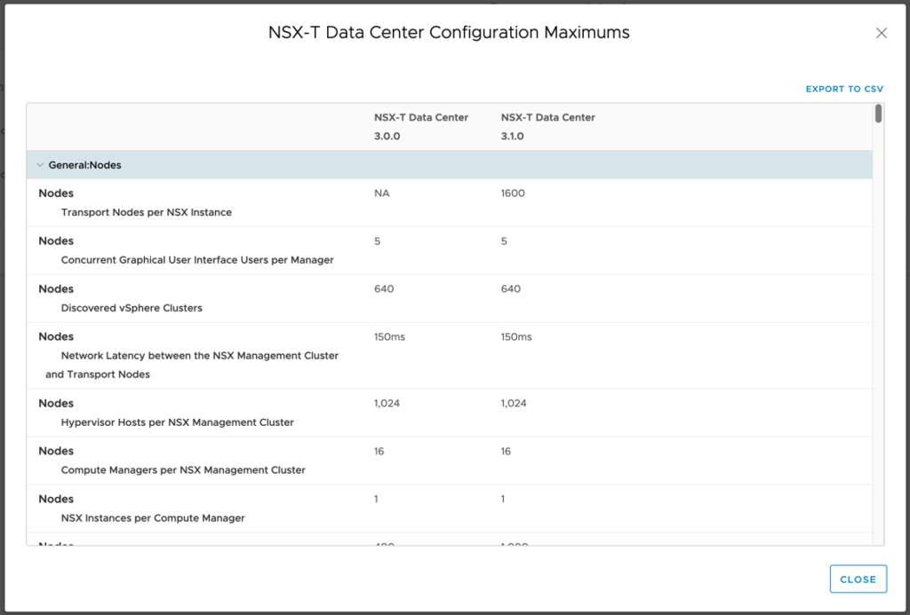

However, its up to you as the user to be able to identify if a limit has changed, been added or removed.... and as we know there is always room for user error. In the example above, there are 274 limits displayed when comparing NSX-T 3.0.0 against NSX-T 3.1.0.

So I decided to try and do something programmatically that will be able to show "what's changed" between releases, and this sent me down the rabbit hole, to where I ended up with a fully functioning PowerShell module to interact with the VMware Configuration Maximums website.

The module is called **VMware.CfgMax**. It is available on PowerShell gallery, and also available on GitHub ( [https://github.com/dcoghlan/VMware.CfgMax](https://github.com/dcoghlan/VMware.CfgMax) ).

I've tried to put a lot of examples on the GitHub repository page, and also embed some within the cmdlets themselves, so they can be viewed with the Get-Help cmdlet, however I will show some basic examples here too.

To install it from PowerShell gallery is pretty easy with the following command:

```
Install-Module VMware.CfgMax
```

Once Installed you can view all the products listed on configmax.vmware.com using the **Get-CfgMaxProduct** cmdlet:

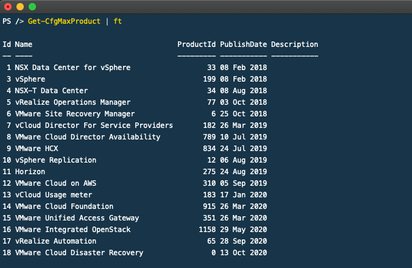

Once you know the products available, you can look at all the releases for a given product using the **Get-CfgMaxRelease** cmdlet:

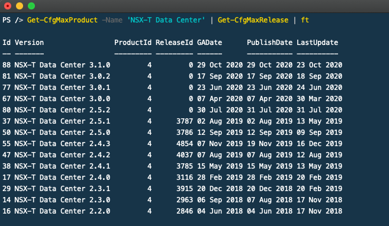

Its then possible to view all the categories for a given release using the **Get-CfgMaxCategory** cmdlet:

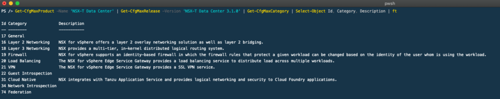

For a given release, you can view all the configuration maximum limits using the **Get-CfgMaxLimits** cmdlet:

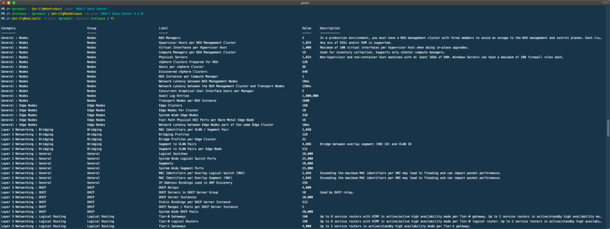

Or if you only want to retrieve the configuration maximum limits for a specific category, well you can do that too by supplying a category object to the **Get-CfgMaxLimit** cmdlet:

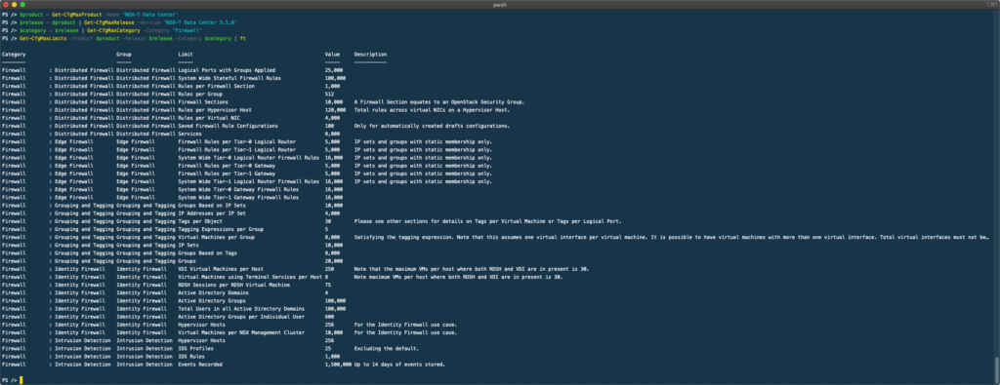

And finally, you can compare configuration maximum limits between releases by using the **Compare-CfgMaxLimits** cmdlet:

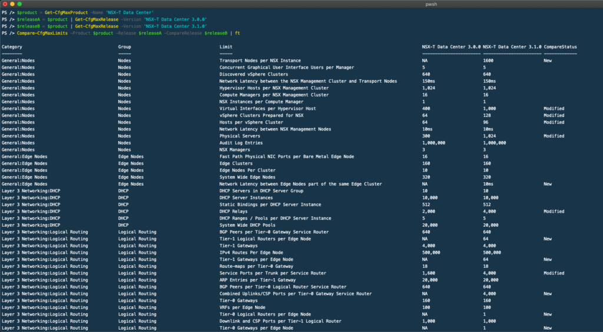

You can see that there is now a CompareStatus property on each object. This shows the status of the limit from the earlier release to the later release. The possible options are:

- <blank> - which indicates that the item hasn't changed
- **New** - the item has been added in the latest release specified in the comparison, and did not exist in the earlier release.
- **Modified** - the item has changed between the earliest and latest releases in the comparison.
- **Deleted** - the item does not exist in the latest release specified, but it did exist in the earliest release in the comparison.

And now that each object has a status, its possible to display the items based on the CompareStatus property by passing the appropriate -Show parameter:

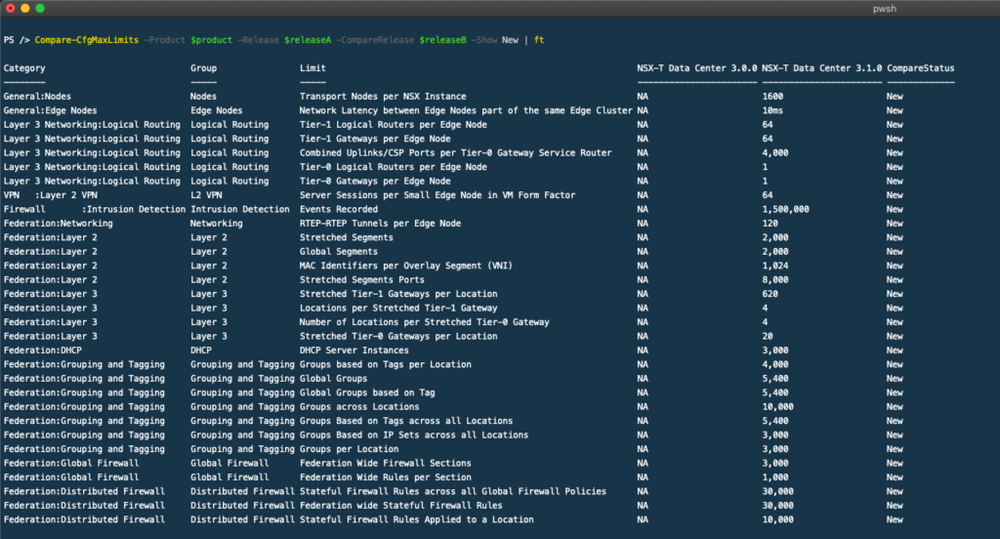

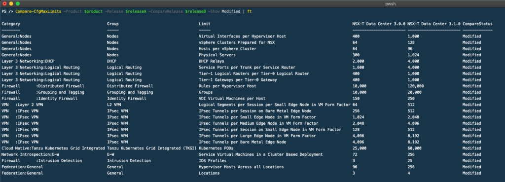

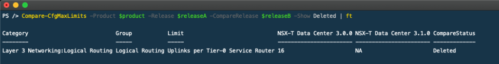

Or to show all of them together:

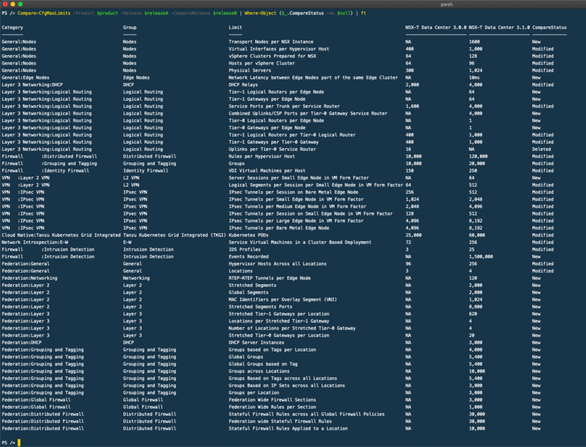

For those of you who like to put things into Excel, because the cmdlets return PSCustomObjects, it means you can pipe them to Export-CSV and you can then manipulate it in your favorite CSV viewer/editor.

```
PS > $product = Get-CfgMaxProduct -Name 'NSX-T Data Center'
PS > $releaseA =  $product | Get-CfgMaxRelease -Version 'NSX-T Data Center 3.0.0'
PS > $releaseB =  $product | Get-CfgMaxRelease -Version 'NSX-T Data Center 3.1.0'
PS > Compare-CfgMaxLimits -Product $product -Release $releaseA -CompareRelease $releaseB | Export-Csv -Path compare-status.csv -NoTypeInformation
```

```
"Category","Group","Limit","NSX-T Data Center 3.0.0","NSX-T Data Center 3.1.0","CompareStatus"
"General:Nodes","Nodes","Transport Nodes per NSX Instance","NA","1600","New"
"General:Nodes","Nodes","Concurrent Graphical User Interface Users per Manager","5","5",
"General:Nodes","Nodes","Discovered vSphere Clusters","640","640",
"General:Nodes","Nodes","Network Latency between the NSX Management Cluster and Transport Nodes","150ms","150ms",
"General:Nodes","Nodes","Hypervisor Hosts per NSX Management Cluster","1,024","1,024",
"General:Nodes","Nodes","Compute Managers per NSX Management Cluster","16","16",
"General:Nodes","Nodes","NSX Instances per Compute Manager","1","1",
"General:Nodes","Nodes","Virtual Interfaces per Hypervisor Host","400","1,000","Modified"
"General:Nodes","Nodes","vSphere Clusters Prepared for NSX","64","128","Modified"
"General:Nodes","Nodes","Hosts per vSphere Cluster","64","96","Modified"
"General:Nodes","Nodes","Network Latency between NSX Management Nodes","10ms","10ms",
"General:Nodes","Nodes","Physical Servers","300","1,024","Modified"
"General:Nodes","Nodes","Audit Log Entries","1,000,000","1,000,000",
"General:Nodes","Nodes","NSX Managers","3","3",
```

I hope that this is useful for others out there, and I am interested to see how and where people use it.
