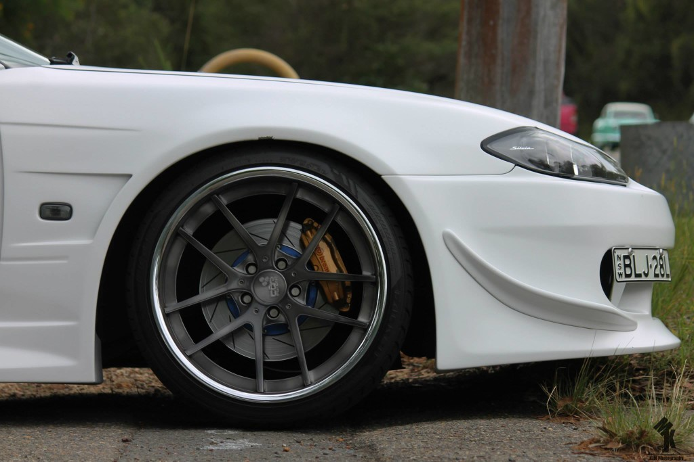
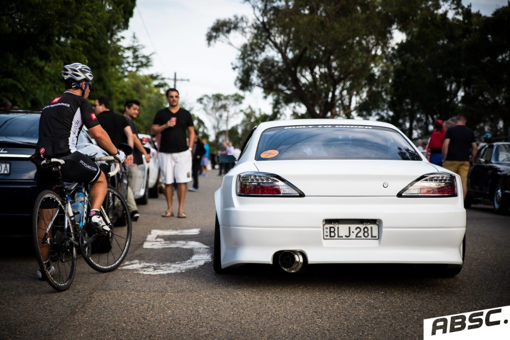

Sunday 1st February saw the first Cars and Coffee meet at Cavallino for the year. It was also our first time attending the event. I had heard and read lots about this monthly meet up but nothing prepared me for the sheer amount of people and cars roaming the quiet streets of Terry Hills at 8am on a Sunday morning. We aren't talking small numbers of cars here, we are talking hundreds!!!!

\[caption id="attachment\_35" align="aligncenter" width="1024"\] Photo by KJM Photography\[/caption\]

 

There were all types of cars, from exotics, super cars,  old school American muscle and even some Japanese imports. It really is a automotive spectacle that everyone should go along and see.

We are hoping to make it along to the next one, but arriving a bit earlier than 8am so we can hopefully park a bit closer this time.

I managed to find some pics of my car on the Facebook Event site. All credit to the owners of the photographs.

\[caption id="attachment\_34" align="aligncenter" width="1024"\] Photo by Archie Brown\[/caption\]
