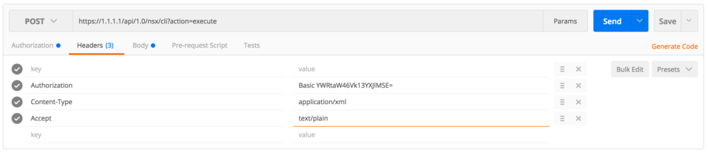

When working on a customer site recently I was made aware that their system to use the NSX Central CLI via the API had stopped functioning. The system had stopped working when the upgrade to NSX 6.2.3 happened.

> Click [here](http://www.sneaku.com/2016/02/22/nsx-v-web-central-cli/) for my previous post on how to use the [Central CLI API](http://www.sneaku.com/2016/02/22/nsx-v-web-central-cli/).

When submitting the request, they would always get the following response:

```
The resource identified by this request is only capable of generating responses with characteristics not acceptable according to the request "accept" headers.
```

It turns out that there was a change made to the API, and an additional header is required to make it work with NSX 6.2.3 & 6.2.4. You now need to add the following to the existing headers:

```
Accept: text/plain
```

Here is an example of the headers configured in a Postman Client.

[](http://www.sneaku.com/wp-content/uploads/2016/09/CentralCliHeader.png)

> A big shoutout to the [vRealize Network Insight](http://www.vmware.com/au/products/vrealize-network-insight.html) dev team for the tip to getting this working!
