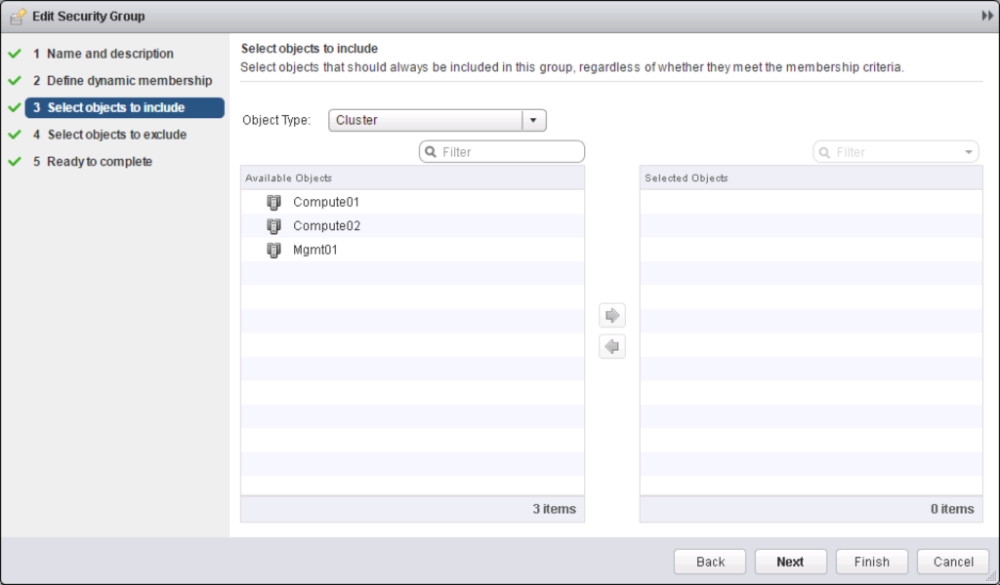

When starting out with the NSX-v API, you will quickly learn that there are times where you are required to reference an object, like when you want to add a member to a security group, you are required to know the object ID of the object you want to add as a member to the security group, as well as the object ID of the security  group itself.

When using the NSX-v UI, you can try as hard as you want, but your aren't going to be able to find the security group object ID. So how do you find it?

There are 2 ways via the NSX-v API.

The first is to hit the following API that will return all the configured Security Groups along with their complete configuration.

```
GET https://NSX-Manager-IP-Address/api/2.0/services/securitygroup/scope/scopeId
```

In the response you will be able to parse the xml and match the name to the security group you are looking for, and then find the Object ID.

This is a perfectly valid method, however its not the most efficient method when working at scale. I will explain why.

When you are working on a scale environment, you can potentially have 1000's of security groups and the configuration of the security group contains the dynamic rules configured along with the object details of every statically included and excluded member. In smaller environments retrieving the configuration of all security groups may be acceptable, but imagine pulling down the complete configuration of 5000 security groups, each with at least a couple of member objects, thats a lot of data just to find an object id of a single security group.

Although there is no native filtering ability in the NSX-v API, knowing your way around can mean that use can use other APIs to your advantage.

## Applicable Members API.

Within the NSX-v UI, when you edit a security group and want to include an object as a member, it presents you with a dialog box that give you a list of objects to choose from.

[](http://www.sneaku.com/wp-content/uploads/2016/05/security-group-picker.png)

Everything that you can choose in this window to add as a member of the security group is referred to as an applicable member.

It is possible to retrieve the complete list of applicable member objects for a security group via the following API.

```
GET https://NSX-Manager-IP-Address/api/2.0/services/securitygroup/scope/scopeId/members/
```

> _For all the examples I am showing here, whenever scopeId is used, we will be referring to the scope called globalroot-0._

The output will be something similar to the following.

```
<?xml version="1.0" encoding="UTF-8"?>
<list>
    <basicinfo>
        <objectId>ipset-3143</objectId>
        <objectTypeName>IPSet</objectTypeName>
        <vsmUuid>42017871-EA87-12B1-6899-B148876B1680</vsmUuid>
        <nodeId>596d8988-747e-4472-8106-ef7bebbbf119</nodeId>
        <revision>1</revision>
        <type>
            <typeName>IPSet</typeName>
        </type>
        <name>IP-10.5.219.0/24</name>
        <description></description>
        <scope>
            <id>globalroot-0</id>
            <objectTypeName>GlobalRoot</objectTypeName>
            <name>Global</name>
        </scope>
        <clientHandle></clientHandle>
        <extendedAttributes/>
        <isUniversal>false</isUniversal>
        <universalRevision>0</universalRevision>
    </basicinfo>
    <basicinfo>
        <objectId>securitygroup-609</objectId>
        <objectTypeName>SecurityGroup</objectTypeName>
        <vsmUuid>42017871-EA87-12B1-6899-B148876B1680</vsmUuid>
        <nodeId>596d8988-747e-4472-8106-ef7bebbbf119</nodeId>
        <revision>13</revision>
        <type>
            <typeName>SecurityGroup</typeName>
        </type>
        <name>Production_Servers</name>
        <description></description>
        <scope>
            <id>globalroot-0</id>
            <objectTypeName>GlobalRoot</objectTypeName>
            <name>Global</name>
        </scope>
        <clientHandle></clientHandle>
        <extendedAttributes/>
        <isUniversal>false</isUniversal>
        <universalRevision>0</universalRevision>
    </basicinfo>
    <basicinfo>
        <objectId>ipset-2773</objectId>
        <objectTypeName>IPSet</objectTypeName>
        <vsmUuid>42017871-EA87-12B1-6899-B148876B1680</vsmUuid>
        <nodeId>596d8988-747e-4472-8106-ef7bebbbf119</nodeId>
        <revision>1</revision>
        <type>
            <typeName>IPSet</typeName>
        </type>
        <name>IP-10.72.18.0/24</name>
        <description></description>
        <scope>
            <id>globalroot-0</id>
            <objectTypeName>GlobalRoot</objectTypeName>
            <name>Global</name>
        </scope>
        <clientHandle></clientHandle>
        <extendedAttributes/>
        <isUniversal>false</isUniversal>
        <universalRevision>0</universalRevision>
    </basicinfo>
    <basicinfo>
        <objectId>securitygroup-628</objectId>
        <objectTypeName>SecurityGroup</objectTypeName>
        <vsmUuid>42017871-EA87-12B1-6899-B148876B1680</vsmUuid>
        <nodeId>596d8988-747e-4472-8106-ef7bebbbf119</nodeId>
        <revision>9</revision>
        <type>
            <typeName>SecurityGroup</typeName>
        </type>
        <name>All_Windows_Servers</name>
        <description></description>
        <scope>
            <id>globalroot-0</id>
            <objectTypeName>GlobalRoot</objectTypeName>
            <name>Global</name>
        </scope>
        <clientHandle></clientHandle>
        <extendedAttributes/>
        <isUniversal>false</isUniversal>
        <universalRevision>0</universalRevision>
    </basicinfo>
</list>
```

What you will also notice is that every object in the list has an associated memberType, that is shown in the objectTypeName element. To retrieve a list of all the possible memberTypes, you can use the following API:

```
GET https://NSX-Manager-IP-Address/api/2.0/services/securitygroup/scope/scopeId/memberTypes
```

This is the list of member types returned.

```
<?xml version="1.0" encoding="UTF-8"?>
<list>
    <objecttype>
        <typeName>IPSet</typeName>
    </objecttype>
    <objecttype>
        <typeName>ClusterComputeResource</typeName>
    </objecttype>
    <objecttype>
        <typeName>VirtualWire</typeName>
    </objecttype>
    <objecttype>
        <typeName>VirtualMachine</typeName>
    </objecttype>
    <objecttype>
        <typeName>DirectoryGroup</typeName>
    </objecttype>
    <objecttype>
        <typeName>SecurityGroup</typeName>
    </objecttype>
    <objecttype>
        <typeName>VirtualApp</typeName>
    </objecttype>
    <objecttype>
        <typeName>ResourcePool</typeName>
    </objecttype>
    <objecttype>
        <typeName>DistributedVirtualPortgroup</typeName>
    </objecttype>
    <objecttype>
        <typeName>Datacenter</typeName>
    </objecttype>
    <objecttype>
        <typeName>Network</typeName>
    </objecttype>
    <objecttype>
        <typeName>Vnic</typeName>
    </objecttype>
    <objecttype>
        <typeName>SecurityTag</typeName>
    </objecttype>
    <objecttype>
        <typeName>MACSet</typeName>
    </objecttype>
</list>
```

Now that you know the different memberTypes, it is possible to filter the objects your looking for with the following API:

```
GET https://NSX-Manager-IP-Address/api/2.0/services/securitygroup/scope/scopeId/members/memberType
```

So as an example, to filter just on security groups in globalroot-0, you could use the following API:

```
https://192.168.100.201/api/2.0/services/securitygroup/scope/globalroot-0/members/SecurityGroup
```

```
<?xml version="1.0" encoding="UTF-8"?>
<list>
    <basicinfo>
        <objectId>securitygroup-314</objectId>
        <objectTypeName>SecurityGroup</objectTypeName>
        <vsmUuid>42017871-EA87-12B1-6899-B148876B1680</vsmUuid>
        <nodeId>596d8988-747e-4472-8106-ef7bebbbf119</nodeId>
        <revision>2</revision>
        <type>
            <typeName>SecurityGroup</typeName>
        </type>
        <name>SCCM-SCOM_Clients_DMZ</name>
        <description></description>
        <scope>
            <id>globalroot-0</id>
            <objectTypeName>GlobalRoot</objectTypeName>
            <name>Global</name>
        </scope>
        <clientHandle></clientHandle>
        <extendedAttributes/>
        <isUniversal>false</isUniversal>
        <universalRevision>0</universalRevision>
    </basicinfo>
    <basicinfo>
        <objectId>securitygroup-433</objectId>
        <objectTypeName>SecurityGroup</objectTypeName>
        <vsmUuid>42017871-EA87-12B1-6899-B148876B1680</vsmUuid>
        <nodeId>596d8988-747e-4472-8106-ef7bebbbf119</nodeId>
        <revision>5</revision>
        <type>
            <typeName>SecurityGroup</typeName>
        </type>
        <name>SG_1498374</name>
        <description></description>
        <scope>
            <id>globalroot-0</id>
            <objectTypeName>GlobalRoot</objectTypeName>
            <name>Global</name>
        </scope>
        <clientHandle></clientHandle>
        <extendedAttributes/>
        <isUniversal>false</isUniversal>
        <universalRevision>0</universalRevision>
    </basicinfo>
    <basicinfo>
        <objectId>securitygroup-519</objectId>
        <objectTypeName>SecurityGroup</objectTypeName>
        <vsmUuid>42017871-EA87-12B1-6899-B148876B1680</vsmUuid>
        <nodeId>596d8988-747e-4472-8106-ef7bebbbf119</nodeId>
        <revision>3</revision>
        <type>
            <typeName>SecurityGroup</typeName>
        </type>
        <name>SG_3026505_2</name>
        <description></description>
        <scope>
            <id>globalroot-0</id>
            <objectTypeName>GlobalRoot</objectTypeName>
            <name>Global</name>
        </scope>
        <clientHandle></clientHandle>
        <extendedAttributes/>
        <isUniversal>false</isUniversal>
        <universalRevision>0</universalRevision>
    </basicinfo>
</list>
```

And as another example, you could retrieve a list of virtual machines using the following:

```
https://192.168.100.201/api/2.0/services/securitygroup/scope/globalroot-0/members/VirtualMachine
```

Which would return a list of all the virtual machines as reported by vCenter.

```
<?xml version="1.0" encoding="UTF-8"?>
<list>
    <basicinfo>
        <objectId>vm-1037</objectId>
        <objectTypeName>VirtualMachine</objectTypeName>
        <vsmUuid>423E02FA-743B-17B8-CE27-499836FB249E</vsmUuid>
        <nodeId>0e73e3e2-058a-4da4-802b-a1ef70111de7</nodeId>
        <revision>139</revision>
        <type>
            <typeName>VirtualMachine</typeName>
        </type>
        <name>yVM_295</name>
        <scope>
            <id>domain-c7</id>
            <objectTypeName>ClusterComputeResource</objectTypeName>
            <name>S3</name>
        </scope>
        <clientHandle></clientHandle>
        <extendedAttributes/>
        <isUniversal>false</isUniversal>
        <universalRevision>0</universalRevision>
    </basicinfo>
    <basicinfo>
        <objectId>vm-1053</objectId>
        <objectTypeName>VirtualMachine</objectTypeName>
        <vsmUuid>423E02FA-743B-17B8-CE27-499836FB249E</vsmUuid>
        <nodeId>0e73e3e2-058a-4da4-802b-a1ef70111de7</nodeId>
        <revision>7</revision>
        <type>
            <typeName>VirtualMachine</typeName>
        </type>
        <name>yVM_311</name>
        <scope>
            <id>domain-c7</id>
            <objectTypeName>ClusterComputeResource</objectTypeName>
            <name>S3</name>
        </scope>
        <clientHandle></clientHandle>
        <extendedAttributes/>
        <isUniversal>false</isUniversal>
        <universalRevision>0</universalRevision>
    </basicinfo>
    <basicinfo>
        <objectId>vm-1022</objectId>
        <objectTypeName>VirtualMachine</objectTypeName>
        <vsmUuid>423E02FA-743B-17B8-CE27-499836FB249E</vsmUuid>
        <nodeId>0e73e3e2-058a-4da4-802b-a1ef70111de7</nodeId>
        <revision>2</revision>
        <type>
            <typeName>VirtualMachine</typeName>
        </type>
        <name>yVM_280</name>
        <scope>
            <id>domain-c7</id>
            <objectTypeName>ClusterComputeResource</objectTypeName>
            <name>S3</name>
        </scope>
        <clientHandle></clientHandle>
        <extendedAttributes/>
        <isUniversal>false</isUniversal>
        <universalRevision>0</universalRevision>
    </basicinfo>
    <basicinfo>
        <objectId>vm-1012</objectId>
        <objectTypeName>VirtualMachine</objectTypeName>
        <vsmUuid>423E02FA-743B-17B8-CE27-499836FB249E</vsmUuid>
        <nodeId>0e73e3e2-058a-4da4-802b-a1ef70111de7</nodeId>
        <revision>145</revision>
        <type>
            <typeName>VirtualMachine</typeName>
        </type>
        <name>yVM_270</name>
        <scope>
            <id>domain-c7</id>
            <objectTypeName>ClusterComputeResource</objectTypeName>
            <name>S3</name>
        </scope>
        <clientHandle></clientHandle>
        <extendedAttributes/>
        <isUniversal>false</isUniversal>
        <universalRevision>0</universalRevision>
    </basicinfo>
    <basicinfo>
        <objectId>vm-820</objectId>
        <objectTypeName>VirtualMachine</objectTypeName>
        <vsmUuid>423E02FA-743B-17B8-CE27-499836FB249E</vsmUuid>
        <nodeId>0e73e3e2-058a-4da4-802b-a1ef70111de7</nodeId>
        <revision>6</revision>
        <type>
            <typeName>VirtualMachine</typeName>
        </type>
        <name>yVM_78</name>
        <scope>
            <id>domain-c7</id>
            <objectTypeName>ClusterComputeResource</objectTypeName>
            <name>S3</name>
        </scope>
        <clientHandle></clientHandle>
        <extendedAttributes/>
        <isUniversal>false</isUniversal>
        <universalRevision>0</universalRevision>
    </basicinfo>
</list>
```

So in the example above, you can see that I can actually retrieve the moref(objectId) for a virtual machine without ever making a connection to vCenter!

The concept that I have just shown you also applies to NSX Services and Service Groups.

The APIs for this is as follows:

```
GET https://NSX-Manager-IP-Address/api/2.0/services/applicationgroup/scope/scopeId/members/
```

Example output containing both services and service groups.

```
<?xml version="1.0" encoding="UTF-8"?>
<list>
    <basicinfo>
        <objectId>applicationgroup-54</objectId>
        <objectTypeName>ApplicationGroup</objectTypeName>
        <vsmUuid>423E02FA-743B-17B8-CE27-499836FB249E</vsmUuid>
        <nodeId>0e73e3e2-058a-4da4-802b-a1ef70111de7</nodeId>
        <revision>4</revision>
        <type>
            <typeName>ApplicationGroup</typeName>
        </type>
        <name>pcANYWHERE</name>
        <description>Symantec pcANYWHERE</description>
        <scope>
            <id>globalroot-0</id>
            <objectTypeName>GlobalRoot</objectTypeName>
            <name>Global</name>
        </scope>
        <clientHandle></clientHandle>
        <extendedAttributes/>
        <isUniversal>false</isUniversal>
        <universalRevision>0</universalRevision>
    </basicinfo>
    <basicinfo>
        <objectId>applicationgroup-68</objectId>
        <objectTypeName>ApplicationGroup</objectTypeName>
        <vsmUuid>423E02FA-743B-17B8-CE27-499836FB249E</vsmUuid>
        <nodeId>0e73e3e2-058a-4da4-802b-a1ef70111de7</nodeId>
        <revision>10</revision>
        <type>
            <typeName>ApplicationGroup</typeName>
        </type>
        <name>NBT</name>
        <description>NetBios Services</description>
        <scope>
            <id>globalroot-0</id>
            <objectTypeName>GlobalRoot</objectTypeName>
            <name>Global</name>
        </scope>
        <clientHandle></clientHandle>
        <extendedAttributes/>
        <isUniversal>false</isUniversal>
        <universalRevision>0</universalRevision>
    </basicinfo>
    <basicinfo>
        <objectId>applicationgroup-83</objectId>
        <objectTypeName>ApplicationGroup</objectTypeName>
        <vsmUuid>423E02FA-743B-17B8-CE27-499836FB249E</vsmUuid>
        <nodeId>0e73e3e2-058a-4da4-802b-a1ef70111de7</nodeId>
        <revision>6</revision>
        <type>
            <typeName>ApplicationGroup</typeName>
        </type>
        <name>GNUtella</name>
        <description>GNUtella P2P protocol -used by: BearShare, ToadNode, Gnucleus, Xolox, LimeWire-</description>
        <scope>
            <id>globalroot-0</id>
            <objectTypeName>GlobalRoot</objectTypeName>
            <name>Global</name>
        </scope>
        <clientHandle></clientHandle>
        <extendedAttributes/>
        <isUniversal>false</isUniversal>
        <universalRevision>0</universalRevision>
    </basicinfo>
    <basicinfo>
        <objectId>application-138</objectId>
        <objectTypeName>Application</objectTypeName>
        <vsmUuid>423E02FA-743B-17B8-CE27-499836FB249E</vsmUuid>
        <nodeId>0e73e3e2-058a-4da4-802b-a1ef70111de7</nodeId>
        <revision>1</revision>
        <type>
            <typeName>Application</typeName>
        </type>
        <name>MGCP (UDP)</name>
        <scope>
            <id>globalroot-0</id>
            <objectTypeName>GlobalRoot</objectTypeName>
            <name>Global</name>
        </scope>
        <clientHandle></clientHandle>
        <extendedAttributes/>
        <isUniversal>false</isUniversal>
        <universalRevision>0</universalRevision>
    </basicinfo>
    <basicinfo>
        <objectId>application-1455</objectId>
        <objectTypeName>Application</objectTypeName>
        <vsmUuid>423E02FA-743B-17B8-CE27-499836FB249E</vsmUuid>
        <nodeId>0e73e3e2-058a-4da4-802b-a1ef70111de7</nodeId>
        <revision>1</revision>
        <type>
            <typeName>Application</typeName>
        </type>
        <name>TCP-3308</name>
        <scope>
            <id>globalroot-0</id>
            <objectTypeName>GlobalRoot</objectTypeName>
            <name>Global</name>
        </scope>
        <clientHandle></clientHandle>
        <extendedAttributes/>
        <isUniversal>false</isUniversal>
        <universalRevision>0</universalRevision>
    </basicinfo>
    <basicinfo>
        <objectId>application-141</objectId>
        <objectTypeName>Application</objectTypeName>
        <vsmUuid>423E02FA-743B-17B8-CE27-499836FB249E</vsmUuid>
        <nodeId>0e73e3e2-058a-4da4-802b-a1ef70111de7</nodeId>
        <revision>1</revision>
        <type>
            <typeName>Application</typeName>
        </type>
        <name>SAP Syndicator Service</name>
        <scope>
            <id>globalroot-0</id>
            <objectTypeName>GlobalRoot</objectTypeName>
            <name>Global</name>
        </scope>
        <clientHandle></clientHandle>
        <extendedAttributes/>
        <isUniversal>false</isUniversal>
        <universalRevision>0</universalRevision>
    </basicinfo>
</list>
```

This little bit of knowledge may not be very useful when writing quick and dirty scripts, however when it comes to writing scripts that will need to perform 100's or maybe 1000's of lookups of objectIds, I use the output of the applicable members APIs to download a local cache so that I can perform quick lookups on it. I will cover how to do that in a future post.
