One of the things that makes NSX-T such a flexible platform when it comes to creating security policy is the ability to group membership defined by dynamic criteria, or based on objects such as a logical segment.

Once a group has been defined in NSX-T based on dynamic criteria, its membership can grow and shrink based on the specified criteria, which is awesome, and allows for virtual workloads to be added/removed from groups based on other attributes (e.g tags, amongst other attributes). But one of the sticking points of this extremely dynamic behaviour is that the groups are only available within the specific NSX-T environment for which they are configured.

So what happens if you have other physical firewalls within the environment and you want to configure a rule which need to reference the members of an NSX-T group which is based on dynamic criteria and hence is changing all the time?

Traditionally, the approach would be to write some sort of script/app/service which would query the NSX-T API for the particular groups translated IP addresses. This script would then have to be executed on some sort of schedule. The time interval the script would be executed at would dictate how quickly the changes could be propagated to the physical firewall, and only the particular group your querying would be able to be used. In some environments this is acceptable, however, there is another way.

In NSX-T (the specific version I am describing here is 2.5.1, however, the API is available in some earlier versions), within the API guide, there is a section titled **NSX Notifications**. This is a **Management Plane API** and is currently marked as Experimental.

The complete API documentation for NSX-T 2.5.1 can be found at the following link:

[https://vdc-download.vmware.com/vmwb-repository/dcr-public/ec5a04ad-00be-4362-9092-7e934609879b/0c127b7e-6d1f-4730-a6db-5f52cba4daf5/api.html#mainFrame](https://vdc-download.vmware.com/vmwb-repository/dcr-public/ec5a04ad-00be-4362-9092-7e934609879b/0c127b7e-6d1f-4730-a6db-5f52cba4daf5/api.html#mainFrame)

Here is a direct link to the NSX Notifications API:

[https://vdc-download.vmware.com/vmwb-repository/dcr-public/ec5a04ad-00be-4362-9092-7e934609879b/0c127b7e-6d1f-4730-a6db-5f52cba4daf5/api\_includes/management\_plane\_api\_nsx\_notifications.html](https://vdc-download.vmware.com/vmwb-repository/dcr-public/ec5a04ad-00be-4362-9092-7e934609879b/0c127b7e-6d1f-4730-a6db-5f52cba4daf5/api_includes/management_plane_api_nsx_notifications.html)

Firstly, what does Experimental mean? Well according to the API documentation (the first link posted above):

- _This indicates that the API may be changed or removed without notice in a future NSX-T Data Center release._

> Keep in mind that whilst I am writing this article to show the possibility of what can be done, I would not be relying on this API for a production environment until the experimental status has been removed.

> **UPDATE - 14th July 2020**: As of NSX-T 3.0, the NSX Notifications API is no longer marked as experimental, yipee.

Second, what is the **NSX Notification** API? The simple answer to this is that it allows the registration of a watcher which is to be notified upon specified criteria. Which means that it's possible to use this API to register a custom endpoint as a notification watcher and for that watcher to receive updates when group membership changes.

What exactly is a notification watcher? Technically it’s a REST endpoint of some description. The NSX-T manager will be configured with the notification watchers IP/FQDN, as well as the credentials, URI and Method which it uses to submit JSON payloads.

Using the VS Code Rest Client ( [https://marketplace.visualstudio.com/items?itemName=humao.rest-client](https://marketplace.visualstudio.com/items?itemName=humao.rest-client) ), an example of how to create a notification watcher is as follows:

```
POST https://192.168.110.201/api/v1/notification-watchers
Content-Type: application/json
Authorization: Basic admin VMware1!VMware1!

{
  "server": "192.168.110.100",
  "method": "POST",
  "uri": "/nsx-notifications",
  "authentication_scheme": {
      "scheme_name": "BASIC_AUTH",
      "username":  "nsx_notification_user",
      "password": "eZHc7k5Z7Gsa"
    }
}
```

To view notification watchers configured and find out the ID of the watcher to be used when adding a URI filter:

```
GET https://192.168.110.201/api/v1/notification-watchers
Content-Type: application/json
Authorization: Basic admin VMware1!VMware1!
```

To add a URI\_filter to watch all policy groups configured ( add the full policy path to the group to receive a notification on, or use \* for all groups ). In this example, I want to receive notifications for all groups configured:

```
POST https://192.168.110.201/api/v1/notification-watchers/6a84be85-4a68-4b33-a4f1-8f2351f42b7c/notifications?action=add_uri_filters
Content-Type: application/json
Authorization: Basic admin VMware1!VMware1!

{
    "notification_id" : "group.change_notification",
    "uri_filters" : [ "/policy/api/v1/infra/domains/default/groups/*" ]
}

```

The easy part is now done. When a policy groups membership is updated, the NSX-T Manager will send out a notification to the subscribed watchers. But what is actually received in a notification?

The following is an example of a notification received after the creation of a new policy group on the NSX-T Manager.

```
{
    "refresh_needed": false,
    "result_count": 1,
    "results": [
        {
            "uris": [
                {
                    "operation": "UPDATE",
                    "uri": "/policy/api/v1/infra/domains/default/groups/Sample-Group"
                }
            ],
            "notification_id": "group.change_notification"
        }
    ]
}

```

The JSON payload submitted to the notification watcher contains a list of the policy URIs that were updated.

This list of URIs can then be used to trigger a separate process to query the translation APIs for only the specific groups that have been updated.

To show an example of this working, I put together a small sample Python app.

The sample app is called NSXTSync2Asa and can be found on Github - [https://github.com/dcoghlan/nsxtsync2asa](https://github.com/dcoghlan/nsxtsync2asa)

- The instructions for installing and running the app are in the **README** file in the repository. Or you can see it on the main page on Github
- It runs a Flask app, providing a REST API using the built-in development server to accept the notification updates from the NSX-T Manager. 
- Once a notification is received from NSX-T Manager, the policy path of the group which was updated is parsed from the list of URIs
- An asynchronous task is spawned via Celery to query the NSX-T manager to get the updated list of translated IP addresses of the supplied policy path
- Once the updated list of IP addresses has been retrieved for the updated group from NSX-T Manager, it writes an Ansible playbook and executes the playbook against a Cisco ASA-v (via SSH).
- The Ansible playbook will create the Network object-group if it doesn't exist, and if it does exist, it updates the IP addresses, removing any which no longer exist and adds any new ones. What you end up with is a network object-group which is identical to the one from NSX-T.

> Note #1: Currently my sample app only works with IPv4 addresses

> Note #2: Although NSX-T will send an update when a group has been deleted, with the operation of DELETE in the payload, this has not been catered for currently as I don't like writing code for people which will dynamically try and delete stuff from their environments 😉

To see it in action, I have an ASA-v, and as you can see that I have no object-groups configured.

```
asav-vi#
asav-vi# show object-group network
asav-vi#
```

Now, I can jump into the NSX-T GUI and create a group which matches VMs with the **Tag** = WebTier & **Scope** = MyApp1

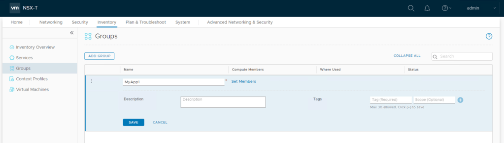

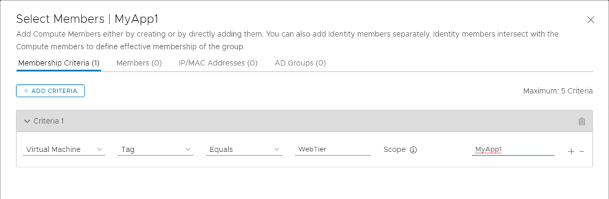

We can see the group has a single VM in it that matches the criteria

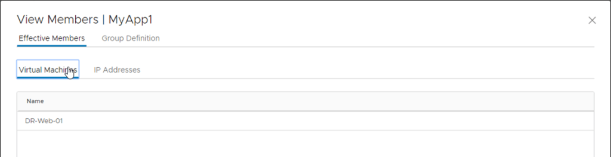

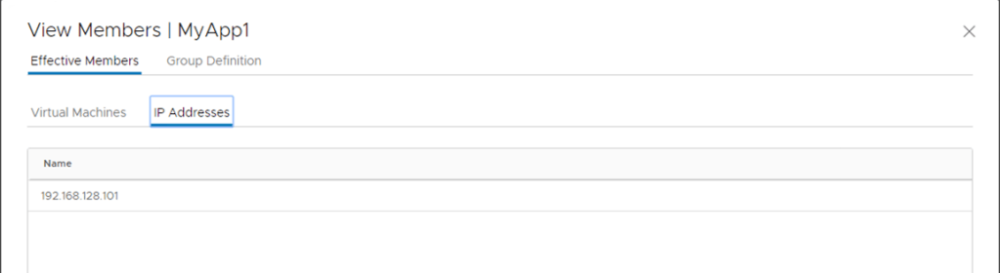

And we can see on the Ubuntu server that I have set up as the notification watcher, that NSX-T Manager has sent a notification to the notification-watcher

```
192.168.110.201 - - [ 02/Mar/2020 01:52:42] "POST /nsx-notifications HTTP/1.1" 202 -
{"refresh_needed": false, "result_count": 1, "results": [{"uris": [{"operation": "UPDATE", "uri": "/policy/api/v1/infra/domains/default/groups/MyApp1"}], "notification_id": "group.change_notification"}]}
```

And now the Cisco ASA-v has a group called MyApp1 configured with the IP details from NSX-T

```
asav-vi# show object-group network
object-group network MyApp1
 network-object host 192.168.128.101
```

Now I will go and tag a few more machines and we will watch what happens

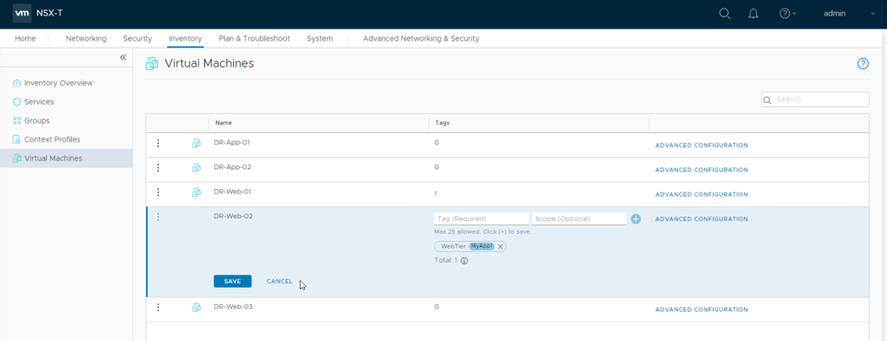

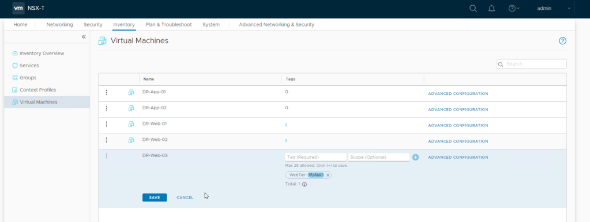

Again, we see the notification send from the NSX-T manager

```
192.168.110.201 - - [02/Mar/2020 02:05:12] "POST /nsx-notifications HTTP/1.1" 202 -
{"refresh_needed": false, "result_count": 1, "results": [{"uris": [{"operation": "UPDATE", "uri": "/policy/api/v1/infra/domains/default/groups/MyApp1"}], "notification_id": "group.change_notification"}]}
```

And now this is what our object group looks like on the Cisco ASA-v

```
asav-vi# show object-group network
object-group network MyApp1
 network-object host 192.168.128.101
 network-object host 192.168.128.103
 network-object host 192.168.128.102
```

Now if I add a Segment as a group member, we should see all the IP Addresses of the connected VMs appear in the object-group on the ASA-v

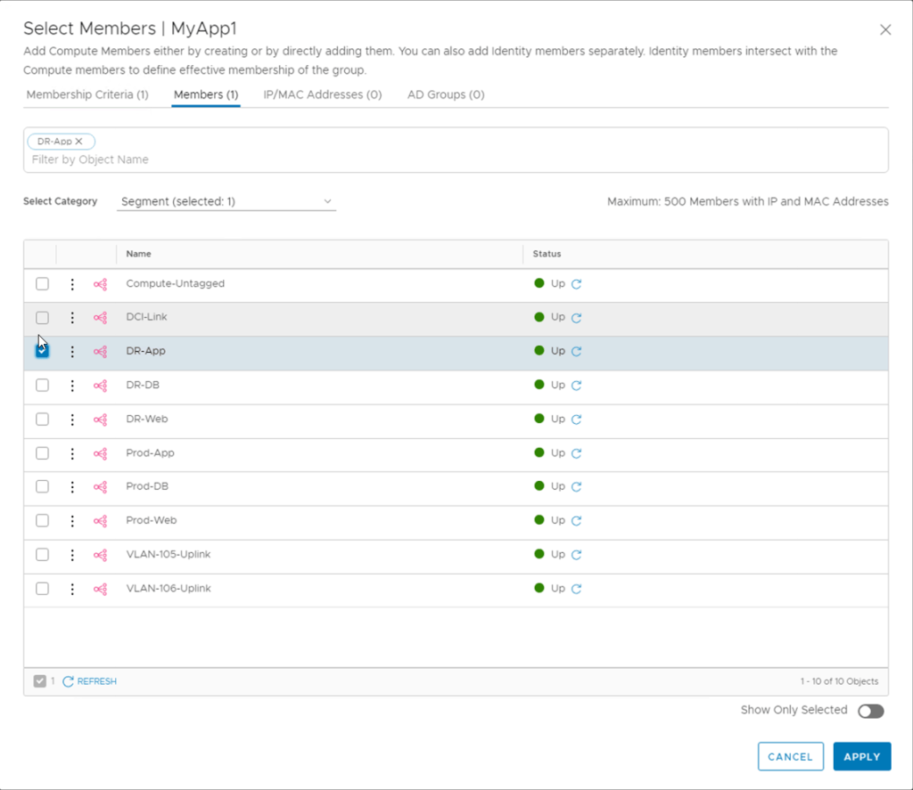

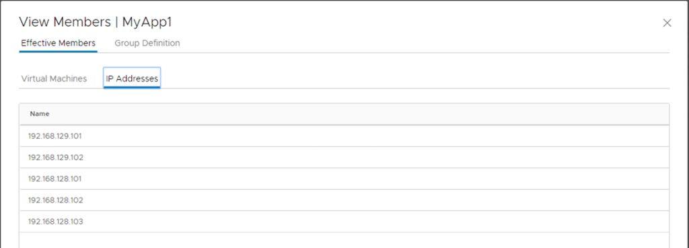

Again, we can see the object-group on the ASA-v has been updated

```
asav-vi#  show object-group network
object-group network MyApp1
 network-object host 192.168.128.101
 network-object host 192.168.128.103
 network-object host 192.168.128.102
 network-object host 192.168.129.102
network-object host 192.168.129.101
```

But it doesn't just work with Dynamic objects, if you add and IP/Network into the group, this will also be reflected.

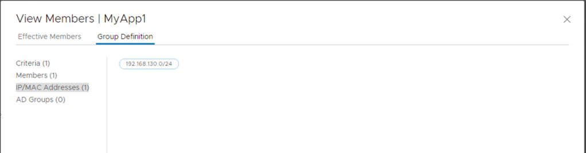

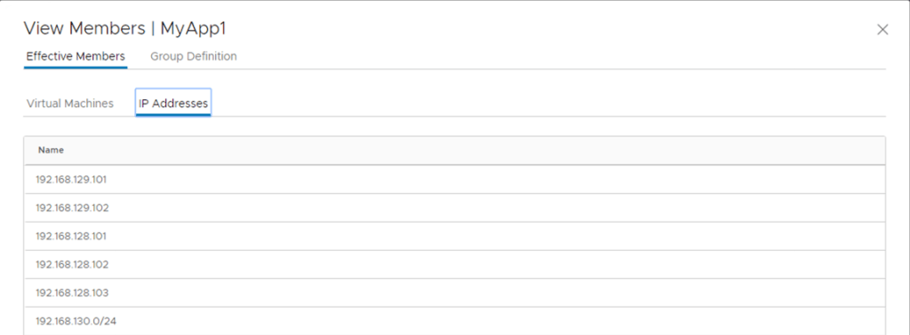

The network appears in the object-group too

```
asav-vi#  show object-group network
object-group network MyApp1
 network-object host 192.168.128.101
 network-object host 192.168.128.103
 network-object host 192.168.128.102
 network-object host 192.168.129.102
 network-object host 192.168.129.101
 network-object 192.168.130.0 255.255.255.0
```

And if the segment is removed from the group definition, the IP addresses derived from the logical ports connected to the segment are also removed

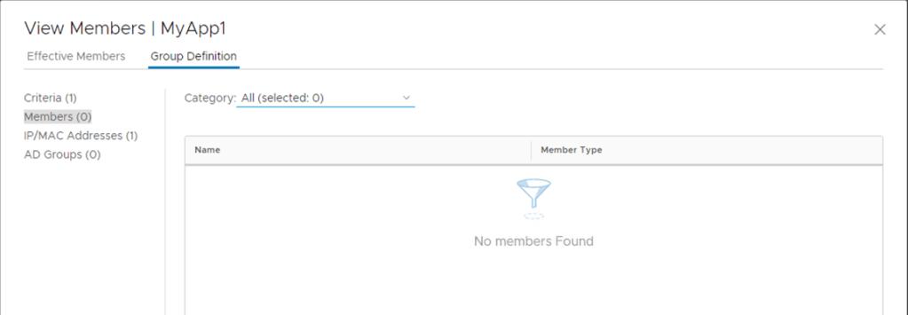

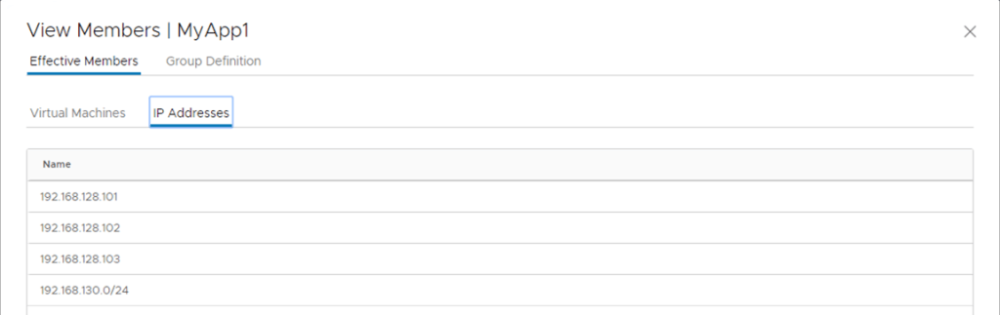

```
asav-vi#  show object-group network
object-group network MyApp1
 network-object host 192.168.128.101
 network-object host 192.168.128.103
 network-object host 192.168.128.102
 network-object 192.168.130.0 255.255.255.0
```

As you can see, this can be quite a useful API to play with and can be used to solve some issues with updating external systems which cannot natively interact with the NSX-T Manager APIs.

Let's hope that the API has its experimental status removed and it becomes a 100% supported API sometime in the future.

Let me know if this API is something that you would be interested in leveraging one way or another.
