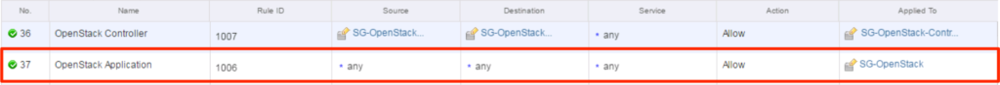
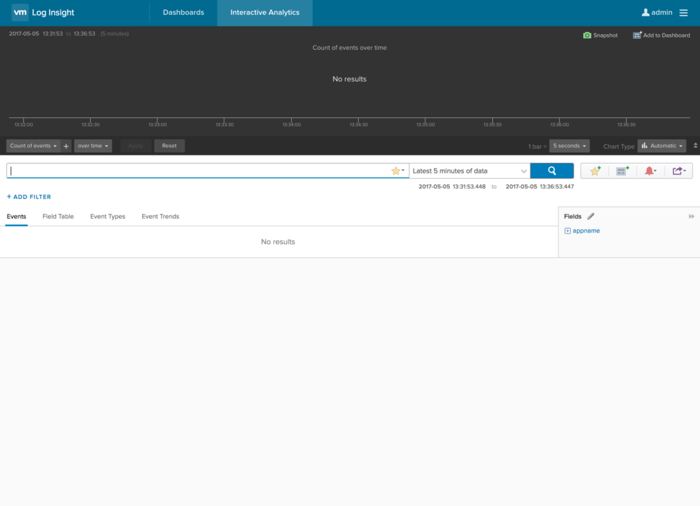
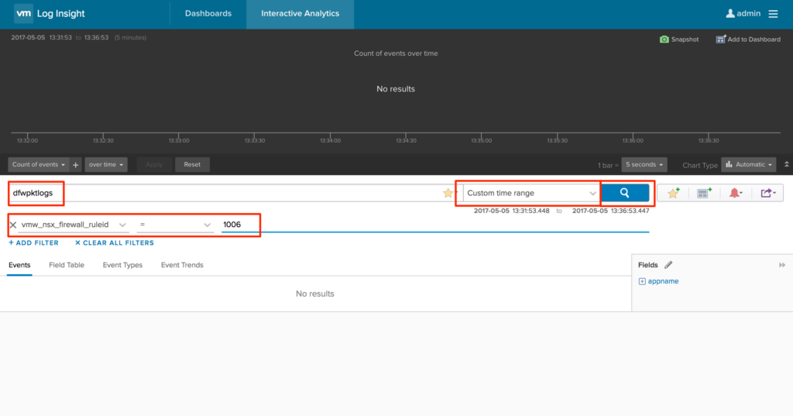
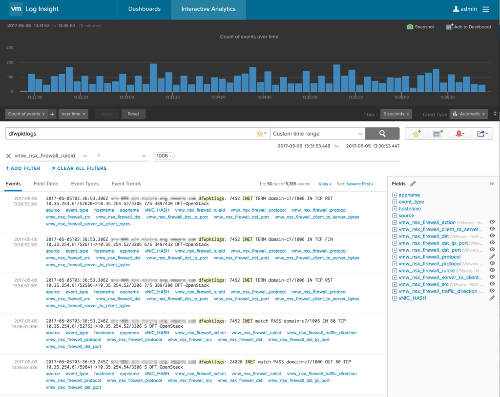
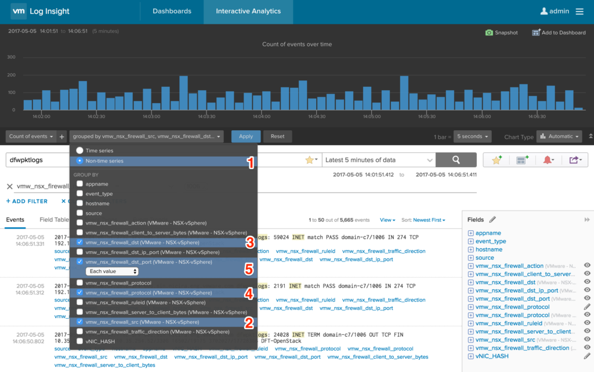
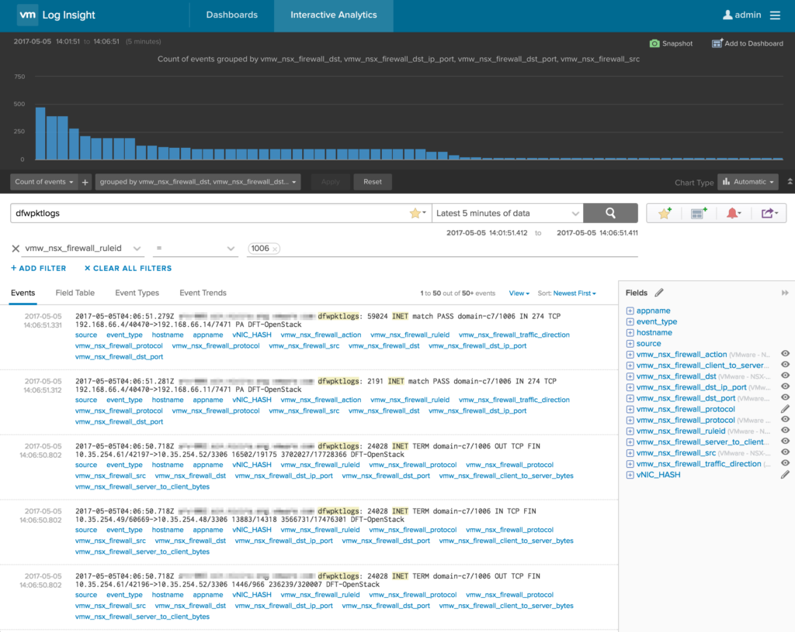
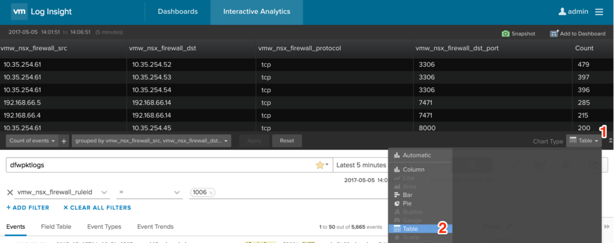
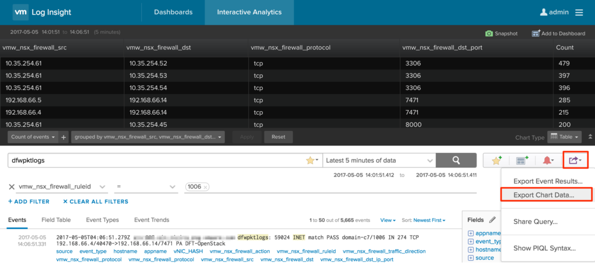
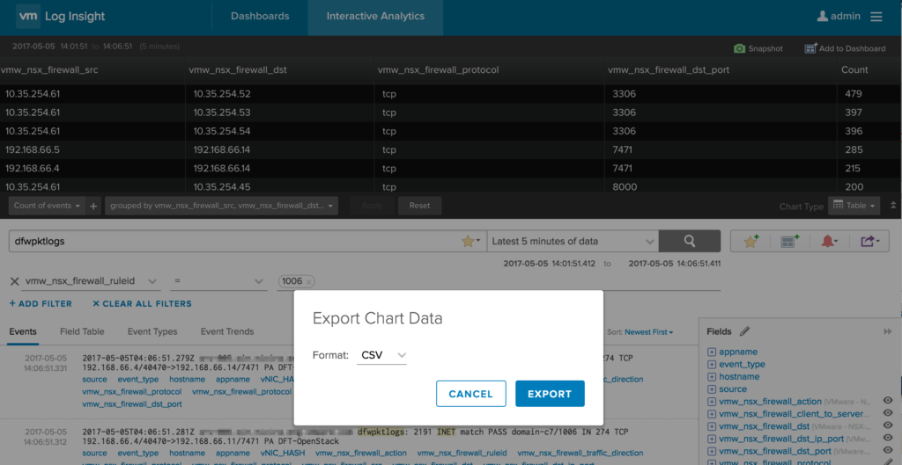
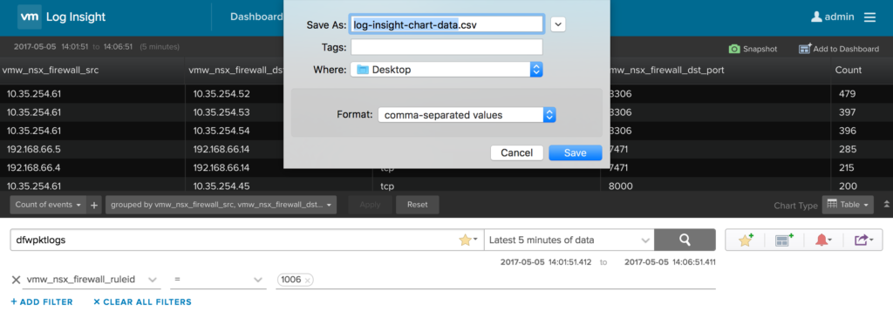

I was recently asked by a customer who is running NSX vSphere (NSX-v) and Log Insight, is there a way they can export data from Log Insight that will give them the unique source/destination/protocol/destinationPort from the DFW logs for a given ruleId over a given time period. This exported data could then be fed into a [PowerNSX](https://github.com/vmware/) ([Get it on GitHub](https://github.com/vmware/)) script to create the required firewall rules.

My initial response to the question was "buggered if I know, but I will send an email to some people that will know".

The customer had setup some monitoring/logging rules in the DFW that they were using to get visibility into what traffic is going to and from a given set of workloads. Now you may ask, why not used the new Application Rule Manager that is available in the 6.3.x release of NSX-v, and the answer to that is they are running 6.2.5, so the feature is not available, so we fall back to using Log Insight which is already setup and configured.

With the help of [Anthony Burke](http://networkinferno.net) & Alan Castonguay, it turns out that this is relatively easy to achieve.

The first thing we need is the DFW ruleId that you want to filter the logs on. For this example we will use ruleId 1006

[](http://www.sneaku.com/wp-content/uploads/2017/05/log-Insight-export-01.png) Now we head over to the Interactive Analytics screen in log insight.

[](http://www.sneaku.com/wp-content/uploads/2017/05/log-Insight-export-02.png)

In the search box, enter dfwpktlogs, select the time range, and add a filter for vmw\_nsx\_firewall\_ruleid = 1006 and then click the search button.

[](http://www.sneaku.com/wp-content/uploads/2017/05/log-Insight-export-04.png)

A whole heap of log entries should appear now along with a lovely chart.

[](http://www.sneaku.com/wp-content/uploads/2017/05/log-Insight-export-05.png)

But the information is not really useful to us in this format, so lets tweak it a bit as shown below.

> The order in which you select the Group By checkboxes, is the order in which they will be displayed, and subsequently exported to csv.

[](http://www.sneaku.com/wp-content/uploads/2017/05/log-Insight-export-08.png)

And what you'll end up with is something which looks like the following

[](http://www.sneaku.com/wp-content/uploads/2017/05/log-Insight-export-07.png)

Now this still isn't quite what we need, so its time to tweak the chart type as shown below.

[](http://www.sneaku.com/wp-content/uploads/2017/05/log-Insight-export-09.png)

Which now displays the chart data needed. Now all thats needed is to export the chart data as shown below.

[](http://www.sneaku.com/wp-content/uploads/2017/05/log-Insight-export-10.png)

The exported file can be in either CSV or JSON format. For this example, I am choosing CSV.

[](http://www.sneaku.com/wp-content/uploads/2017/05/log-Insight-export-11.png)

[](http://www.sneaku.com/wp-content/uploads/2017/05/log-Insight-export-12.png)

The saved file will look something similar to the following

```
vmw_nsx_firewall_src (VMware - NSX-vSphere),vmw_nsx_firewall_dst (VMware - NSX-vSphere),vmw_nsx_firewall_protocol (VMware - NSX-vSphere),vmw_nsx_firewall_dst_port (VMware - NSX-vSphere),Count
10.35.254.61,10.35.254.52,tcp,3306,479
10.35.254.61,10.35.254.53,tcp,3306,397
10.35.254.61,10.35.254.54,tcp,3306,396
192.168.66.5,192.168.66.14,tcp,7471,285
192.168.66.4,192.168.66.14,tcp,7471,215
10.35.254.61,10.35.254.45,tcp,8000,200
10.35.254.61,10.35.254.45,tcp,8004,200
10.35.254.61,10.35.254.46,tcp,8000,199
10.35.254.61,10.35.254.46,tcp,8004,199
192.168.66.4,192.168.66.11,tcp,7471,133
192.168.66.5,192.168.66.11,tcp,7471,133
10.35.254.61,10.35.254.50,tcp,9696,118
10.35.254.61,10.35.254.40,tcp,8777,110
10.35.254.61,10.35.254.41,tcp,8777,110
10.35.254.61,10.35.254.49,tcp,35357,100
10.35.254.61,10.35.254.49,tcp,5000,100
10.35.254.61,10.35.254.49,tcp,8773,100
10.35.254.61,10.35.254.49,tcp,8774,100
10.35.254.61,10.35.254.49,tcp,8775,100
10.35.254.61,10.35.254.49,tcp,8776,100
10.35.254.61,10.35.254.49,tcp,9191,100
10.35.254.61,10.35.254.49,tcp,9292,100
10.35.254.61,10.35.254.49,tcp,9696,100
10.35.254.61,10.35.254.50,tcp,6080,100
10.35.254.61,10.35.254.50,tcp,80,100
10.35.254.61,10.35.254.50,tcp,8773,100
10.35.254.61,10.35.254.50,tcp,8774,100
10.35.254.61,10.35.254.50,tcp,8775,100
10.35.254.61,10.35.254.50,tcp,8776,100
10.35.254.61,10.35.254.50,tcp,9191,100
10.35.254.61,10.35.254.50,tcp,9292,100
10.35.254.61,10.35.254.49,tcp,6080,99
10.35.254.61,10.35.254.49,tcp,80,99
10.35.254.61,10.35.254.50,tcp,35357,99
10.35.254.61,10.35.254.50,tcp,5000,99
192.168.66.5,192.168.66.15,tcp,7471,75
192.168.66.4,192.168.66.15,tcp,7471,72
10.35.254.50,10.35.254.48,tcp,3306,46
10.35.254.65,10.35.254.255,udp,137,26
10.35.254.9,10.35.254.63,udp,138,26
10.35.254.51,10.35.254.48,tcp,9696,18
10.35.254.49,10.35.254.48,tcp,3306,13
10.35.254.65,10.35.254.255,udp,138,13
10.35.254.7,10.35.254.127,udp,138,13
192.168.66.112,192.168.66.14,tcp,7471,7
10.35.253.138,10.35.253.191,udp,138,6
10.35.254.45,10.35.254.4,udp,53,6
10.35.254.46,10.35.254.4,udp,53,6
10.35.254.53,10.35.254.4,udp,53,6
10.35.254.54,10.35.254.4,udp,53,6
10.35.254.56,10.35.254.4,udp,53,6
10.35.254.57,10.35.254.4,udp,53,6
10.35.254.58,10.35.254.4,udp,53,6
10.35.254.60,10.35.254.4,udp,53,6
10.35.254.45,10.35.254.59,tcp,5672,4
10.35.254.46,10.35.254.59,tcp,5672,4
10.35.254.52,10.35.254.8,udp,514,4
192.168.66.14,192.168.66.112,tcp,7471,4
10.35.253.138,10.35.253.191,udp,137,2
10.35.253.141,10.35.253.191,udp,138,2
10.35.254.45,192.168.65.255,udp,123,2
10.35.254.57,192.168.65.255,udp,123,2
10.35.254.58,192.168.65.254,udp,123,2
10.35.254.58,192.168.65.255,udp,123,2
192.168.66.97,192.168.66.14,tcp,7471,2
10.35.254.52,192.168.65.255,udp,123,1
10.35.254.87,192.168.65.254,udp,123,1
```

Now you can use the data directly to create some firewall rules using your preferred method of programming language.
