One of the features of NSX-v is the ability to create a Layer 2 VPN between 2 NSX-v Edge Services Gateways (ESG from now on). But what happens if there is no NSX-v at the destination where you would like to extend your Layer 2 network. As of NSX-v 6.1.0 the concept of a Standalone Edge L2 VPN Client has been made available to deploy into a remote vSphere environment.

The reasons why you would want utilise a L2 VPN could be one of many, and I am not here to say if its a good idea or not, however if you do decide to go down this path and utilise the Standalone Edge L2 VPN Client, this is how you would do it.

Setting up a regular L2 VPN with NSX on both ends is documented sufficiently enough that you should be able to figure it out by reading the following link: [http://pubs.vmware.com/NSX-61/index.jsp#com.vmware.nsx.admin.doc/GUID-7977542E-C4BA-484A-9811-1233E2401A23.html](http://pubs.vmware.com/NSX-61/index.jsp#com.vmware.nsx.admin.doc/GUID-7977542E-C4BA-484A-9811-1233E2401A23.html)

However when deploying a Standalone Edge L2 VPN Client, there appears to be some steps missing from the official documentation to get the L2 VPN up and running.

The following community post by Dmitri Kalintsev is an indication of what is required: [https://communities.vmware.com/message/2435409#2435409](https://communities.vmware.com/message/2435409#2435409)

* * *

At a customer site recently there was a specific use case which we needed to setup that required the use of the Standalone Edge L2 VPN Client, and with a lot of time, investigation and patience, we were able to get it up and running. This post will document the process so anyone else who would like to deploy this particular scenario will have a reference to be able to help them.

The L2 VPN concept I will be describing here today uses an NSX provisioned ESG acting as the L2 VPN server and a Standalone ESG acting as the L2 VPN client. So the first step is to setup the L2 VPN server.

## L2 VPN Server

- Deploy a new NSX ESG, making sure you at least do the following:
    - Configure an uplink interface and connect it to an appropriate port group or logical switch. The uplink interface will be used by the L2 VPN service to listen on/bind to. [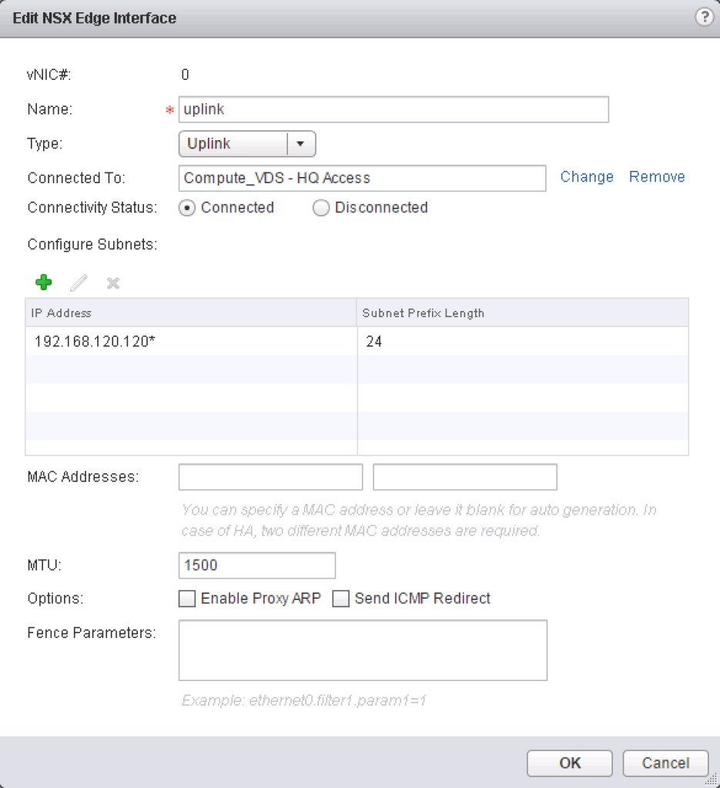](http://www.sneaku.com/wp-content/uploads/2015/06/L2VPN-01.png)
    - Configure a default gateway on the ESG so that IP connectivity can exist outside of the local subnet the uplink is connected to.[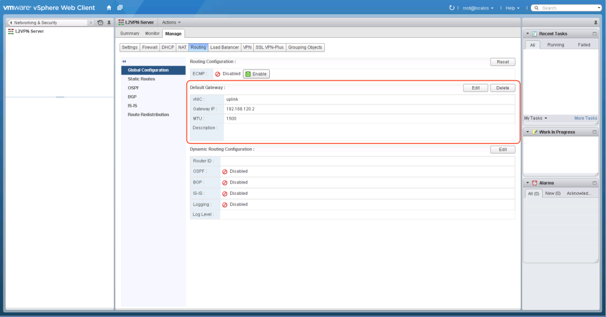](http://www.sneaku.com/wp-content/uploads/2015/06/L2VPN-02.png)
- A single ESG has the ability to “stretch” multiple L2 segments through the L2 VPN functionality. To achieve this, the ESG will need to have a interface in each L2 segment is to be stretched via the L2 VPN. But as an ESG is limited to 10 interfaces in total, the L2 VPN service now uses sub-interfaces configured on a Trunk interface. But where do we connect this trunk interface?

> Well for this purpose the answer is “it depends", as long it is connected to a port group on the same vSwitch of the L2 segments that is to be stretched then everything should be hunky dory.
> 
> So as an example, if there are two distributed switches configured, we will call then A & B, and distributed switch A is configured and used with NSX for logical switching (VXLAN), whilst distributed switch B has only traditional VLAN backed port groups configured, if you connected the ESG Trunk interface to a port group on distributed switch B, when it comes time to create a sub-interfaces, you will only be able to create sub-interfaces in the port-groups configured on the vSwitch connected to the Trunk interface (in this case VLAN backed port groups only). To stretch some of the Logical Switches, the Trunk interface will need to be connected to a port group on distributed switch A.
> 
> It is possible to have 2 Trunk interfaces configured, one connected to each vSwitch so that multiple L2 segments from both vSwitches can be stretched. And whilst my explanation uses the distributed vSwitch, you can also use a standard vSwitch if you so desire. After it is explained, it makes perfect sense right?
> 
> However I have seen customers with multiple standard and distributed switches stumble over this little piece of information. Maybe think of it like in a physical network. The Trunk interface would be connected to a physical switch that is configured for VLAN trunking. This will give the trunk interface access to all the VLANs which are allowed/configured on the trunk.

> Another area people often get tripped up on is the port group the Trunk interface is actually connected to. Often people try and connect the Trunk interface directly to the port group that they want to stretch and then have issues when they can’t actually configure the L2 VPN service with the required port group/L2 segment. The trick here is to create a dedicated port group on the applicable vSwitch, configured with VLAN trunking, which is solely for the purpose just to logically connect the ESG’s to when being used for L2 VPN.

- So now we know we need to configure a dedicated port group configured for VLAN trunking so that it can be connected to the ESG. When configuring the port group, make sure to configure the "VLAN type” as VLAN trunking and set the VLAN trunk range accordingly.

> In production environments I usually only set this to the include just the VLAN IDs corresponding to the VLANs the are to be stretched, but in a POC or DEV setup, I just use 0-4094.

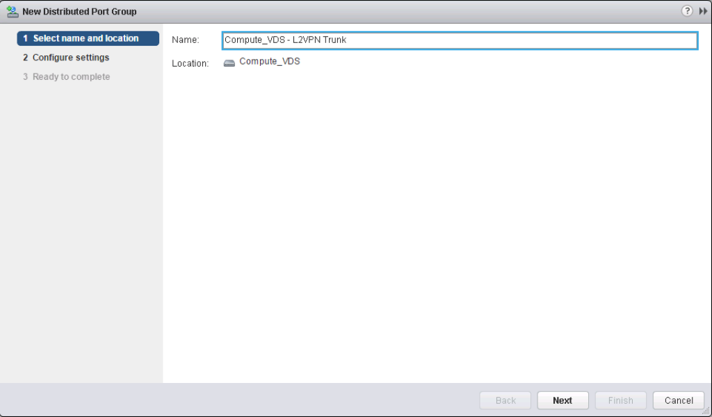

[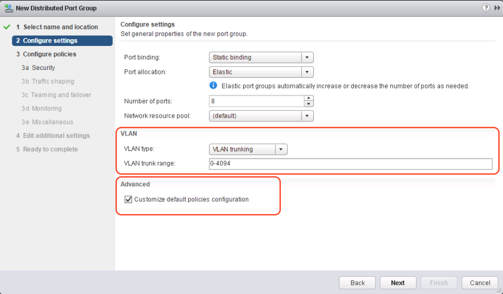](http://www.sneaku.com/wp-content/uploads/2015/06/L2VPN-04.png)

[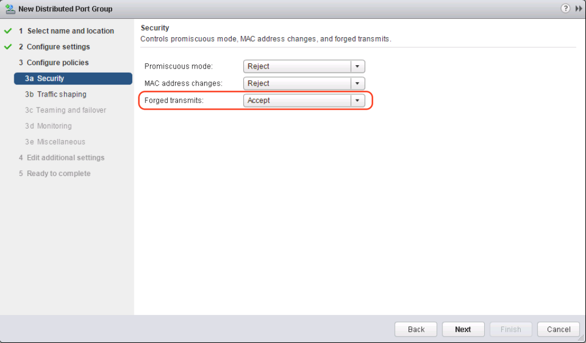](http://www.sneaku.com/wp-content/uploads/2015/06/L2VPN-05.png)

[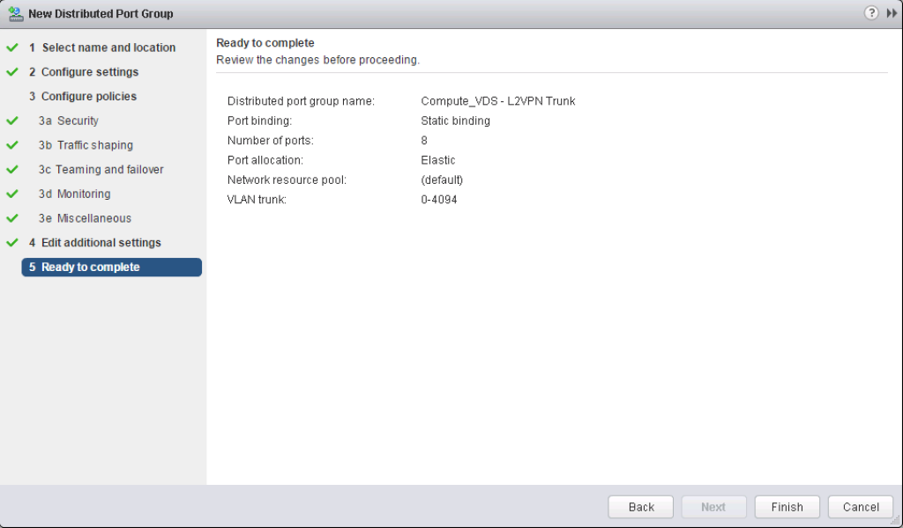](http://www.sneaku.com/wp-content/uploads/2015/06/L2VPN-06.png)

- Now the L2 VPN Trunk port group is configured, it can be connected the ESG to this interface. This interface must be configured as the type “Trunk”. When choosing the type to be Trunk, an IP address is not required to be configured on the interface, however it does allow sub-interfaces to now be configured.

[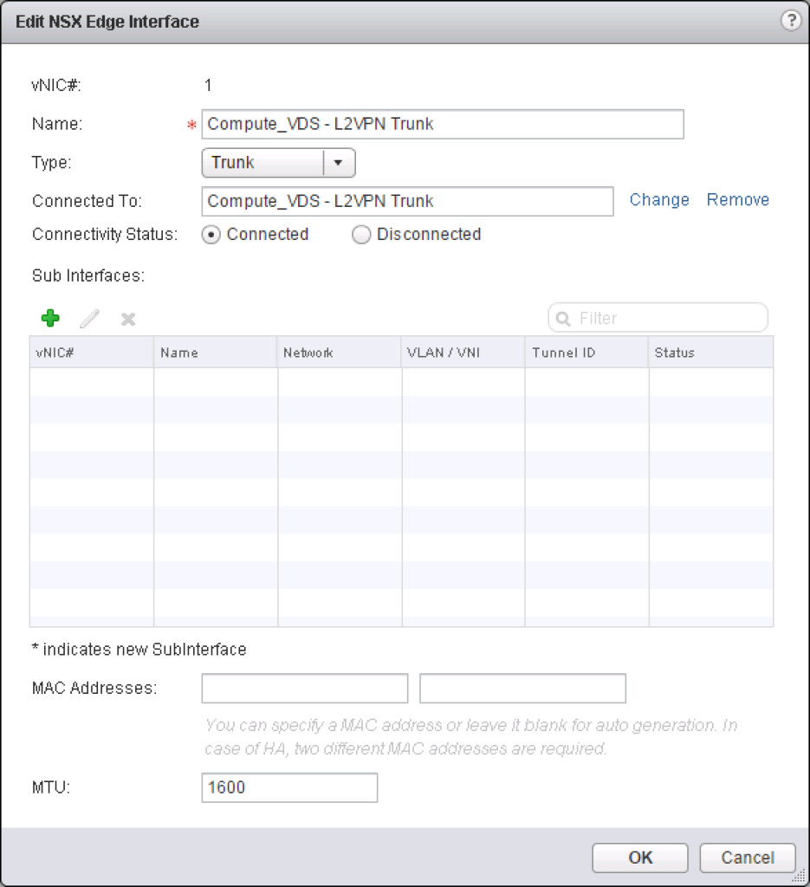](http://www.sneaku.com/wp-content/uploads/2015/06/L2VPN-07.png)

- Time to create a sub-interface:
    - Click the + sign to add a sub-interface.
    - Give it a name.
    - Enter a Tunnel ID. It says the acceptable values are 1 - 4094 (which sounds suspiciously like VLAN IDs). Just pick a random number to assign as the Tunnel ID. For this exercise just choose Tunnel ID 45. (If you want to stretch a VLAN backed port group, there is no harm in making the tunnel ID the same as the VLAN ID, but I will show you later the implications of doing that).
- Next is choosing the backing type.
    - Choosing VLAN as the backing type, will allow a VLAN ID to be entered for the VLAN that is to stretched.
    - Choosing Network as the backing type, requires a logical switch or dvPortGroup to be selected that is to connect the sub-interface to.
    - The None Type is used specifically when Egress Optimization is selected so traffic can be routed.
- Now choose the appropriate Network.

> The options which get displayed for the Nework will be dependant on the vSwitch the Trunk interface is connected to.

- An IP address is not required on the interface for our purpose.
- Keep everything else at their defaults and save the changes. A sub-interface should show now in the list..... Yay.

[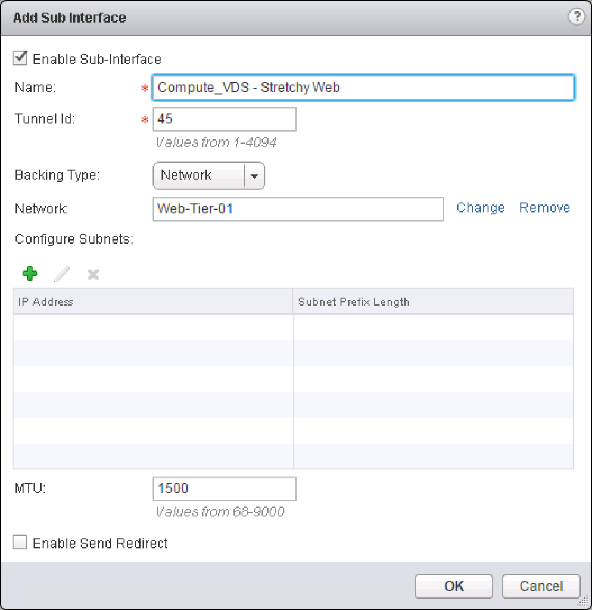](http://www.sneaku.com/wp-content/uploads/2015/06/L2VPN-08.png)

[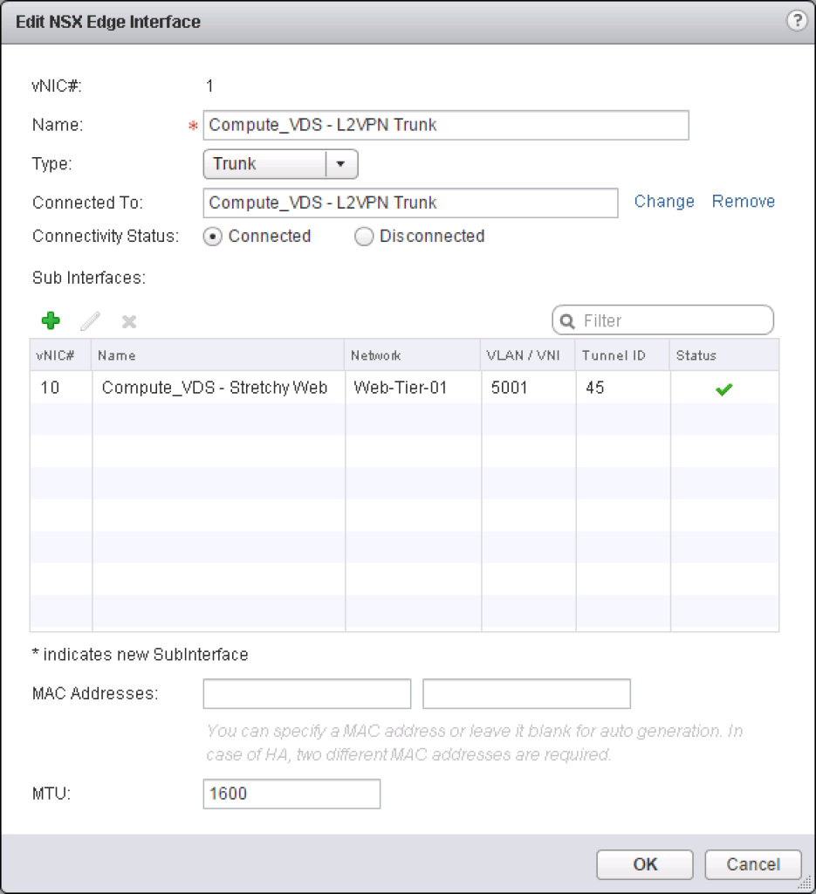](http://www.sneaku.com/wp-content/uploads/2015/06/L2VPN-09.png)

- Next step is to actually configure the L2 VPN Server, so jump over to the VPN Section, and Click on the L2 VPN section down the left hand side:
    - Click Enable.
    - Choose “Server” as the L2VPN Mode.[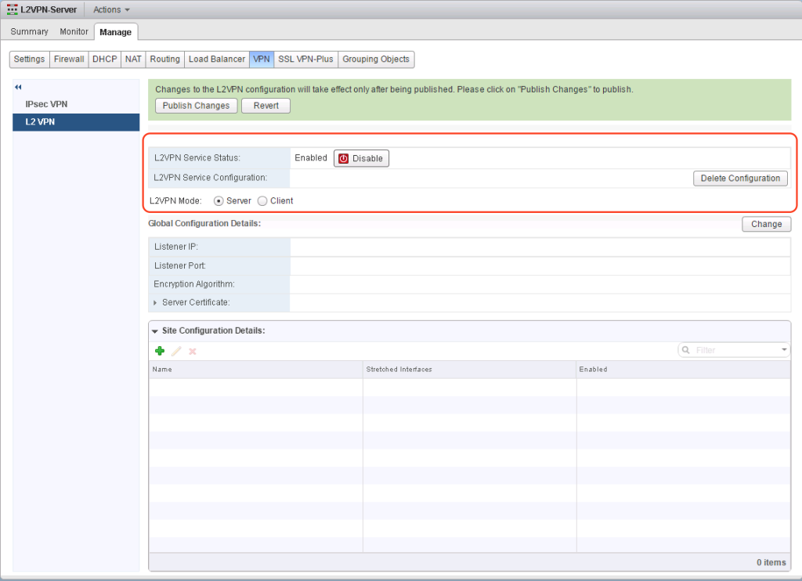](http://www.sneaku.com/wp-content/uploads/2015/06/L2VPN-10.png)
    - Next to the “Global Configuration Details” section, click the Change button.
    - Choose the IP Address of the Uplink interface as the Listener IP.
    - Leave the port as 443.
    - Choose an encryption algorithm.
    - And for our demo, we will use the system generated certificate.
    - Click OK.[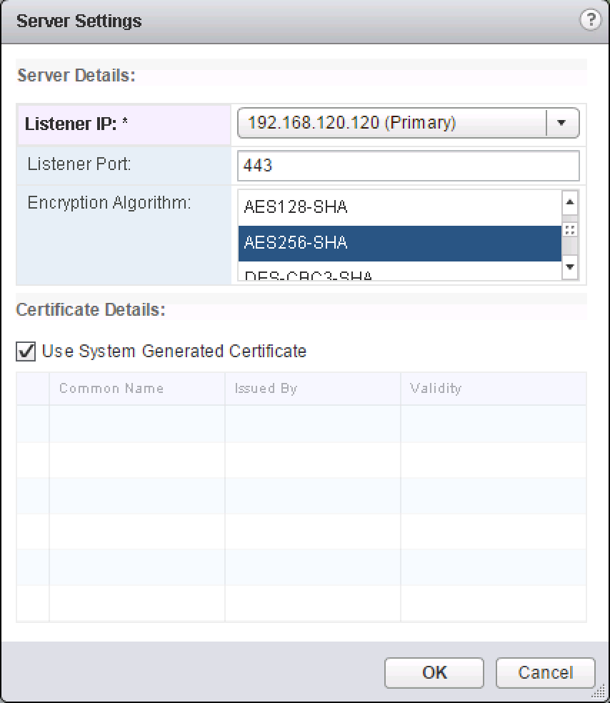](http://www.sneaku.com/wp-content/uploads/2015/06/L2VPN-11.png)

[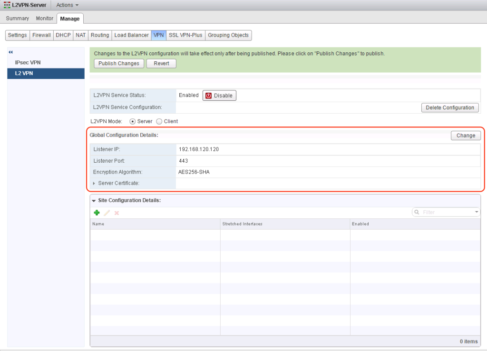](http://www.sneaku.com/wp-content/uploads/2015/06/L2VPN-12.png)

- Now we need to define the Site Configuration Details:
    - Click the +.
    - Tick the check box to **Enable Peer Site**.
    - Give the connection a Name, this can be any friendly name used to identify the connection in the UI.
    - Enter a Description here if required.
    - Enter a User Id, this will be the credentials that will be used by the Standalone Edge L2VPN Client to authenticate to the server.
    - Enter a Password.

> Quick Tip, make sure you have easy access to this password, or can type it easily, as every time you make any change to the Site Configuration Details, you are required to enter and confirm the password again.

[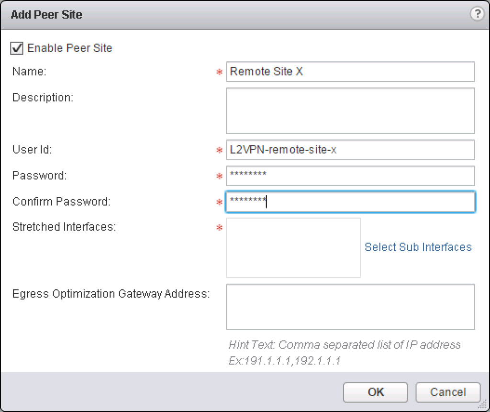](http://www.sneaku.com/wp-content/uploads/2015/06/L2VPN-13.png)

- Next , select the sub-interface which is to be stretched. When selecting the interfaces, only the names of the sub-interfaces defined earlier will be shown, so its a good idea that the sub-interfaces are created with a relevant name.

[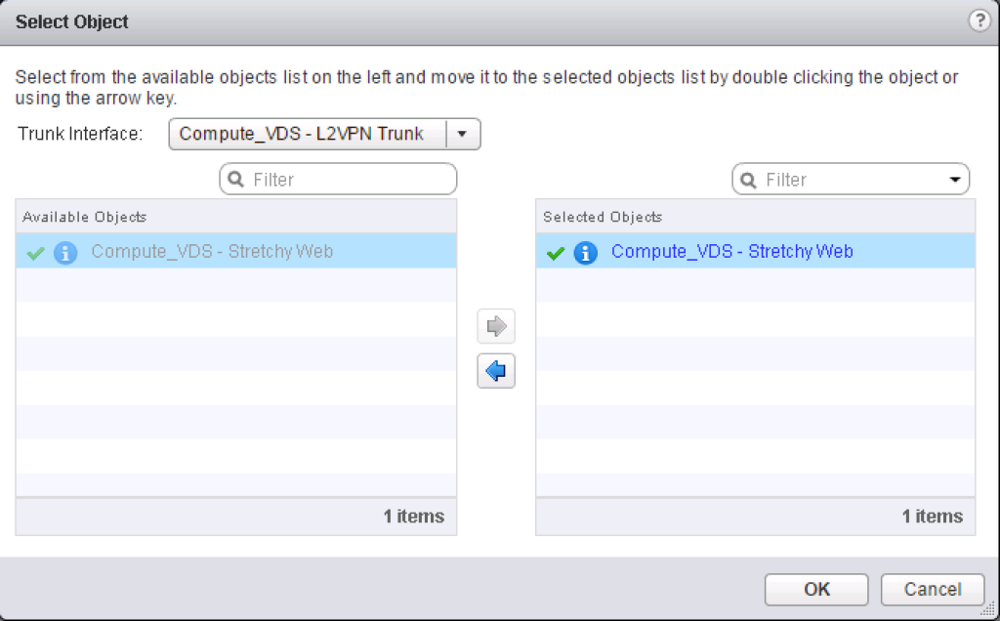](http://www.sneaku.com/wp-content/uploads/2015/06/L2VPN-14.png)

[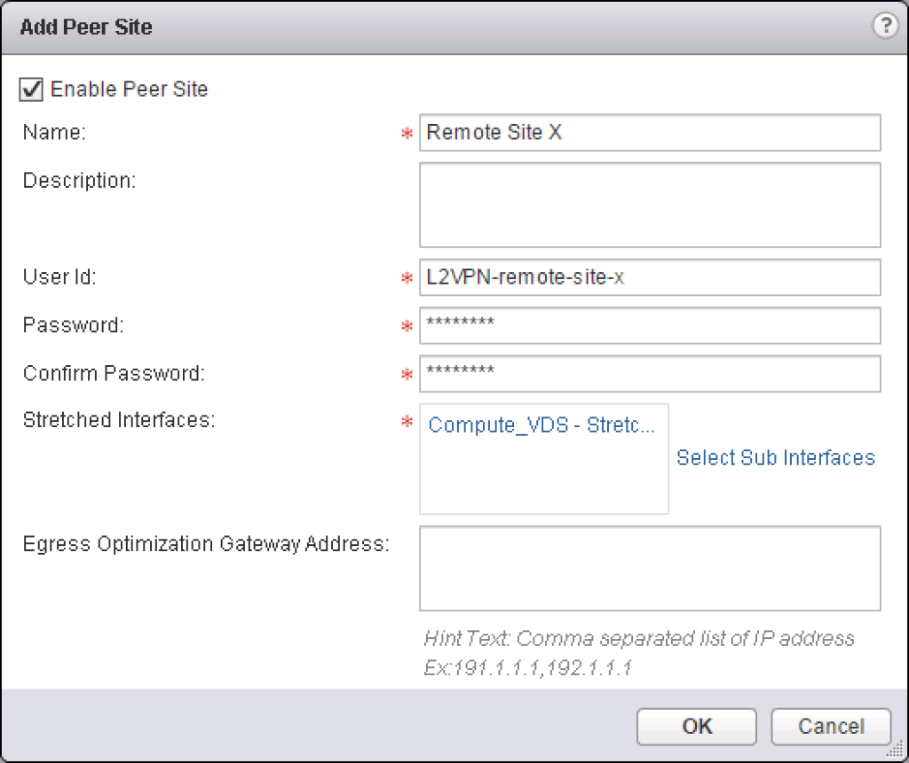](http://www.sneaku.com/wp-content/uploads/2015/06/L2VPN-15.png)

- Egress Optimization Gateway Address: For this particular scenario we don’t need to put anything into this field. By leaving this blank, it will mean that depending on where the default gateway is setup, some traffic may traverse the L2VPN to reach the default gateway. I may cover how the Egress Optimisation works in a future post.
- Click OK.
- Now publish the changes.

[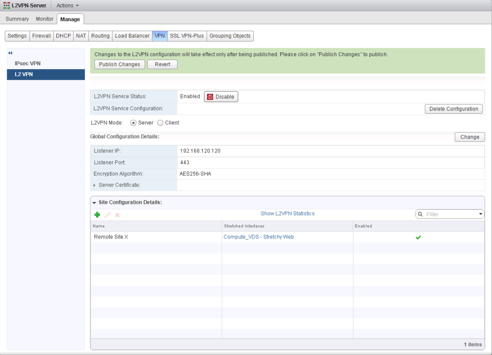](http://www.sneaku.com/wp-content/uploads/2015/06/L2VPN-16.png)

- The server side is now setup.

## Standalone Edge L2 VPN Client

When it comes to a standalone edge, according to the NSX-v documentation, it is a fairly straight forward process. However there are some quirks that you need to be aware of when deploying the Standalone L2VPN Client on the remote end.

- The standalone Edge is distributed as a Tar Gzip file. So you first need to download the file from [my.vmware.com](https://my.vmware.com) (assuming you already have NSX Download access) and unpack it.
- Once unpacked you should have a folder with the required files needed to import the OVF into vCenter.
- The standalone Edge is required to be connected to 2 separate port groups as described below.

> The first port group is required for the uplink interface. This interface is the one the appliance will use as the source interface to reach the L2VPN server and which the L2VPN tunnel will be established. This can be connected to a standard or distributed port group. The only requirements here is that once you've given the appliance an IP address, subnet mask and gateways, that it can reach the L2VPN server via  HTTPS (TCP port 443 ) to bring up the tunnel.

> The second interface on the appliance is used for the Trunk interface and will be used to create sub-interfaces for the networks/vlans you will be stretching. The Trunk interface will need to be connected to a portgroup which has a VLAN type set to trunking with the appropriate VLAN IDs of the VLANS (or other port groups) you want to be stretched across the tunnel. This portgroup will need specific configuration depending on whether it is connected to a VSS (Virtual Standard Switch) or VDS (vSphere Distributed Switch).

- Trunk Port Group - Standard vSwitch Configuration:
    - Make sure you are trunking All VLAN IDs.
    - Promiscuous mode must be enabled.
    - Forged Transmits must be enabled.

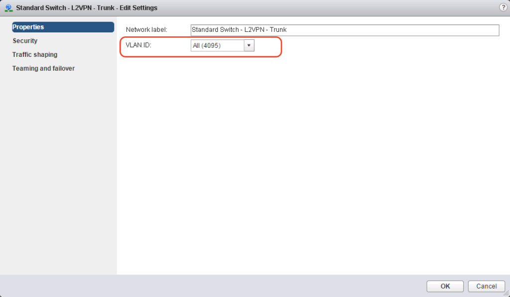

[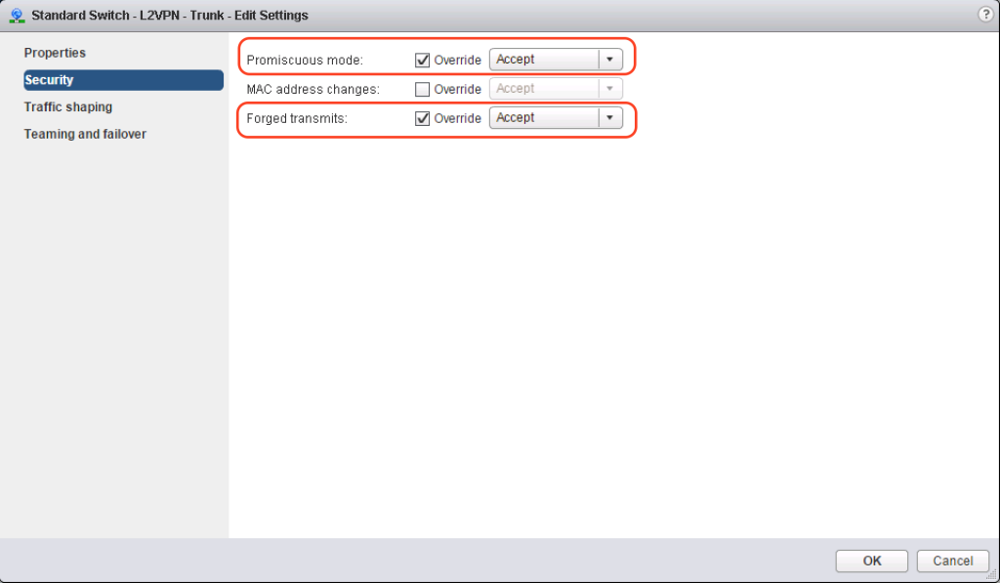](http://www.sneaku.com/wp-content/uploads/2015/07/L2VPN-22.png)

- Trunk Port Group - Distributed vSwitch Configuration:
    - Set the VLAN Type to **VLAN Trunking**.
    - VLAN trunk range should be set to the VLAN IDs of the VLAN/Port Group that is to be stretched.
    - Tick the checkbox to **Customize default policies configuration**.
    - Forged Transmits must be enabled.
    - Sink port must be enabled.

> The sink port MUST also be enabled on the dvPort when using a distributed vSwitch. However it can only be enabled once the Port ID of the device connecting to the port group is known. This will be covered after the standalone Edge is deployed further down.

[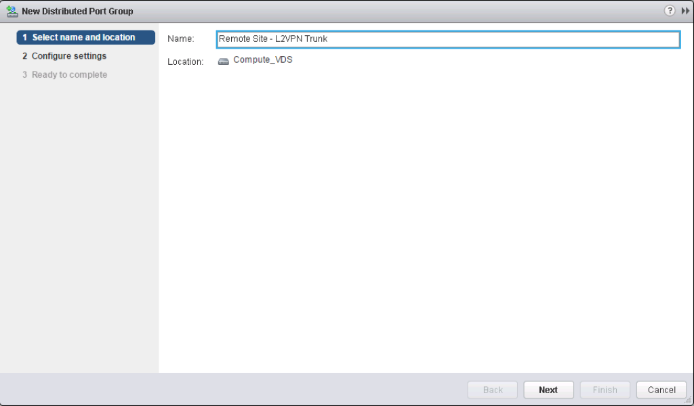](http://www.sneaku.com/wp-content/uploads/2015/07/L2VPN-18.png)

**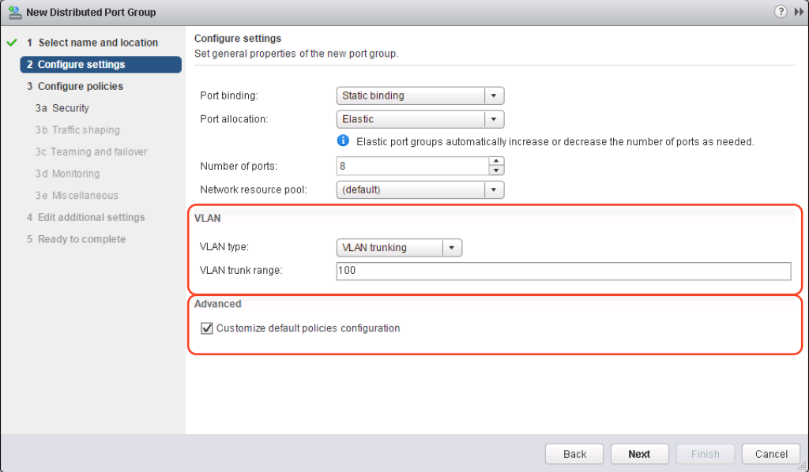**

[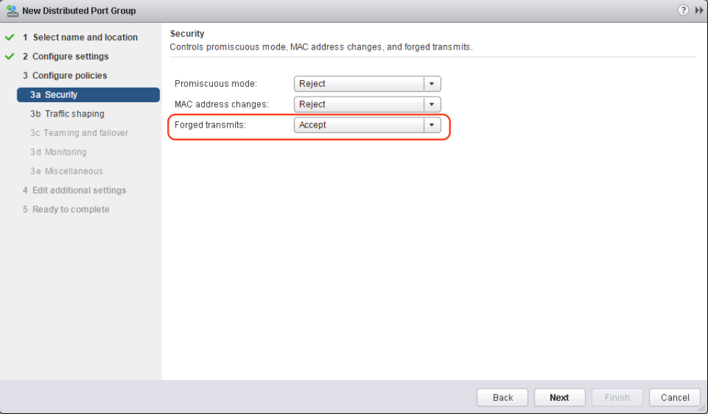](http://www.sneaku.com/wp-content/uploads/2015/07/L2VPN-20.png)

- Once the uplink and trunk port groups configured, the standalone Edge can be deployed, just like any other pre-bundled virtual machine which comes as a OVF.
- When deploying the standalone Edge, it will prompt for the standard information as shown in the following screenshots:

[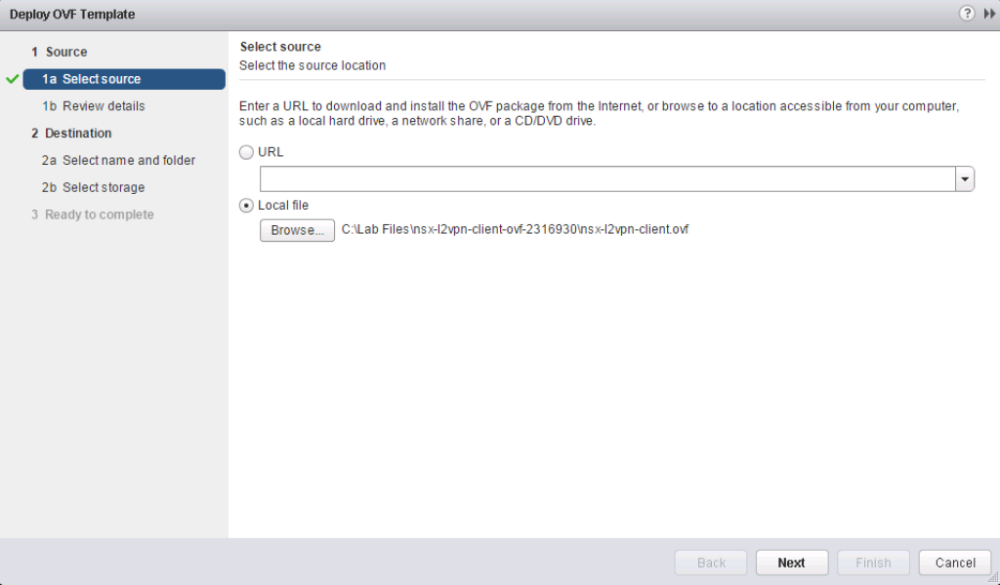](http://www.sneaku.com/wp-content/uploads/2015/07/L2VPN-23.png)

- Make sure to check the box to "Accept extra configuration options". This is required to enter the L2VPN specific configuration towards the end of the process.

[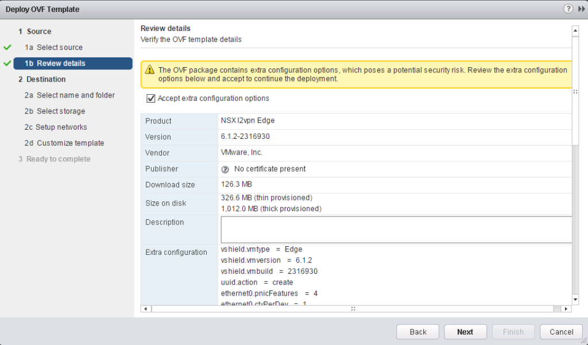](http://www.sneaku.com/wp-content/uploads/2015/07/L2VPN-24.png)

[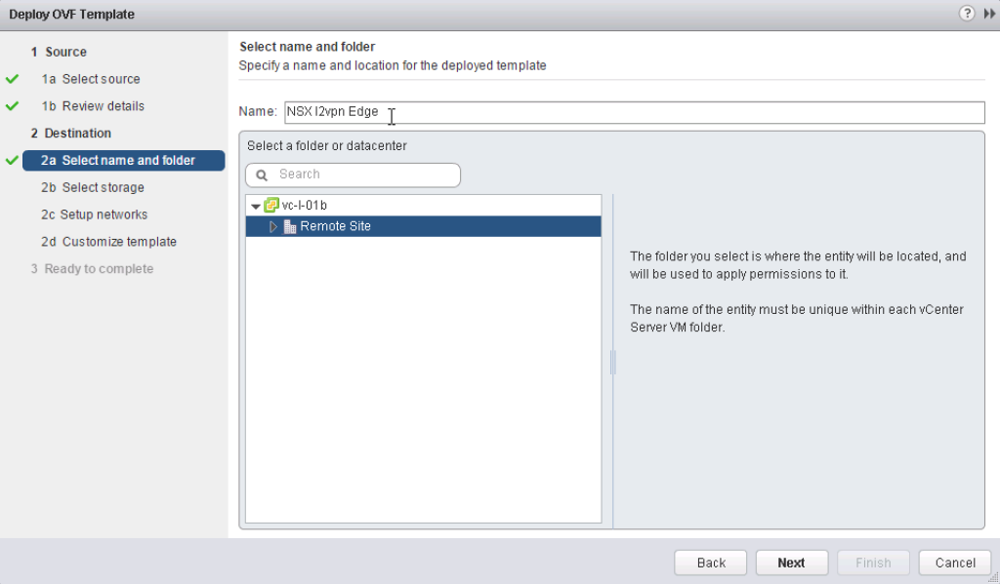](http://www.sneaku.com/wp-content/uploads/2015/07/L2VPN-25.png)

[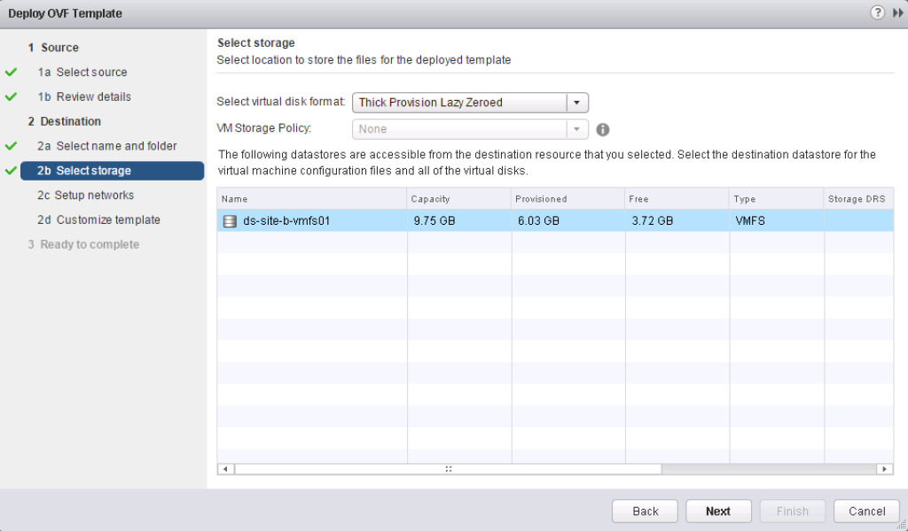](http://www.sneaku.com/wp-content/uploads/2015/07/L2VPN-26.png)

- Connect the Public interface to the uplink port group created earlier.
- Connect the Trunk interface to the trunk port group created earlier.

[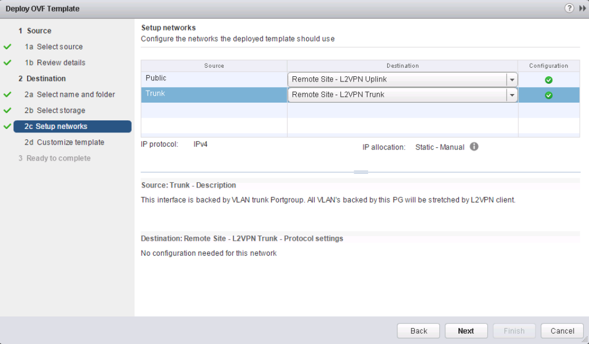](http://www.sneaku.com/wp-content/uploads/2015/07/L2VPN-27.png)

- The customize template screen is then shown (as long as the box was checked to **Accept extra configuration options** earlier).
- Enter the admin and root user passwords for the appliance.

[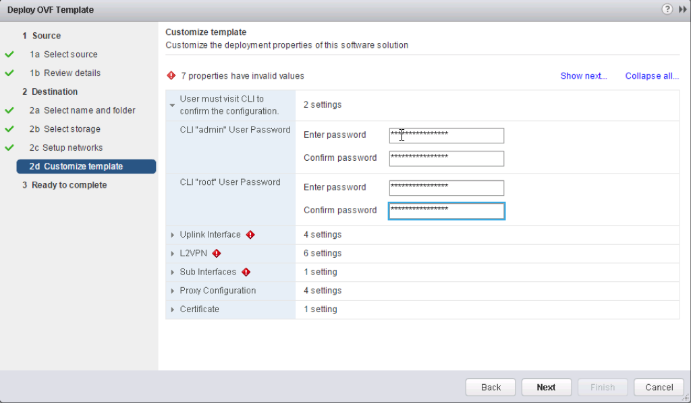](http://www.sneaku.com/wp-content/uploads/2015/07/L2VPN-28.png)

- Fill in the L2VPN configuration details:
    - Choose the Cipher which matches the Encryption Algorithm setup earlier on the L2VPN server.
    - Enter the Server Address of the L2VPN server.
    - Enter the port (Same as the Listener Port configured on the L2VPN Server configuration).
    - Enter the username and password configured on the L2VPN server for this particular site.

[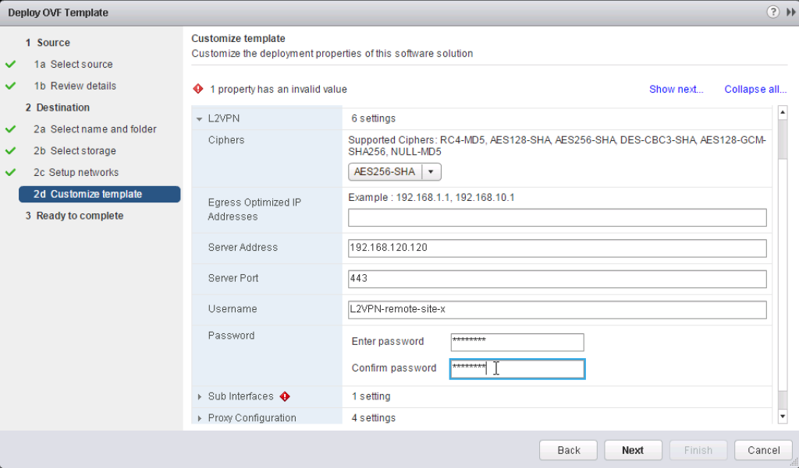](http://www.sneaku.com/wp-content/uploads/2015/07/L2VPN-30.png)

- Enter the VLAN ID of the VLAN/port group for that is to be stretched, along with the tunnel id that it is to be mapped to. The Tunnel ID should be enclosed in brackets and match what is configured on the L2VPN server.

[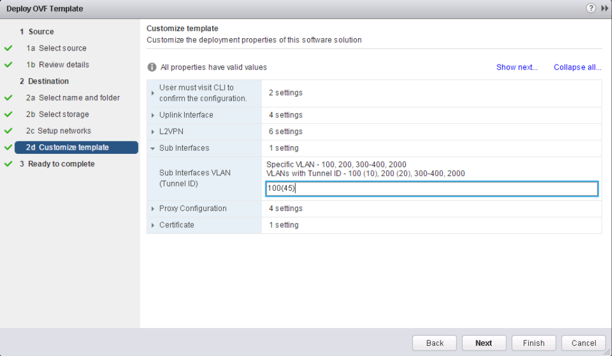](http://www.sneaku.com/wp-content/uploads/2015/07/L2VPN-31.png)

- Tick the checkbox to **Power on after deployment**.

[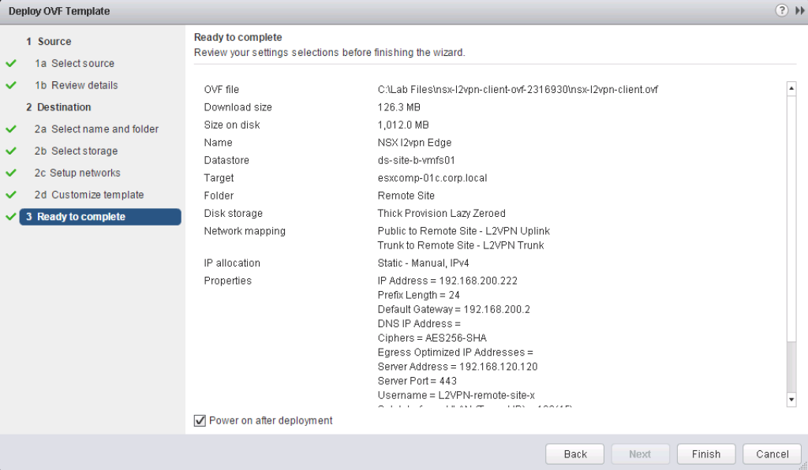](http://www.sneaku.com/wp-content/uploads/2015/07/L2VPN-32.png)

- Once deployed, the standalone Edge will power on and will try to connect to the L2VPN server.

> If you wish to change any of the OVF options after the Edge has been deployed, the Edge must be shut down, the vApp options changed, and then powered back on for the changes to take effect.

[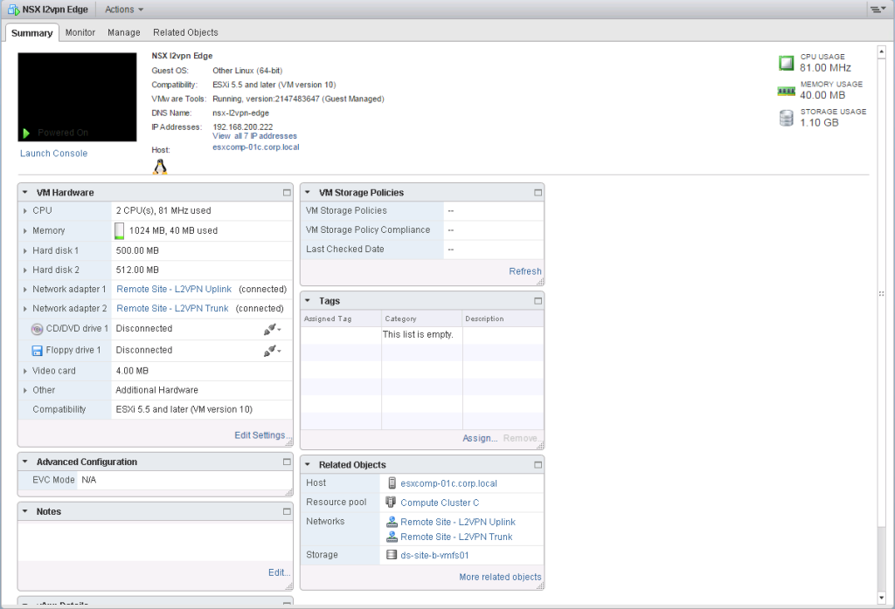](http://www.sneaku.com/wp-content/uploads/2015/07/L2VPN-33.png)

- If everything has been setup correctly, back on the Edge configured as the L2VPN Server, under the L2VPN configuration page, click on **Show L2VPN Statistics**

[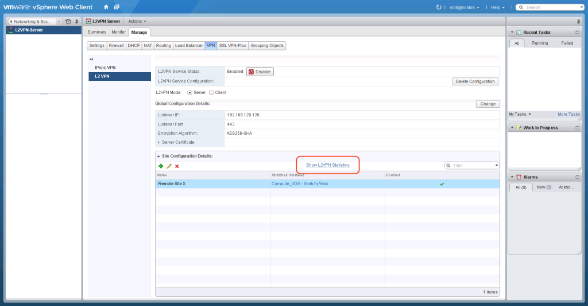](http://www.sneaku.com/wp-content/uploads/2015/07/L2VPN-34.png)

- The L2VPN statistics should pop up and display the Tunnel Status as up, and the Tx and Rx statistics should hopefully show some data flowing across the tunnel.

[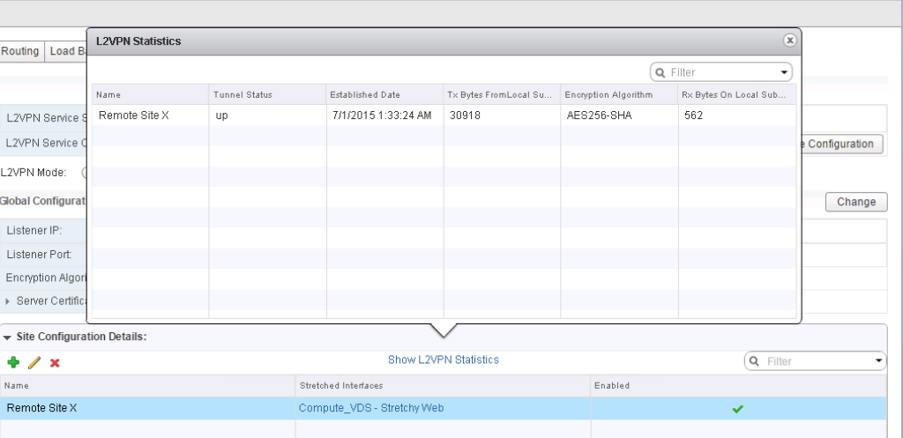](http://www.sneaku.com/wp-content/uploads/2015/07/L2VPN-35.png)

Although the tunnel is up and running, if we jump onto a server sitting on the Web-Tier Logical Switch and try to ping the server connected across the L2VPN, you can see that it doesn't work, even though the tunnel is up and running.

[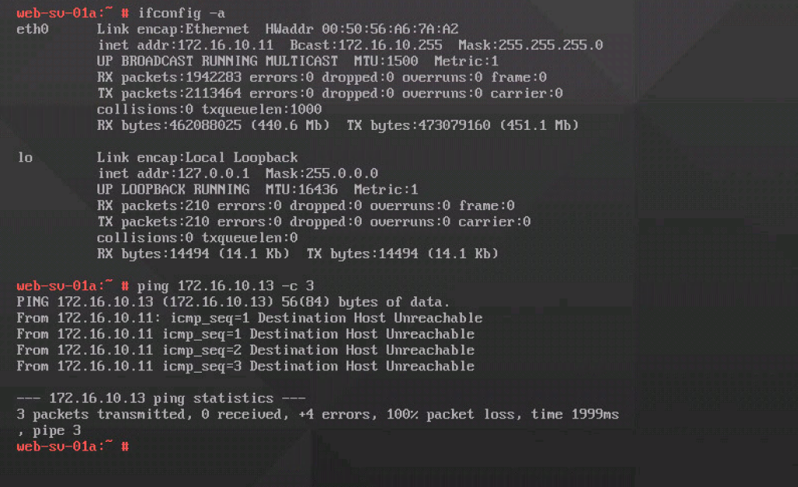](http://www.sneaku.com/wp-content/uploads/2015/07/L2VPN-36.png)

And you can see it's the same from the server on the standalone Edge side.

[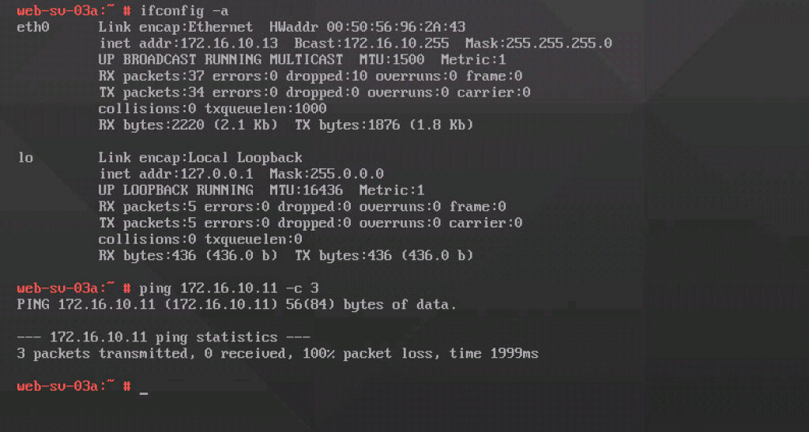](http://www.sneaku.com/wp-content/uploads/2015/07/L2VPN-37.png)

So to resolve this, you need to enable the sink port which was mentioned earlier.

> The SINK port is only required to be manually configured on the remote site when using a Standalone Edge with the tunk interface connected to a distributed port group. When using an NSX managed Edge on the remote side (ie. both ends have NSX installed), the SINK port is created by NSX Manager automatically.

The syntax to enable the sink port is as follows:

```
net-dvs --enableSink [0|1] -p dvport switch_name
```

To find the dvport and switch name, issue the following command:

```
esxcfg-vswitch -l
```

```
~ # esxcfg-vswitch -l
Switch Name      Num Ports   Used Ports  Configured Ports  MTU     Uplinks
vSwitch0         1536        3           128               1500    vmnic1

  PortGroup Name        VLAN ID  Used Ports  Uplinks
  Standard Switch - L2VPN - Trunk  4095     0           vmnic1

DVS Name         Num Ports   Used Ports  Configured Ports  MTU     Uplinks
Compute_VDS      1536        10          512               1500    vmnic0

  DVPort ID           In Use      Client
  32                  1           vmnic0
  0                   1           vmk0
  25                  1           web-sv-04a.eth0
  24                  1           web-sv-03a.eth0
  16                  1           router-l-01b.eth0
  8                   1           router-l-01b.eth1
  33                  1           NSX l2vpn Edge.eth0
  41                  1           NSX l2vpn Edge.eth1

~ #
```

The standalone Edge has 2 interfaces, eth0 & eth1. The one that is connected to the trunk port group will be eth1. Take note of the DVPort ID and DVS Name.

To enable the sink port, issue the following command:

```
net-dvs --enableSink 1 -p 41 Compute_VDS
```

```
~ # net-dvs --enableSink 1 -p 41 Compute_VDS
~ #
```

Dont be alarmed by the lack of output after running the command, that is normal. Here are some examples if you get the command syntax or options wrong.

**vDS Port ID does not exist**

```
~ # net-dvs --enableSink 1 -p 12345 Compute_VDS
ioctl failed: No such file or directory
```

**Switch name is incorrect (due to a space or other special character), or needs to be surrounded by quotes or the spaces escaped (either surrounding with quotes or escaping the spaces will work)**

```
~ # net-dvs --enableSink 1 -p 57 Compute vDS
ioctl failed: No such file or directory
```

**Or if you get the syntax completely wrong, it will show a segmentation fault. In this example the "1" to enableSink is in the wrong spot.**

```
~ # net-dvs --enableSink -p 57 1 Compute\ VDS
Segmentation fault
```

You can check to see if enabling the sink port has worked with the following command:

```
net-dvs -l
```

```
~ # net-dvs -l
switch b7 00 16 50 a9 8d 8d b8-5c 4a 54 c2 0e a7 91 9a (etherswitch)
        max ports: 1536
        global properties:
                com.vmware.common.version = 0x 3. 0. 0. 0
                        propType = CONFIG
                com.vmware.common.opaqueDvs = false ,   propType = CONFIG
                com.vmware.common.alias = Compute_VDS ,         propType = CONFIG
                com.vmware.common.uplinkPorts:
                        Uplink 1
                        propType = CONFIG
                com.vmware.etherswitch.ipfix:
                        idle timeout = 15 seconds
                        active timeout = 60 seconds
                        sampling rate = 0
                        collector = 0.0.0.0:0
                        internal flows only = false
                        propType = CONFIG
                com.vmware.etherswitch.mtu = 1500 ,     propType = CONFIG
                com.vmware.etherswitch.cdp = CDP, listen
                        propType = CONFIG
                com.vmware.common.respools.list:
                        netsched.pools.persist.ft
                        netsched.pools.persist.hbr
                        netsched.pools.persist.iscsi
                        netsched.pools.persist.mgmt
                        netsched.pools.persist.nfs
                        netsched.pools.persist.vm
                        netsched.pools.persist.vmotion
                        netsched.pools.persist.vsan
                        propType = CONFIG
                com.vmware.common.respools.sched:
                        active
                        propType = CONFIG
        host properties:
                com.vmware.common.host.portset = DvsPortset-0 ,         propType = CONFIG
                com.vmware.common.host.volatile.status = green ,        propType = RUNTIME
                com.vmware.common.portset.opaque = false ,      propType = RUNTIME
                com.vmware.common.host.uplinkPorts:
                        32
                        propType = CONFIG
//output hidden//

        port 41:
                com.vmware.common.port.alias =  ,       propType = CONFIG
                com.vmware.common.port.connectid = 569802486 ,  propType = CONFIG
                com.vmware.common.port.portgroupid = dvportgroup-42 ,   propType = CONFIG
                com.vmware.common.port.block = false ,  propType = CONFIG
                com.vmware.common.port.dvfilter = filters (num = 0):
                        propType = CONFIG
                com.vmware.common.port.ptAllowed = 0x 0. 0. 0. 0
                        propType = CONFIG
                com.vmware.etherswitch.port.teaming:
                        load balancing = source virtual port id
                        link selection = link state up;
                        link behavior = notify switch; best effort on failure; shotgun on failure;
                        active = Uplink 1;
                        standby =
                        propType = CONFIG
                com.vmware.etherswitch.port.security = deny promiscuous; deny mac change; allow forged frames
                        propType = CONFIG
                com.vmware.etherswitch.port.vlan = Guest VLAN tagging
                        ranges = 100
                        propType = CONFIG
                com.vmware.etherswitch.port.txUplink = normal ,         propType = CONFIG
                com.vmware.common.port.volatile.persist = /vmfs/volumes/541e6368-805b140a-e29a-0050560945d9/.dvsData/b7 00 16 50 a9 8d 8d b8-5c 4a 54 c2 0e a7 91 9a/41 ,         propType = CONFIG
                com.vmware.common.port.ptAllowedRT = 0x 0. 0. 0. 0
                        propType = RUNTIME
                com.vmware.etherswitch.port.extraEthFRP =   SINK
                        propType = CONFIG
                com.vmware.common.port.volatile.vlan = VLAN 0
                        ranges = 100
                        propType = RUNTIME VOLATILE
                com.vmware.common.port.statistics:
                        pktsInUnicast = 893
                        bytesInUnicast = 53580
                        pktsInMulticast = 3
                        bytesInMulticast = 298
                        pktsInBroadcast = 21
                        bytesInBroadcast = 1260
                        pktsOutUnicast = 0
                        bytesOutUnicast = 0
                        pktsOutMulticast = 0
                        bytesOutMulticast = 0
                        pktsOutBroadcast = 2
                        bytesOutBroadcast = 120
                        pktsInDropped = 0
                        pktsOutDropped = 0
                        pktsInException = 17
                        pktsOutException = 0
                        propType = RUNTIME
                com.vmware.common.port.volatile.status = inUse linkUp portID=33554441  propType = RUNTIME
                com.vmware.common.port.volatile.ptstatus = noPassthruReason=4,  propType = RUNTIME
~ #

```

Or if you prefer a command which will show you just the info you are looking for:

```
net-dvs -l | grep "port\ [0-9]\|SINK\|com.vmware.common.alias"
```

```
~ # net-dvs -l | grep "port\ [0-9]\|SINK\|com.vmware.common.alias"
                com.vmware.common.alias = Compute_VDS ,         propType = CONFIG
        port 32:
        port 0:
        port 25:
        port 24:
        port 16:
        port 8:
        port 33:
        port 41:
                com.vmware.etherswitch.port.extraEthFRP =   SINK
~ #

```

Now the 2 machines should be able to communicate with each other across the L2VPn tunnel.

[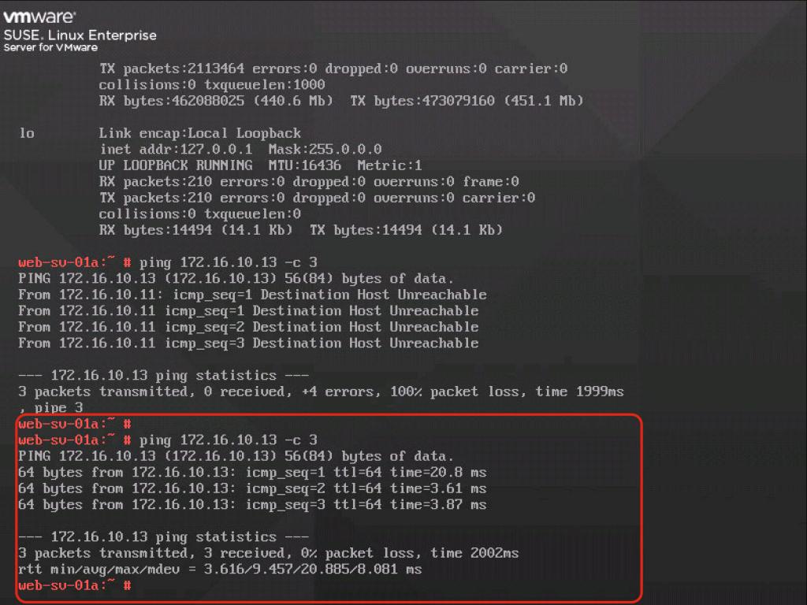](http://www.sneaku.com/wp-content/uploads/2015/07/L2VPN-38.png)

[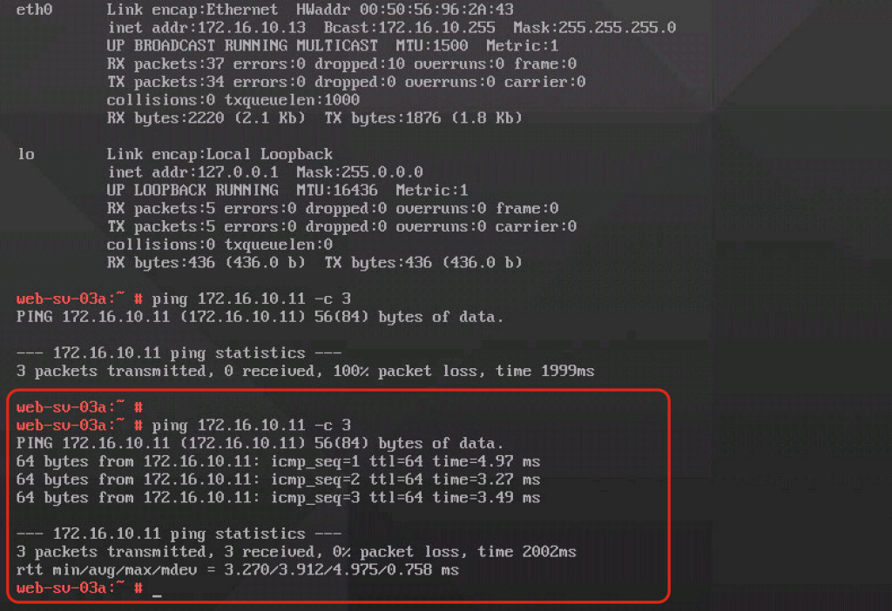](http://www.sneaku.com/wp-content/uploads/2015/07/L2VPN-39.png)

 

* * *

## L2VPN CLI Commands

Below are some of the L2VPN CLI commands which are available on the Edge devices:

```
show configuration l2vpn
```

```
nsx-l2vpn-edge> show configuration l2vpn
-----------------------------------------------------------------------
vShield Edge L2 VPN Config:
{
   "l2vpn" : {
      "ciphers" : [
         "AES256-SHA"
      ],
      "listenerPort" : null,
      "clientVnicIndex" : null,
      "filters" : [
         ""
      ],
      "serverPort" : "443",
      "caCertificate" : null,
      "encryptionAlgorithm" : null,
      "listenerIp" : null,
      "clientProxySetting" : null,
      "peerSites" : null,
      "enable" : "true",
      "l2vpnUsers" : [
         {
            "password" : "****",
            "userId" : "L2VPN-remote-site-x"
         }
      ],
      "serverVnicIndex" : null,
      "trunkedVnicIndexes" : null,
      "serverAddress" : "192.168.120.120",
      "logging" : null,
      "vseVnicNames" : [
         "vNic_4105"
      ],
      "serverCertificate" : null
   }
}
nsx-l2vpn-edge>

```

```
show service l2vpn
```

```
L2VPN-Server-0> show service l2vpn
L2 VPN is running.
----------------------------------------
L2 VPN type            : Server
Tunnel Information     :
1                    L2VPN-remote-site-x       na1                  1435739604           AES256-SHA
L2VPN-Server-0>

```

The following command shows some more detailed information about the L2VPN bridge.

```
show service l2vpn bridge
```

```
L2VPN-Server-0> show service l2vpn bridge

bridge name     bridge id               STP enabled     interfaces
br-sub          8000.0050568e2c5f       no              vNic_1
                                                        na1

List of learned MAC addresses for L2 VPN bridge br-sub
-------------------------------------------------------------------
port no mac addr                is local?       vlanid          ageing timer
  1     00:50:56:8e:2c:5f       yes             0                  0.00
  1     00:50:56:a6:7a:a2       no              45                 2.99
  2     62:b8:90:34:e6:4a       yes             0                  0.00

L2VPN-Server-0>
```

- is local = The listed MAC address is associated to an interface which is local Edge device. In the example below mac address 00:50:56:8e:2c:5f is the mac address of interface vNic\_1
- vlanid = Shows the vlanid or tunnel Id the mac address is associated to.

The following command will show the TunnelId to VLAN/VNI conversion table

```
show service l2vpn conversion-table
```

```
L2VPN-Server-0> show service l2vpn conversion-table
TunnelId  VLAN/VNI  Type
-------------------------------
45        5001      VXLAN
L2VPN-Server-0>

```

> If you happened to make your Tunnel Id the same number as your VLAN Id, it will not show up when running this command.

The following command will show the trunk table which displays all interfaces and whether the interface is a trunk interface or not.

```
show service l2vpn trunk-table
```

```
L2VPN-Server-0> show service l2vpn trunk-table
ifindex iface   trunk flag
=================================
01      lo      0
02      VDR     0
03      vNic_0  0
04      vNic_4  0
05      vNic_8  0
06      vNic_1  1
07      vNic_5  0
08      vNic_9  0
09      vNic_2  0
10      vNic_6  0
11      vNic_3  0
12      vNic_7  0
13      br-sub  0
14      vNic_10 0
15      na0     0
L2VPN-Server-0>

```
