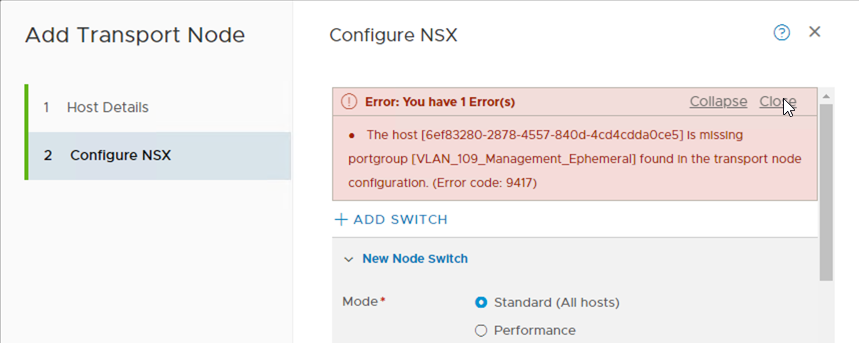
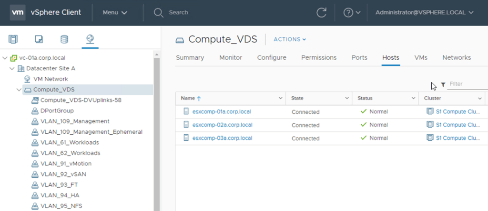
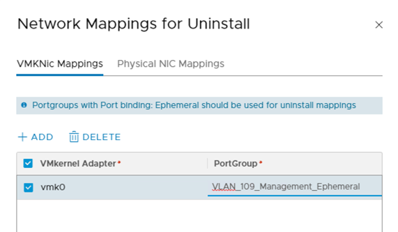
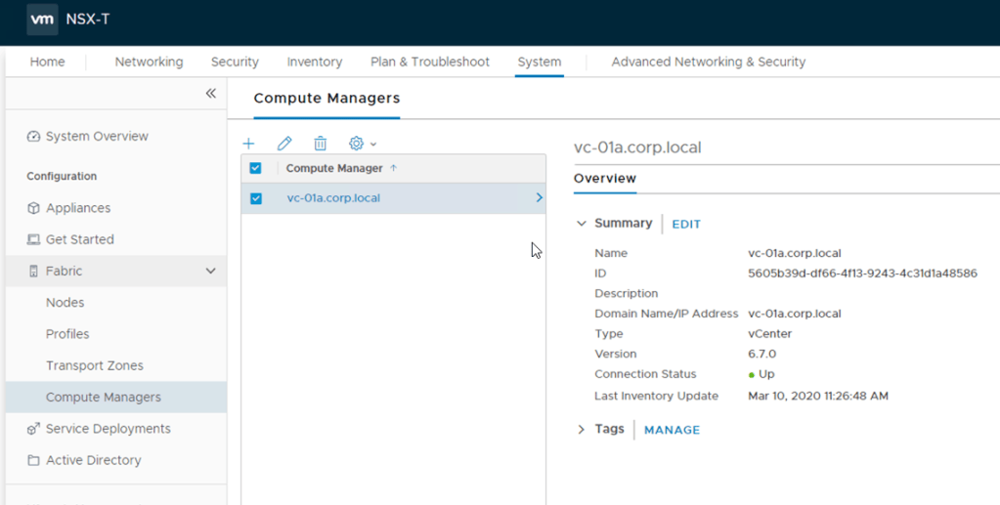
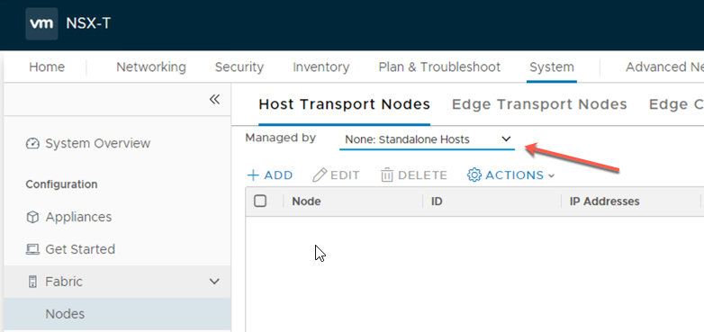
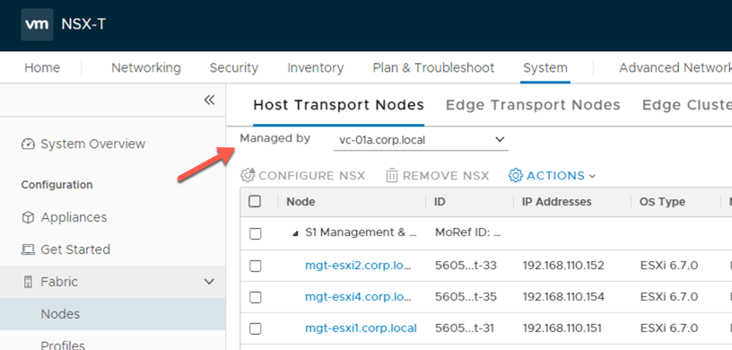

This is one of those pesky errors that I keep stumbling across, and every time It pops up, I forget how to fix it, so I am going to document it once and for all so that I can at easily find the fix for it.

When adding a ESXi transport node into NSX-T and wanting to configure the vmk uninstall mappings (to handle removing the NSX-T VIBs and migrating the VMKernel interfaces back to a VSS/VDS), the following error sometimes appears.



If your trying this operation via the API, this is what the error will look like

```
{
  "httpStatus": "BAD_REQUEST",
  "error_code": 9417,
  "module_name": "NsxSwitching service",
  "error_message": "The host [05610188-d013-40b3-8176-4c4a915ca5b0] is missing portgroup [VLAN_109_Management_Ephemeral] found in the transport node configuration."
}
```

Taking a look in vCenter confirms that it does exist...



So why does NSX-T complain that it doesn't exist?

When configuring the Uninstall Mapping, the portgroup is entered into a free text field as shown below



Now when clicking Finish on the **Add Transport Node** wizard, NSX-T will check to see if the port group exists.

If the port group entered is a VSS port group, everything will be OK as NSX-T will check the port group exists on the host directly by using the credentials supplied in the **Add Transport Node** wizard for connecting to the host.

If the port group entered is a VDS port group (like this example), rather than checking the host directly, NSX-T will need to check vCenter if the port group exists, as a VDS port group is a vCenter managed construct.

To facilitate checking vCenter, NSX-T needs to have the vCenter added as a Compute Manager, and this is the step that is often missed.



But even with vCenter added a compute manager, the error was still appearing.

As it turns out, if you are manually adding a ESXi Transport Node (_Managed By: None: Standalone Hosts_), it does not appear to use the compute manager to check the port groups available on the host.



If you need to specify a VDS Portgroup, when configuring the transport node, make sure a compute manager is configured, AND it's being configured from via a **Transport Node Profile**, or being added from the _Managed By: Compute-Manager-Name_ section.



As for the ultimate question about whether this is working as intended, that's a question that I don't have an answer to at the moment, but I will be looking into it, as I seem to trip over this one a lot.
