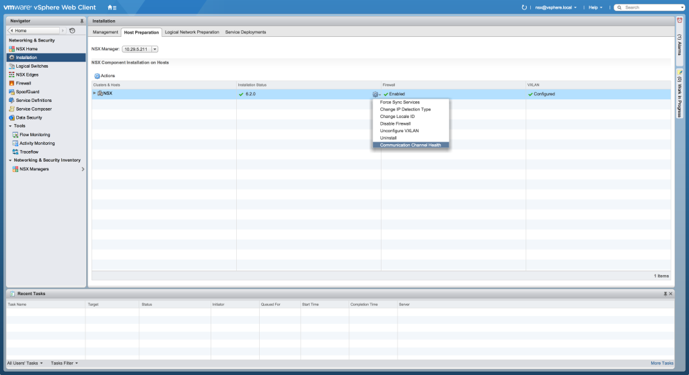
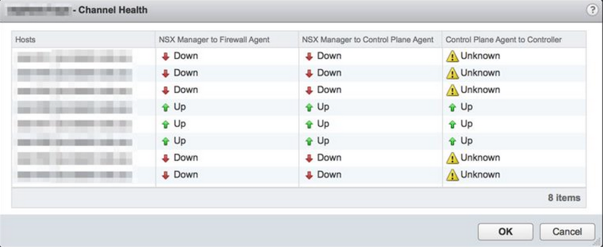

NSX-v 6.2 was released last week ([Release Notes](https://www.vmware.com/support/nsx/doc/releasenotes_nsx_vsphere_620.html)) and one of the features mentioned in the release notes is the Communication Channel Health feature.

> **Show health of the communication channels**: NSX 6.2.0 adds the ability to monitor communication channel health. The channel health status between NSX Manager and the firewall agent, between NSX Manager and the control plane agent, and between host and the NSX Controller can be seen from the NSX Manager UI. In addition, this feature detects when configuration messages from the NSX Manager have been lost before being applied to a host, and it instructs the host to reload its NSX configuration when such message failures occur.

Although, from the text in the release notes, it is not exactly clear on how to access the feature. So if you want to see if the communications channels are all happy, navigate to the Networking & Security section in the vSphere Web Client, select Installation down the left hand side, and then highlight the Host Preparation tab.

Highlight the cluster you want to check, and in the Installation Status, Firewall or VXLAN columns, if you hover your mouse, a small gear icon will appear. You can

