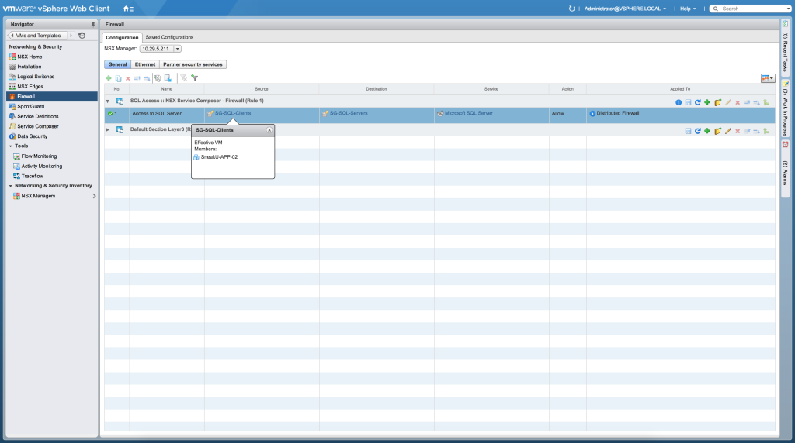
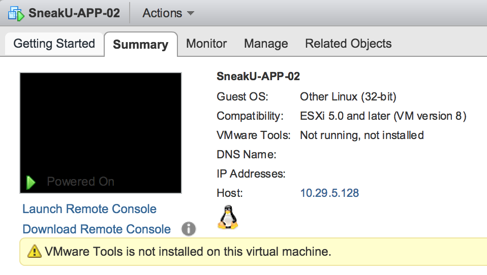
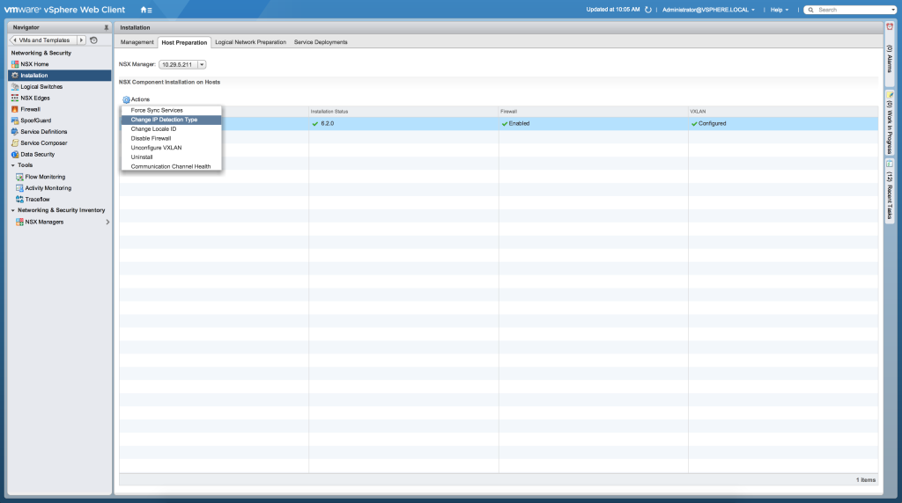
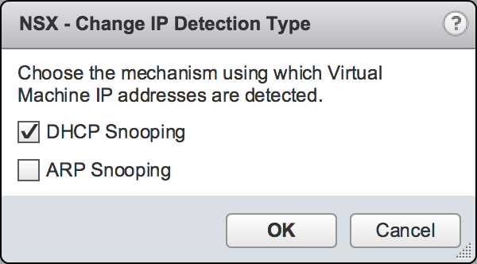
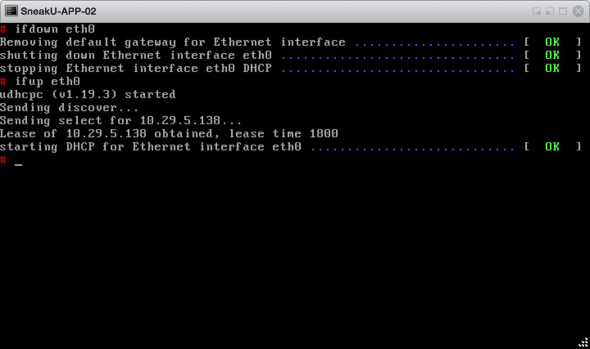
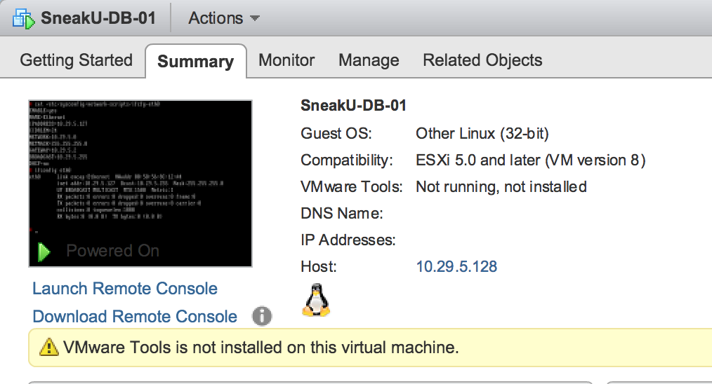
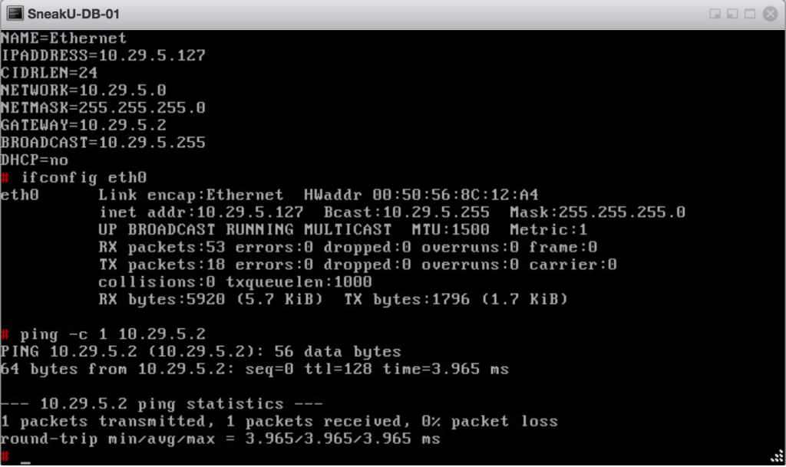
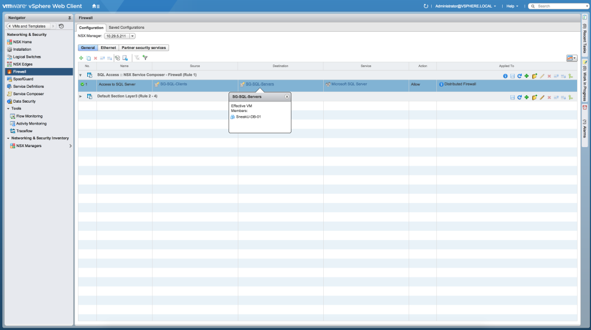
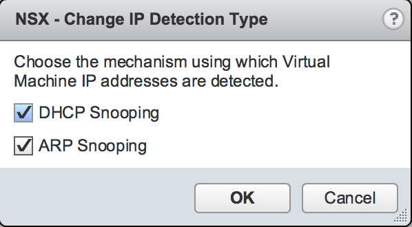
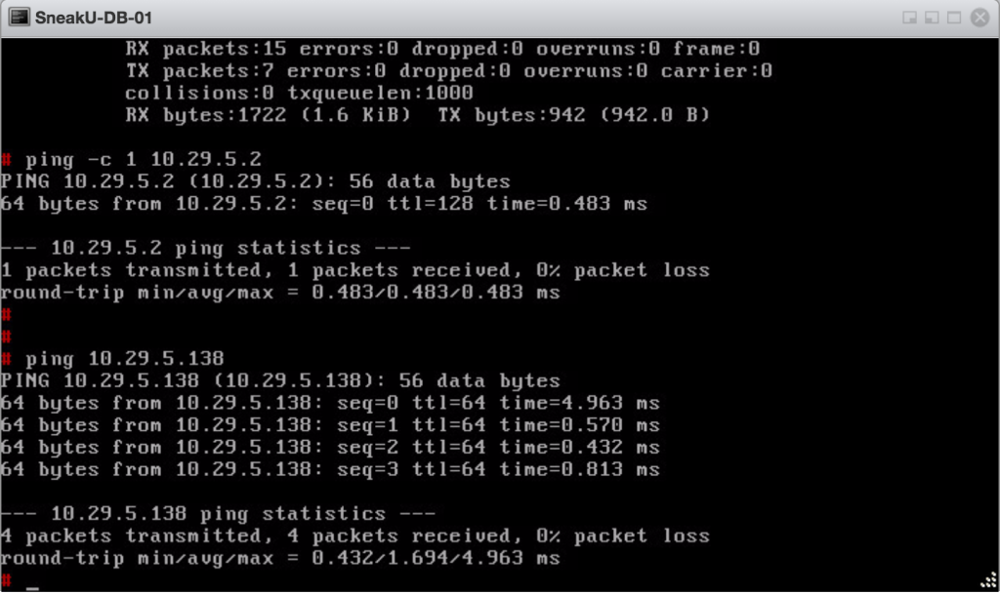

One of the new features in NSX vSphere 6.2 is the introduction of new IP discovery mechanisms. The official release notes mentions this as follows:

> **New IP address discovery mechanisms for VMs:** Authoritative enforcement of security policies based on VM names or other vCenter-based attributes requires that NSX know the IP address of the VM. In NSX 6.1 and earlier, IP address discovery for each VM relied on the presence of VMware Tools (vmtools) on that VM or the manual authorization of the IP address for that VM. NSX 6.2 introduces the option to discover the VM's IP address using DHCP snooping or ARP snooping. These new discovery mechanisms enable NSX to enforce IP address-based security rules on VMs that do not have VMware Tools installed.

For the DFW to correctly enforce a DFW rule on a VM, in versions prior to NSX-v 6.2 VMware Tools was required to provide this mapping of IP address to vCenter object. There was a work-around available, which was to enable SpoofGuard, but now you don't have to rely on SpoofGuard to provide the IP to vCenter object mapping.

With a default install of NSX-v 6.2, DFW behaves the same as previous versions (ie. VMs require VMware Tools to provide the IP address to vCenter object mapping) as shown below.

I have configured a DFW rule via a Service Composer Security Policy in the screenshot below, and you can see that the source group contains a VM.

[](http://www.sneaku.com/wp-content/uploads/2015/08/IP-discovery-011.png)

And you can see that VMware Tools is not installed on the machine, so vCenter is unable to determine the IP address of the VM.

[](http://www.sneaku.com/wp-content/uploads/2015/08/IP-discovery-02.png)

So from a DFW perspective, even though the VM is a member of a security group used in a DFW rule, it cannot determine its IP address to use in the actual DFW rule. You can see this from the following central CLI command output:

```
nsxmgr01> show dfw host host-10 filter nic-689859-eth0-vmware-sfw.2 addrsets 
addrset ip-securitygroup-23 {
}
}
addrset ip-securitygroup-24 {
}
}

```

> The output below shows all the central cli commands used to get to the output above.

```
nsxmgr01> show cluster all
No.  Cluster Name   Cluster Id               Datacenter Name   Firewall Status          
1    NSX            domain-c7                SneakU 6.2 VDC    Enabled                  

nsxmgr01> show cluster domain-c7
Datacenter: SneakU 6.2 VDC           
Cluster: NSX                      
No.  Host Name     Host Id                  Installation Status                               
1    10.29.5.128   host-10                  Ready                                             

No.  VM Name                                               VM Id     Power Status
1    SneakU-DB-01                                          vm-75     on   
2    NSX_Controller_32ad36b1-acc4-4ea3-886c-efb9f25ae000   vm-16     on   
3    SneakU-APP-02                                         vm-73     on   
4    ComputeFW-0                                           vm-21     on   
 
nsxmgr01> show vm vm-73
Datacenter: SneakU 6.2 VDC           
Cluster: NSX                      
Host: 10.29.5.128              
VM: SneakU-APP-02                                                              
Virtual Nics List:
1.
Vnic Name      SneakU-APP-02 - Network adapter 1                           
Vnic Id        500ca15b-63d5-0d6c-fd03-30b5920072f5.000                    
Filters        nic-689859-eth0-vmware-sfw.2              

nsxmgr01> show dfw host host-10 filter nic-689859-eth0-vmware-sfw.2 rules
ruleset domain-c7 {
  # Filter rules
  rule 1489 at 1 inout protocol tcp from addrset ip-securitygroup-23 to addrset ip-securitygroup-24 port 1433 accept with log;
  rule 1003 at 2 inout protocol ipv6-icmp icmptype 136 from any to any accept;
  rule 1003 at 3 inout protocol ipv6-icmp icmptype 135 from any to any accept;
  rule 1002 at 4 inout protocol udp from any to any port 67 accept;
  rule 1002 at 5 inout protocol udp from any to any port 68 accept;
  rule 1001 at 6 inout protocol any from any to any accept with log;
}

ruleset domain-c7_L2 {
  # Filter rules
  rule 1004 at 1 inout ethertype any from any to any accept;
}

nsxmgr01> show dfw host host-10 filter nic-689859-eth0-vmware-sfw.2 addrsets 
addrset ip-securitygroup-23 {
}
}
addrset ip-securitygroup-24 {
}
}

```

You can see that although the VM is a member of the security group which gets translated to DFW addrset ip-securitygroup-23 on the host, that there are no IP addresses listed, which means the IP address of the VM will never match the rule.

To turn on the IP Discovery Mechanisms, perform the following on a per cluster basis.

In the vSphere Web client, navigate to **Networking & Security > Installation > Host Preparation**.

Click the cluster you want to change, then click **Actions > Change IP Detection Type**.

[](http://www.sneaku.com/wp-content/uploads/2015/08/IP-discovery-03.png)

Select the desired detection types and click **OK**.

[](http://www.sneaku.com/wp-content/uploads/2015/08/IP-discovery-04.png)

For the first example, I am just going to enable **DHCP snooping**.

Now lets see what happens. Keep in mind that even though my machine we will be looking at uses DHCP to get its IP address, it was already powered on and had already received its IP address by DHCP.

```
nsxmgr01> show dfw host host-10 filter nic-689859-eth0-vmware-sfw.2 addrsets 
addrset ip-securitygroup-23 {
}
}
addrset ip-securitygroup-24 {
}
}

```

Still no IP address, which is as expected. However if I were to reboot the current machine or trigger the DHCP client to request a new address, DHCP snooping will kick in and the address will be linked to the vCenter object, which will then propagate to the DFW addrset on the host.

On my test machine, I have shutdown eth0 and then enabled it, which forced the DHCP client to run again.

[](http://www.sneaku.com/wp-content/uploads/2015/08/IP-discovery-05.png)

And now we can see that the IP address of the VM has been added to the DFW addrset ip-securitygroup-23 even though VMware Tools is not running on the machine.

```
nsxmgr01> show dfw host host-10 filter nic-689859-eth0-vmware-sfw.2 addrsets 
addrset ip-securitygroup-23 {
ip 10.29.5.138,
}
addrset ip-securitygroup-24 {
}
}

```

But what if the machines have static IP addresses I hear you ask?

Well, here is a machine I created earlier with a static IP address, and like the other one, VMware Tools is not installed. It is a member of the SG-SQL-Servers security group which means it should be listed in the DFW addrset ip-securitygroup-24, but it isn't.

[](http://www.sneaku.com/wp-content/uploads/2015/08/IP-discovery-09.png)

[](http://www.sneaku.com/wp-content/uploads/2015/08/IP-discovery-10.png)

[](http://www.sneaku.com/wp-content/uploads/2015/08/IP-discovery-111.png)

And as expected we can see that its IP address is not listed in the DFW addrset on the host.

```
nsxmgr01> show dfw host host-10 filter nic-689859-eth0-vmware-sfw.2 addrsets 
addrset ip-securitygroup-23 {
ip 10.29.5.138,
}
addrset ip-securitygroup-24 {
}
}

```

Now if we enable **ARP Snooping** as an IP discovery mechanism

[](http://www.sneaku.com/wp-content/uploads/2015/08/IP-discovery-12.png)

And check the DFW addrset again

```
nsxmgr01> show dfw host host-10 filter nic-689859-eth0-vmware-sfw.2 addrsets 
addrset ip-securitygroup-23 {
ip 10.29.5.138,
}
addrset ip-securitygroup-24 {
}
}
```

Hang on, it still hasn't resolved the address of the VM? That is because in my lab environment there is no other communication going on, hence no ARP packets being generated. A quick ping will fix that, but in a normal environment, generally servers like to be really chatty so they will often be trying to communicate to other servers, which will generate some ARP traffic that can be snooped.

[](http://www.sneaku.com/wp-content/uploads/2015/08/IP-discovery-13.png)Checking the DFW addrset on the host shows that ip-securitygroup-24 now has the correct IP address.

```
nsxmgr01> show dfw host host-10 filter nic-689859-eth0-vmware-sfw.2 addrsets 
addrset ip-securitygroup-23 {
ip 10.29.5.138,
}
addrset ip-securitygroup-24 {
ip 10.29.5.127,
}

```

The DFW rule will now actually permit or deny traffic as required for these machines without VMware Tools installed.

The recommendation is to still install VMware Tools where possible, but for cases where you cannot install them, it is not the end of the world and you don't have to reply on SpoofGuard anymore.

## UPDATE 07/09/2015:

Digging into it a bit further, it is possible to use the NSX manager central CLI to display some more information about discovered IPs. Below are some examples of IPs discovered by both ARP snooping and DHCP Snooping.

To view IP discovered for a particular VM.

```
nsxmgr01> show dfw host host-10 filter nic-1191051-eth0-vmware-sfw.2 discoveredips
Entries found for nic-1191051-eth0-vmware-sfw.2: 1
        [1] vlan = 0  mac = 00:50:56:8c:12:a4  IP = 10.29.5.127 (ARP snooping)

```

```
nsxmgr01> show dfw host host-10 filter nic-1191041-eth0-vmware-sfw.2 discoveredips 
Entries found for nic-1191041-eth0-vmware-sfw.2: 1
        [1] vlan = 0  mac = 00:50:56:8c:9b:4f  IP = 10.29.5.138 (DHCP snooping)
```

To see more statistics

```
nsxmgr01> show dfw host host-10 filter nic-1191051-eth0-vmware-sfw.2 discoveredips stats 
Features Enabled : 0000000F : (DHCP snooping) (ARP snooping) (DHCPv6 snooping) (ND snooping)
Number of Adds so far : 1
Number of Deletes so far : 0
Last updated time : 229155
Entries found for nic-1191051-eth0-vmware-sfw.2: 1
        [1] vlan = 0  mac = 00:50:56:8c:12:a4  IP = 10.29.5.127 (ARP snooping)
```

```
nsxmgr01> show dfw host host-10 filter nic-1191041-eth0-vmware-sfw.2 discoveredips stats 
Features Enabled : 0000000F : (DHCP snooping) (ARP snooping) (DHCPv6 snooping) (ND snooping)
Number of Adds so far : 1
Number of Deletes so far : 0
Last updated time : 229260
Entries found for nic-1191041-eth0-vmware-sfw.2: 1
        [1] vlan = 0  mac = 00:50:56:8c:9b:4f  IP = 10.29.5.138 (DHCP snooping)
```

If you disable either of the IP discovery detection types, it clears ALL the discovered IPs for the detection type that is disabled.

And from what I can see, when DHCP Snooping is enabled, it appears to clean up the discovered IPs when a DHCP lease expires, so it appears to track the DHCP lease expiry.
