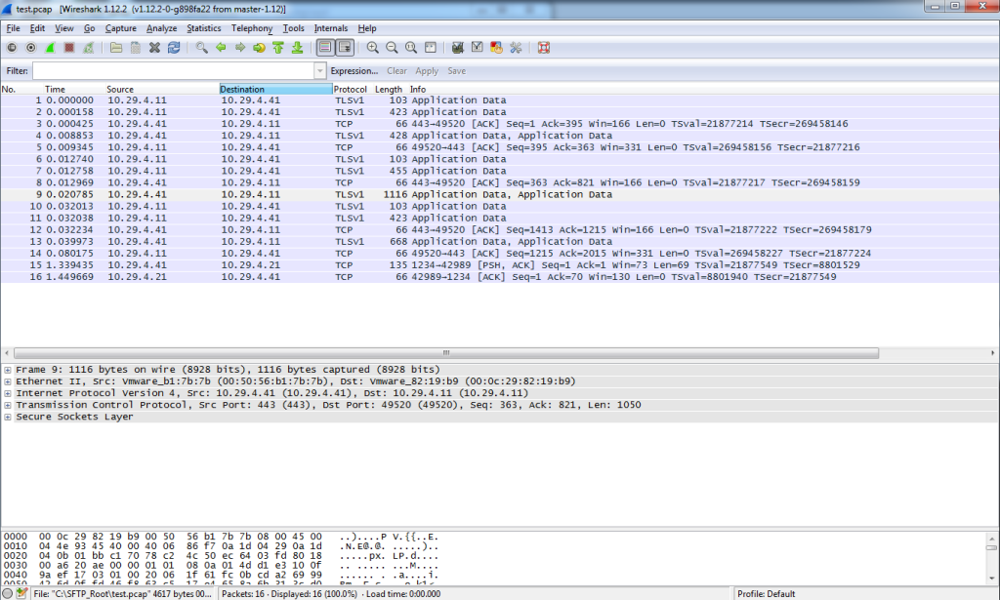

So following on from my previous post ([NSX-v: ESG Packet Capture](http://www.sneaku.com/2015/03/16/nsx-v-esg-packet-capture/)), today we run through how to do a packet capture on one of your NSX Controllers.

Why would you want to do this I hear you ask?

Well I had a situation recently where I had some unexplained behavior and I needed to make sure that a particular packet was physically arriving at the controller as it had to pass through several VRFs and a FW or two.

The version of NSX I am using is the 6.1.2 GA version.

So lets jump straight into it.

First you connect to the CLI of your NSX Controller. This can be via the console or SSH. For this example I will be connecting via SSH.

In a similar fashion to packet captures on an ESG, under the covers it is using tcpdump, but with a different command syntax that I mentioned in the ESG post, which means that there are two basic methods to choose from. Display the capture on the screen in real-time, or save it to a capture file.

The interface to capture on will always be breth0 as the controllers are deployed from a template.

```
nsx-controller # show network interface
Interface       Address/Netmask     MTU     Admin-Status  Link-Status   
breth0          10.29.4.41/24       1500    UP            UP            
eth0                                1500    UP            UP            

```

To display the capture on the screen you would use the following command which will start spewing stuff onto the screen.

```
nsx-controller # watch network interface breth0 traffic
```

```
tcpdump: listening on breth0, link-type EN10MB (Ethernet), capture size 65535 bytes
23:11:06.066017 00:50:56:9d:6a:de > 00:00:5e:00:01:28, ethertype IPv4 (0x0800), length 242: (tos 0x0, ttl 64, id 14589, offset 0, flags [DF], proto TCP (6), length 228)
    10.29.4.41.22 > 10.29.4.1.51566: Flags [P.], cksum 0xddf4 (incorrect -> 0x7217), seq 3446641445:3446641621, ack 2411960546, win 103, options [nop,nop,TS val 16335398 ecr 1039967322], length 176

```

Being tcpdump under the covers means that it also accepts tcpdump expressions.  When specifying an expression it must be surrounded by quotation marks (" ")

```
nsx-controller # watch network interface breth0 traffic "not port 22 and not ip proto 50"
```

```
tcpdump: listening on breth0, link-type EN10MB (Ethernet), capture size 65535 bytes
23:19:19.030388 00:50:56:a2:f1:3f > ff:ff:ff:ff:ff:ff, ethertype IPv4 (0x0800), length 92: (tos 0x0, ttl 128, id 22891, offset 0, flags [none], proto UDP (17), length 78)
    10.29.4.100.137 > 10.29.4.255.137: NBT UDP PACKET(137): QUERY; REQUEST; BROADCAST
23:19:19.488037 00:50:56:a2:15:09 > 00:50:56:9d:6a:de, ethertype IPv4 (0x0800), length 103: (tos 0x0, ttl 64, id 28377, offset 0, flags [DF], proto TCP (6), length 89)
    10.29.4.220.59708 > 10.29.4.222.443: Flags [P.], cksum 0x4dee (correct), seq 1090521364:1090521401, ack 2648835970, win 331, options [nop,nop,TS val 1096248798 ecr 16451209], length 37

```

Instead of displaying the output to the screen, you can save the capture to a file

```
nsx-controller # save network interface breth0 traffic test.pcap "not port 22 and not ip proto 50"

```

```
Use Ctrl-C to stop writing to file 'test.pcap' ...
tcpdump: listening on breth0, link-type EN10MB (Ethernet), capture size 65535 bytes
^C
22 packets captured
Terminated by keyboard interrupt
```

To list the files

```
nsx-controller # show file
    2848 test.pcap
```

This one took me a while to figure out as its just not documented anywhere, you can copy the files off via SCP so that you can analyse them in Wireshark. Take note that the command starts with a colon and then followed by a space.

```
nsx-controller # : file copy test.pcap sneaku@10.29.4.1:/Users/sneaku/controller.pcap
sneaku@10.29.4.1's password: 
test.pcap                           100% 4633     4.5KB/s   00:00
```

[](http://www.sneaku.com/wp-content/uploads/2015/03/Wireshark-NSX-Controller-Packet-Capture.png)

After you have transferred the file somewhere for analysis, you can remove the capture file

```
nsx-controller # remove file test.pcap
```

Voila all done.

Coming up I will outline how to do a packet capture on a NSX Manager.
