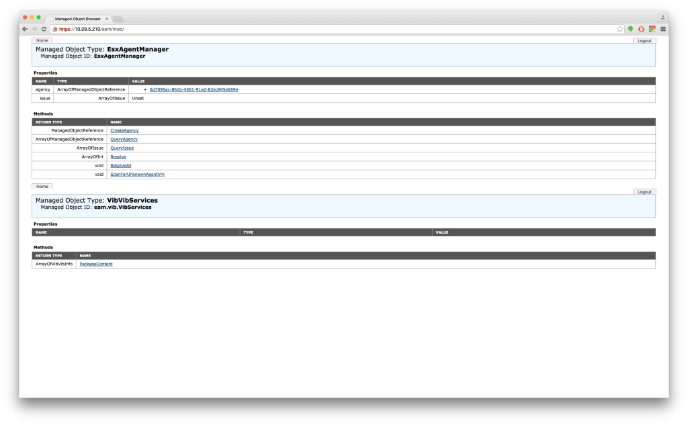
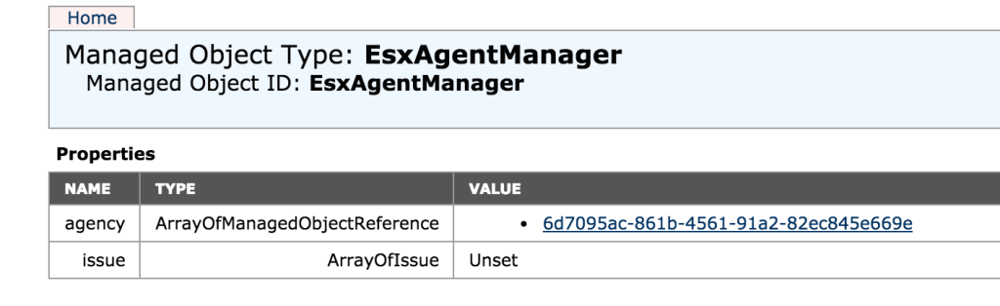
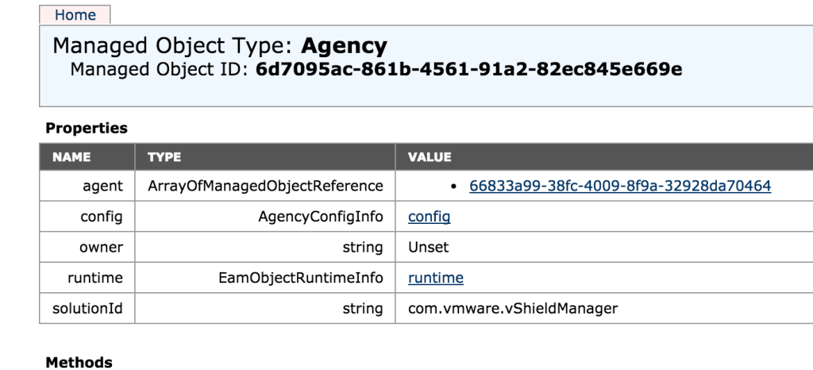
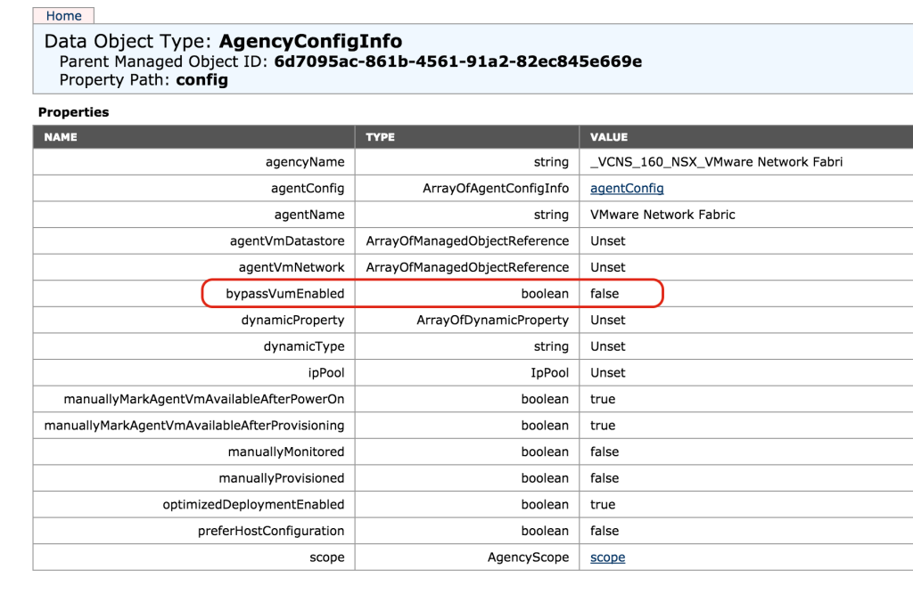
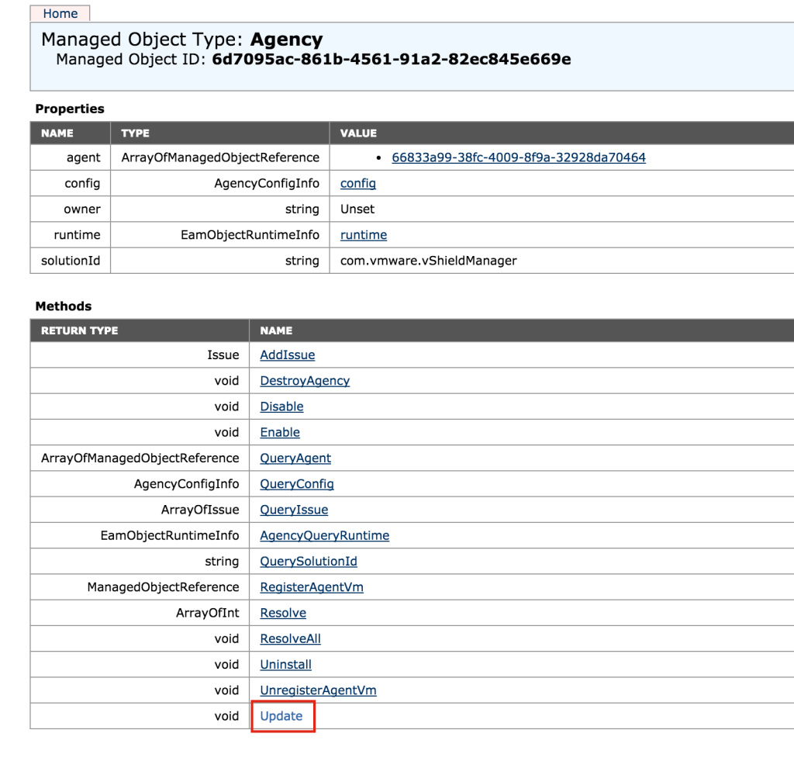
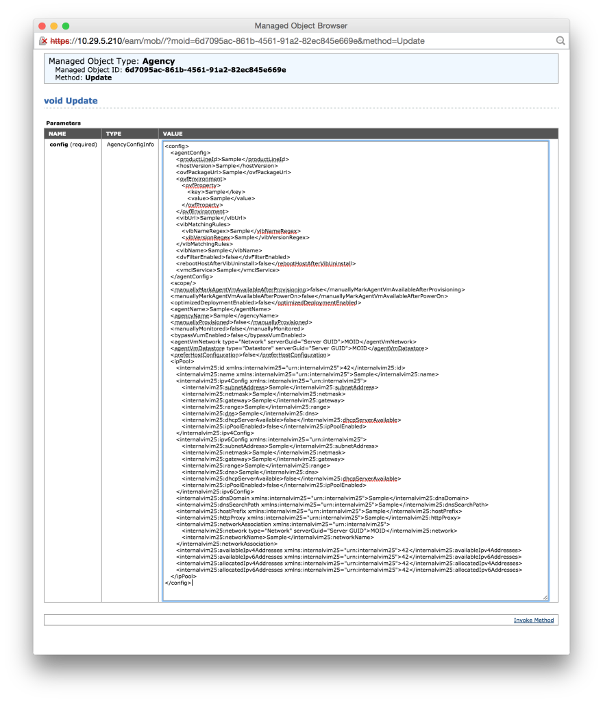
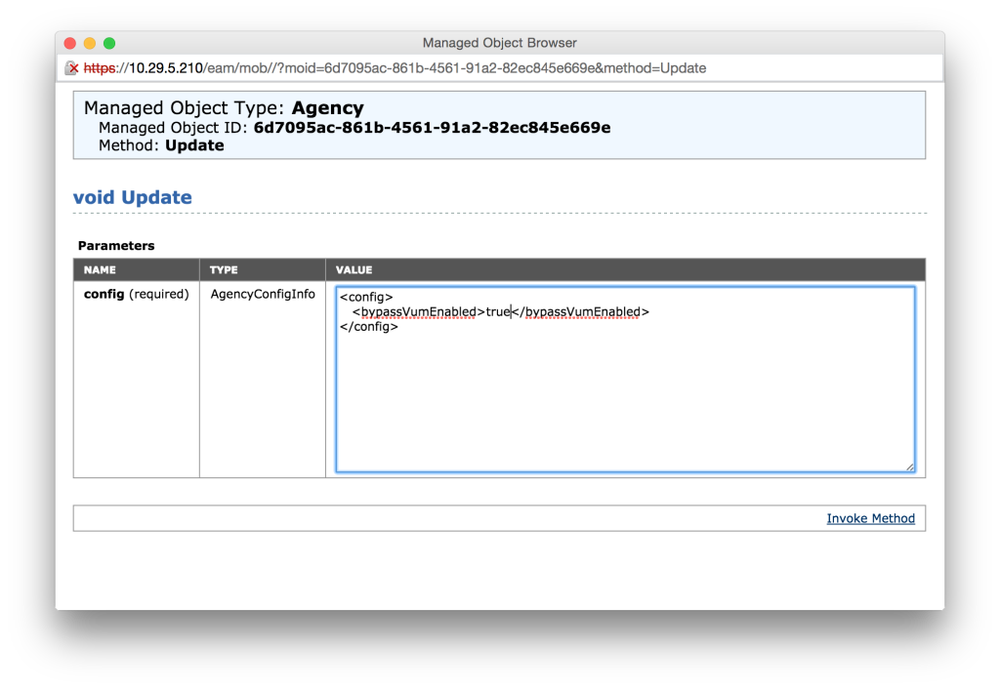
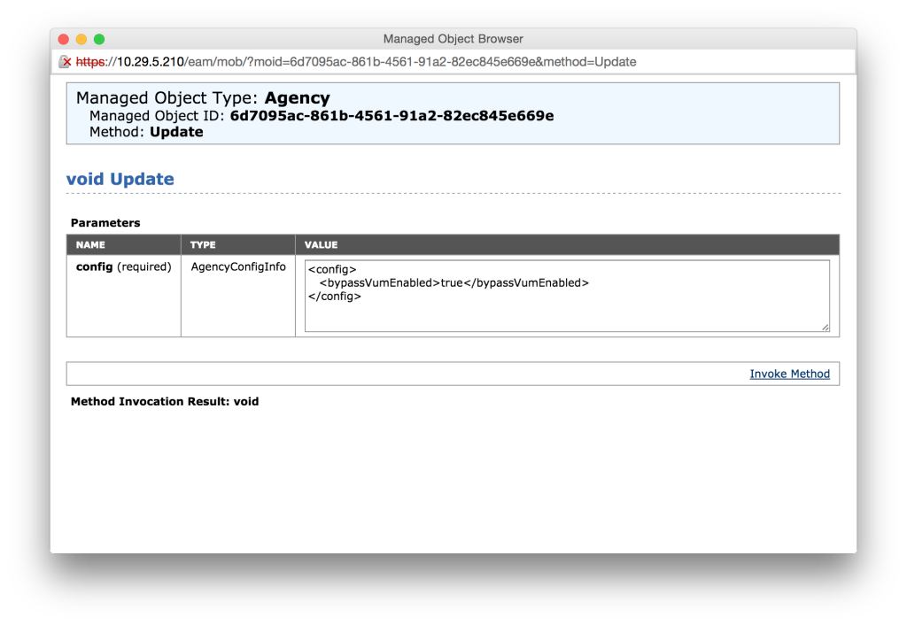
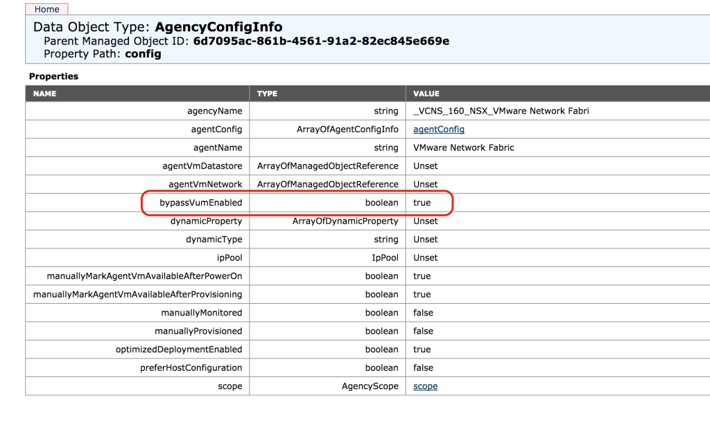

When working with a customer recently to install NSX-v into a lab environment, we were faced with hosts which would fail when we went through the Host Preparation steps to install the NSX VIBs.

As it turns out, it wasn't the usual problems of incorrect DNS or a firewall causing issues but rather vSphere Update Manager (VUM) which was causing the issue.

So from what I can deduce, it seems that when you Click the install button to prepare a cluster, EAM is used to install a VIB onto the ESXi hosts within that cluster, an agency is created within EAM for that specific cluster and within the cluster specific agency the following config option is set by default.

```
<config>
   <bypassVumEnabled>false</bypassVumEnabled>
</config>
```

This field seems to indicate that if you have VUM installed in your environment, EAM will check with VUM when installing VIBs. In the case of this particular customer, the VUM server was offline due to other issues and the installation of the VIBs was failing the VUM check.

VMware has released a KB article ([http://kb.vmware.com/kb/2053782](http://kb.vmware.com/kb/2053782)) which runs through how to fix the issue, however it is not abundantly clear on all the steps. We found this out the hard way!

To resolve the issue, these were the steps we followed.

Open a browser to the EAM specific MOB at the following URL

https://vcenter\_ip\_address/eam/mob/

> Remember to put the trailing / otherwise you will get a wierd error message

When prompted, enter the appropriate admin credentials and you should end up on a screen similar to the following:

[](http://www.sneaku.com/wp-content/uploads/2015/08/eam-01.png)

 

Now in this particular lab environment I only have a single cluster defined. You can see the agency created for the cluster:

[](http://www.sneaku.com/wp-content/uploads/2015/08/eam-02.png)

Click on the agency value which should bring you to the following screen:

[](http://www.sneaku.com/wp-content/uploads/2015/08/eam-03.png)

 

To view the current configuration of the agency, click the **config** link. The current configuration will be displayed on the screen:

[](http://www.sneaku.com/wp-content/uploads/2015/08/eam-04.png)

The value for **bypassVumEnabled** is set to false (Default). Now go back to the previous screen, and click on the **Update** link.[](http://www.sneaku.com/wp-content/uploads/2015/08/eam-05.png)A windows similar to the following will pop up. It will be significantly smaller that what I am showing here, however you can resize both the browser window & the text field.

[](http://www.sneaku.com/wp-content/uploads/2015/08/eam-06.png)

 

Now this is where thing became a bit ambiguous. As this method is a update method, you only need to supply the details which you want to update. We made the mistake of editing the config in the picture above however it never worked.

So what you need to do is to delete everything in the VALUE text box, and replace it with the following:

```
<config>
   <bypassVumEnabled>true</bypassVumEnabled>
</config>
```

 

[](http://www.sneaku.com/wp-content/uploads/2015/08/eam-07.png)

Then click on **Invoke Method** to update the agency configuration.

If all goes well, the message **Method Invocation Result: void** is displayed which means it has worked (this stumped me too as initially I had thought it failed).

[](http://www.sneaku.com/wp-content/uploads/2015/08/eam-08.png)

And now the agency config now shows the bypassVumEnabled value to be true.

[](http://www.sneaku.com/wp-content/uploads/2015/08/eam-09.png)

Repeat the above steps for each cluster you want to run the Host Preparation on. If the agency doesn't appear in the list yet, run through the Host Preparation steps and wait for it to fail. An agency should then be created which will then allow the agency config to be changed.

And last but not least, Host Preparation should now complete and the NSX VIBs should install onto the ESXi hosts successfully.
