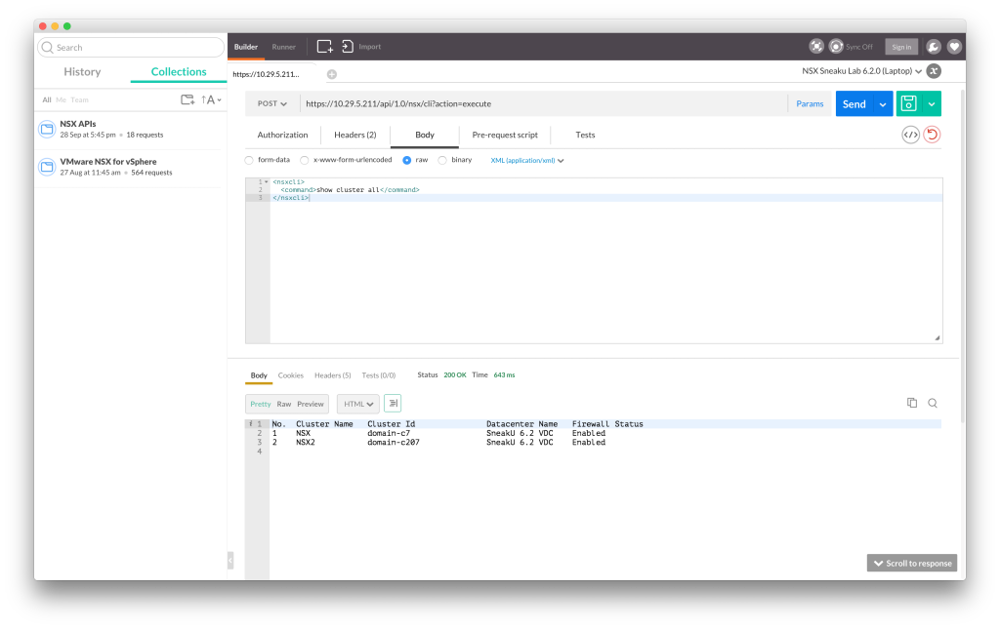
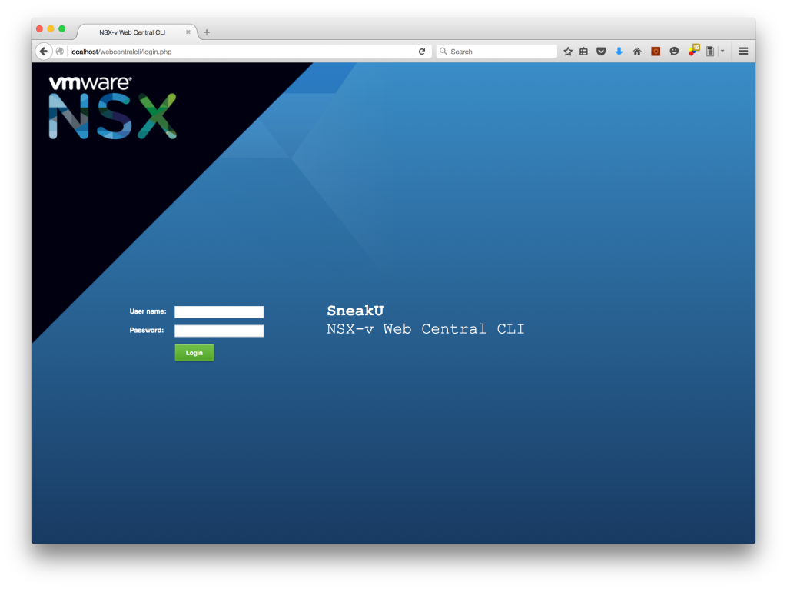
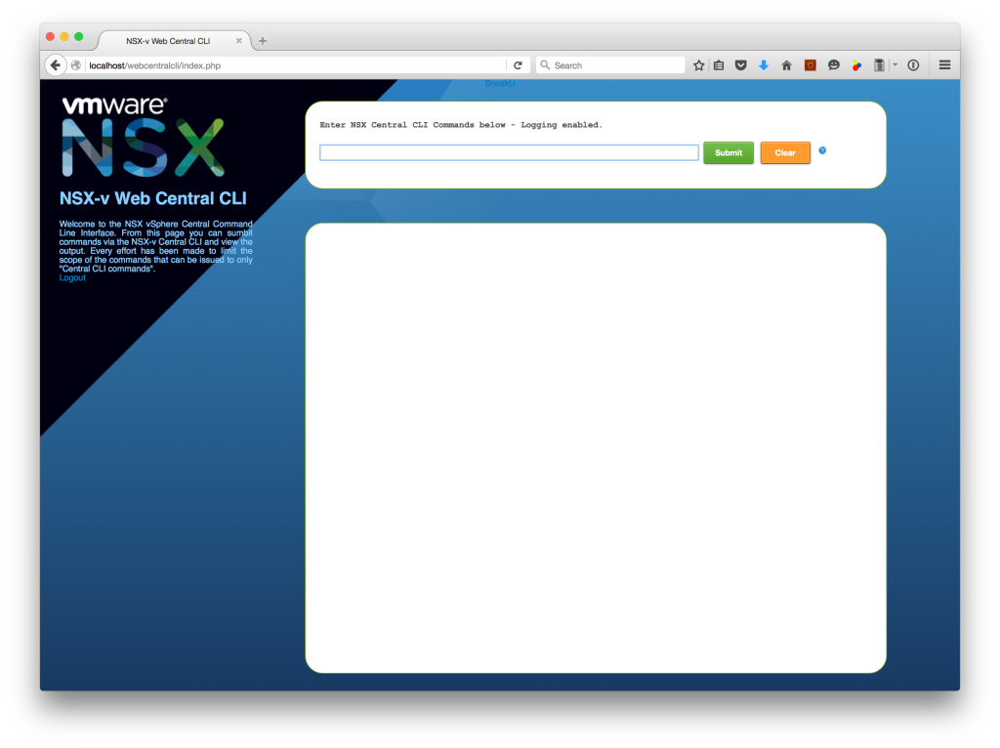
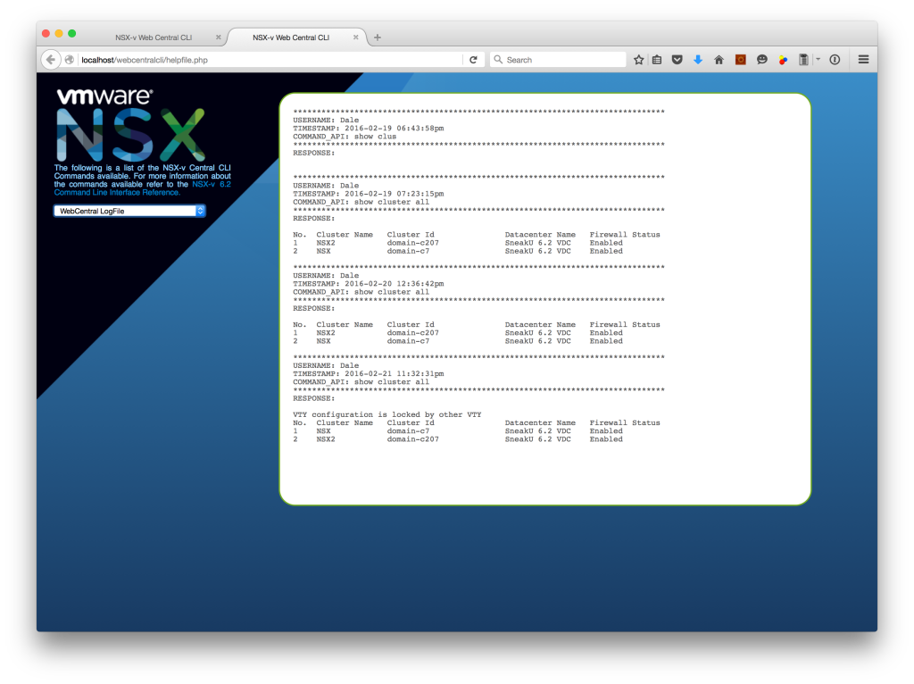

While NSX 6.2.x has been out for a while now, most people should be aware of the newly introduced feature called the Central CLI.

I won't go into the details of what the Central CLI is, as you can read about it on Brett Draytons blog ([link](http://brettdrayton.com/vmware-nsx-6-2-central-cli-introduction/)).

What I do want to point out though is that the main method for accessing the Central CLI is via a SSH connection to the NSX Manager. As you may or may not be aware, the authentication used for SSH connections to the NSX Manager is not integrated with SSO, meaning it uses local authentication.

So in a default installation, the admin account is able to SSH to the NSX Manager. As is often the case, using the admin account as a shared account, to perform operational procedures doesn't often sit very well with security teams, and in some situations, the NSX Manager (and associated vSphere infrastructure) may be owned by an outsourcer, and they may be reluctant to give up the admin account.

So there are a couple of ways to work around this.

The first is to create a local user account for each person that is required to use the Central CLI for operational or troubleshooting purposes. In a large enterprise, this may not be suitable as there is no easy way to enforce enterprise password policies etc. Not to mention that the password would not be synced to any other account.

The second is to use an API call to issue Central CLI commands. And because the NSX API is able to be authenticated using SSO, it means that you generally do not need access to the admin account.

> _Although this API call is documented in the API guide, I have found that next to no-one I encounter in my day to day role (outside of VMware of course) knows that it exists._

The details are as follows (as described in the [NSX 6.2 API Guide](http://pubs.vmware.com/NSX-62/topic/com.vmware.ICbase/PDF/nsx_62_api.pdf)):

```
POST https://NSX-Manager-IP-Address/api/1.0/nsx/cli?action=execute
```

Request Body

```
<nsxcli>
  <command>CLI Command</command>
</nsxcli>
```

So say for example you wanted to issue the command "show cluster all" to my NSX Manager 10.29.5.211, it would be put together as follows:

```
POST https://10.29.5.211/api/1.0/nsx/cli?action=execute

```

Request Body

```
<nsxcli>
  <command>show cluster all</command>
</nsxcli>

```

And if successful, you should receive a HTTP status code of 200, and returned in the body will be the unformatted text.

> _This return text is identical to the output of the command if you were to run it on the command line via SSH._

Here is a screenshot from my [Postman client](http://www.getpostman.com/) showing the output.

[](http://www.sneaku.com/wp-content/uploads/2016/02/nsxcli-api-01.png)So having the Central CLI commands and output accessible through an API means we can do some cool things with it.

I’ve come across some customers recently where for any number of reasons, the people who were required to troubleshoot issues with NSX-v, do not have access to the NSX Manager via SSH. So I put together a simple webpage which allows the Central CLI to be accessed from a webpage, I call it my **NSX-v Web Central CLI**.

NSX-v Web Central CLI is written in PHP, and utilises the PHP Curl module/libraries. Theres also a bit of AJAX thrown in for certain components, but overall its a fairly simple set of webpages.

> _I am not a web designer or programmer, so please don’t assume that the code that makes up these web pages and scripts is secure or the best way of doing things. The code I provide here is done to show what could be possible by using the NSX-v API._

Here you can see that I have given it a login page so that I can authenticate users, which I can subsequently log.

[](http://www.sneaku.com/wp-content/uploads/2016/02/nsxcli-api-02.png)

The authentication system that I have used is intended for demonstration purposes only and should not be considered secure as the user credentials are hard coded into the php code. But put you imagination caps on for a second and think about how something like this could be integrated into an existing authentication system used within your current environment!

Once logged in, we are greeted with a screen that allows us to enter our Central CLI commands in the top input box, which then can be submitted to the NSX Manager via the API.

[](http://www.sneaku.com/wp-content/uploads/2016/02/nsxcli-api-03.png)So if we use our example command from earlier, this is what it would look like.

[](http://www.sneaku.com/wp-content/uploads/2016/02/nsxcli-api-04.png)Now next to the Clear button, there is a little Question mark icon. Clicking this will open another window that will give the user the ability to see what commands are available.

[](http://www.sneaku.com/wp-content/uploads/2016/02/nsxcli-api-05.png)By Clicking on the dropdown list, the user can choose the different command areas available via the Central CLI which will then list out each command syntax (This is the part provided by AJAX).

[](http://www.sneaku.com/wp-content/uploads/2016/02/nsxcli-api-06.png)For Central CLI command areas that have lots of applicable commands, like the Edge commands, the windows is scrollable.

The last option in the dropdown list is to view the Webcentral Logfile. The log file currently logs the username, timestamp, command submitted and also the response.

[](http://www.sneaku.com/wp-content/uploads/2016/02/nsxcli-api-07.png)

As you can see, by having the Central CLI exposed through the NSX-v API, SSH access to the NSX Manager and local user accounts on the NSX Manager are not required.

I have bundled these web pages into a zip file for you to download if you want to take a look at the code.\[sdm\_download id="837" fancy="0" new\_window="1"\]

Please remember, this was more to prove a concept so no effort was put into making the code, neat, optimised or even secure, and I would strongly urge you to consult your friendly developer to have them design something specific for your purpose.

If you actually want to get it running in your environment to test, you will need do the following:

- Have a web server running PHP. I have run it on my Mac but have also used it on a RHEL server.
- Extract the contents of the zip file onto your webserver somewhere, and ensure permissions are correctly set to allow the web server to server the files.
- Modify the config.php file with your NSX Manager details and user account details which has API access.
- You must ensure that the file webcentral.log is also able to be written to by the webserver process.
- Once these are sorted, you should be able to open a web browser and point it to the relevant path on your web server and be greeted with the login page.
- The default credentials are as follows:
    - Username: Dale
    - Password: 12345
- If you wish to add/delete/modify the credentials, these are stored in an array in the login.php file. Again, this wasn’t created to actually be secure, but just to show a concept.

If you want to see another project which utilises the Central CLI API, head over to [https://networkinferno.net/powernsx](https://networkinferno.net/powernsx) and checkout the PowerNSX module written by Nick Bradford.
