Recently I have been seeing various posts about running NSX-T on NSX-T, and I thought it was about time that I finished off this post i've been sitting on for quite some time.

As part of my teams role, we have a lab environment which we use for customer re-productions, however, we also run enablement sessions internally using our own labs.

These nested NSX-T labs run on top of a NSX-T environment which is being driven by VMware Integrated Openstack (VIO).

> NOTE: All the logical constructs mentioned in this article are based on the Management Plane (MP/Advanced UI) objects. The reason for this is that this platform was built a few years ago, and as such we are not using the Policy API/Simplified UI just yet.

When we use the platform for enablement sessions, each student receives their own "pod" which provides them with the following virtual machines:

- 1 x vCenter Appliance
- 3 x ESXi Hypervisors (Compute Cluster hosts with 2 pnics)
- 4 x ESXi Hypervisors (Management/Edge Cluster hosts with 4 pnics)
- 2 x Ubuntu KVM hosts (2 nics)
- 1 x FreeNAS server (Shared storage for hypervisors)
- 1 x Windows Jump Server
- 1 x Active Directory Domain Controller (AD/DNS etc)
- 2 x Linux Jump Servers
- 3 x Cumulus VX (2 x TOR and an additional one the TOR VXs connect to which then connects to external)

As well as their own set of virtual machines, they also get provisioned with their own Tier1 router and a set of networks to consume.

Up until the recent NSX-T 2.5 release we had to work around a limitation of running nested topologies on NSX-T, which meant that to present an additional routed network to a nested VM, it was required to do this by presenting a new vNic to the VM, which was connected to a NSX-T OVERLAY logical switch, which would be connected to the pods Tier-1 router.

Obviously this had scalability limitations as a VM can only have 10 vNics, and is not realistic of how a customer would do things.

And so, for our network/vnic assignment, this is what we have been working with for the last few years.

## Compute Cluster Hosts

| vSwitch | pNic | VLAN | Description |
| --- | --- | --- | --- |
| Comp\_VDS | vmnic0 | 0 | Management |
| N-VDS | vmnic1 | 0 | NSX-T TEP/Overlay |

### Management/Edge Cluster Hosts

| vSwitch | pNic | VLAN | Description |
| --- | --- | --- | --- |
| Mgmt\_VDS1 | vmnic0 | 0 | Management |
| Mgmt\_VDS2 | vmnic1 | 0 | Edge VM TEP |
| Mgmt\_VDS3 | vmnic2 | 0 | Edge VM Uplink A |
| Mgmt\_VDS4 | vmnic3 | 0 | Edge VM Uplink B |

In NSX-T 2.5, we have been able to take advantage of an **UNSUPPORTED** feature which allows us to present VLANs to a virtual machine and have the VLAN tagged traffic mapped to a OVERLAY logical switch and connected to and routed by the pod Tier-1 router.

With this new feature, we have been able to deploy labs during our bootcamps which allows us to teach the attendees how to configure ESXi transport nodes with only 2 NICs and perform vmkernel migrations whilst also leveraging VLAN pinning, which wasn't previously able to be done in a nested environment when running NSX-T on NSX-T.

Now to setup a nested NSX-T on NSX-T environment, there are a few select pieces of configuration that you need to do otherwise you will get some strange things happening. I will try to break these down so that if you are thinking about running a NSX-T on NSX-T environment, you won't step on the same rakes in the grass that we have done over the past few years.

## OVERLAY Transport Zone: nested\_nsx

When running NSX-T on NSX-T, it's a requirement that when you configure an overlay Transport Zone, that one of either the outer/underlay NSX-T or the nested NSX-T environments has its OVERLAY Transport Zone configured with the `nested_nsx` property set to true. Which one you choose is up to you, and where you are at with your lab environment. If your building your lab environment from scratch, I suggest setting this property in the outer NSX-T environment which means that your nested NSX-T environments will not need any modifications. Or if your in the same situation that we were, where our environment was well established and we cannot change the existing OVERLAY Transport Zone, we have to make sure that every nested environment we spin up has its OVERALY Transport Zone provisioned by the API with the `nested_nsx` property set to true

```
POST https://192.168.1.1/api/v1/transport-zones
```

```
 {
         "display_name"     : "TZ_OVERLAY",
         "description"      : "Transport Zone created via API for nested workloads",
         "host_switch_name" : "NVDS-0",
         "transport_type"   : "OVERLAY",
         "nested_nsx"       : true
 }
```

This flag can only be set at Transport Zone creation time, and what it actually does is changes the Logical Interface (LIF) MAC addresses (vMAC) that are configured from `02:50:56:56:44:52` to `02:50:56:56:44:53`.

Without this setting, any packet which is meant to leave the nested hypervisor and be routed by the outer/underlay NSX-T logical router (has a destination mac of the vMAC), will never actually leave the nested hypervisor, as the destination vMAC is the same as the nested VDR LIF vMACs, and hence the packet gets sent to the nested hypervisor VDR port instead of going to the outer/underlay logical router.

> Officially running NSX-T on NSX-T is not supported, but enabling the `nested_nsx` is what you would do to get this working in your lab environments _(wink wink)_

## Nested hypervisor vmk0 mac address

When running nested NSX-T on NSX-T environments, the vnic of the nested hypervisor is going to be connected to a NSX-T OVERLAY logical switch of some, and this requires some configuration to make work correctly.

During the install of a ESXi hypervisor, generally the `vmk0` management interface is created with the same MAC address as the first vmnic on the host.

Now in your NSX-T on NSX-T environment, if your nested hypervisor only has a single vmnic, then this will not cause any issues, as `vmk0` will only ever appear on `vmnic0` with the same MAC address as the physical vmnic, but if you want to have a nested hypervisor with multiple vmnics (to simulate redundancy etc), then this will cause an issue.

What you will find is that if your `vmk0` has the same MAC address as `vmnic0` but has been pinned to the second uplink, `vmnic1`, the host will have no connectivity as the outer NSX-T will drop the packet.

To remedy this, it is a simple fix, and that is to delete the current `vmk0` interface and re-create it. When a vmkernel interface is re-created, it gets assigned a MAC address beginning with `00:50:56` and therefore will not conflict with the MAC address of `vmnic0`.

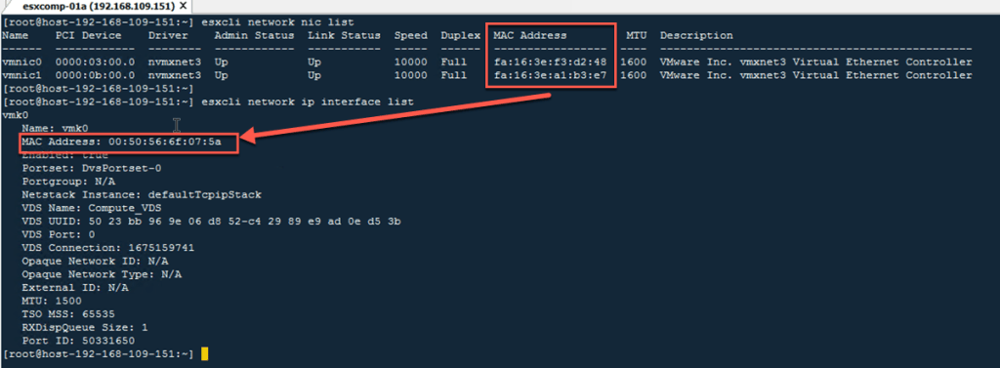

Although this seems straight forward, in isolation it doesn't fix the issue in it's entirety, some changes also need to be applied to the Logical Switches.

## Logical Switch/Segement Profiles

As we are connecting a nested hypervisor to a NSX-T logical switch, there can be any number of IP/MAC addresses which appear on the logical port, and if your hypervisor has multiple vmnics, then MAC/IP addresses will also be able to move between logical switch port.

By default NSX-T logical switches have default profiles applied to them which don't play nicely with a nested hypervisor.

To make it work, custom switch profiles are required. These are the settings we have implemented:

### IP Discovery Profile

We use a user defined IP Discovery Profile with the following changes from default:

| Feature | Default | NSX-T on NSX-T Setting |
| --- | --- | --- |
| ARP Binding Limit | 1 | `256` |

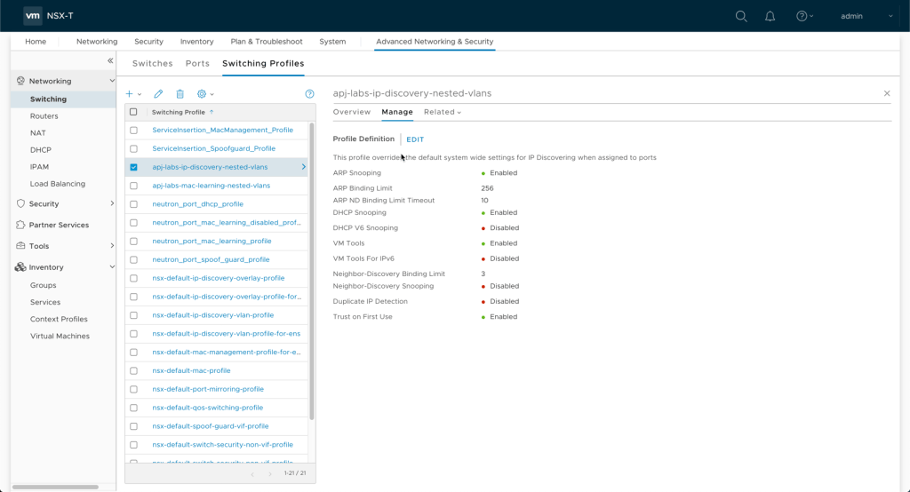

The IP Discovery Profile is then applied to every logical switch that a hypervisor will be connected to.

> NOTE: We only use IPv4 in our labs so we don't need to modify any IPv6 settings.\_

### MAC Management Profile

We use a user defined MAC Management Profile with the following changes from default:

| Feature | Default | NSX-T on NSX-T Setting |
| --- | --- | --- |
| MAC Learning | Disabled | `Enabled` |
| Unknown Unicast Flooding | None | `Enabled` |
| MAC Limit | None | `4096` |
| MAC Limit Policy | None | `Enabled` |

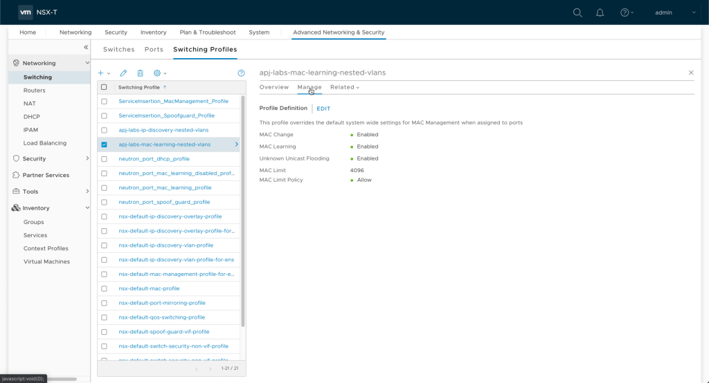

The MAC Management profile is then applied to every logical switch that a hypervisor will be connected to.

## Guest VLAN tagging

Within our lab environments there are some networks that are not connected to the "pod/core" router for the tenant. These are provided to connect VMs together via a trunk interface. Think hypervisors running edge VMs which are connected to VMs running Cumulus VX acting as TOR.

To achieve this, we create OVERLAY logical switches, and configure them with a vlan spec of `0 - 4094`. This will then allow the VMs connected to these logical switches (Hypervisors and Cumulus VX) to tag the frames with 802.1q tags and the outer NSX-T will NOT strip the tags.

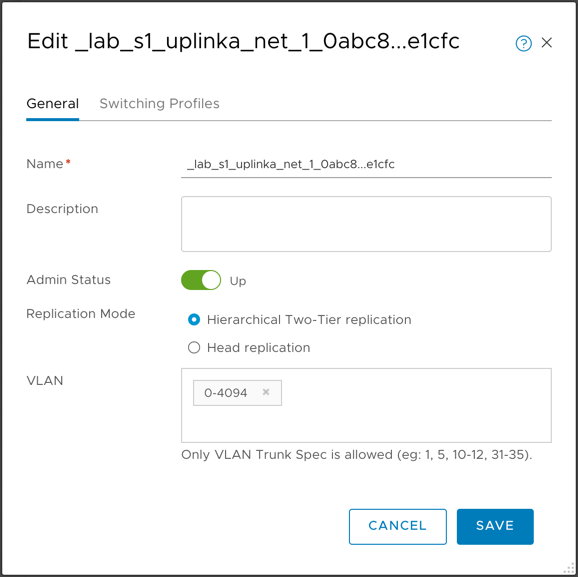

## Guest Inter-VLAN Tagging

Another piece of configuration that is very helpful when it comes to running NSX-T on NSX-T is the ability to present VLANs to a nested hypervisor.

Now some will of you will already know that this is already possible with the guest VLAN tagging feature, whereby a virtual machine (i.e. nested hypervisor) is able to send and receive frames with the 802.1q tags across a OVERLAY logical switch.

However, up until recently there has been no way to have these VLAN tagged frames routed by the outer/underlay NSX-T logical routers.

Starting in NSX-T 2.5, it is now possible to configure your outer NSX-T environments in such a way that you can map VLAN tagged traffic received on a logical port to an OVERLAY logical switch which can then be routed by a Tier1 or Tier0 Gateway/Router.

[https://docs.vmware.com/en/VMware-NSX-T-Data-Center/2.5/rn/VMware-NSX-T-Data-Center-250-Release-Notes.html](https://docs.vmware.com/en/VMware-NSX-T-Data-Center/2.5/rn/VMware-NSX-T-Data-Center-250-Release-Notes.html)

> Guest Inter-VLAN Tagging
> 
> The Enhanced Datapath N-VDS enables users to map guest VLAN Tag to a segment. This capability overcomes the limitation of 10 vNICs per VM and allows guest VLAN tagged traffic (mapped to different segments) to be routed by the NSX infrastructure.

Now as with all things which seem like a godsend for those who want to run some really cool labs, this "feature" is only supported when used in conjunction with the Enhanced Network Switch (ENS). So before you read any further and think about running this in any sort of fashion on a standard N-VDS, please remember that implementing this feature on the standard N-VDS is 100% un-supported, although it does work.

> IMPORTANT: Implementing guest VLAN routing on a N-VDS Standard Switch is absolutely 100% NOT SUPPORTED.

So now we've gotten that out of the way and you're thinking to yourself that you like living on the edge..... To configure this Guest Inter-VLAN tagging feature on a standard N-VDS, in general you can use the official instructions:

[https://docs.vmware.com/en/VMware-NSX-T-Data-Center/2.5/administration/GUID-08930EDF-C0BE-435C-A9EC-CA1303A9AA30.html](https://docs.vmware.com/en/VMware-NSX-T-Data-Center/2.5/administration/GUID-08930EDF-C0BE-435C-A9EC-CA1303A9AA30.html)

However, there are a few grey area items with the configuration/implementation, so i've got my own set of tips to be used with the official instructions.

- Create a overlay logical switch that will be connected directly to the nested hypervisors vnic. This overlay logical switch will service all the `untagged`, `VLAN 0` or `Native VLAN` packets.

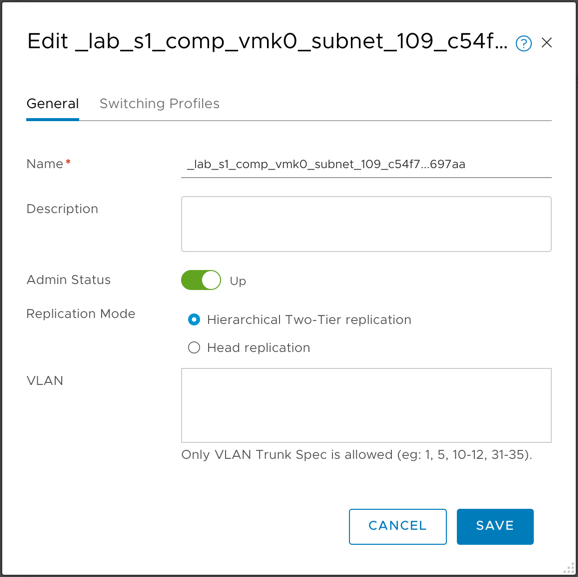

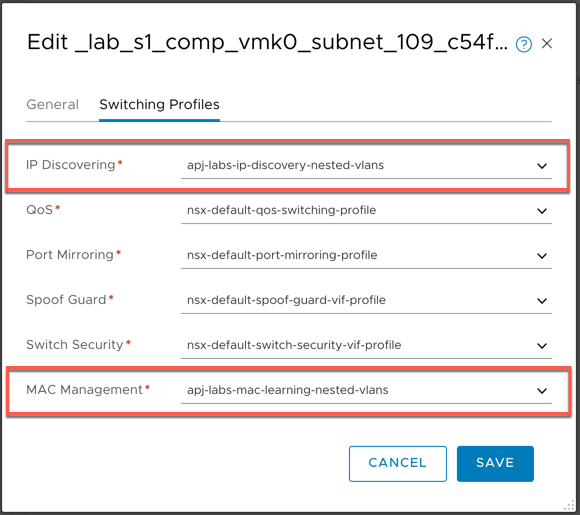

- Connect the `Native VLAN` overlay logical switch to a logical router as required.

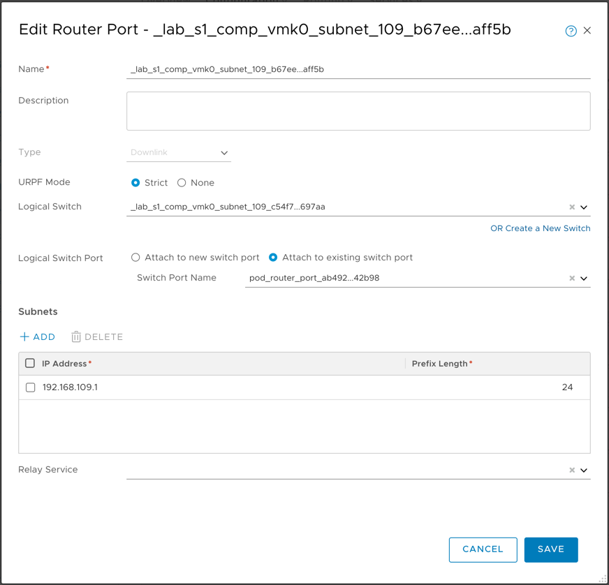

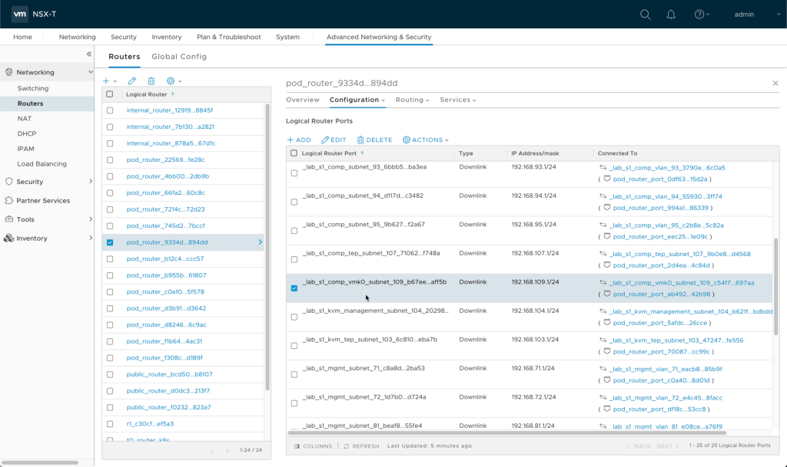

- Once the `Native VLAN` logical switch has been created, Connect the interfaces of the nested hypervisor to the `Native VLAN` logical switch created.
    - In our setup, this `Native VLAN` logical switch is where our vmk0 management interfaces live.

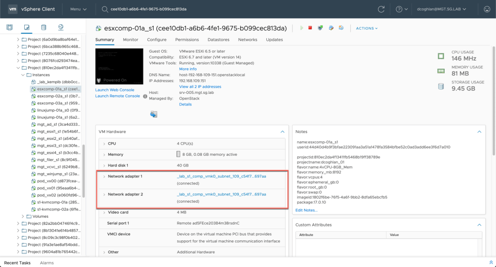

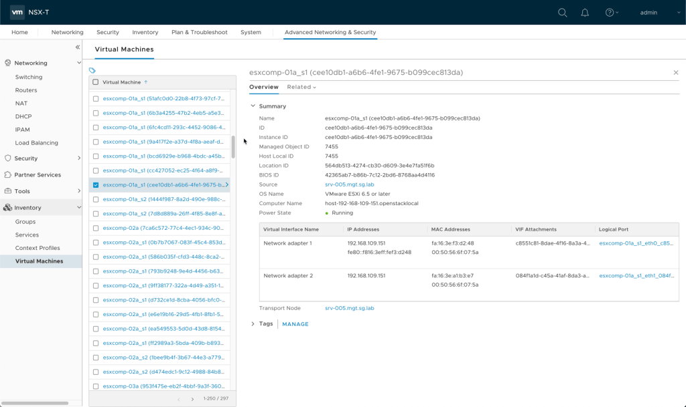

- Find the logical port that is connected to the `Native VLAN` overlay logical switch from the nested hypervisor and convert it to a `PARENT PORT` as per the official documentation.

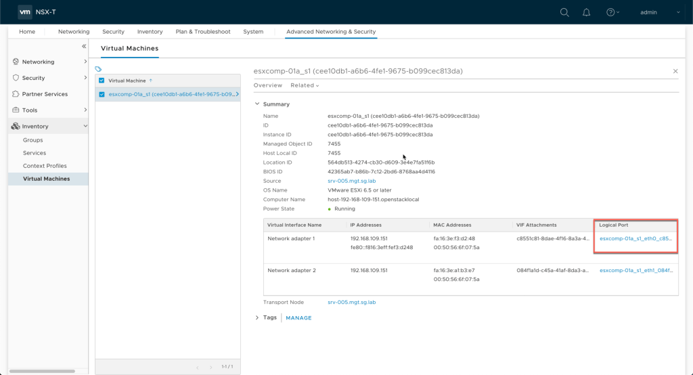

- To save you reading the doco, what you need to do is modify the logical port attachment property to add the context as follows:

```
"attachment": {
     "context": {
       "vif_type": "PARENT",
       "resource_type": "VifAttachmentContext"
     }
```

- Here is an example of the API and body in it's entirety that we use to convert an existing port to a parent port.

> NOTE: The body in this API call has tags specific to our VIO implementation

```
PUT https://192.168.1.1/api/v1/logical-ports/7abd09e6-687e-48dc-8254-0cab71b631bb
```

```
{
  "logical_switch_id": "2db7d699-a93c-4586-a355-7ec7c87aa3fd",
  "attachment": {
    "attachment_type": "VIF",
    "id": "c8551c81-8dae-4f16-8a3a-4b41b00ebe4f",
    "context": {
      "vif_type": "PARENT",
      "resource_type": "VifAttachmentContext"
    }
  },
  "admin_state": "UP",
  "address_bindings": [],
  "switching_profile_ids": [
    {
      "key": "SwitchSecuritySwitchingProfile",
      "value": "47ffda0e-035f-4900-83e4-0a2086813ede"
    },
    {
      "key": "SpoofGuardSwitchingProfile",
      "value": "fad98876-d7ff-11e4-b9d6-1681e6b88ec1"
    },
    {
      "key": "MacManagementSwitchingProfile",
      "value": "93dbcf3f-54ca-4613-b13a-3b027ec17934"
    },
    {
      "key": "IpDiscoverySwitchingProfile",
      "value": "64814784-7896-3901-9741-badeff705639"
    },
    {
      "key": "PortMirroringSwitchingProfile",
      "value": "93b4b7e8-f116-415d-a50c-3364611b5d09"
    },
    {
      "key": "QosSwitchingProfile",
      "value": "f313290b-eba8-4262-bd93-fab5026e9495"
    }
  ],
  "ignore_address_bindings": [],
  "resource_type": "LogicalPort",
  "id": "7abd09e6-687e-48dc-8254-0cab71b631bb",
  "display_name": "esxcomp-01a_s1_eth0_c8551...ebef4",
  "description": "",
  "tags": [
    {
      "scope": "os-neutron-port-id",
      "tag": "9f07c869-484a-455f-98e8-e271f5f4d74b"
    },
    {
      "scope": "os-project-id",
      "tag": "6bca388b965c468dba3e7d0aec51e6a3"
    },
    {
      "scope": "os-project-name",
      "tag": "train-lab-001"
    },
    {
      "scope": "os-api-version",
      "tag": "12.0.6.dev13714247"
    },
    {
      "scope": "os-instance-uuid",
      "tag": "7d8d889a-26ff-4f85-8e8f-a38706ab8e51"
    },
    {
      "scope": "os-security-group",
      "tag": "Exclude-Port"
    }
  ],
  "_create_user": "admin",
  "_create_time": 1566623170923,
  "_last_modified_user": "admin",
  "_last_modified_time": 1566623184890,
  "_system_owned": false,
  "_protection": "NOT_PROTECTED",
  "_revision": 1
}
```

- For each VLAN that needs to be presented to the nested hypervisor, create the following:
    
    - create a overlay logical switch and connect it to the appropriate logical router. This logical switch is what the vlan tagged traffic will be mapped to.
    - create a new child logical port to represent the vlan. This child logical port (of the parent port created earlier) will have the VLAN tag and overlay logical switch configured to provide the mapping between the two.
        - the child port is required to specify the IP/MAC bindings at creation time. Now this can potentially be a bit of a chicken and an egg scenario, as we don't know what specific IPs will be connecting on this port, as there could be multiple endpoints due to it being connected to a hypervisor. At this point, you can just put in a dummy ip and mac address. Although this dummy mac and ip address will appear in the static bindings for the port, these aren't actually used in the creation of the child port or any DFW enforcement for these ports. In our lab setup, we use a IP/MAC static binding of `127.0.0.1`/`00:00:00:00:00:00` on every child port.

> NOTE: Remember that for each parent port you want a VLAN to be present on, you will need to create a child port.

- The following is an example of the API and body required to make a child logical port

```
POST https://192.168.1.1:443/api/v1/logical-ports
```

```
{
  "logical_switch_id": "6809c7a1-47d5-4c4c-9d9a-abd0282cdb2d",
  "display_name": "esxcomp-01a_s1_eth0_c8551...ebef4/vlan123",
  "description": "",
  "admin_state": "UP",
  "address_bindings": [
    {
      "mac_address": "00:00:00:00:00:00",
      "ip_address": "127.0.0.1"
    }
  ],
  "attachment": {
    "id": "esxcomp-01a_s1_eth0_c8551...ebe4f/vlan107-a315eb4c-1630-46c3-87f1-7b87732ce31b",
    "context": {
      "allocate_addresses": "None",
      "parent_vif_id": "c8551c81-8dae-4f16-8a3a-4b41b00ebe4f",
      "traffic_tag": "107",
      "resource_type": "VifAttachmentContext",
      "vif_type": "CHILD",
      "app_id": "93213705-a60c-4af0-9bbb-2e4014277744"
    },
    "attachment_type": "VIF"
  }
}
```

- To verify the VLAN sub-interfaces are configured on the parent port, navigate to the parent port in the NSX Manager UI


- Select `Related` > `Container Ports` to see all the VLAN sub-interfaces configured for the parent port

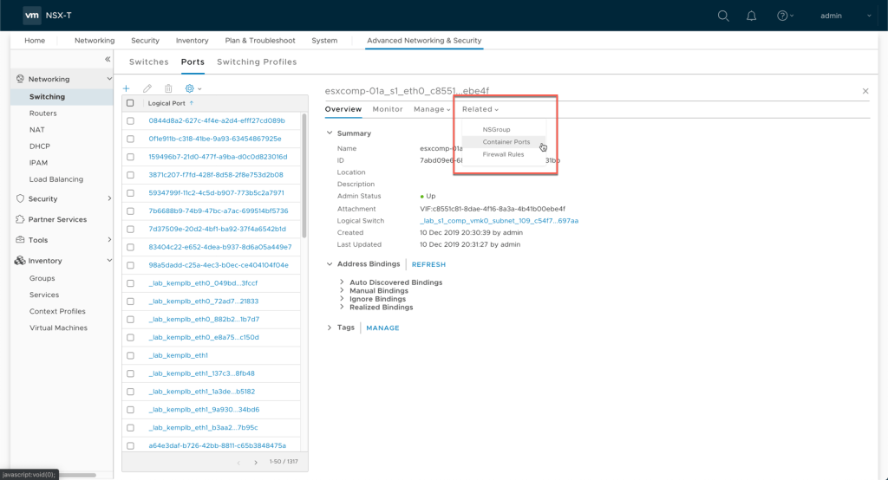

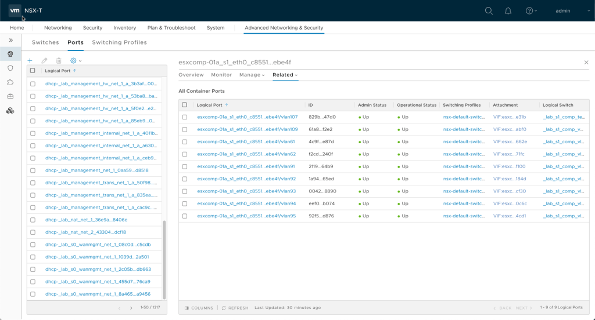

- Alternativley, use the following global search query if you know the parent port VIF ID: `logical port where attachment context vif type = CHILD and attachment context parent vif id = 'c8551c81-8dae-4f16-8a3a-4b41b00ebe4f'`

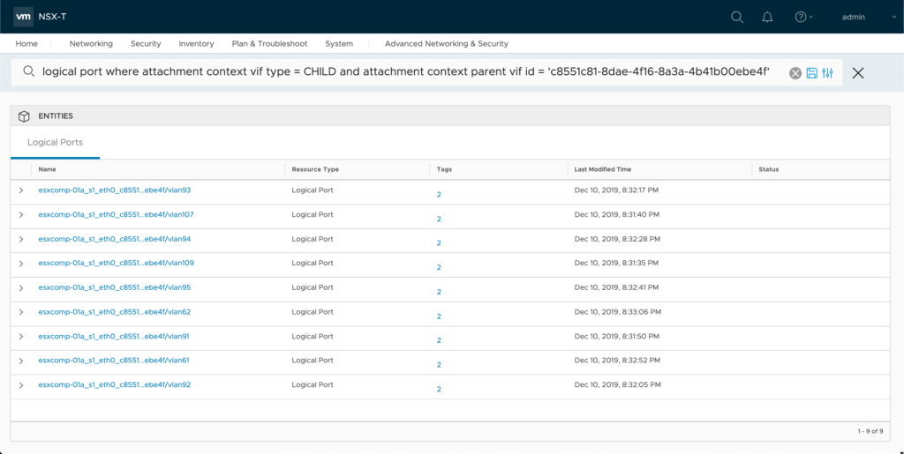

So now our VLAN/network assignment on our nested hypervisors is as follows:

## Compute Cluster Hosts

| vSwitch | pNic | VLAN | Network | Description |
| --- | --- | --- | --- | --- |
| Comp\_VDS | vmnic0,vmnic1 | 0 | 192.168.109.0/24 | Management |
| Comp\_VDS | vmnic0,vmnic1 | 107 | 192.168.107.0/24 | OVERLAY/TEP |
| Comp\_VDS | vmnic0,vmnic1 | 91 | 192.168.91.0/24 | vMotion |
| Comp\_VDS | vmnic0,vmnic1 | 92 | 192.168.92.0/24 | vSAN |
| Comp\_VDS | vmnic0,vmnic1 | 93 | 192.168.93.0/24 | FT |
| Comp\_VDS | vmnic0,vmnic1 | 94 | 192.168.94.0/24 | HA |
| Comp\_VDS | vmnic0,vmnic1 | 95 | 192.168.95.0/24 | NFS |
| Comp\_VDS | vmnic0,vmnic1 | 61 | 192.168.61.0/24 | VLAN\_WORKLOADS |
| Comp\_VDS | vmnic0,vmnic1 | 62 | 192.168.62.0/24 | VLAN\_WORKLOADS |

### Management/Edge Cluster Hosts

| vSwitch | pNic | VLAN | Network | Description |
| --- | --- | --- | --- | --- |
| Mgmt\_VDS | vmnic0,vmnic1 | 0 | 192.168.110.0/24 | Management |
| Mgmt\_VDS | vmnic0,vmnic1 | 107 | 192.168.107.0/24 | OVERLAY/TEP |
| Mgmt\_VDS | vmnic0,vmnic1 | 81 | 192.168.81.0/24 | vMotion |
| Mgmt\_VDS | vmnic0,vmnic1 | 82 | 192.168.82.0/24 | vSAN |
| Mgmt\_VDS | vmnic0,vmnic1 | 83 | 192.168.83.0/24 | FT |
| Mgmt\_VDS | vmnic0,vmnic1 | 84 | 192.168.84.0/24 | HA |
| Mgmt\_VDS | vmnic0,vmnic1 | 85 | 192.168.85.0/24 | NFS |
| Mgmt\_VDS | vmnic0,vmnic1 | 71 | 192.168.71.0/24 | VLAN\_WORKLOADS |
| Mgmt\_VDS | vmnic0,vmnic1 | 72 | 192.168.72.0/24 | VLAN\_WORKLOADS |
| Mgmt\_VDS\_Uplinks | vmnic2,vmnic3 | 105 | 192.168.105.0/24 | TOR\_A\_Uplink |
| Mgmt\_VDS\_Uplinks | vmnic2,vmnic3 | 106 | 192.168.106.0/24 | TOR\_B\_Uplink |

From the perspective of our nested hypervisors, they now operate as if they were connected to a physical switch that has all the VLANs setup as described in the tables above. And because each of our pods has its own dedicated Tier1 router, each pod can use identical network addressing. The connected networks on the pod Tier1 router are NOT advertised to the Tier0 router, and we are only advertising NAT routes to the Tier0 router (this functionality is provided by the Openstack Neutron plugin), and we NAT the windows jump box to allow remote access to it.

From a Distributed Firewall perspective on the outer NSX-T environment, all the nested VMs are excluded from the DFW, again this functionality is provided by Openstack.

Maybe my next post will go into some detail around the actual Openstack side of the setup (NAT, routing, DFW), and also how we use Terraform to drive Openstack to create repeatable topologies.
