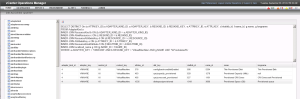

So if you've landed on this post, it because you've searched for something to do with VMware vCenter Operations Manager. Whilst I am in not a guru when it comes to this product... yet, and with a bit of reading its possible to find out most of what you need, however, there was a fundamental piece of information that I couldn't find recently and it was doing my head in.

A colleague and myself were tasked with creating some custom dashboards, and whilst that in itself is well documented online from various sources, I found it difficult to correlate the name of the metrics represented in the metric picker vs their attribute key, which is what they are called in the back end. I needed these attribute keys so that we could reference these in the custom XML files we were using to display in our dashboards.

VMware provide a KB article ([2011714](http://kb.vmware.com/selfservice/microsites/search.do?language=en_US&cmd=displayKC&externalId=2011714)) used to provide a KB article which outlined a SQL query to find the actual Attribute Key values, but to me these meant nothing. I knew what I wanted from the vCOps metric selector, but didn't know what attribute key it represented.

So taking the information provided by VMware KB article and a little bit of searching the SQL tables, I found the table which holds the "localized names" as they are displayed in the metric selector and modified the query to show these values too. This makes correlating the metric selector options against their respective attribute keys a damn lot simpler.

The following query I used to find out the attribute key represented in the metric select as "Provisioned Space (GB)". With a bit of customisation, you can search for any "metric" you want.

```
SELECT DISTINCT On (e.ATTRKEY_ID) a.ADAPTER_KIND_ID, a.ADAPTER_KEY, b.RESKND_ID, b.RESKND_KEY, e.ATTRKEY_ID, e.ATTR_KEY, d.rkattrib_id, f.name_id, g.name, g.longname
FROM AdapterKind a
INNER JOIN ResourceKind b ON (b.ADAPTER_KIND_ID = a.ADAPTER_KIND_ID)
INNER JOIN AliveResource c ON (c.RESKND_ID = b.RESKND_ID)
INNER JOIN ResourceAttributeKey d ON (d.RESOURCE_ID = c.RESOURCE_ID)
INNER JOIN AttributeKey e ON (e.ATTRKEY_ID = d.ATTRKEY_ID)
INNER JOIN ResourceKindAttribute f ON (f.RKATTRIB_ID = d.RKATTRIB_ID)
INNER JOIN localized_name g ON (g.NAME_ID = f.NAME_ID)
WHERE a.ADAPTER_KEY = 'VMWARE' AND b.RESKND_KEY = 'VirtualMachine' AND g.NAME LIKE '%Provisioned%'
```

And this is the result

[](http://www.sneaku.com/wp-content/uploads/2015/01/SneakU-AttributeKeysSQL.png)

* * *

**\*\* Update - 4th August 2015 \*\***

It seems as though the KB article referenced in my post has been pulled for one reason or another, which kinda sucked as I needed to use the DB Access Query page to check some information recently, but I couldn't remember how to access it.

So I am documenting how to access the DB Access Query page below:

1. Open a browser to the following URL:
    - https://vcops-fqdn/vcops-custom/dbAccessQuery.action
