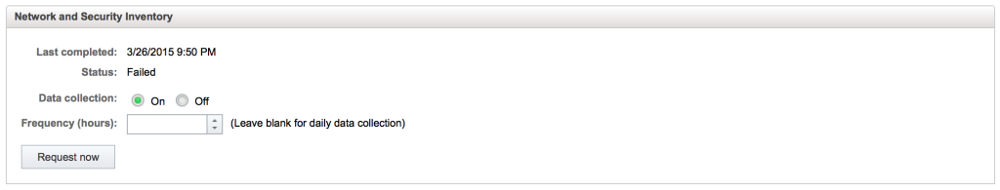
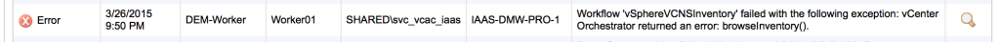
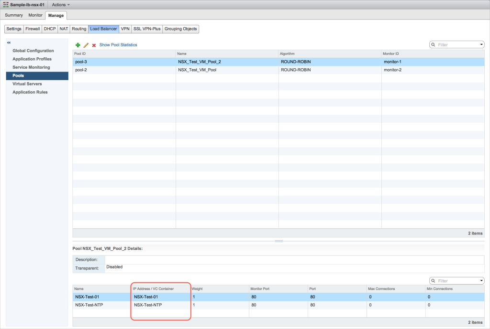
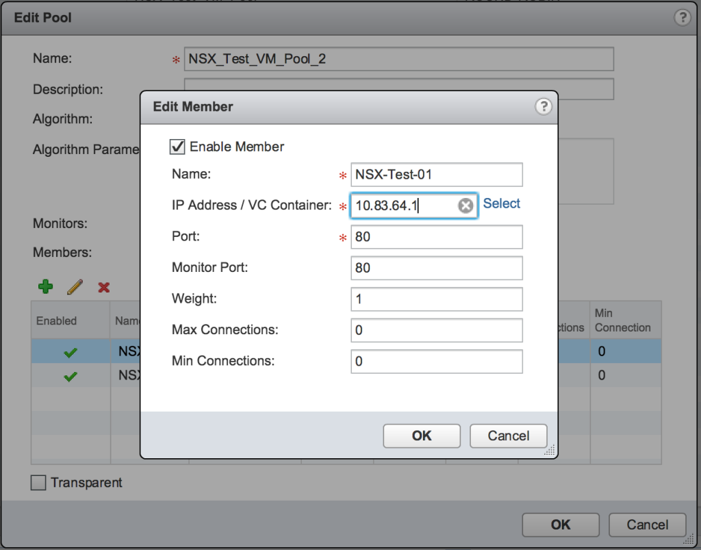
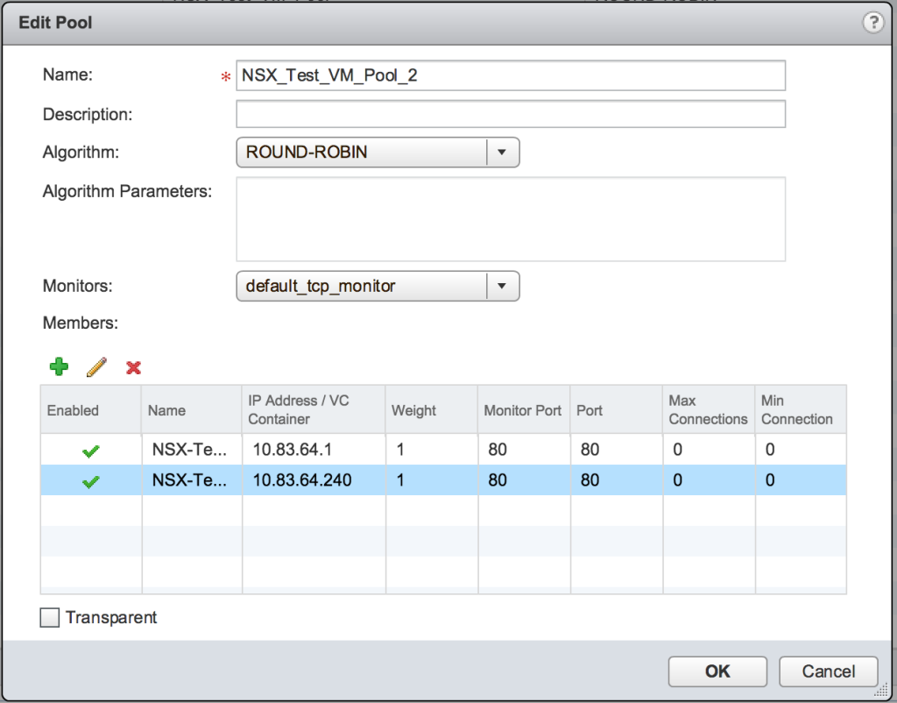
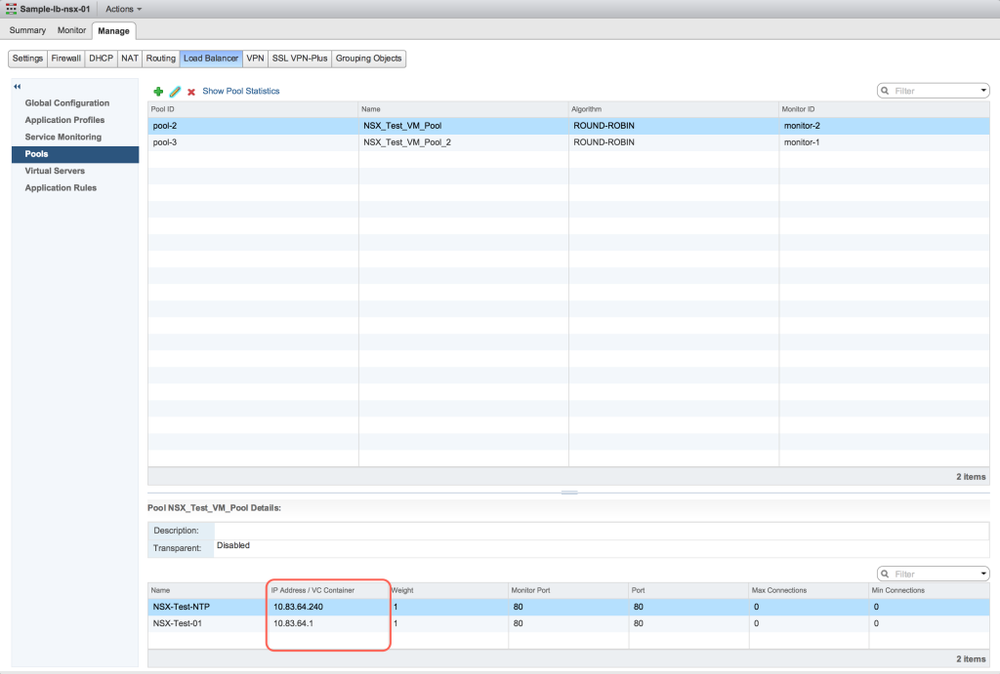
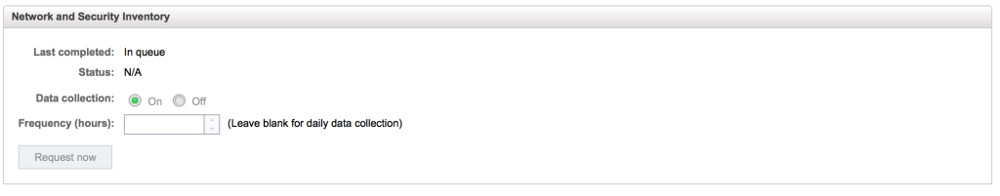
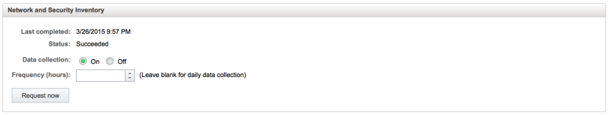

Whilst working on a vCloud Automation Center integration with NSX-v this evening, I noticed a strange error which had appeared in the logs in regards to the data collection for Network and Security Inventory.

The Network and Security Inventory data collection was displaying the time the data collection last completed, which looked fine to me, as it was inline with what I was expecting, but the status was showing as Failed.

Jumping over to Infrastructure > Monitoring > Log I could see the following error

_Workflow 'vSphereVCNSInventory' failed with the following exception: vCenter Orchestrator returned an error: browseInventory()._

A quick hunt around the world wide web came up with the following KB article on the VMware website

[http://kb.vmware.com/kb/2088831](http://kb.vmware.com/kb/2088831)

The cause is listed as follows:

_This issue occurs when the Load Balancer (LB) configuration in one of the edges in NSX consists of a Load Balancer pool member, which is configured as an object (for example, virtual machine) instead of an IP address. Currently, members other than the IP addresses are not supported by the NSX-vRealize Orchestrator plugin. This issue occurs only when the LB pool members are configured using objects instead of the IP addresses._

As it turns out, this error had only appeared after I had configured the load balancer for testing purposes, so it looks like this would fix the issue.

Jumping into my NSX Edge I could see that indeed my pool members were defined by objects

Editing the pool member required clicking the cross button next to the VM name, and then just typing the IP address of the VM.

Here you can see both pool members are now defined by their IP address.

Now we jump back over to Infrastructure > Compute Resources > Compute Resources > Select the compute resource and choose Data Collection

Scroll down to the bottom of the screen to the Network and Security Inventory and click Request Now.

In a short period of time, click the refresh button at the bottom of the screen and voila, the data collection has completed and the status is now showing Succeeded.

