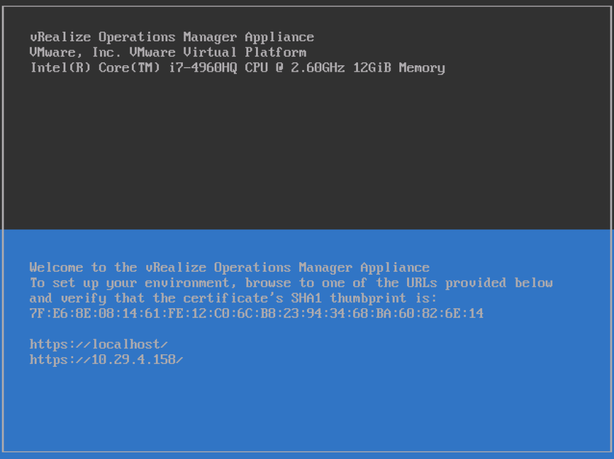
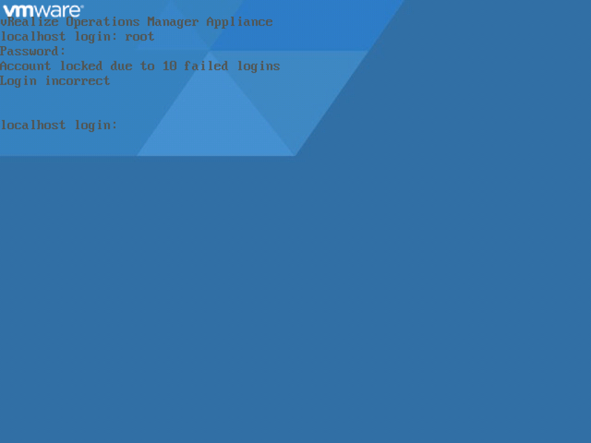
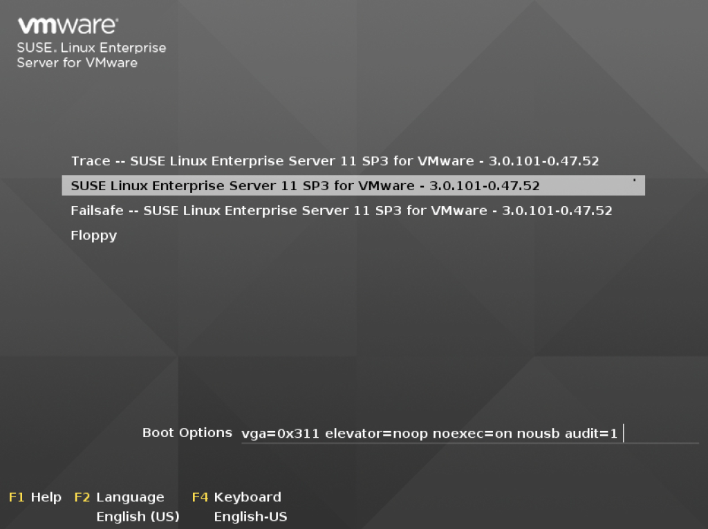
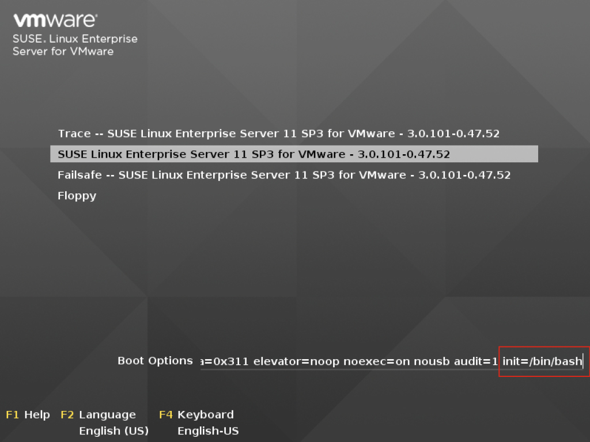
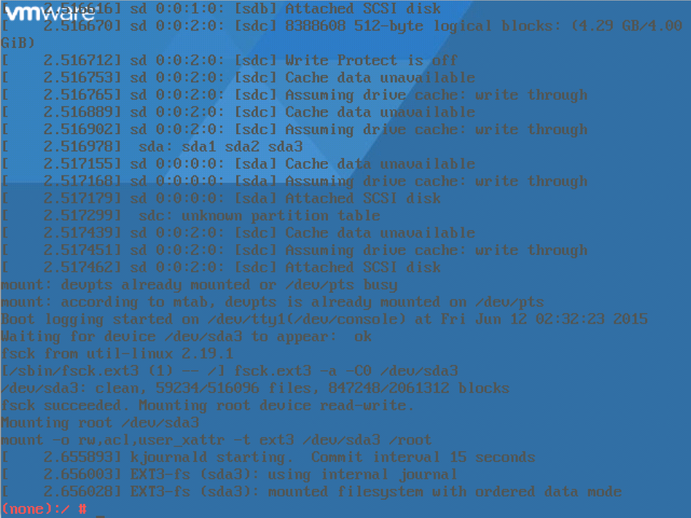
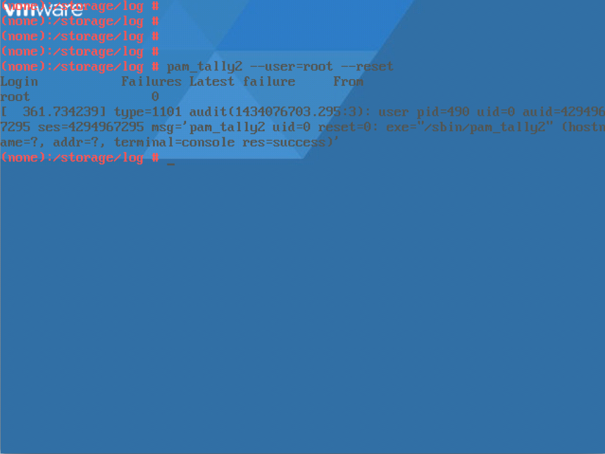
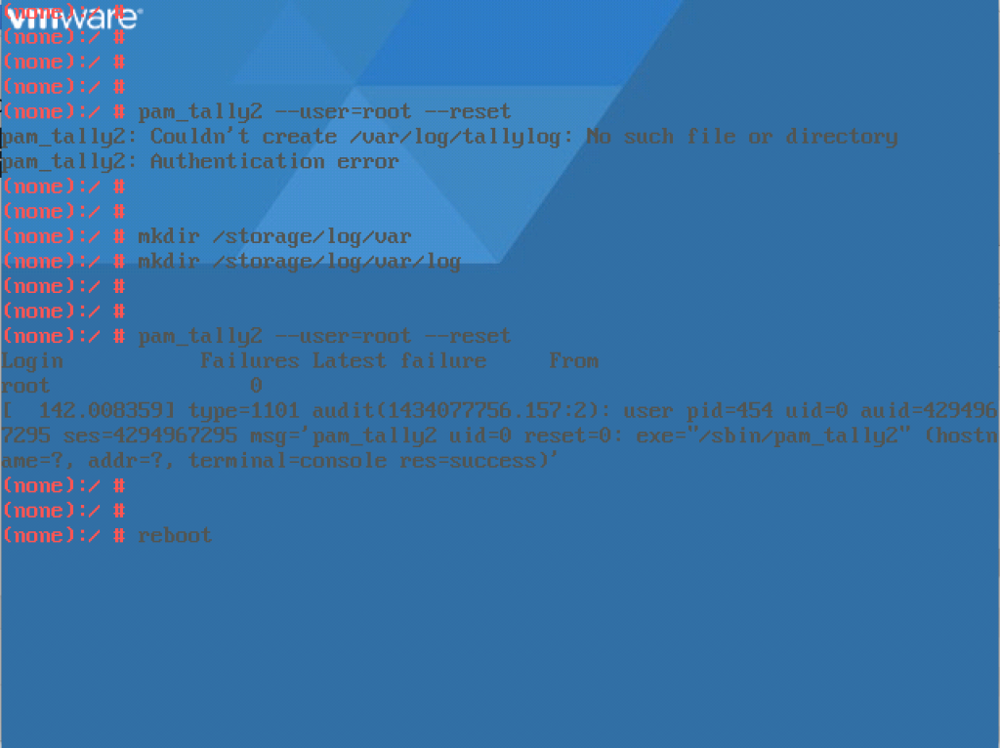
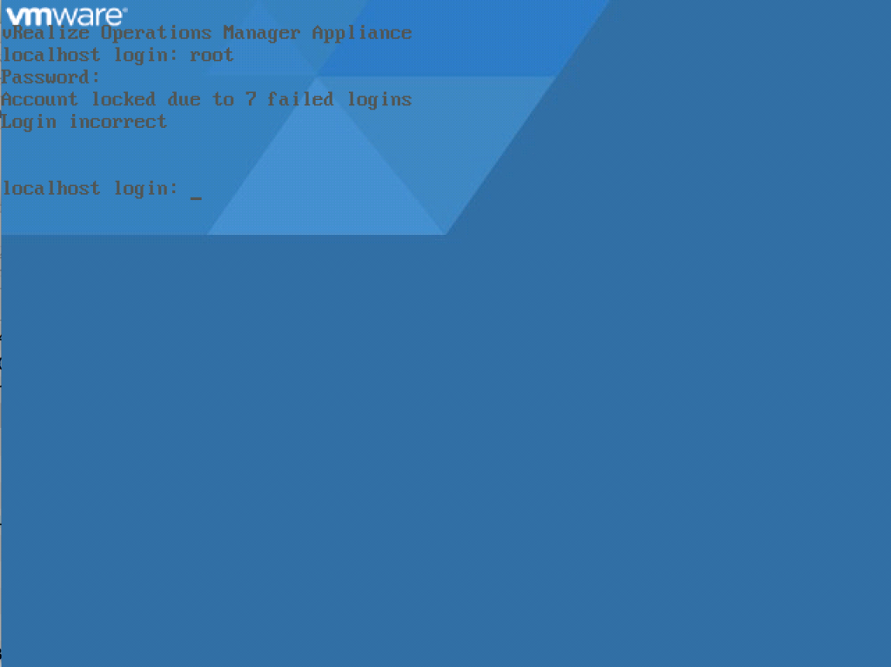
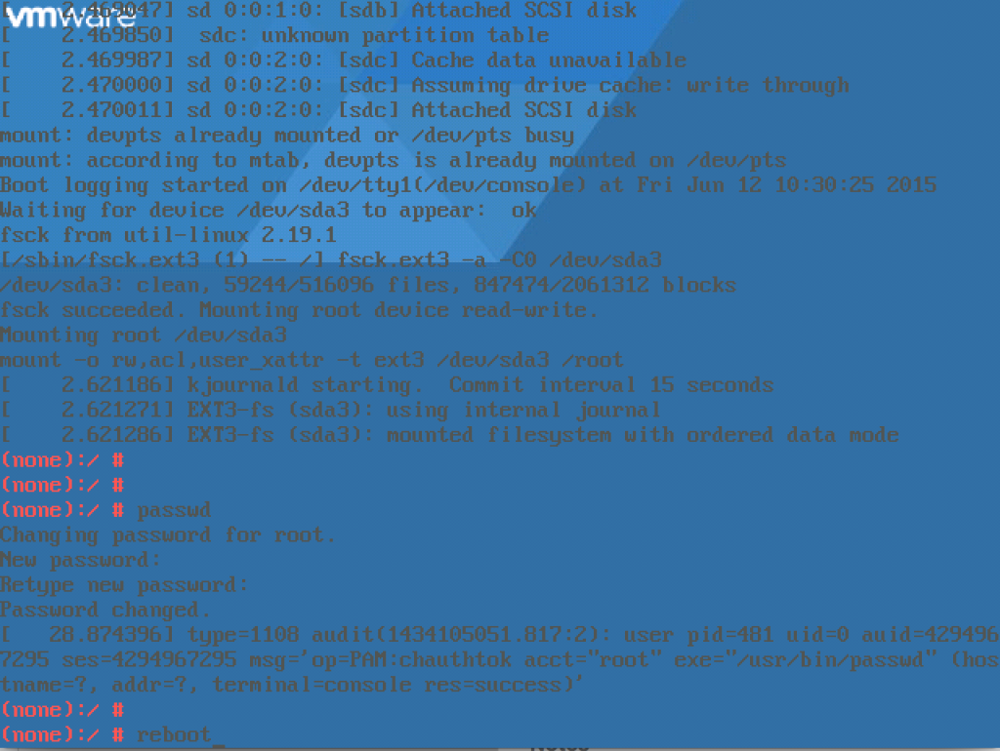
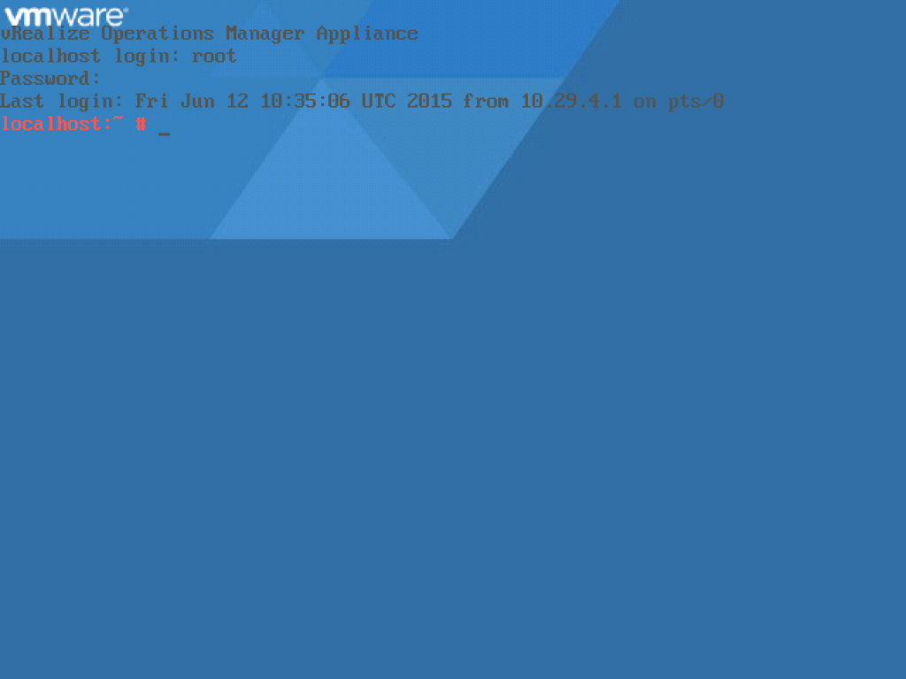

When working on a customer site recently, it was discovered that the root account on the vRealize Operations Manager 6.0 server had been locked out.

This is the process we used to unlock the root account.

Open up a console session to the VM

[](http://www.sneaku.com/wp-content/uploads/2015/06/vROps-root-account-01.png)

Press Alt + F1 and try to login as root

[](http://www.sneaku.com/wp-content/uploads/2015/06/vROps-root-account-02.png)

You can see by the screenshot above that someone has tried many unsuccessful attempts to access the root account and subsequently it has been locked by the operating system.

Reboot the virtual machine

[](http://www.sneaku.com/wp-content/uploads/2015/06/vROps-root-account-04.png)

On the bootloader screen, leave the normal option chosen to boot into, however in the boot options we want to append the following to the string

```
init=/bin/bash
```

[](http://www.sneaku.com/wp-content/uploads/2015/06/vROps-root-account-05.png)

Now hit Enter, and the machine will now boot into a bash shell

[](http://www.sneaku.com/wp-content/uploads/2015/06/vROps-root-account-06.png)

If you feel that locking an account out after 3 failed attempts is a bit extreme, you can modify the settings.

Edit the file /etc/pam.d/common-auth

Find and change the value "deny=3" in the following line

```
auth    required       pam_tally2.so deny=3 onerr=fail even_deny_root unlock_time=86400 root_unlock_time=300
```

Maybe change it to something like 5.

```
auth    required       pam_tally2.so deny=5 onerr=fail even_deny_root unlock_time=86400 root_unlock_time=300
```

What we can also see in this file is that the root account is supposed to unlock itself automatically after 5 minutes. This is a handy piece of information to know. There is no need to restart anything after making changes the common-auth file, just save the changes and close the file.

Run the following command to unlock the root account

```
pam_tally2 --user=root --reset
```

If it works, you should see something similar to the following screenshot.

[](http://www.sneaku.com/wp-content/uploads/2015/06/vROps-root-account-07.png)

If it fails and is complaining about not being able to create the file /var/log/tallylog run the following commands:

```
mkdir /storage/log/var
mkdir /storage/log/var/log
```

Now you should be able to run the command to unlock the root account:

```
pam_tally2 --user=root --reset
```

[](http://www.sneaku.com/wp-content/uploads/2015/06/vROps-root-account-08.png)

All that's left to do is reboot the virtual machine, and now you should be able to login with the root account. If all is well, you should see a screen like the following:

[](http://www.sneaku.com/wp-content/uploads/2015/06/vROps-root-account-09.png)

But in our case, we still couldn't get in, and after a few attempts, it locked the root account again...aarrrgghhhh

[](http://www.sneaku.com/wp-content/uploads/2015/06/vROps-root-account-12.png)

It was looking more and more like the password we had for the root account wasn't correct. So how do we fix it?

Once again, reboot the virtual machine again and edit the boot string like earlier on, and once it boots to the bash shell, we can then run command:

```
passwd
```

Which will prompt you to enter and confirm the new password. After that is completed, you can reboot the virtual machine.

[](http://www.sneaku.com/wp-content/uploads/2015/06/vROps-root-account-13.png)

Voila, now we know what the password is and we don't keep locking the account (although now we know that it automatically unlocks itself after 5 minutes).

[](http://www.sneaku.com/wp-content/uploads/2015/06/vROps-root-account-14.png)

Whilst your on the console, now is a good time to enable SSH. To do so, you can start the service manually using the following command:

```
service sshd start
```

[](http://www.sneaku.com/wp-content/uploads/2015/06/vROps-root-account-10.png)

Starting the service manually will not persist after a reboot, so to configure SSH to start automatically, use the following command:

```
chkconfig sshd on
```

[](http://www.sneaku.com/wp-content/uploads/2015/06/vROps-root-account-11.png)

Now you should be able to SSH into your vROps machine using the root account.

```
$ ssh root@10.29.4.158
vRealize Operations Manager Appliance
root@10.29.4.158's password: 
Last login: Fri Jun 12 10:34:16 UTC 2015 on tty1
Last login: Fri Jun 12 10:35:06 2015 from 10.29.4.1
localhost:~ #
```
