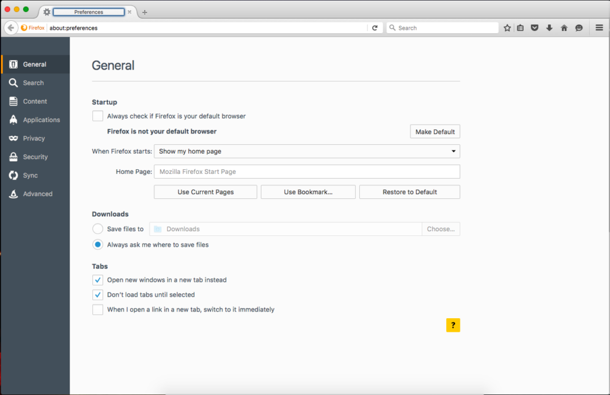
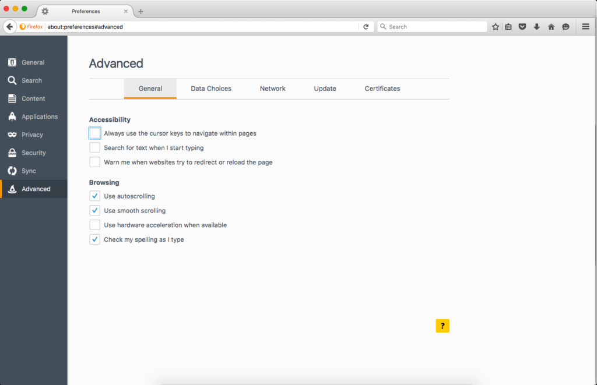

Every now and then I get asked by a colleague or client if there is a known issue with the vSphere Web Client and the NSX Plugin that causes the screen to go black.

My response is to ask them the following questions:

1. Are you using Firefox as the browser?
2. Are you accessing the machine your using the browser on via RDP?

So far the answers to the questions is always Yes to both of them!

Whilst it is not an issue with the NSX Plugin exactly, it only seems to rear its ugly head when using the NSX Plugin.

So, to fix the issue, follow these simple steps to disable Firefox from trying to use hardware acceleration if it is available:

- Open up Firefox and navigate to the preferences.

- Navigate to the Advanced > General page.
- Disable "Use hardware acceleration when available".

- Restart Firefox.

Now the black screen issue that has been driving you bonkers will no longer be an issue for you.
