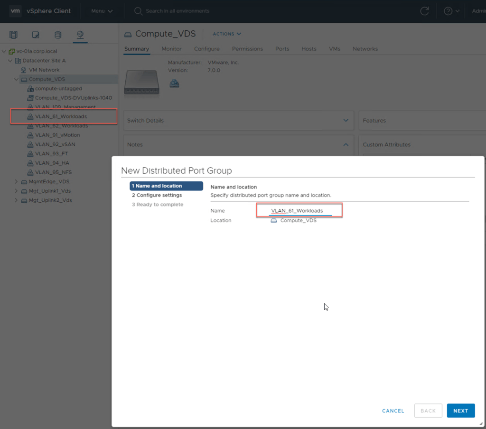
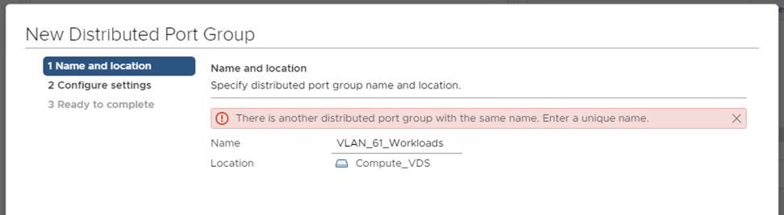
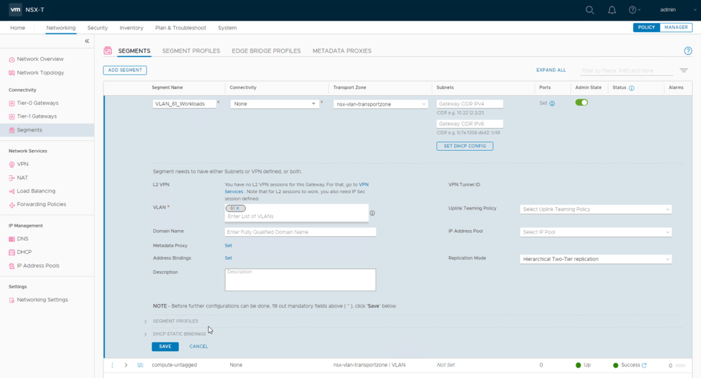
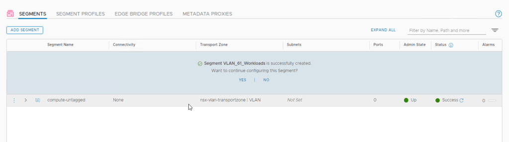
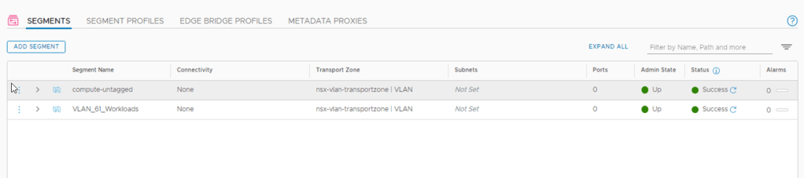
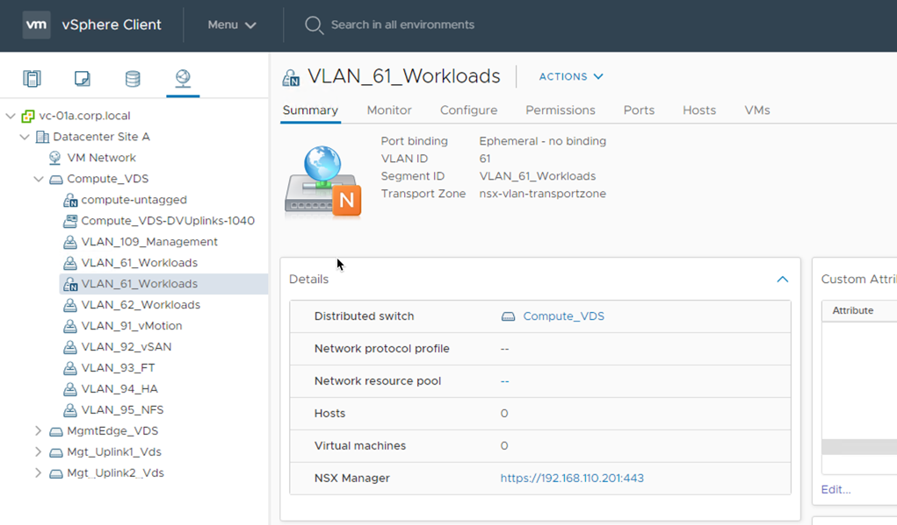
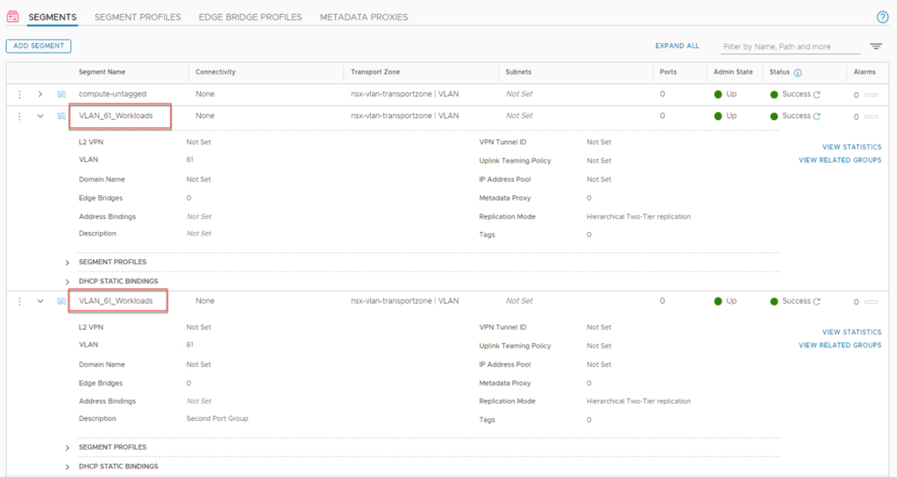
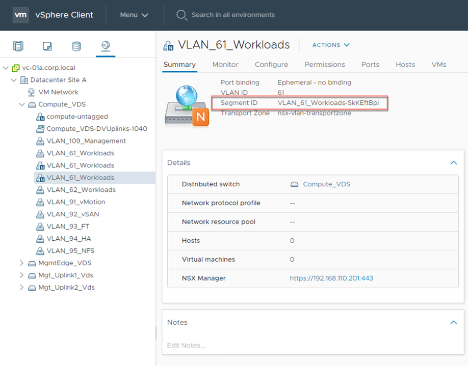
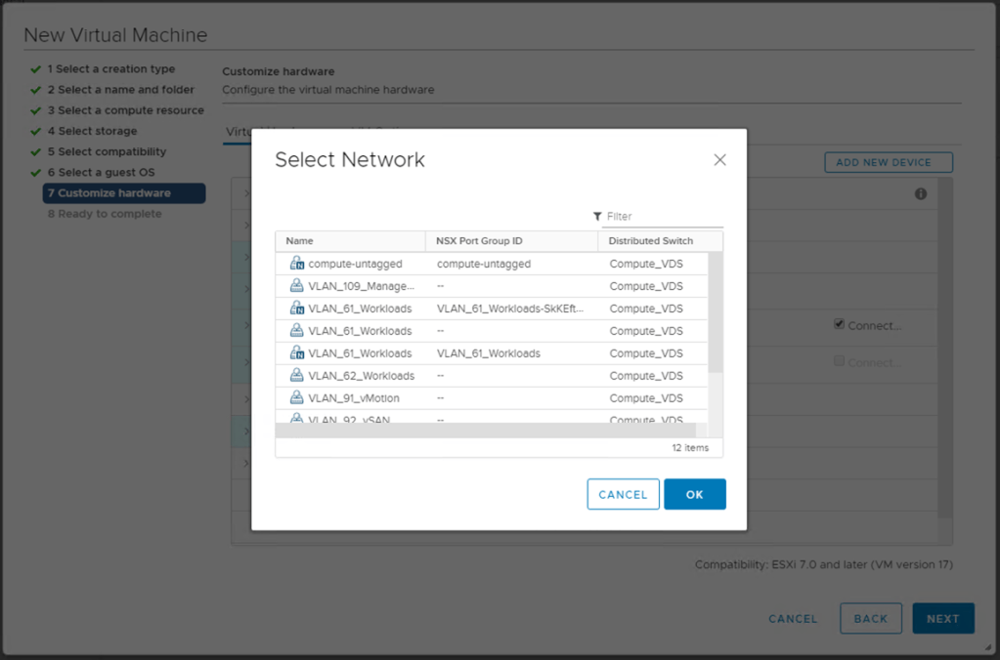
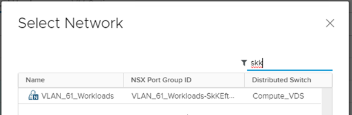

When working with a colleague recently on an NSX-T 3.0 environment that utilises VDS 7.0 rather than N-VDS, we came across something which initially stumped me.

If you were to try and create 2 Distributed Port Groups with the same name on the same vCenter



the following error is displayed, which is expected.



So what would happen if we created a NSX-T Segment with the same name as one already created through vCenter?



NSX-T Policy Manager accepts it...



And the Status shows as Success and there are no alarms



But what name did it use for the VDS Port Group? Checking in vCenter will provide the answer.....



The Distributed Port Group created by NSX-T is named using the Display Name property from the Segment, even though it is identical to the one created in vCenter.

To be able to tell them apart just by looking at them, the NSX-T backed port groups are shown with a funky little icon.

Looking on the summary tab, some new information is now displayed for these NSX-T Port Groups.

- Port Binding (NSX-T back port groups appear to always be ephemeral)
- VLAN ID
- Segment ID (Derived from the NSX-T Policy Path of the segment)
- Transport Zone

This additional information is helpful so that you can correlate the port group back to the corresponding NSX-T Policy Segement.

But what happens if you have multiple segments with the same display name as shown below?



The second segment with the same display name gets added as a new port group in vCenter and appears as follows:



Although there are now multiple NSX-T provisioned port groups with the same name, the difference between them is the Segment ID. So it appears that the unique identifier is the Segment ID.

Our next thought was, what happens when trying to connect a VM to one of the port groups that has an identical name as another. Will it show the NSX-T Policy Segment ID.



And the answer is yes.

And to my surprise, the Filter option in the top right corner of the "Select Network" popup also searches the NSX Port Group ID column



So after now being able to identify the different port groups in the UI, our focused turned to PowerCLI.

If we tried to retrieve all the Port Groups named VLAN\_61\_Workloads, all the objects are returned as expected

```
PS > Get-VDPortgroup VLAN_61_Workloads
Name              NumPorts PortBinding
---- -------- -----------
VLAN_61_Workloads 128      Static
VLAN_61_Workloads 0        Ephemeral
VLAN_61_Workloads 0        Ephemeral
```

Not much to show here to tell them apart. So it was time to pipe the objects to Get-Member to see what is available

```
PS C:\Users\Administrator> Get-VDPortgroup VLAN_61_Workloads | Get-Member

   TypeName: VMware.VimAutomation.Vds.Impl.V1.VmwareVDPortgroupImpl

Name                 MemberType Definition
---- ---------- ----------
AttachNetworkAdapter Method     VMware.VimAutomation.ViCore.Interop.V1.Task.TaskInterop VirtualPortGroupBaseInterop....
ConvertToVersion     Method     T VersionedObjectInterop.ConvertToVersion[T]()
Equals               Method     bool Equals(System.Object obj)
GetClient            Method     VMware.VimAutomation.Vds.Interop.V1.VDClient VDObjectCoreInterop.GetClient(), VMware...
GetHashCode          Method     int GetHashCode()
GetType              Method     type GetType()
IsConvertableTo      Method     bool VersionedObjectInterop.IsConvertableTo(type type)
LockUpdates          Method     void LockUpdates(), void ExtensionData.LockUpdates()
ToNetworkAdapter     Method     System.Collections.Generic.IEnumerable[VMware.VimAutomation.ViCore.Interop.V1.Virtua...
ToString             Method     string ToString()
ToVDSwitch           Method     System.Collections.Generic.IEnumerable[VMware.VimAutomation.Vds.Interop.V1.VDSwitchI...
ToVirtualMachine     Method     System.Collections.Generic.IEnumerable[VMware.VimAutomation.ViCore.Types.V1.Inventor...
UnlockUpdates        Method     void UnlockUpdates(), void ExtensionData.UnlockUpdates()
Datacenter           Property   VMware.VimAutomation.ViCore.Types.V1.Inventory.Datacenter Datacenter {get;}
ExtensionData        Property   System.Object ExtensionData {get;}
Id                   Property   string Id {get;}
IsUplink             Property   bool IsUplink {get;}
Key                  Property   string Key {get;}
Name                 Property   string Name {get;}
Notes                Property   string Notes {get;}
NumPorts             Property   int NumPorts {get;}
PortBinding          Property   VMware.VimAutomation.ViCore.Types.V1.Host.Networking.DistributedPortGroupPortBinding...
Uid                  Property   string Uid {get;}
VDSwitch             Property   VMware.VimAutomation.Vds.Types.V1.VDSwitch VDSwitch {get;}
VirtualSwitch        Property   VMware.VimAutomation.ViCore.Types.V1.Host.Networking.VirtualSwitchBase VirtualSwitch...
VlanConfiguration    Property   VMware.VimAutomation.Vds.Types.V1.VlanConfiguration VlanConfiguration {get;}
```

We saw ExtensionData and decided to take a look in there as there are often hidden treasures embedded in there

```
PS > (Get-VDPortgroup VLAN_61_Workloads).ExtensionData

Key                 : dvportgroup-1048
Config              : VMware.Vim.DVPortgroupConfigInfo
PortKeys            : {768, 769, 770, 771...}
LinkedView          :
Summary             : VMware.Vim.NetworkSummary
Host                : {HostSystem-host-1018, HostSystem-host-1017, HostSystem-host-1016}
Vm                  : {}
Name                : VLAN_61_Workloads
Parent              : Folder-group-n1005
CustomValue         : {}
OverallStatus       : green
ConfigStatus        : green
ConfigIssue         : {}
EffectiveRole       : {-1}
Permission          : {}
DisabledMethod      : {}
RecentTask          : {}
DeclaredAlarmState  : {}
TriggeredAlarmState : {}
AlarmActionsEnabled : True
Tag                 : {}
Value               : {}
AvailableField      : {}
MoRef               : DistributedVirtualPortgroup-dvportgroup-1048
Client              : VMware.Vim.VimClientImpl

Key                 : dvportgroup-1057
Config              : VMware.Vim.DVPortgroupConfigInfo
PortKeys            : {}
LinkedView          :
Summary             : VMware.Vim.NetworkSummary
Host                : {}
Vm                  : {}
Name                : VLAN_61_Workloads
Parent              : Folder-group-n1005
CustomValue         : {}
OverallStatus       : green
ConfigStatus        : green
ConfigIssue         : {}
EffectiveRole       : {-1}
Permission          : {}
DisabledMethod      : {}
RecentTask          : {}
DeclaredAlarmState  : {}
TriggeredAlarmState : {}
AlarmActionsEnabled : True
Tag                 : {}
Value               : {}
AvailableField      : {}
MoRef               : DistributedVirtualPortgroup-dvportgroup-1057
Client              : VMware.Vim.VimClientImpl

Key                 : dvportgroup-1058
Config              : VMware.Vim.DVPortgroupConfigInfo
PortKeys            : {}
LinkedView          :
Summary             : VMware.Vim.NetworkSummary
Host                : {}
Vm                  : {}
Name                : VLAN_61_Workloads
Parent              : Folder-group-n1005
CustomValue         : {}
OverallStatus       : green
ConfigStatus        : green
ConfigIssue         : {}
EffectiveRole       : {-1}
Permission          : {}
DisabledMethod      : {}
RecentTask          : {}
DeclaredAlarmState  : {}
TriggeredAlarmState : {}
AlarmActionsEnabled : True
Tag                 : {}
Value               : {}
AvailableField      : {}
MoRef               : DistributedVirtualPortgroup-dvportgroup-1058
Client              : VMware.Vim.VimClientImpl
```

As there is a config property, that was the obvious spot to look, and low and behold, we hit the motherload

```
PS > (Get-VDPortgroup VLAN_61_Workloads).ExtensionData.config

Key                          : dvportgroup-1048
Name                         : VLAN_61_Workloads
NumPorts                     : 128
DistributedVirtualSwitch     : VmwareDistributedVirtualSwitch-dvs-1040
DefaultPortConfig            : VMware.Vim.VMwareDVSPortSetting
Description                  :
Type                         : earlyBinding
BackingType                  : standard
Policy                       : VMware.Vim.VMwareDVSPortgroupPolicy
PortNameFormat               :
Scope                        :
VendorSpecificConfig         :
ConfigVersion                : 2
AutoExpand                   : True
VmVnicNetworkResourcePoolKey :
Uplink                       : False
TransportZoneUuid            :
TransportZoneName            :
LogicalSwitchUuid            :
SegmentId                    :
LinkedView                   :

Key                          : dvportgroup-1057
Name                         : VLAN_61_Workloads
NumPorts                     : 0
DistributedVirtualSwitch     : VmwareDistributedVirtualSwitch-dvs-1040
DefaultPortConfig            : VMware.Vim.VMwareDVSPortSetting
Description                  :
Type                         : ephemeral
BackingType                  : nsx
Policy                       : VMware.Vim.VMwareDVSPortgroupPolicy
PortNameFormat               :
Scope                        :
VendorSpecificConfig         :
ConfigVersion                : 0
AutoExpand                   : False
VmVnicNetworkResourcePoolKey :
Uplink                       : False
TransportZoneUuid            : a95c914d-748d-497c-94ab-10d4647daeba
TransportZoneName            : nsx-vlan-transportzone
LogicalSwitchUuid            : c5f8a5a4-8347-4ef1-ac43-526b29cae906
SegmentId                    : VLAN_61_Workloads
LinkedView                   :

Key                          : dvportgroup-1058
Name                         : VLAN_61_Workloads
NumPorts                     : 1
DistributedVirtualSwitch     : VmwareDistributedVirtualSwitch-dvs-1040
DefaultPortConfig            : VMware.Vim.VMwareDVSPortSetting
Description                  :
Type                         : ephemeral
BackingType                  : nsx
Policy                       : VMware.Vim.VMwareDVSPortgroupPolicy
PortNameFormat               :
Scope                        :
VendorSpecificConfig         :
ConfigVersion                : 2
AutoExpand                   : False
VmVnicNetworkResourcePoolKey :
Uplink                       : False
TransportZoneUuid            : a95c914d-748d-497c-94ab-10d4647daeba
TransportZoneName            : nsx-vlan-transportzone
LogicalSwitchUuid            : dc80118d-137b-4aca-9437-e8c34c0fb25a
SegmentId                    : VLAN_61_Workloads-SkKEftBpi
LinkedView                   :
```

The config property exposes the information that is seen in vCenter.

Now that we knew where to find this extra NSX-T information about the port group, we were able to match our Policy Segment to the corresponding Port Group and attach our VMs appropriately using PowerCLI.
